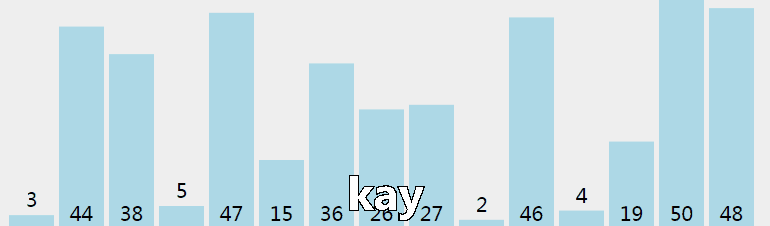

## 冒泡排序和选择排序

### 排序算法比较

| 排序算法 |      平均时间复杂度      |      最坏时间复杂度      |    空间复杂度    | 是否稳定 |
| :------: | :----------------------: | :----------------------: | :--------------: | :------: |
| 冒泡排序 |         $O(n^2)$         |         $O(n^2)$         |      $O(1)$      |    是    |
| 选择排序 |         $O(n^2)$         |         $O(n^2)$         |      $O(1)$      |   不是   |
| 插入排序 |         $O(n^2)$         |         $O(n^2)$         |      $O(1)$      |    是    |
| 希尔排序 |       $O(n^{1.3})$       |         $O(n^2)$         |      $O(1)$      |   不是   |
| 快速排序 | $O(n\space log\space n)$ |         $O(n^2)$         | $O(log\space n)$ |   不是   |
| 归并排序 | $O(n\space log\space n)$ | $O(n\space log\space n)$ |      $O(n)$      |    是    |

注：希尔排序的时间复杂度与其增量序列有关，具体数值存疑，这里仅供参考。

### 冒泡排序（Bubble sort）

冒泡排序是将相邻的数据两两比较，让较大的值向一个方向移动，经过有限多次移动后，即可实现排序操作。



首先，将乱序序列中的最大值找出，逐一移动到序列最后的位置：

```python
alist = [3, 8, 5, 7, 6]
def bubble_sort(alist):
    # 找最大值的方式是通过对列表中的元素进行两两比较，值大的元素逐步向后移动
    # 序列中有n个元素，两两比较的话，需要比较n-1次
    for i in range(len(alist) - 1):    # 循环n-1次，控制两两比较的次数
        if alist[i] > alist[i + 1]:    # 如果前面的元素大于后面的元素，交换两个元素的位置；如果后面的元素大于前面的元素，则不作任何操作
            alist[i], alist[i + 1] = alist[i + 1], alist[i]
    return alist
print(bubble_sort(alist))    # [3, 5, 7, 6, 8]
```

我们发现上述代码已经可以将序列中的最大值放置到合适的位置。然后我们就可以将上述操作继续作用到剩下的 n-1 个元素对应的新序列，则就可以将者 n-1 个元素对应的最大值放置到第 n-1 个元素的最后位置。

结论：发现如果将上述的操作逐步的作用 n-1 次就可以将整个序列变成有序的。

```python
alist = [3, 8, 5, 7, 6]
def bubble_sort(alist):
    for j in range(len(alist) - 1):    # 外层循环次数递增，内层循环次数递减
        for i in range(len(alist) - 1 -j):
            if alist[i] > alist[i + 1]:
                alist[i], alist[i + 1] = alist[i + 1], alist[i]
    return alist
print(bubble_sort(alist))    # [3, 5, 6, 7, 8]
print(bubble_sort([]))    # []
print(bubble_sort([1]))    # [1]
```

### 选择排序（Selection sort）

选择排序是依次将最大值找到，然后将其放在最后位置。


同样地，我们先试着将最大的元素放到最后。乱序序列中的元素两两比较，找出最大值，然后直接将最大值放置到序列最后的位置，也就是将最大值直接和最后一个元素交换位置：

```python
alist = [3, 8, 5, 7, 6]
def selection_sort(alist):
    max_index = 0    # 最大值元素的下标，一开始假设下标为0的元素为最大值
    for i in range(1, len(alist)):
        if alist[max_index] < alist[i]:
            max_index = i
    # 循环结束后max_index就一定是最大值的下标
    alist[max_index], alist[len(alist) - 1] = alist[len(alist) - 1], alist[max_index]
    return alist
print(selection_sort(alist))    # [3, 6, 5, 7, 8]
```

将上面的步骤重复作用 n - 1 次即可：

```python
alist = [3, 8, 5, 7, 6]
def selection_sort(alist):
    for j in range(len(alist) - 1):
        max_index = 0
        for i in range(1, len(alist) - j):
            if alist[max_index] < alist[i]:
                max_index = i
        alist[max_index], alist[len(alist) - 1 - j] = alist[len(alist) - 1 - j], alist[max_index]
    return alist
print(selection_sort(alist))    # [3, 5, 6, 7, 8]
```

