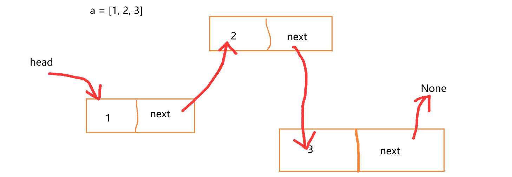

## 顺序表和链表

[TOC]

### 内存浅谈

计算机的作用，简单来说就是用来存储和运算二进制的数据。

计算机如何实现 1+1 的操作？

首先要将两个 1 加载到计算机内存中，然后基于计算机的加法寄存器对指定内存中存储的数据进行加法运算。

变量的概念

- 本质讲，变量指的就是计算机中的某一块内存空间。
- 内存空间有两个固有的属性
  - 地址：使用 16 进制数表示
    - 作用：方便 cup 寻址。门牌号。
  - 大小：bit，byte，kb，mb，gb，tb
    - 决定该块内存存储的数值的范围

理解 `a=10` 的内存图（引用，指向）

- 引用：就是变量，通常将，变量表示的就是一块内存空间的地址。
- 指向：如果一个变量或者引用存储表示了某块内存空间的地址后，则该变量或引用指向了该块内存空间。

不同数据占用内存空间的大小

- bit（位）：1 bit 只能存储一位二进制的数。
- byte 字节：8 bit。

给相同的数据类型的数据开辟固有大小的内存空间

- 整形数据：4 byte
- 浮点型：4，8 byte
- 字符型：1 byte

### 顺序表

顺序表数据结构中存储的元素是有顺序的，顺序表的结构可以分为两种形式：单数据类型（数组）和多数据类型（列表）。

Python 中的列表和元组就属于多数据类型的顺序表。

单数据类型顺序表的内存图（内存连续开辟）：


多数据类型顺序表的内存图（内存非连续开辟并伴有一段连续开辟的内存）：


顺序表的弊端：顺序表的结构需要预先知道数据大小来申请连续的存储空间，而在进行扩充时又需要进行数据的搬迁。

### 链表

相对于顺序表，链表结构可以充分利用计算机内存空间，实现灵活的内存动态管理且进行扩充时不需要进行数据搬迁。

链表（Linked list）是一种常见的基础数据结构，是一种线性表，但是不像顺序表一样连续存储数据，而是每一个结点（数据存储单元）里存放下一个结点的信息（即地址）。



接下来，我们将使用 Python 代码创建要给链表：

- `.is_empty()`：链表是否为空
- `.length()`：链表长度
- `.travel()`：遍历整个链表
- `.add(item)`：链表头部添加元素
- `.append(item)`：链表尾部添加元素
- `.insert(pos, item)`：指定位置添加元素
- `.remove(item)`：删除节点
- `.search(item)`：查找节点是否存在

```python 
# 节点的封装
class Node():
    def __init__(self,item):
        self.item = item
        self.next = None
# 链表的实现
class Link:
    def __init__(self):    # 构建一个空链表
        self._head = None    # _head永远要指向链表中的第一个节点，None表示链表中没有节点。
        
    def add(self, item):    # 向链表的头部添加节点（insert(0,item)）
        node = Node(item)    # 实例化一个新的节点对象
        node.next = self._head
        self._head = node    # 将_head指向当前节点
        
    def travel(self):
        # cur指向了第一个节点
        # _head要永远指向第一个节点，轻易不要修改_head的指向
        cur = self._head
        while cur:
            print(cur.item)
            cur = cur.next
        
    def isEmpty(self):    # 判断链表是否为空
        return self._head == None
    
    def length(self):    # 返回链表中节点的个数
        count = 0
        cur = self._head
        while cur:
            count += 1
            cur = cur.next
        return count
    
    def append(self, item):    # 向链表的尾部添加节点
        node = Node(item)
        # 如果链表为空
        if self._head == None:
            self._head = node
            return
        # 如果链表为非空
        cur = self._head
        prev = None    # pre是指向cur前面的一个节点
        while cur:
            prev = cur
            cur = cur.next
        # 当while循环结束的时候，pre就指向了链表中最后一个节点
        prev.next = node
        
    def search(self, item):    # 查找item对应的节点是否存在
        cur = self._head
        while cur:
            if cur.item == item:
                return True
            cur = cur.next
        return False
    
    def insert(self, pos, item):    # 将item对应的节点插入到pos指定的位置中
        node = Node(item)
        # 单独判断插入位置为0的情况
        if pos == 0:
            node.next = self._head
            self._head = node
            return
        # 插入位置为非0的情况
        prev = None
        cur = self._head
        for i in range(pos):
            prev = cur
            cur = cur.next
        prev.next = node
        node.next = cur
        
    def remove(self, item):    # 将item对应的节点删除
        if self._head == None:
            return
        if item == self._head.item:    # 删除的节点是第一个节点
            self._head = self._head.next
            return
        prev = None
        cur = self._head
        while cur:
            prev = cur
            cur = cur.next
            if cur.item == item:
                prev.next = cur.next
                return
            
    def sort(self):    # 链表排序，升序排列
        node_list = []
        cur = self._head
        while cur:
            node_list.append(Node(cur.item))
            cur = cur.next
        self._head = None
        for node in node_list:
            if self._head == None:
                self._head = node
                continue
            prev = None
            current = self._head
            if current.item > node.item:
                node.next = self._head
                self._head = node
                continue
            while current:
                prev = current
                current = current.next
                if current == None:
                    prev.next = node
                elif current.item > node.item:
                    prev.next = node
                    node.next = current
                    break
    
    def reverse(self):    # 翻转链表
        cur = self._head
        prev = None
        new_head = None
        while cur:
            prev = cur
            cur = cur.next
            prev.next = new_head
            new_head = prev
        self._head = new_head
        
        
link = Link()
print(link.isEmpty())    # True
link.add(1)
link.add(2)
link.add(3)
link.add(4)
link.add(5)
print(link.length())    # 5
print(link.isEmpty())    # False
link.travel()    # 5 4 3 2 1
link.append(6)
link.insert(2, 7)
print(link.search(4))    # True
link.remove(4)
print(link.search(4))    # False
link.travel()    # 5 7 3 2 1 6
link.sort()
link.travel()    # 1 2 3 5 6 7
link.reverse()
link.travel()    # 7 6 5 3 2 1
```

链表排序思路：3，8，5，7，6，将这几个值封装到 5 个节点中，首先将 3 对应的节点插入到链表中。然后插入后序节点的时候，都需要先进行判断将节点合适的位置找到，然后将其插入到合适的为中。

链表翻转

- 1，2，3，4，5
- 翻转后顺序：5，4，3，2，1
- 要求：修改节点的指向实现链表的倒置输出！

