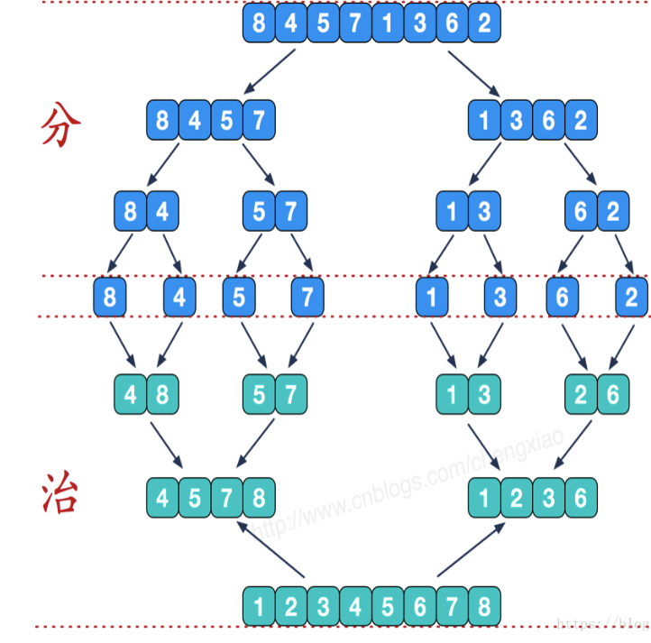

## 快速排序和归并排序

### 快速排序（Quick sort）

快速排序，是每次找一个数字（一般是列表的第一个元素）作为中间值，将小于这个中间值的元素都放在左边，比这个中间值大的放在右边。然后，对左边和右边的子序列进行递归操作，即可实现排序。只有一个元素的序列是有序的。


- 将列表中第一个元素设定为基准数字，赋值给 mid 变量，然后将整个列表中比基准小的数值放在基准的左侧，比基准到的数字放在基准右侧。然后将基准数字左右两侧的序列在根据此方法进行排放。
- 定义两个指针，low 指向最左侧，high 指向最右侧。
- 然后对最右侧指针进行向左移动，移动法则是，如果指针指向的数值比基准小，则将指针指向的数字移动到基准数字原始的位置，否则继续移动指针。
- 如果最右侧指针指向的数值移动到基准位置时，开始移动最左侧指针，将其向右移动，如果该指针指向的数值大于基准则将该数值移动到最右侧指针指向的位置，然后停止移动。
- 如果左右侧指针重复则，将基准放入左右指针重复的位置，则基准左侧为比其小的数值，右侧为比其大的数值。

首先，对于第一个元素进行操作。调整后的列表中，该元素左边的元素都比它小，右边的元素都比它大：

```python
alist = [3, 8, 5, 7, 6, 9, 2, 1, 4, 6, 3, 3, 2]    # 使用重复值更严谨
def quick_sort(alist):
    left = 0    # 第一个元素下标
    right = len(alist) - 1    # 最后一个元素下标
    # 循环过后的序列中，要确保小于等于基准值的数字在基准值右侧，大于基准值的数在其左侧
    while left < right:
        # 先偏移right，此时基准值3位于left对应的位置
        while left < right:
            if alist[right] > alist[left]:
                right -= 1    # 如果right对应的值比基准值大，不需要操作，比较下一个数字
            else:    # 如果right对应的值比基准值小（或等于），则将其与基准值交换位置
                alist[right], alist[left] = alist[left], alist[right]
                left += 1    # 因为原来基准值的位置left的元素已经检查过了，不需要重复检查，所以直接去下一个元素即可
                break
        while left < right:
            # 先偏移left，此时基准值3位于right对应的位置
            if alist[right] >= alist[left]:
                left +=1    # 如果left对应的值比基准值小或者相等，不需要操作，比较下一个数字
            else:    # 如果left对应的值比基准值大，将其于基准值交换位置
                alist[right], alist[left] = alist[left], alist[right]
                right -= 1    # 因为原来基准值的位置right的元素已经检查过了，不需要重复检查，所以直接去下一个元素即可
                break
                
    print(left, right)    # 5 5
    return alist
print(quick_sort(alist))    # [2, 3, 3, 1, 2, 3, 9, 6, 4, 6, 7, 5, 8]
```

经一次操作后，左右两侧的索引都到了 5 的位置。接下来，我们对左右两部分的列表进行递归，即可实现快速排序：

```python
alist = [3, 8, 5, 7, 6, 9, 2, 1, 4, 6, 3, 3, 2]
def quick_sort(alist, start, end):
    left = start
    right = end
    while left < right:
        while left < right:
            if alist[left] < alist[right]:
                right -= 1
            else:
                alist[left], alist[right] = alist[right], alist[left]
                left += 1
                break
        while left < right:
            if alist[left] <= alist[right]:
                left += 1
            else:
                alist[left], alist[right] = alist[right], alist[left]
                right -= 1
                break
    # 上述为核心操作，需要将核心操作递归左右到左右子序列中
    if start < left - 1:    # 结束递归条件：当左侧只剩一个元素或没有元素时
        quick_sort(alist, start, left - 1)    # 将sort作用到左侧序列中
    if right + 1 < end:    # 结束递归条件：当右侧只剩一个元素或没有元素时
        quick_sort(alist, right + 1, end)    # 将sort作用到右侧序列中
    return alist
quick_sort(alist, 0, len(alist) - 1)    # [1, 2, 2, 3, 3, 3, 4, 5, 6, 6, 7, 8, 9]
```

### 归并排序（Merge sort）


归并排序采用分而治之的原理：

- 将一个序列从中间位置分成两个序列；

- 在将这两个子序列按照第一步继续二分下去；

- 直到所有子序列的长度都为 1，也就是不可以再二分截止。这时候再两两合并成一个有序序列即可。

如何合并？

下图中的倒数第三行表示为第一次合并后的数据。其中一组数据为 4 8  ，  5 7。该两组数据合并方式为：每一小组数据中指定一个指针，指针指向每小组数据的第一个元素，通过指针的偏移指定数据进行有序排列。排列情况如下：

1. p1 指向 4，p2 指向 5，p1 和 p2 指向的元素 4 和 5 进行比较，较小的数据归并到一个新的列表中。经过比较 p1 指向的 4 会被添加到新的列表中，则 p1 向后偏移一位，指向了 8，p2 不变。

2. p1 和 p2 指向的元素 8，5 继续比较，则 p2 指向的 5 较小，添加到新列表中，p2 向后偏移一位，指向了 7。

3. p1 和 p2 指向的元素 8，7 继续比较，7 添加到新列表中，p2 偏移指向 NULL，比较结束。

4. 最后剩下的指针指向的数据（包含该指针指向数据后面所有的数据）直接添加到新列表中即可。



归并排序使用 Python 代码实现：

```python
alist = [3, 8, 5, 7, 6, 9, 2, 1, 4, 6, 3, 3, 2]
def merge_sort(alist):
    n = len(alist)
    # 递归结束条件
    if n <= 1:
        return alist
    # 将序列分成左右两部分，递归排序
    mid = n // 2
    left = merge_sort(alist[:mid])
    right = merge_sort(alist[mid:])
    # 将指针归零
    left_pointer = right_pointer = 0
    result = []    # 用于存放排序好的结果
    # 比较指针位置的数字，较小的放到结果中，并依次移动指针
    while left_pointer < len(left) and right_pointer < len(right):
        if left[left_pointer] < right[right_pointer]:
            result.append(left[left_pointer])
            left_pointer += 1
        else:
            result.append(right[right_pointer])
            right_pointer += 1
    # 将左右两边剩余的元素直接放到结果中
    result.extend(left[left_pointer:])
    result.extend(right[right_pointer:])
    # 将结果返回
    return result
print(merge_sort(alist))    # [1, 2, 2, 3, 3, 3, 4, 5, 6, 6, 7, 8, 9]
```

