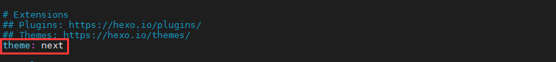

# Hexo Next 主题的安装

[toc]

## Hexo 主题

Hexo 的默认主题毕竟不是很好看。我看好 Hexo 很重要的一点是它支持自定义的主题。[Hexo 官网](https://hexo.io/themes/) 就有很多很好看的主题。

下载好 Hexo 主题文件后，将其解压放到 `themes` 文件夹下，然后在 `_config.yml` 文件中修改 theme 为主题名称。

## Next 主题简介

Hexo 主题我也用过几个，终有些不满意处而放弃，直到我发现了 Next 主题。这个主题很简洁，却又很自由，能配置出很多花样。

Next 的官网教程为：http://theme-next.iissnan.com/

不过这个教程已经很旧了，就连用的仓库都是老版本的。虽然如此，还是能从这个网站中找到很多有用的东西，比如配置公益 404 的方法之类的。而且这个官方教程很好看呀，欣赏欣赏也是不错的。

最新版本的 Next 仓库地址为：https://github.com/theme-next/hexo-theme-next

## Next 主题安装

挺简单，进入 Hexo 项目根目录，然后用 git 克隆下来即可（抄的官网的命令）：

```bash
cd hexo
git clone https://github.com/theme-next/hexo-theme-next themes/next
```

然后打开项目的配置文件（Hexo 项目根目录下的 `_config.yml` 文件）：

```bash
vim _config.yml
```

把 theme 配置成 next：

```yaml
theme: next
```



然后清理下生成的文件，重新生成一下博客就可以了：

```bash
hexo clean
hexo generate
```

## Next 主题更新

安装是 git 克隆的，更新只要 `git pull` 下来即可：

```bash
cd themes/next
git pull
```

