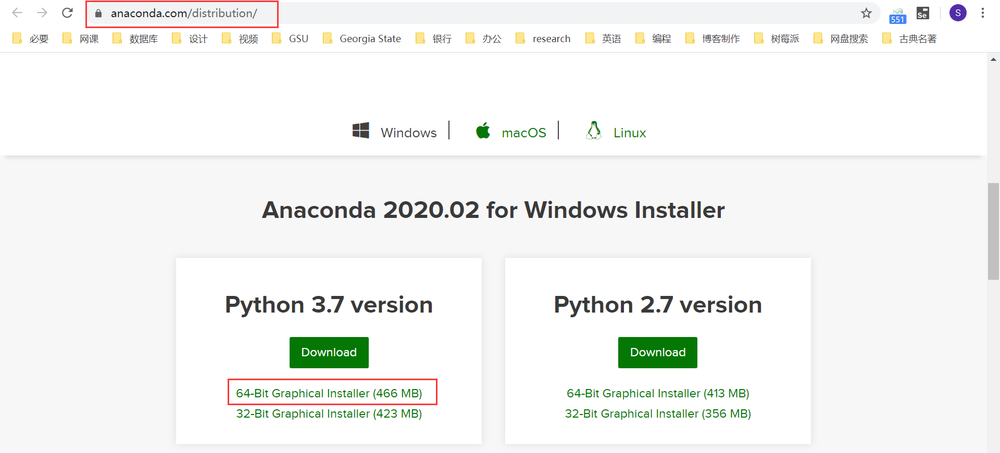
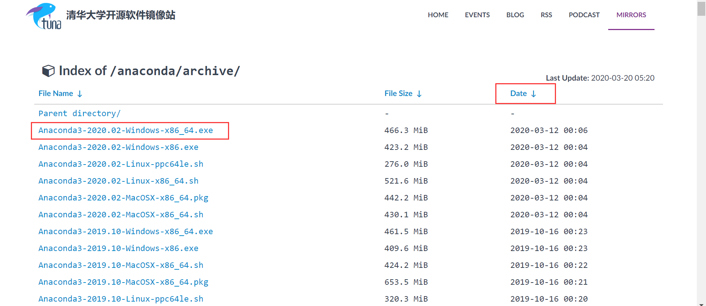
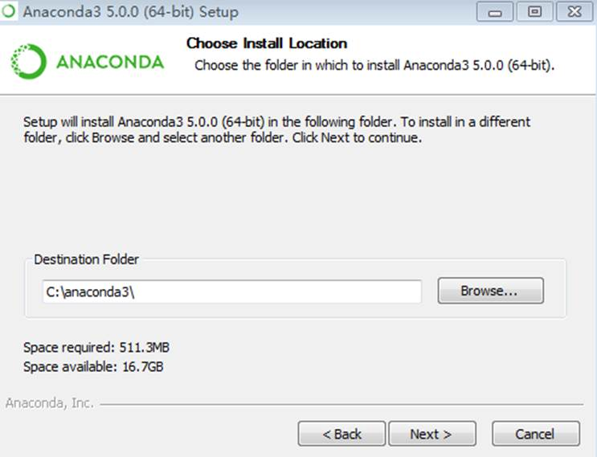
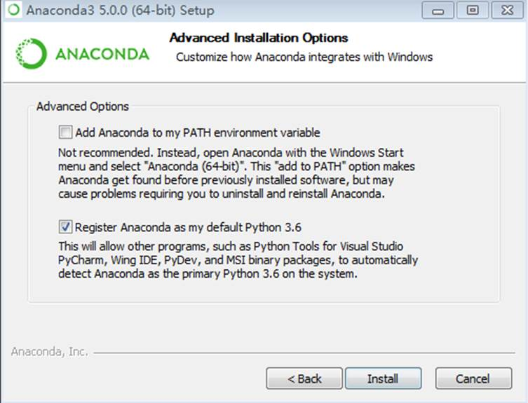
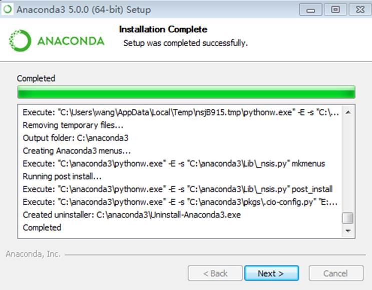
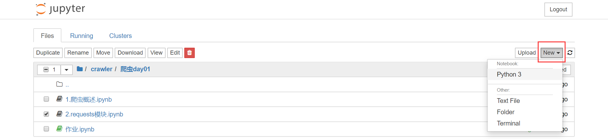
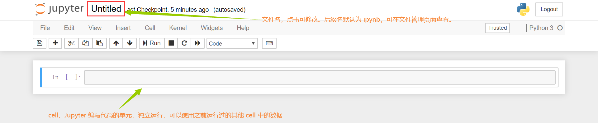
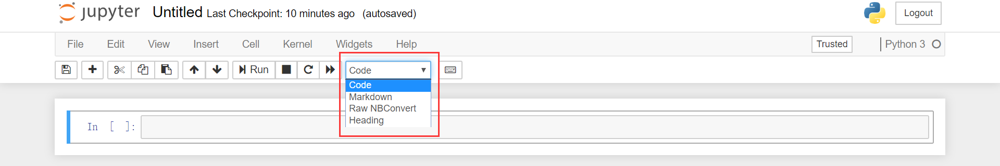
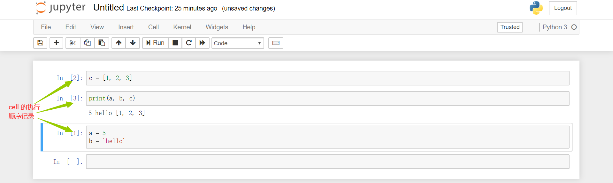
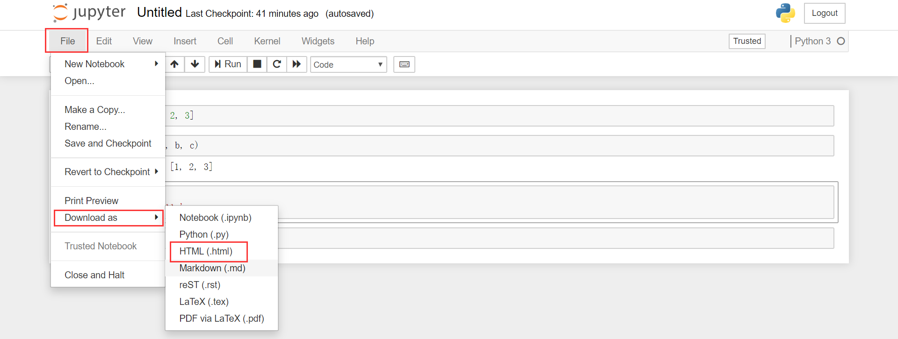

# Anaconda 开发环境的搭建和 Jupyter 的基本使用

[TOC]

## Anaconda 和 Jupyter 的简要介绍

Anaconda是一个基于数据分析和机器学习的集成环境（给我们集成好了数据分析和机器学习对应的各种环境和模块）。当然，我们也可以用它来完成网络爬虫的各种任务。

Anaconda官方文档：https://docs.anaconda.com/anaconda/navigator/

文档是纯英文，暂时没有精力翻译这个了哈。

Anaconda 这个集成环境提供了一个十分好用的基于浏览器可视化的编码工具，就是 Jupyter。也就是说，安装了 Anacanda，就默认以及安装好了 Jupyter，不许额外安装。

## Anaconda 的安装

首先，在 [Anaconda 官网](https://www.anaconda.com/distribution/) 下载所需版本的 Anaconda 安装包。

由于 Anaconda 的服务器在国外，访问和下载速度可能会比较慢，我们可以使用 [清华大学开源软件镜像站](https://mirrors.tuna.tsinghua.edu.cn/anaconda/archive/) 来下载 Anaconda 安装包，这样速度会快很多。

下载好以后，运行安装包 exe 文件，一直按照默认的选项，点击下一步安装即可。其中有几个小点说明一下。

首先是安装路径。大家都是程序员，道理都懂，开发软件的安装路径中**不要出现中文、空格和特殊符号**！可以用驼峰体，顶多用个下划线，别的符号一定不要用！比如 `Program Files(x86)` 这种就不要用了。一般情况，可以直接安装到磁盘根目录下。

然后是选择环境变量这块。官方不推荐直接加入到环境变量中。添加环境变量会让我们启动 Jupter 更方便，但也没什么必要。按需勾选吧。

最后点击 install 开始安装，可能过程需要时间，耐心等待。

测试安装是否成功：

- 打开终端：jupyter notebook 按下回车。如果成功打开 jupyter，说明安装成功，且环境变量也配置成功了。

- 如果没有配置环境变量也没关系，在你的所有程序中（点击 Windows 键），找寻有没有一个叫做 anaconda 的文件夹，点击该文件件如果文件夹下方出现了一个叫做 navigator 程序也表示安装成功。只不过环境变量没有配置好。

  

##  Jupyter 的基本使用

### 打开 Jupyter

 首先当然要打开 Jupyter。启动 Jupyter 有两种方式：

- 方式 1：如果已经配置好环境变量，直接在终端中输入 jupyter notebook 按下回车即可

- 方式 2：如果没有配置环境变量（配置好环境变量也可以如此操作），打开 navigator，点击左上角的 home 选项，点击 jupyter notebook 图标下的 lauch 启动

- 方式 3（推荐）：在 Anaconda navigator 的 Environments 标签下打开终端。这样会打开一个 Anaconda 虚拟环境的终端，在这个终端中输入 jupyter notebook 即可启动 Jupyter。

  

在终端中录入 jupyter notebook 指令后，表示我们在本机中启动了一个服务。然后会自动打开你的默认浏览器。在启动前，可以先 cd 到项目目录的根目录下，Jupyter 会默认以此目录为根目录打开文件。终端对应的目录就是浏览器打开的 Jupyter 文件管理页面中的根目录。

### new 新建

在 Jupter 文件管理页面的右上角，有一个 new 按钮，用来新建文件或文件夹。

我们可以新建四种项目：

- Python 3，新建一个 Jupyter 的源文件，这是我们要学习的重点，接下来会具体讨论它的用法
- Text File，普通文本文件，可以使用任何后缀名。创建的文件只能编辑，不能执行，不是很常用
- Folder，新建文件夹，跟普通文件夹一样
- Terminal，新建一个浏览器打开集成了 Anaconda 环境的终端，也不很常用

### Jupyter Python 3 源文件的基本使用（重点）

#### cell 初识

在 Jupyter 中使用 new 创建一个新的 Python 3 文件。我们发现，这跟我们平时使用 PyCharm 创建的 py 文件不同：

- 文件后缀名是 ipynb，而非 py，意思是 ipython notebook
- 文档由一个个小单元格组成，称作 cell。cell 就是一行可编辑框

cell 用来根据不同的模式进行代码和笔记的编写。编写好的代码和笔记可以直接在当前文件中运行，查看到运行结果。

#### cell 的模式

在菜单栏可以选择 cell 的模式：

我们看到，可以选择的 cell 模式有 4 种：Code、Markdown、Eaw NBConvert 和 Heading。我们主要使用前两种模式，即 Code 和 Markdown，接下来详细介绍一下。

##### Code 模式

Code 模型下的 cell 可以编写 Python 代码。代码可以是一行，也可以是多行。其特点为：

- 每个 cell 独立运行，cell 的执行顺序无所谓，但是 cell 中的代码一定是自上而下执行的
- 只要在一个 cell 中定义好了相关的变量/函数/类（相关的定义），当该 cell 执行后，则定义的内容就会被加载到当前源文件的缓存中。那么在任意其他的 cell 中就都可以直接使用之前定义好的加载到缓存中的变量/函数/类

从下面途中的例子可以看出，cell 执行的顺序未必从上至下。后执行的 cell 可以使用前面 cell 产生的数据。

##### Markdown 模式

cell 的 Markdown 模式用于编写笔记。可以使用 markdown 集成好的指令指定文字的样式，也可以使用 html 标签指定文字的样式。

就是普通的 markdown 语法写笔记，没啥好说的。

#### 常用快捷键

- 插入 cell：a（从当前 cell 上方插入），b（从当前 cell 下方插入）
- 删除 cell：x
- 执行 cell：shift + enter
- 切换 cell 的模式：m（切换至 Markdown 模式），y（切换至 Code 模式）
- cell 执行后，在 cell 的左侧双击就可以切换回 cell 的可编辑模式
- 收起执行结果：在执行结果左侧双击即可
- 打开帮助文档：shift + tab
- 自动补全：tab
- 撤销：z

#### 导出文件

Jupyter 文件有导出为 markdown 的功能，但是因为会产生格式错误，所以不建议这样导出。更恰当的方式是写好之后将其导出为 HTML 文件：`File -> Download as -> HTML`

