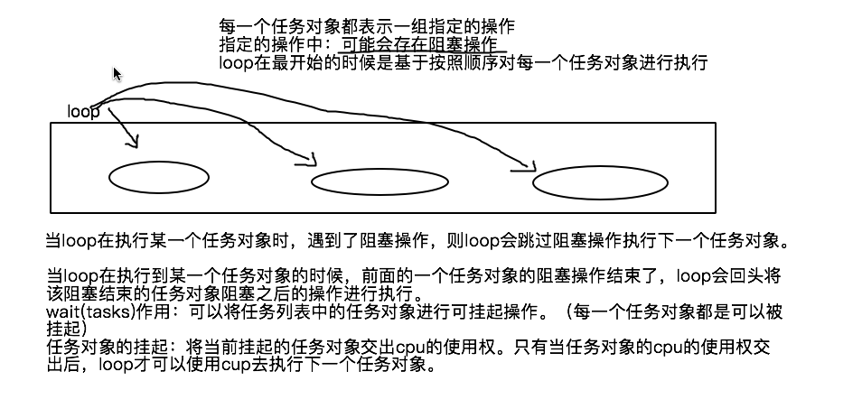
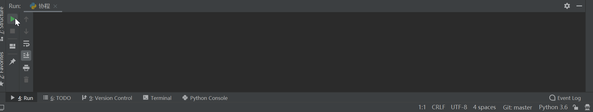
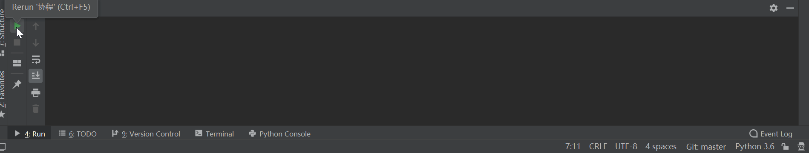

## 异步爬虫

[TOC]

### 异步爬虫概述

异步爬虫的作用很显而易见，就是为了提高我们爬虫的效率。因为网络请求通常会消耗一点时间，普通的爬虫在网络请求这段时间会诸塞住，CPU 的资源是浪费掉了。使用异步爬虫，就是在一个任务请求数据的时候，把 CPU 让出来，处理其他任务，从而提高爬虫的效率。

异步爬虫在实际应用中很有用也很没有用。说他有用，是因为就是像前面说的，可以提高爬虫的效率。说他没用，是因为实际的爬虫中，我们很多时候不那么追求效率。毕竟如果请求过于频繁，是有可能把人家的服务器搞崩掉的，会造成麻烦。另外，如果人家的服务器设置了反爬，有可能会禁掉我们的 IP。所以有些时候，我们不但不会想方设法提高效率，反而还会适当降低一点请求的频率。细水长流嘛。

当然，话说回来，有没有用是他的事，学不学是我们的事。知道怎么进行异步爬虫，才不至于将来用的时候手忙脚乱。

在这里主要介绍两种异步爬虫机制：

- 基于线程池的异步爬虫
- 基于单线程 + 多任务的异步爬虫（基于 asyncio 协程）

当然异步爬虫不仅限于这两个，而且线程池和协程也会有很多种写法，这里只是抛砖引玉，具体怎么用还得随机应变，灵活使用。

### 使用 Flask 框架搭建一个简单的 Web 服务器

我们要进行异步爬虫的演示，要看到效果就要对比同步和异步过程需要消耗的时间。如果使用网络中的服务器，测试时间会受网络波动的影响，不一定准确。所以在开始介绍异步爬虫之前，先让我们在本地搭建一个 Web 服务器。这样，用这个服务器测试我们的结果，就不会受网速的影响了。

我们从前一致用 Django 搭建 Web 服务器，这次我们换一个轻量的 Web 框架，Flask。

首先，我们要安装 Flask：

```bash
pip install flask
```

然后创建一个 py 文件，名字随意，比如就叫 `FlaskServer.py`。

然后就可以创建一个 Web 服务器了：

```python
from flask import Flask, render_template
from time import sleep
# 实例化一个app
app = Flask(__name__)

# 创建视图函数&路由地址
@app.route('/sure')
def index_1():
    sleep(2)    # 这里睡2秒是为了模拟网络请求消耗的时间
    return render_template('test.html')    # test.html放在FlaskServer.py同级目录下的templates文件夹中

@app.route('/xiaoming')
def index_2():
    sleep(2)
    return render_template('test.html')

@app.route('/xiaohui')
def index_3():
    sleep(2)
    return render_template('test.html')

if __name__ == "__main__":
    # debug=True表示开启调试模式：服务器端代码被修改后按下保存键会自动重启服务
    app.run(debug=True)
```

执行文件，即可启动 Flask 项目。项目默认运行在 `http://127.0.0.1:5000/`。

可以通过修改 run 的 port 的参数，置顶端口。

### 基于线程池的异步爬虫

首先，我们用从前的方法，写一个同步的爬虫代码，爬取我们刚刚写好的三个页面，看一看需要花费多长时间：

```python
import time
import requests

url_list = [
    'http://127.0.0.1:5000/sure',
    'http://127.0.0.1:5000/xiaoming',
    'http://127.0.0.1:5000/xiaohui',
]

def get_requests(url):
    page_text = requests.get(url).text
    return len(page_text)

if __name__ == '__main__':
    start = time.time()
    for url in url_list:
        ret = get_requests(url)
        print(ret)
    print('总耗时：', time.time() - start)
```

运行代码，我们发现，总耗时大约是 6 秒。因为每个视图函数，我们都休眠 2 秒，用来模拟网络请求的消耗时间。3 个网页总共耗时 6 秒，没毛病。

接下来，我们使用线程池实现异步爬虫，看看会不会提高我们的爬虫效率：

```python
import time
from multiprocessing.dummy import Pool
import requests

url_list = [
    'http://127.0.0.1:5000/sure',
    'http://127.0.0.1:5000/xiaoming',
    'http://127.0.0.1:5000/xiaohui',
]

def get_requests(url):
    page_text = requests.get(url).text
    return len(page_text)

if __name__ == '__main__':
    start = time.time()
    pool = Pool(3)
    ret = pool.map(get_requests, url_list)
    print(ret)
    print('总耗时：', time.time() - start)
```

总耗时降低到了 2 秒左右，鸡蛋缩短了爬虫所需要的时间。

这里我们简单提一下 pool 线程池对象的 `map(callback,alist)` 方法。

- 可以使用 callback 对 alist 中的每一个元素进行指定形式的异步操作

### 基于单线程多任务（协程）的异步爬虫

首先安装 asyncio 模块：

```
pip install asyncio
```

然后就要介绍几个概念：

#### 特殊的函数

一个函数的定义被 async 修饰后，该函数就变成了一个特殊的函数

这个函数的特殊之处在于：
- 该特殊的函数被调用后，函数中的代码不会被立即执行
- 该特殊函数被调用后的返回值是一个**协程对象**

#### 协程对象

协程对象首先是一个对象。通过特殊函数的调用能够返回一个协程对象。

换句话说，协程对象就是特殊函数，而特殊函数是一组指定的操作。

那么，协程对象其实就是一组指定的操作。

#### 任务对象

任务对象就是一个高级的协程对象（任务对象就是对协程对象的进一步封装）。

任务对象就是协程对象，而协程对象是特殊函数，特殊函数是封装了的一组指定操作。

所以，任务对象也是一组指定的操作。

创建任务对象的方式：

```python
asyncio.ensure_future(协程对象)
```

任务对象的高级之处在于可以给任务对象绑定回调，这个特点在爬虫任务中，应用十分广泛。回调任务对象的方式：

```python
task.add_done_callback(task_callback)
```

回调函数的调用时机：

- 当任务执行完成后，才会调用回调函数

回调函数的参数只可以有一个：表示的就是该回调函数的调用者（任务对象）

使用回调函数的参数调用 `result()` 方法，得到的就是任务对象表示的特殊函数 return 的结果

#### 事件循环对象

- 事件循环对象也是一个对象。

- 作用：
  - 可以将多个任务对象注册/装载到事件循环对象中
  - 如果开启了事件循环后，则其内部注册/装载的任务对象表示的指定操作就会被基于异步的被执行
  
- 创建事件循环对象：
  
  ```python
  loop = asyncio.get_event_loop()
  ```
  
- 注册并启动事件循环对象：
  
  ```python
  loop.run_until_complete(task)
  ```

启动事件循环对象，函数中的代码即可执行。

前面的几个概念，包括特殊的函数、协程对象、任务对象和事件循环的对象的用法如下：

```python
import time
import asyncio

# 声明特殊的函数
async def get_request(url):
    print('正在请求的 url：', url)
    time.sleep(2)
    print('请求结束', url)


if __name__ == '__main__':
    # 特殊的函数执行后，成为协程对象
    c = get_request('www.baidu.com')
    # 将协程对象转换为任务对象
    task = asyncio.ensure_future(c)
    # 创建任务循环对象
    loop = asyncio.get_event_loop()
    # 注册并启动事件循环对象
    loop.run_until_complete(task)
```

#### wait 方法

wait 方法用来将任务列表中的任务对象赋予可被挂起的权限。只有任务对象被赋予了可被挂起的权限后，该
任务对象才可以被挂起。

挂起指的是，将当前的任务对象交出 CPU 的使用权。

wait 方法的作用如图所示：



有了 wait 方法，我们就可以实现多任务操作了：

```python
import time
import asyncio


async def get_request(url):
    print('正在请求的 url：', url)
    # time.sleep是不支持异步模块的代码
    time.sleep(2)
    print('请求结束', url)


if __name__ == '__main__':
    url_list = [
        'http://127.0.0.1:5000/sure',
        'http://127.0.0.1:5000/xiaoming',
        'http://127.0.0.1:5000/xiaohui',
    ]
    task_list = []
    for url in url_list:
        c = get_request(url)
        task = asyncio.ensure_future(c)
        task_list.append(task)
    loop = asyncio.get_event_loop()
    # 必须使用wait方法对task_list进行封装才可以实现多任务，wait赋予task_list中所有的任务可挂起的权限
    loop.run_until_complete(asyncio.wait(task_list))
```

我们看到，代码顺利执行了，也没报错。但总觉得哪里不对——说好的异步执行呢？三个任务逐个完成，分明是串行的，没有一点异步执行的意味。



注意事项【重要】：

- 在特殊函数内部不可以出现不支持异步模块对应的代码，否则会中断整个异步效果

很遗憾，`time.sleep` 和 `requests` 都是不支持异步的模块，所以都不能用在这里。

我们需要把 `time.sleep` 更换为 `asyncio.sleep`，把 `requests` 更换为我们下面很快就会讨论的 `aiohttp`。

#### await 关键字

前面的代码光把不支持异步的模块更换为支持的模块还是不够的，我们还需要使用 await 关键字。否则的话，阻塞的操作会被直接跳过，不被执行。

在特殊函数内部，凡是阻塞操作前都必须使用 await 进行修饰。await 就可以保证阻塞操作在异步执行的过程中不会被跳过！

于是，**完整的多任务操作**代码就是这样的：

```python
import asyncio

async def get_request(url):
    print('正在请求的 url：', url)
    # 使用支持异步的阻塞模块，且用await装饰
    await asyncio.sleep(2)
    print('请求结束', url)

if __name__ == '__main__':
    url_list = [
        'http://127.0.0.1:5000/sure',
        'http://127.0.0.1:5000/xiaoming',
        'http://127.0.0.1:5000/xiaohui',
    ]
    task_list = []
    for url in url_list:
        c = get_request(url)
        task = asyncio.ensure_future(c)
        task_list.append(task)
    loop = asyncio.get_event_loop()
    loop.run_until_complete(asyncio.wait(task_list))
```

就成功实现异步操作了



#### aiohttp 异步请求模块

我们前面提到，requests 并不是一个支持异步的模块。若要实现异步爬虫，我们就需要使用 aiohttp。

aiohttp 是一个支持异步的网络请求模块。

aiohttp 模块的安装：

```bash
pip install aiohttp
```

使用代码：

1. 写出一个大致的架构：

   ```python
   import asyncio
   import aiohttp
   
   async def get_request(url):
       # 实例化一个请求对象，使用with是为了避免后续关闭起来混乱
       with aiohttp.ClientSession() as sess:
           # 调用get发起请求，返回一个响应对象
           # get/post(url,headers,params/data,proxy="http://ip:port")
           with sess.get(url=url) as response:
               # 获取字符串形式的响应数据
               page_text = response.text()
               return page_text
   ```

2. 补充细节

   - 在阻塞操作前加上 await 关键字。对于网络请求来说，发送请求和获取数据都会有阻塞
   - 在每一个 with 前加上 async 关键字

完整代码：

```python
import asyncio
import aiohttp

async def get_request(url):
    # 实例化一个请求对象，使用with是为了避免后续关闭起来混乱
    async with aiohttp.ClientSession() as sess:
        # 调用get发起请求，返回一个响应对象
        # get/post(url,headers,params/data,proxy="http://ip:port")
        async with await sess.get(url=url) as response:
            # text()获取字符串形式的响应数据
            # read()获取byte类型的响应数据
            # json()获取json类型的数据
            page_text = await response.text()
            return page_text
```

#### 多任务爬虫完整代码

多任务爬虫的数据解析一定要使用任务对象的回调函数实现数据解析，因为多任务的架构中数据的爬取是封装在特殊函数中，我们一定要保证数据请求结束后，再实现数据解析。

使用多任务的异步协程爬取数据实现套路：
- 先使用 requests 模块将待请求数据对应的 url 封装到某个列表中（同步）
- 然后使用 aiohttp 模式将列表中的 url 进行异步的请求和数据解析（异步）

多任务爬虫完整代码：

```python
import asyncio
import aiohttp
import time
from lxml import etree

async def get_request(url):
    # 实例化一个请求对象，使用with是为了避免后续关闭起来混乱
    async with aiohttp.ClientSession() as sess:
        # 调用get发起请求，返回一个响应对象
        # get/post(url,headers,params/data,proxy="http://ip:port")
        async with await sess.get(url=url) as response:
            # text()获取字符串形式的响应数据
            # read()获取byte类型的响应数据
            # json()获取json类型的数据
            page_text = await response.text()
            return page_text

# 解析函数的封装
def parse(task):
    # 获取请求到页面源码数据
    page_text = task.result()
    tree = etree.HTML(page_text)
    msg = tree.xpath('//a[@id="feng"]//text()')[0]
    # 数据持久化
    print(msg)

url_list = [
    'http://127.0.0.1:5000/sure',
    'http://127.0.0.1:5000/xiaoming',
    'http://127.0.0.1:5000/xiaohui',
]

if __name__ == '__main__':
    start = time.time()
    task_list = []
    for url in url_list:
        task = asyncio.ensure_future(get_request(url))
        task.add_done_callback(parse)
        task_list.append(task)
    loop = asyncio.get_event_loop()
    loop.run_until_complete(asyncio.wait(task_list))
    print('总耗时：', time.time() - start)
```

### 简答题

1. 说明是特殊函数特殊之处在哪里

   - 定义特殊：需要用 async 修饰

   - 执行过程特殊：执行后，函数中的代码不会立即执行

   - 返回值特殊：返回的是协程对象

2. 阐述任务对象和协程的区别，任务对象的回调函数在爬虫中的作用是什么

   任务对象和协程对象都是函数中封装的一组可执行的操作。任务对象是对协程对象的进一步封装，可以实现结果的回调。

   在爬虫中，请求任务的返回结果往往还需要做进一步的处理。这些处理，需要拿到结果后才能进行。所以，最好的办法是将数据处理的代码作为回调函数交给任务。当任务执行完毕，返回页面数据。回调函数就可以用来处理页面数据了。

3. 阐述事件循环的工作流程

   首先，实例化一个事件循环对象：`loop = asyncio.get_event_loop()`

   然后，注册并执行实现循环对象即可：`loop.run_until_complete(tast)`

4. 简述 wait() 和 await 关键字的作用

   wait 可以实现列表中的多个任务的并发执行。当执行中的任务进入阻塞时，将变成挂起状态，交出 CPU 的使用权。待其完成阻塞，将继续执行。

   await 用来保证阻塞的操作在异步任务中不被跳过。

5. aiohttp的基本使用有哪些？

   ```python
   # 伪代码
   with aiohttp.ClientSession as sess:
       with sess.get/post(url=url, headers=headers, data=data, params=params, proxy='代理') as response:
           return response.text()/read()
   ```

   