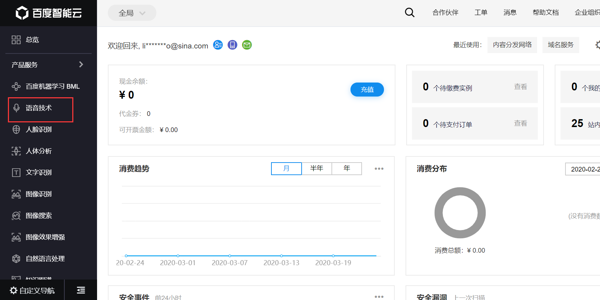
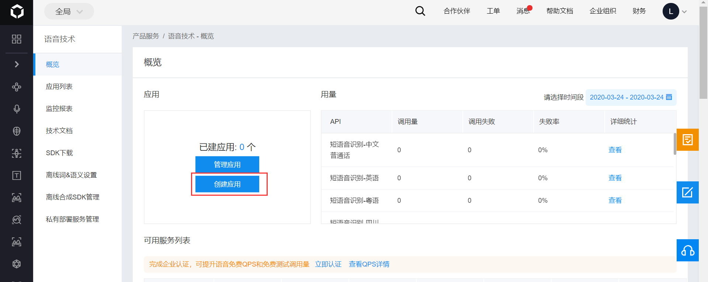
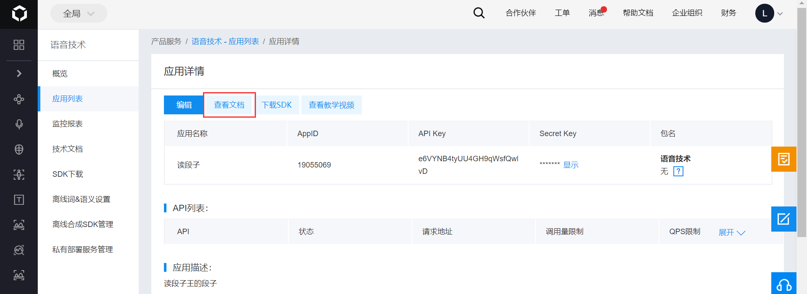
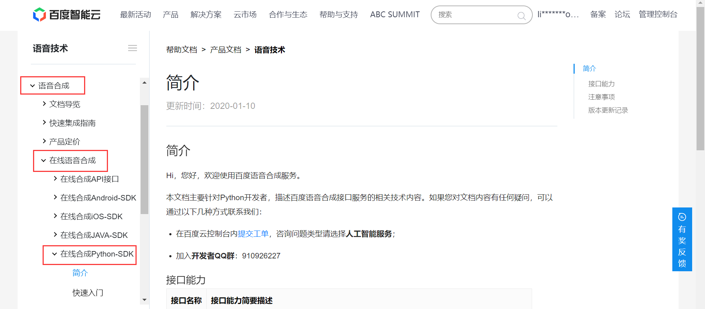
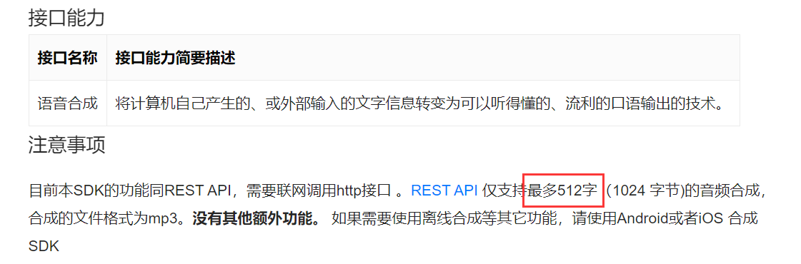

## 百度 AI 的基本用法

百度 AI 有很多有趣的功能，在爬虫过程中或许会用到。比如，我们常用的基于百度AI实现的爬虫功能有：

- 图像识别
- 语音识别&合成
- 自然语言处理

百度 AI 的通用使用流程：

- 点击控制台进行登录
- 选择想要实现的功能
- 实现功能下创建一个 app
- 选择对应的 Python SDK 文档进行代码实现

接下来，我将以百度 AI 的语音合成功能为例，介绍一下百度 AI 的基本用法。百度 AI 的其他功能的使用方法完全类似。

首先，打开百度 AI 的控制台，可能需要登陆。网址为：https://console.bce.baidu.com/

找到我们需要的功能，点进去，比如语音技术：



若没有应用，点击 `创建应用`，若已有应用，也可点击 `管理应用`：



然后填上应用名和描述，选择自己需要用到的功能即可。

创建好应用后，即可查看应用的各种信息：



点击 `查看文档` 即可查看每种功能的具体用法。我们要用的功能是语音合成，要使用的是在线语音合成，要查看的是 Python SDK。



需要注意的是，语音合成长度不能太长，不可以超过 512 字：



然后就是按照官方文档的要求，一步一步走下来。

首先安装 baidu-aip 模块：

```bash
pip install baidu-aip
```

然后实例化一个 AipSpeech 对象，这些数据都很容易找到：

```python
from aip import AipSpeech

""" 你的 APPID AK SK """
APP_ID = '你的 App ID'
API_KEY = '你的 Api Key'
SECRET_KEY = '你的 Secret Key'

client = AipSpeech(APP_ID, API_KEY, SECRET_KEY)
```

然后调用语音合成方法 synthesis，把参数传进去即可：

```python
result  = client.synthesis('你好百度', 'zh', 1, {
    'vol': 5,
})

# 识别正确返回语音二进制 错误则返回dict 参照下面错误码
if not isinstance(result, dict):
    with open('auido.mp3', 'wb') as f:
        f.write(result)
```

参数解释：

| 参数 | 类型   | 描述                                                         | 是否必须 |
| ---- | ------ | ------------------------------------------------------------ | -------- |
| tex  | String | 合成的文本，使用UTF-8编码， 请注意文本长度必须小于1024字节   | 是       |
| cuid | String | 用户唯一标识，用来区分用户， 填写机器 MAC 地址或 IMEI 码，长度为60以内 | 否       |
| spd  | String | 语速，取值0-9，默认为5中语速                                 | 否       |
| pit  | String | 音调，取值0-9，默认为5中语调                                 | 否       |
| vol  | String | 音量，取值0-15，默认为5中音量                                | 否       |
| per  | String | 发音人选择, 0为女声，1为男声， 3为情感合成-度逍遥，4为情感合成-度丫丫，默认为普通女 | 否       |

示例：将段子王的笑话爬取下来，并转换成语音

段子王 url：https://duanziwang.com/category/%E7%BB%8F%E5%85%B8%E6%AE%B5%E5%AD%90

```python
import os
import requests
from bs4 import BeautifulSoup
headers = {
    'User-Agent': 'Mozilla/5.0 (Windows NT 10.0; WOW64) AppleWebKit/537.36 (KHTML, like Gecko) Chrome/80.0.3987.132 Safari/537.36'
}
from aip import AipSpeech

""" 你的 APPID AK SK """
APP_ID = '19055069'
API_KEY = 'e6VYNB4tyUU4GH9qWsfQwlvD'
SECRET_KEY = 'F03R86gmufCwvRkM8LZMfftTZaAikRTg'

client = AipSpeech(APP_ID, API_KEY, SECRET_KEY)

audio_dir = 'DuanziwangAud'
if not os.path.exists(audio_dir):
    os.mkdir(audio_dir)
for page in range(1, 11):
    url = f'https://duanziwang.com/category/%E7%BB%8F%E5%85%B8%E6%AE%B5%E5%AD%90/{page}/'
    response = requests.get(url=url, headers=headers)
    page_text = response.text
    soup = BeautifulSoup(page_text, 'lxml')
    article_list = soup.findAll('article', class_='post')
    for article in article_list:
        title = os.path.join(audio_dir, article.h1.text + '.mp3')
        content = article.p.text
        result  = client.synthesis(content, 'zh', 1, {
            'vol': 5,
        })

        # 识别正确返回语音二进制 错误则返回dict 参照下面错误码
        if not isinstance(result, dict):
            with open(title, 'wb') as f:
                f.write(result)
        print(title, '下载成功！')
```

