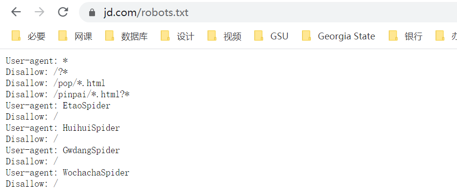

## 爬虫概述

简要说一下关于爬虫的东西。

### 爬虫的概念

爬虫的别名很多，网络爬虫，网络蜘蛛之类的大家都知道就不说了。

通俗来讲，爬虫就是通过编写程序，**模拟**我们使用浏览器上网，在互联网中**抓取**我们想要的数据的过程。

这里有两个关键词：模拟和抓取

- 模拟，也就是通过代码来进行操作，不需要人直接参与访问网页的过程。不过其实从广义上讲，我们使用浏览器也可以看作是一个爬虫的过程。浏览器就是一个纯天然最原始的一个爬虫工具。只不过我们的效率太低，这种工作太无聊，所以交给计算机去做了而已
- 抓取，又涉及到两个方面的含义：抓取一整张的页面源码数据和抓取一整张页面中的局部数据。显而易见，要抓取到页面的局部数据，首先还是要抓取到一整张页面的完整源码数据。

### 爬虫的分类

依据抓取的内容和使用的方式不同，大致可以将爬虫分为四个类别：通用爬虫、聚焦爬虫、增量式爬虫和分布式爬虫。

- 通用爬虫：爬取一整张页面的源码数据
- 聚焦爬虫：爬取一张页面中的局部的数据，聚焦爬虫一定是建立在通用爬虫基础之上

- 增量式爬虫：用来监测网站数据更新的情况，以便爬取到网站最新更新出来的数据
- 分布式爬虫：提高爬取效率的终极武器。基于 scrapy 框架，使用的方法包括但不限于高并发

### 反爬机制与反反爬策略

- 反爬机制
    - 是作用到门户网站中。如果网站不想让爬虫轻易爬取到数据，它可以制定相关的机制或者措施阻止爬虫程序爬取其数据。
- 反反爬策略
    - 是作用在爬虫程序中。我们爬虫可以制定相关的策略破击反爬机制从而爬取到相关的数据。

#### robots 协议，课程第一个反爬机制

- robots 协议：防君子不防小人
    
    - 是一个纯文本的协议，协议中规定了该网站中哪些数据可以被哪些爬虫爬取，哪些不可以被爬取。
    
    - 一般在网站的门户页面后面加上 `/robots.txt` 即可查看该网站的 robots 协议，比如京东的：
    
      
- 破解：
    
    - 你自己主观性地不遵从该协议即可。

### 爬虫模块

我们要学到的爬虫模块又下面两个：requests 和 scrapy。

requests 模块

- 数据解析
- 动态加载数据的爬取
- selenium
- 移动端数据的爬取
- 异步的爬虫
- 10 种反爬机制

scrapy 框架

- 异步的爬虫框架