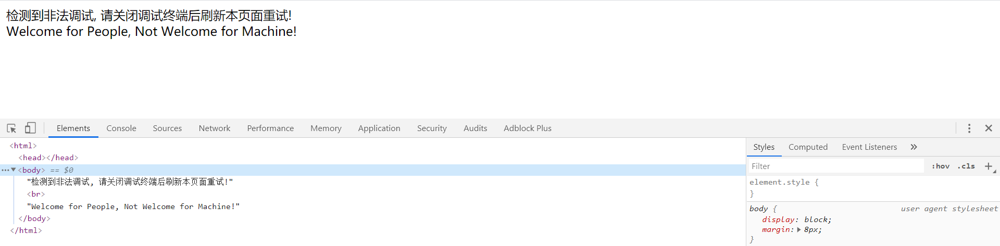
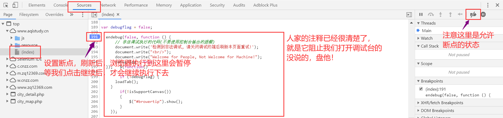
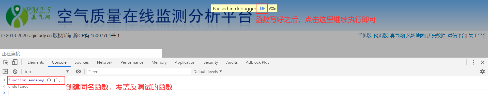
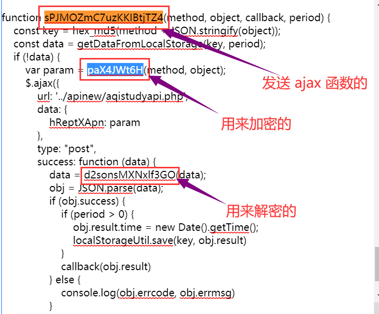

## 空气质量在线监测平台首页数据爬取

[TOC]

在 [JS 解密和混淆破解](js-decode.md) 这篇博客中，我们尝试抓去了空气质量在线监测平台网页的数据。但是因为这个网站最近似乎在更新，前端解密不稳定，所以最终没能解析出数据来。

我偶然发现，这个网站的首页内容是可以正常显示的。所以，在这里尝试对其首页进行爬取。

### 规避反调试机制

网址 url：https://www.aqistudy.cn/

在这个网址的首页，如果我们使用 F12 打开调试台，网页内容会消失，就像这样：

这是因为这个网站进行了反调试处理。当我们打开调试页面，会通过 JS 代码删除掉页面中的数据。

解决办法是，找到删除页面的 JS 代码，通过调试工具的端点功能，在其执行前，在网页中注入同名的函数将其覆盖，使得检测函数不会被执行。

这段 JS 代码还算比较容易找到。一个小技巧是，可以通过查找页面中显示内容所在的位置找到修改页面数据的代码。

设置好断电后，刷新页面，页面会暂停在我们设置断点的位置。在 console 中，新定义一个同名的 JS 函数，覆盖掉反调试的代码，比如直接写 `var function endebug(){};` 即可：

这样，我们就可以使用调试工具调试这个页面了。

### 爬取指定城市的空气质量数据

接下来的操作，和前一篇博客基本一致，就不复述细节了。

