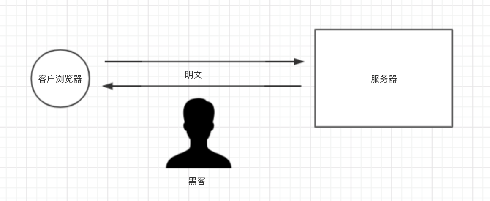
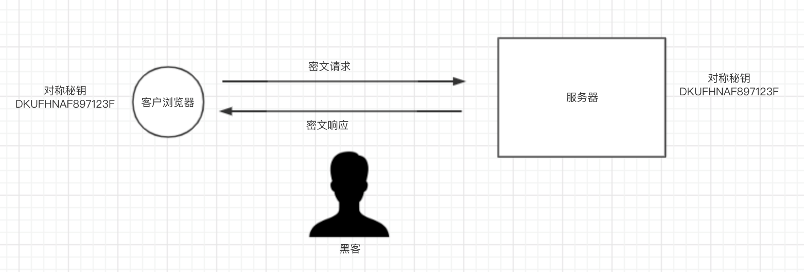
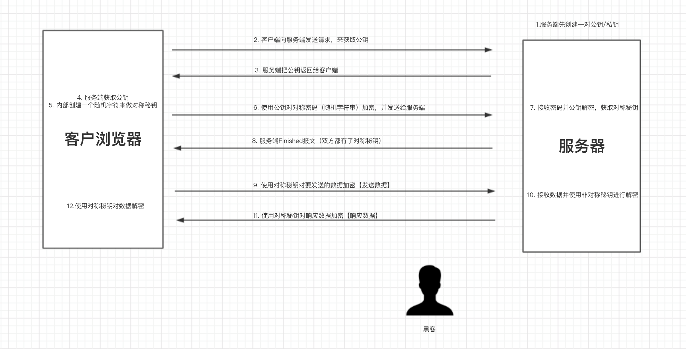
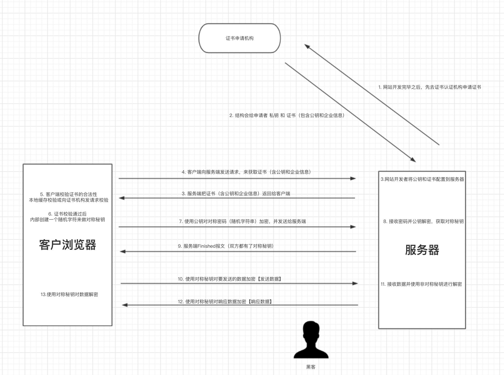

## HTTPS 简要介绍

[TOC]

HTTPS 是基于 HTTP 和 SSL/TLS 实现的一个协议，使用 HTTPS 在网络上传输的数据都是加密的，从而保证数据安全。

接下来我们从没有加密的 HTTP 协议开始，逐步对数据进行加密，增加安全性，最终实现 HTTPS。

### HTTP 协议是不安全的。

在 HTTPS 诞生之前，所有网站都直接使用 HTTP 协议。而 HTTP 协议在数据传输的过程中使用的都是明文，传输的数据很容易被泄露和篡改。

### 使用对称秘钥进行数据加密

为了防止数据泄露和篡改，人们开始对数据进行加密。比如，生成一个对称密码（类似于 DKUFHNAF897123F 这样的随机字符串），将对称秘钥分别交给浏览器和服务器端，他们之间传输的数据都使用对称秘钥进行加密和解密。

请求和响应流程如下：

1. 客户端使用对称秘钥对请求进行加密，并发送给服务端。
2. 服务端接收到密文之后，使用对称秘钥对密文进行解密，然后处理请求。 最后再使用对称秘钥把要返回的内容再次加密，返回给客户端。
3. 客户端接收到密文之后，使用对称秘钥进行解密，并获取最终的响应内容。

总结起来就是，密钥加密，密钥解密。

如此一来，数据传输都是密文，解决了明文传输数据的问题。**但是**，这么干有 bug。

- 浏览器如何获取对称秘钥？
- 每个客户端的对称秘钥相同，浏览器能拿到对称秘钥，那么黑客也可以拿到。这样一来，数据加密就没有意义了。  

### 动态对称秘钥和非对称秘钥

为了解决对称秘钥动态性以及让客户端和服务端安全的获取对称秘钥，可以引入非对称秘钥机制。

这种模式可以总结为：公钥加密，私钥解密。

如此一来，解决了 动态对称秘钥和数据加密的问题，因为每个用户的对称秘钥都是随机生成且传输的过程中都使用公钥加密（公钥加密的数据只有私钥能解密），黑客无法截获对称秘钥。而数据传输是通过对称秘钥加密过的，所以黑客即使能获取数据也无法去解密看到真实的内容。  看似无懈可击，**但是**，这么干还是又 bug。

客户端如何才能保证，自己拿到的公钥就一定来自于服务器呢？

如果黑客在上图 【步骤2】劫持，黑客把自己的公钥返回给客客户端。那么客户端会使用黑客的公钥来加密对称秘钥。黑客在【步骤6】截获请求，使用自己的私钥获取对称秘钥，后面过程全都gg！

### CA 证书的应用

使用 CA 证书可以解决黑客劫持的问题。

使用 CA 证书也是通过非对称加密，只是客户端会向证书签发机构验证公钥确实是来自于服务器，而非伪造的或是被人篡改过的。

如此一来，就解决了黑客劫持的问题，因为即使黑客劫持后的给浏览器即使返回了证书也无法通过校验，同时浏览器也会提示错误信息。

注意：HTTPS 是基于 HTTP 和 SSL/TLS 实现的一个协议，其中前 9 个步骤称为是 SSL/TLS 过程，之后的传输数据利用的就是 HTTP 协议（收发数据）。

### 总结

以上就是 HTTPS 的实现原理。HTTPS 可以保证数据安全，但由过程需要反复加密解密所有访问速度会有所下降（鱼和熊掌不能兼得）。