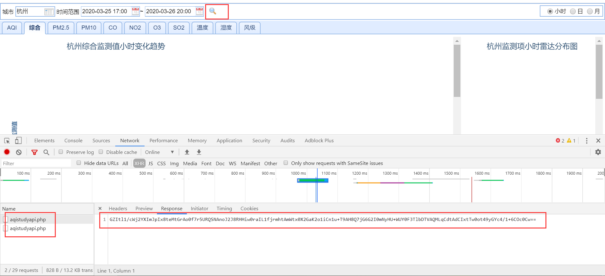
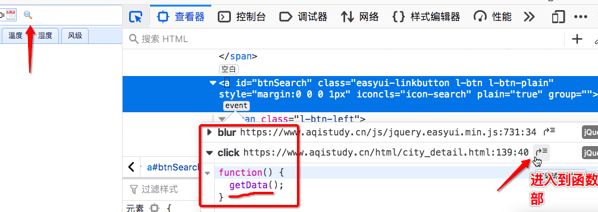
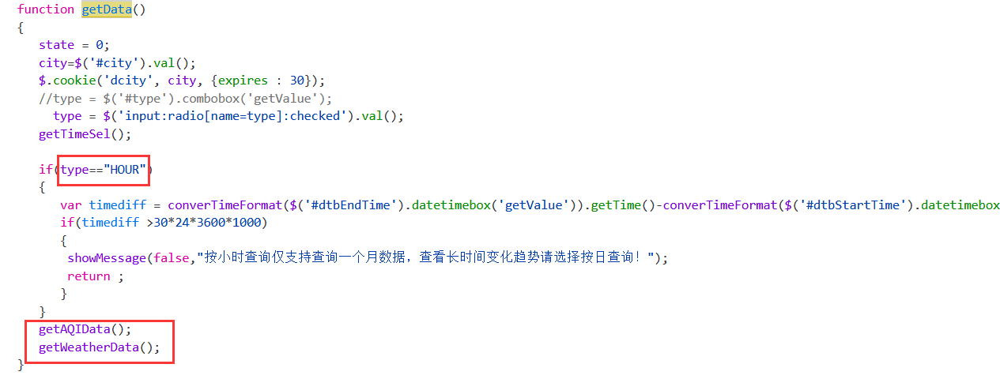
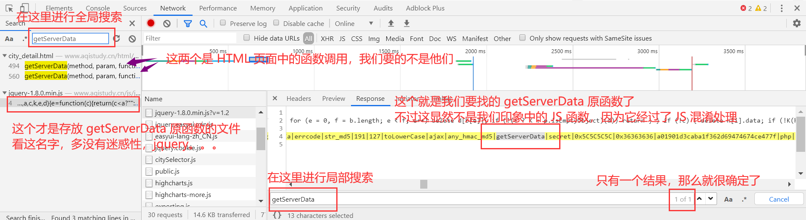
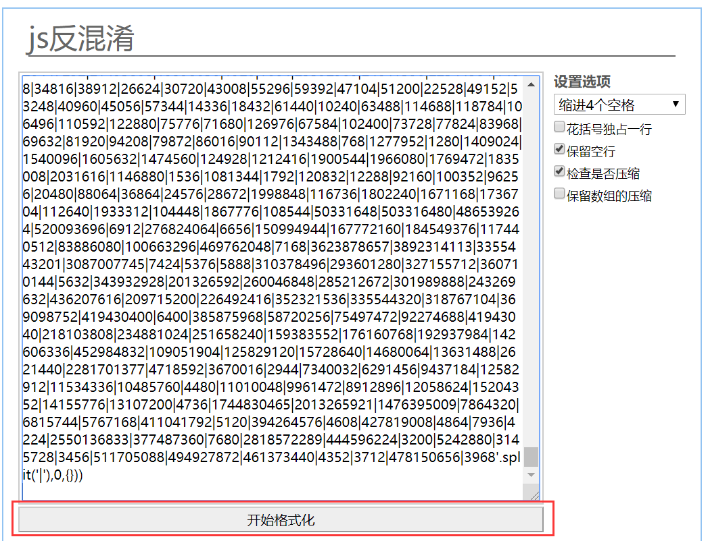

## JS 解密和混淆破解

我们已经学到很多反爬机制以及相应的反反爬策略。使用那些手段，其实已经完全可以完成绝大多数的爬虫任务。但是，还是有极个别的情况下，会出现诸如 JS 加密和 JS 混淆之类的高深反爬机制。

如果不幸遇到这种反爬机制，一个明智之举是给站长点个赞，然后恭恭敬敬选择放弃，去别的地方找数据。

当然，还是那句话，我们可以选择不爬，但是对付 JS 加密和 JS 混淆的方法却不可以不会。

这里就以中国空气质量在线检测平台为例，介绍 JS 加密和 JS 混淆的实现和破解方法。

要爬取的网站：https://www.aqistudy.cn/html/city_detail.html

这个网站正在升级，所以页面无法正常显示。这也意味着这个网站本身的 JS 解密是有问题的（如果没问题就能显示了），所以最后我们并不能完全解析出数据来。虽然如此，这个网站仍然是学习 JS 加密和 JS 混淆的相当不错的平台。

闲话少说，开始干活！

首先浏览器打开网页，并打开调试台的抓包工具。修改查询条件（城市的名称 + 时间范围），然后点击查询按钮，捕获点击按钮后发起请求对应的数据包。点击查询按钮后，并没有刷新页面，显然发起的是 ajax 请求。该请求就会将指定查询条件对应的数据加载到当前页面中（我们要爬取的数据就是该ajax请求请求到的数据）。



分析捕获到的数据包

- 提取出请求的url：https://www.aqistudy.cn/apinew/aqistudyapi.php
- 请求方式：post
- 请求参数：d: 动态变化一组数据（且加密）
- 响应数据：是加密的密文数据

该数据包请求到的是密文数据，为何在前台页面显示的却是原文数据呢？

原来，在请求请求到密文数据后，前台接受到密文数据后使用指定的解密操作（JS 函数）对密文数据进行了解密操作，然后将原文数据显示在了前台页面。

接下来的工作流程：

- 首先先处理动态变化的请求参数，动态获取该参数的话，就可以携带该参数进行请求发送，将请求到的密文数据捕获到。
- 将捕获到的密文数据找到对应的解密函数对其进行解密即可。
- 【重点】需要找到点击查询按钮后对应的 ajax 请求代码，从这组代码中就可以破解动态变化的请求参数和加密的响应数据对应的相关操作。
- 找 ajax 请求对应的代码，分析代码获取参数 d 的生成方式和加密的响应数据的解密操作。
  - 直接在页面中，并没有办法直接找到发送 ajax 请求的函数的，因为它以及被封装到别的文件中了。
  - 我们可以基于火狐浏览器定位查询按钮绑定的点击事件。



抽丝剥茧，首先从 getData 函数实现中找寻 ajax 请求对应的代码。在该函数的实现中没有找到 ajax 代码，但是发现了另外两个函数的调用，`getAQIData()` 和 `getWeatherData()`。ajax 代码一定是存在于这两个函数实现内部。

另外，这里记住一个参数，`type == ’HOUR‘`，它的含义是查询时间是以小时为单位。这个参数我们后来会用到。



接下来我们就去分析 `getAQIData()` 和 `getWeatherData()`，争取能够找到 ajax 代码。

我们找到这两个函数的定义位置，还是没有找到 ajax 请求代码。不过我们却发现它们同时调用了另外一个函数，`getServerData(method,param,func,0.5)`。它的参数的值可以为：

- method 可以是 'GETCITYWEATHER' 或者 'GETDETAIL'

- params 的值是 `{city, type, startTime, endTime}`，也就是查询条件
- func 是一个匿名函数，看样子是在处理数据。

下一步当然就要找 `getServerData` 函数了，看看那个函数里面有没有我们一致想要的发送 ajax 请求的代码。

我们尝试着在页面中搜索，却找不到这个函数。很显然，它是被封装到其他 js 文件中了。这时，我们可以基于抓包工具做全局搜索。



好消息是，我们顺利找到了 getServerData 函数！坏消息是，这货长得一点也不像是函数。

这是因为，这段 JS 函数代码被加密的。这种加密的方式，我们称为 JS 混淆。

JS 混淆，也就是对核心的 JS 代码进行加密。

JS 反混淆，则是对 JS 加密代码进行解密。

接下来我们要做的，就是 JS 反混淆，让这段我们看不懂的东西，显现出庐山真面目。

我们用的方法十分简单粗暴，也就是暴力破解。使用这个网站就可以实现对 JS 混淆的暴力破解：https://www.bm8.com.cn/jsConfusion/

将 getServerData 函数所在的那一整行代码都复制过来，粘贴到这个网址的文本输入框中，然后点击 `开始格式化` 即可：



终于，我们看到了 getServerData 的代码，并且在其中发现了发送 ajax 的请求：

```js
function getServerData(method, object, callback, period) {
    const key = hex_md5(method + JSON.stringify(object));
    const data = getDataFromLocalStorage(key, period);
    if (!data) {
        var param = getParam(method, object);
        $.ajax({
            url: '../apinew/aqistudyapi.php',
            data: {
                d: param
            },
            type: "post",
            success: function (data) {
                data = decodeData(data);
                obj = JSON.parse(data);
                if (obj.success) {
                    if (period > 0) {
                        obj.result.time = new Date().getTime();
                        localStorageUtil.save(key, obj.result)
                    }
                    callback(obj.result)
                } else {
                    console.log(obj.errcode, obj.errmsg)
                }
            }
        })
    } else {
        callback(data)
    }
}
```

从这段代码中，我们不难得出下面这几个信息：

- ajax 请求成功后获得到的 data 是加密的响应数据（就是我们最开始通过抓包工具看到的那一串神秘的相应字符串），通过 `decodeData(data)` 函数，可以将加密的数据解密成我们需要的明文数据。
- 发送请求时携带的参数，也就是 d 对应的值 param 是通过 `getParam(method, object)` 函数返回动的态变化的请求参数。这两个参数我们前面也分析过：
  - 参数 method 可以是 'GETCITYWEATHER' 或者 'GETDETAIL'
  - 参数 object 则为 `{city, type, startTime, endTime}`，是我们的查询条件

我们当然还可以继续最终下去，刨根问题找到它们究竟是通过什么方式进行加密和解密的。然后，使用 Python 代码，重复这个加密和解密的过程，完成请求数据的生成和响应数据的解析过程。

但是我们并不打算这么做。因为再继续深挖下去，难度将会陡然增加。此时我们已经很疲惫了，如果继续下去恐怕要疯掉。而且，JavaScript 和 Python 毕竟是两种语言，它们之间的方法和各种包都不相同。JavaScript 能实现的，Python 未必能够轻松完成。所以重新写一个加密和解密的脚本，并不是明智之举。

更好的解决方案是，我们提供请求的明文数据，通过网站自己的 JS 代码进行加密，得到加密的请求参数。使用这个参数，我们发送请求给服务端。拿到加密的响应数据后，再通过网站的 JS 代码进行解密。

也就是说，我们接下来需要做的就是要调用两个 JS 函数 decodeData 和 getParam，并拿到返回结果即可。

现在的问题是，在 Python 程序中如何调用 JS 函数呢？

这就涉及到一个新的概念：**JS 逆向**。JS 逆向，也就是在 Python 中调用 JS 函数代码。

能够实现 JS 逆向的方式有两种：

1. 手动将 JS 函数改写称为 Python 函数并执行。

   这种方法我刚刚谈过了，并不现实。因为 JS 能实现的，Python 未必能够轻易实现。而且毕竟还要重写函数，比较麻烦。

2. 使用固定模块，实现自动逆向（推荐）。

   一个很好用的实现 JS 逆向的 Python 库 是 PyExecJS。

   PyExecJS 库用来实现模拟 JavaScript 代码执行获取动态加密的请求参数，然后再将加密的响应数据带入 decodeData 进行解密即可。

   PyExecJS 需要在本机安装好 nodejs 的环境。

   PyExecJS 的安装：

   ```bash
   pip install PyExecJS
   ```

接下来，我们就可以生成加密的请求数据了。

首先，把我们解析出来的那串代码保存到本地，比如名为 `code.js` 的文件中。在里面我们补充一个函数，比如名字叫 getPostParamCode，用来发起我们的数据请求。之所以这样做是因为使用 PyExecJS 调用 JS 函数时，传入的参数只能是字符串。而 getParam 方法的参数需要用到 JS 的自定义对象。

我们只需在 `code.js` 中加上下面的代码即可：

```js
function getPostParamCode(method, type, city, start_time, end_time) {
    var param = {};
    param.type = type;
    param.city = city;
    param.start_time = start_time;
    param.end_time = end_time;
    return getParam(method, param)
}
```

然后，使用 PyExecJS 调用里面的 getParam 方法，将我们的请求数据加密：

```python
# 模拟执行decodeData的js函数对加密响应数据进行解密
import execjs
import requests

node = execjs.get()

# 请求参数
method = 'GETCITYWEATHER'
type = 'HOUR'
city = '北京'
start_time = '2020-03-20 00:00:00'
end_time = '2020-03-25 00:00:00'

# 编译js代码
file = 'code.js'    # js代码的路径
ctx = node.compile(open(file, encoding='utf-8').read())

# 将请求数据加密
encode_js = f'getPostParamCode("{method}", "{type}", "{city}", "{start_time}", "{end_time}")'
params = ctx.eval(encode_js)

# 使用加密的参数，发起post请求
url = 'https://www.aqistudy.cn/apinew/aqistudyapi.php'
response_text = requests.post(url, data={'d': params}).text

# 将响应数据解密
decode_js = f'decodeData("{response_text}")'
decrypted_data = ctx.eval(decode_js)    # 如果顺利，返回的将是解密后的原文数据
print(decrypted_data)    # 执行会报错：目前页面中没有数据。解密函数只是针对页面中原始的数据进行解密。
```

自此，我们完成了 JS 加密和 JS 混淆的处理。这里我们总结一下这几个概念：

- JS 加密，也就是通过 JS 代码，将数据进行加密处理，将明文数据变成密文数据。如果不能将其解密，密文数据将毫无用处。
- JS 解密：通过 JS 代码，将加密的数据解密，也就是将密文数据解析成明文数据。JS 解密是 JS 加密的逆过程。
- JS 混淆：将 JS 代码（比如 JS 函数）本身进行加密。
- JS 反混淆：将加密了的 JS 代码解密成常规的 JS 代码。通常直接使用暴力破解即可。
- JS 逆向（重要）：通过 Python 代码调用 JS 的函数。

附，ajax 请求的各个数据的含义：

```js
$(function () { 
    $(".submit").on("click", function () {
        var sub = $(".search").val()	//拿到输入框的值
        $.ajax({
            type: "POST",    //请求类型 
            url: 'https://www.aqistudy.cn/apinew/aqistudyapi.php',    //请求地址和参数    GET请求才把参数写在这里
            data: d
            // res加密的响应数据
            success: function (res) {   //请求成功后执行的函数res是返回的值
                xxxx // 在对res的密文数据进行解密
                                     
            }
        });
    });
});
```