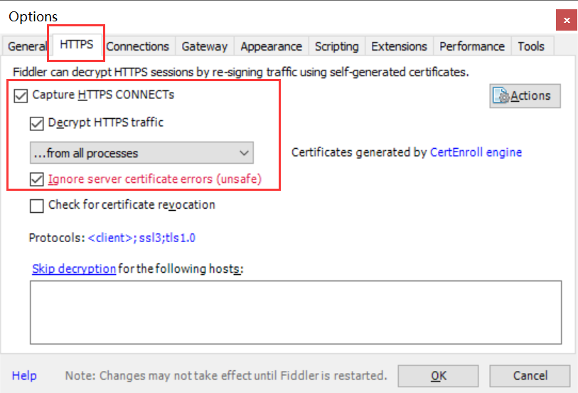
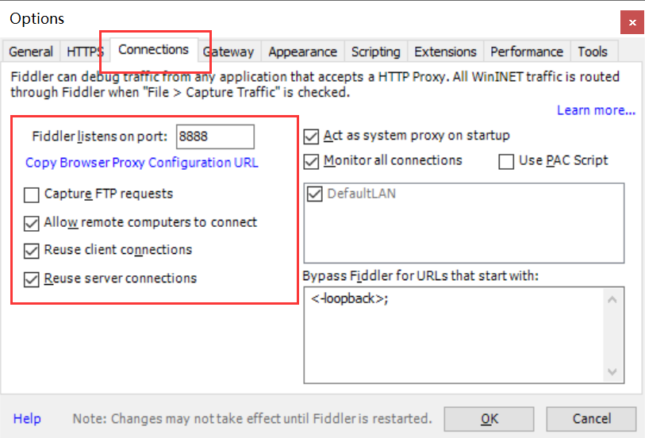
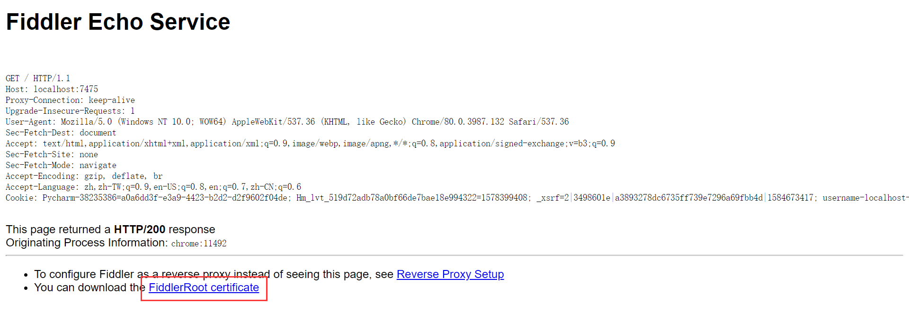
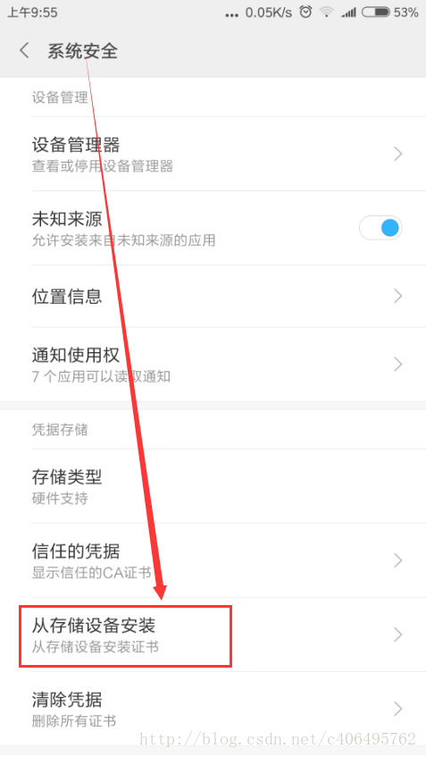
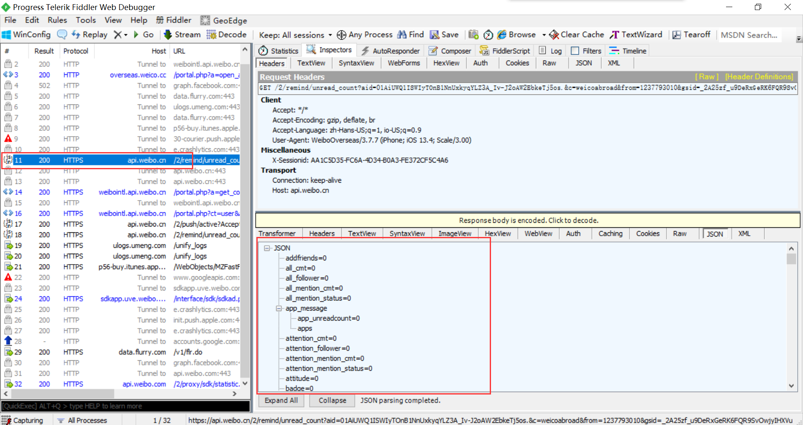

## 使用 Fiddle 实现移动端数据的爬取

[TOC]

### 概述

移动端数据的爬取，主要指的针对手机、平板电脑等便携设备的应用数据进行爬取。

因为移动端应用获取数据也是使用 HTTP 协议，通过发送请求获取到数据。所以我们只需要获取到移动端应用的请求接口，给足所需的参数，就可以实现移动端数据的爬取。

### Fiddle 的介绍与安装

我们刚刚说到，要爬取移动端的数据，只需要获取到应用的接口。可是人家不会主动把这些接口告诉我们，让我们去爬取他们的数据。我们就需要通过一些抓包工具，抓取这些应用发出的请求。从这些请求中，找到我们需要的那些接口。

对于浏览器网页而言，我们可以简单地使用调试台抓取数据。

在移动端，我们可以用的工具就是 Fiddle。

Fiddler 是位于客户端和服务器端之间的 HTTP 代理，也是目前最常用的 HTTP 抓包工具之一 。 它能够记录客户端和服务器之间的所有 HTTP 请求，可以针对特定的 HTTP 请求，分析请求数据、设置断点、调试 web 应用、修改请求的数据，甚至可以修改服务器返回的数据。可以说功能非常强大，是 web 调试的利器。

既然是代理，也就是说，客户端的所有请求都要先经过 Fiddler，然后转发到相应的服务器。反之，服务器端的所有响应，也都会先经过Fiddler然后发送到客户端。基于这个原因，Fiddler 支持所有可以设置 http 代理为 `127.0.0.1:8888` 的浏览器和应用程序。
利用可以设置代理的这个特点，我们就可以对手机 APP 进行抓包了。

Fiddler下载地址：https://www.telerik.com/fiddler

傻瓜式安装，一键到底。

### Fiddle 设置

我们需要进行一些设置，让 Fiddle 能够适配我们的手机。我们需要确保手机和电脑处在同一网段之内。

打开 Fiddler 软件，打开工具的设置。（Fiddler 软件菜单栏：Tools->Options）

 在 HTTPS 中设置如下：

期间可能会有系统提示，全部点击确定即可。

在 Connections 中设置如下，指定一个端口号，默认为 8888。端口可修改，但是注意不要与已经使用的端口冲突。

Allow remote computers to connect：允许别的机器把请求发送到 Fiddler 上来。

### 安全证书下载和安装

证书是需要在手机上进行安装的，这样在电脑 Fiddler 软件抓包的时候，手机使用电脑的网卡上网才不会报错。

在电脑浏览器中输入地址：`http://localhost:8888/`，注意修改端口号，点击 `FiddlerRoot certificate`，下载安全证书：

#### Android 手机证书安装

把证书放入手机的内置或外置存储卡上，然后通过手机的"系统安全->从存储设备安装"菜单安装证书。

然后找到拷贝的 `FiddlerRoot.cer` 进行安装即可。安装好之后，可以在信任的凭证中找到我们已经安装好的安全证书。

#### 苹果手机证书安装

首先要确保手机网络和 Fiddler 所在机器网络是同一个网段下的。

在 Safari 中访问 `http://fiddle机器ip:fiddler端口`，进行证书下载。然后进行安装证书操作。

在手机中的设置 -> 通用 -> 关于本机 -> 证书信任设置 -> 开启 Fiddler 证书信任。

### 局域网设置

想要使用 Fiddler 进行手机抓包，首先要确保手机和电脑的网络在一个内网中。可以使用让电脑和手机都连接同一个路由器。当然，也可以让电脑开放WIFI热点，手机连入。这里，我使用的方法是，让手机和电脑同时连入一个路由器中。最后，让手机使用电脑的代理IP进行上网。
 在手机上，点击连接的 WIFI 进行网络修改，添加代理。

进行手动设置，ip 和端口号是 fiddler 机器的 ip 和 fiddler 上设置的端口号。

### Fiddler手机抓包测试

上述步骤都设置完成之后，用手机浏览器打开百度首页，我们就可以顺利抓包了。

一般情况下，移动端的数据都是通过 json 进行传输的，所以我们重点关注 json 数据即可。

比如我在手机上打开微博，然后就接收收到了微薄的数据：

