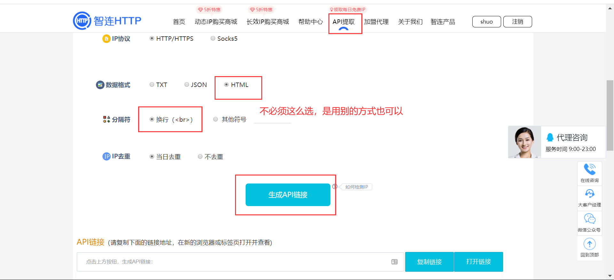
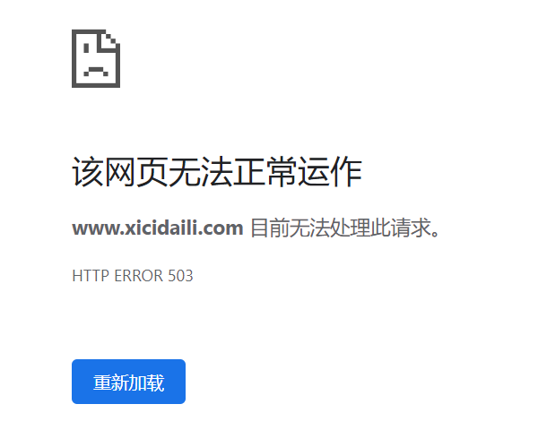

## requests 高级用法之获取 Cookie、使用代理和识别验证码

[TOC]

### 获取 Cookie

Cookie 是存储在客户端浏览器中的一组键值对。

web 中 Cookie 的典型应用为免密登录。

Cookie 和爬虫之间也有千丝万缕的关联：

- 有时候，对一张页面进行请求的时候，如果请求的过程中不携带 Cookie 的话，那么我们是无法请求到正确的页面数据。因此 Cookie 是爬虫中一个非常典型且常见的反爬机制。

接下来，我们看一个需要用到 Cookie 的爬虫案例。

需求：爬取雪球网中的咨询信息。

网址 url：https://xueqiu.com/

分析：

1. 判定爬取的咨询数据是否为动态加载的
   - 相关的更多咨询数据是动态加载的，滚轮滑动到底部的时候会动态加载出更多咨询数据。
2. 定位到 ajax 请求的数据包，提取出请求的 url，响应数据为 json 形式的咨询数据

尝试使用常规方法抓取数据：

```python
import requests
headers = {
    'User-Agent': 'Mozilla/5.0 (Windows NT 10.0; WOW64) AppleWebKit/537.36 (KHTML, like Gecko) Chrome/80.0.3987.132 Safari/537.36'
}
url = 'https://xueqiu.com/v4/statuses/public_timeline_by_category.json?since_id=-1&max_id=20369485&count=15&category=-1'
response = requests.get(url=url, headers=headers)
print(response.json())
```

数据拿到了吗？拿到了。但是为什么不开心？因为拿到的数据是这么一串玩意儿：

```python
{'error_description': '遇到错误，请刷新页面或者重新登录帐号后再试', 'error_uri': '/v4/statuses/public_timeline_by_category.json', 'error_data': None, 'error_code': '400016'}
```

数据没写错，但是却没拿到正确的响应。我们没有请求到我们想要的数据

原因：我们没有严格意义上模拟浏览器发请求，比如没有携带 Cookie。

处理：可以将浏览器发请求携带的请求头，全部粘贴在 headers 字典中，将 headers 作用到 requests 的请求操作中即可。

Cookie 有两种处理方式

方式1：手动处理

- 将抓包工具中的cookie粘贴在headers中
- 弊端：cookie如果过了有效时长则该方式失效。

方式2：自动处理

- 基于Session对象实现自动处理。

  1. 获取一个 session 对象：`requests.Session()` 返回一个 session 对象。

  2. 使用 session 对象可以像 requests 一样调用get和post发起指定的请求。只不过如果在使用 session 对象发请求的过程中产生了 cookie，cookie 会被自动存储到该 session 对象中。在下次再次使用 session 对象发起请求时，该次请求就是携带cookie进行的请求发送。

问：在爬虫中使用 session 的时候，session 对象至少会被使用几次？

答：两次。第一次使用 session 是为了将 cookie 捕获且存储到 session 对象中。下次的时候就是携带 cookie 进行的请求发送。

一般情况下，直接访问首页就可以获得浏览器返回的 Cookie。使用 Cookie 即可进行下一步的操作。

上面雪球网的例子，我们就可以修改成这样：

```python
import requests
headers = {
    'User-Agent': 'Mozilla/5.0 (Windows NT 10.0; WOW64) AppleWebKit/537.36 (KHTML, like Gecko) Chrome/80.0.3987.132 Safari/537.36'
}
session = requests.Session()    # 创建sesion对象
# 第一次使用session捕获且存储cookie，猜测对雪球网的首页发起的请求可能会产生cookie
session.get(url='https://xueqiu.com/', headers=headers)    # 捕获并存储cookie
url = 'https://xueqiu.com/v4/statuses/public_timeline_by_category.json?since_id=-1&max_id=20369485&count=15&category=-1'
response = session.get(url=url, headers=headers)    # 携带cookie发起的请求
print(response.json())
```

顺利拿到想要的数据。

### 代理操作

在爬虫中，所谓的代理指的就是代理服务器。代理服务器的作用是用来转发请求和响应。

在爬虫中为什么会需要使用代理服务器？

- 如果我们的爬虫在短时间内对服务器发起了高频的请求，那么服务器一旦检测到这样的一个异常的行为请求，就有可能将该请求对应设备的 ip 禁掉，这样这台 client 设备就无法对服务器端再次进行请求发送（ip被禁掉了）。
- 如果 ip 被禁，我们可以使用代理服务器进行请求转发，破解 ip 被禁的反爬机制。因为使用代理后，服务器端接受到的请求对应的 ip 地址就是代理服务器而不是我们真正的客户端的。

代理服务器分为不同的匿名度：

- 透明代理：如果使用了该形式的代理，服务器端知道你使用了代理机制也知道你的真实 ip。
- 匿名代理：知道你使用代理，但是不知道你的真实 ip
- 高匿代理：不知道你使用了代理也不知道你的真实 ip

代理的类型

- https：代理只能转发 https 协议的请求
- http：转发 http 的请求

常用的代理服务器

- 快代理
- 西刺代理
- goubanjia
- 代理精灵（推荐）：http://http.zhiliandaili.cn/)

接下来，我们先通过高频次的爬取西刺代理的网页，让其封禁我们的 IP（尽管如此，也不要写死循环，温柔一点。我们的目的是让他把我们禁掉，而不是把人家搞崩）。然后通过 IP 代理的方式，继续爬取。

我们使用的代理时代理精灵，网站上面有给。买一个最低配的 3 元套餐，用作练习测试。

点击 API 提取，选择我们刚刚支付的套餐，然后选择要生产的数量，还有协议格式之类的。最后点击 `生成 API 链接` 即可。



首先使用生成好的链接封装一个代理池：

```python
# 刚刚生成的API链接
proxy_url = 'http://ip.11jsq.com/index.php/api/entry?method=proxyServer.generate_api_url&packid=1&fa=0&fetch_key=&groupid=0&qty=10&time=1&pro=&city=&port=1&format=html&ss=5&css=&dt=1&specialTxt=3&specialJson=&usertype=15'
page_text = requests.get(url=proxy_url, headers=headers).text
tree = etree.HTML(page_text)
http_proxy = [{'https': ip} for ip in tree.xpath('//body//text()')]    # 代理池
```

接下来，对西祠代理发起一个高频的请求，让其将我本机 ip 禁掉。将下面的代码多执行几次，直到报错。

```python
url = 'https://www.xicidaili.com/nn/%s'
ip_list = []
for page in range(1, 11):
    new_url = url % page
    page_text = requests.get(url=new_url, headers=headers).text
    tree = etree.HTML(page_text)
    # 在xpath表达式中不可以出现tbody标签
    tr_list = tree.xpath('//table[@id="ip_list"]//tr')[1:]
    for tr in tr_list:
        ip = tr.xpath('./td[2]/text()')
        ip_list.append(ip)
len(ip_list)
```

然后浏览器访问 `https://www.xicidaili.com`，访问不到，说明 IP 已经被禁掉。



 然后，使用代理，尝试继续访问：

```python
# 生成代理池，注意代理的API地址要及时更新
proxy_url = 'http://t.11jsq.com/index.php/api/entry?method=proxyServer.generate_api_url&packid=1&fa=0&fetch_key=&groupid=0&qty=53&time=1&pro=&city=&port=1&format=html&ss=5&css=&dt=1&specialTxt=3&specialJson=&usertype=15'
page_text = requests.get(url=proxy_url, headers=headers).text
tree = etree.HTML(page_text)    # 代理池
http_proxy = [{'https': ip} for ip in tree.xpath('//body//text()')]

# 代码不需要大改动，只需要在requests请求中加上代理即可
url = 'https://www.xicidaili.com/nn/%s'
ip_list = []
for page in range(1, 11):
    new_url = url % page
    # 让当次的请求使用代理机制，就可以更换请求的ip地址
    page_text = requests.get(url=new_url, headers=headers, proxies=random.choice(http_proxy)).text
    tree = etree.HTML(page_text)
    # 在xpath表达式中不可以出现tbody标签
    tr_list = tree.xpath('//table[@id="ip_list"]//tr')[1:]
    for tr in tr_list:
        ip = tr.xpath('./td[2]/text()')
        ip_list.append(ip)
    print(len(ip_list))
```

就又可以爬取到数据了

### 验证码的识别

我们往往通过基于线上的打码平台识别验证码，而不是自己用机器学习写一个。虽然能够实现功能，但是自己写的毕竟没有大的数据量支撑，且不是一朝一夕能搞定的。

常用的打码平台有：

- 1.超级鹰（使用）：

  http://www.chaojiying.com/about.html

  - 注册（用户中心的身份）
  - 登录（用户中心的身份）
    1. 查询余额，请充值
    2. 创建一个软件ID（例如：899370）
    3. 下载示例代码

- 2.云打码

- 3.打码兔

超级鹰打码平台 SDK 整理封装成一个函数，传入验证码地址和图片的验证码类型数字，即可得到验证码识别结果。

```python
#!/usr/bin/env python
# coding:utf-8

import requests
from hashlib import md5

class Chaojiying_Client(object):

    def __init__(self, username, password, soft_id):
        self.username = username
        password =  password.encode('utf8')
        self.password = md5(password).hexdigest()
        self.soft_id = soft_id
        self.base_params = {
            'user': self.username,
            'pass2': self.password,
            'softid': self.soft_id,
        }
        self.headers = {
            'Connection': 'Keep-Alive',
            'User-Agent': 'Mozilla/4.0 (compatible; MSIE 8.0; Windows NT 5.1; Trident/4.0)',
        }

    def PostPic(self, im, codetype):
        """
        im: 图片字节
        codetype: 题目类型 参考 http://www.chaojiying.com/price.html
        """
        params = {
            'codetype': codetype,
        }
        params.update(self.base_params)
        files = {'userfile': ('ccc.jpg', im)}
        r = requests.post('http://upload.chaojiying.net/Upload/Processing.php', data=params, files=files, headers=self.headers)
        return r.json()

    def ReportError(self, im_id):
        """
        im_id:报错题目的图片ID
        """
        params = {
            'id': im_id,
        }
        params.update(self.base_params)
        r = requests.post('http://upload.chaojiying.net/Upload/ReportError.php', data=params, headers=self.headers)
        return r.json()

    
def get_img_code(img_path, img_type):
    chaojiying = Chaojiying_Client('liushuo', 'liushuo', '904154')    # 用户中心>>软件ID 找到或生成软件ID
    im = open(img_path, 'rb').read()
    return chaojiying.PostPic(im, img_type)['pic_str']    # 验证码类型  官方网站>>价格体系


print(get_img_code('a.jpg', 1902))
```

### 模拟登录

有些网站的信息，是需要我们登录之后，才能拿到的。要想爬取这些网站的内容，我们首先要进行模拟登录。

模拟登录的流程：

1. 对点击登录按钮对应的请求进行发送（post 请求）
2. 处理请求参数：
   - 用户名
   - 密码
   - 验证码
   - 其他的防伪参数

需求：登录古诗文网，获取登陆成功后的页面

登陆页面 url：https://so.gushiwen.org/user/login.aspx?from=http://so.gushiwen.org/user/collect.aspx

首先，我们猜测，需要输入用户名密码和验证码信息即可登录：

```python
# 识别验证码
url = 'https://so.gushiwen.org/user/login.aspx?from=http://so.gushiwen.org/user/collect.aspx'
# 解析验证码图片的地址
page_text = requests.get(url=url, headers=headers).text
tree = etree.HTML(page_text)
img_code_url = 'https://so.gushiwen.org' + tree.xpath('//img[@id="imgCode"]/@src')[0]
img_data = requests.get(url=img_code_url, headers=headers).content
# 将验证码图片保存到本地
with open('b.jpg', 'wb') as fp:
    fp.write(img_data)
# 识别验证码
code = get_img_code('b.jpg', 1902)
print(code)
login_url = 'https://so.gushiwen.org/user/login.aspx?from=http://so.gushiwen.org/user/collect.aspx'
data = {
    '__VIEWSTATE': 'zLcWU1Ihz+ZP28Jlu5xMxY8NMnEHb6jYi3hkBbQemydBVHdU8VMEyRw7jL0QOdTEnWM6aGEQMYQiKLb0fccd11U/MqxMMEpMBNI6pF8mr9Xzi0ARS/O3rvKz+vM=',
    '__VIEWSTATEGENERATOR': 'C93BE1AE',
    'from': 'http://so.gushiwen.org/user/collect.aspx',
    'email': 'liushuo432@outlook.com',
    'pwd': 'liushuo',
    'code': code,    # 动态变化
    'denglu': '登录',
}
# 对点击登录按钮发起请求：获取了登录成功后对应的页面源码数据
page_text = requests.post(url=login_url, headers=headers, data=data).text
with open('gushiwen.html', 'w', encoding='utf-8') as fp:
    fp.write(page_text)
```

打开生成的 `gushiwen.html` 文件，并没有成功登录。

对比我们的请求和浏览器发送的请求，可以获得这样两个信息：

1. 浏览器的请求有携带 Cookie，或许是因为我们没有携带 Cookie 信息，从而导致登录失败
2. 从打印出来的验证码数据来看，验证码识别是正确的，所以不可能是验证码的问题

所以接下来我们尝试携带 Cookie 进行模拟登录：

```python
# 携带 Cookie 模拟登录
session = requests.Session()
url = 'https://so.gushiwen.org/user/login.aspx?from=http://so.gushiwen.org/user/collect.aspx'
page_text = session.get(url=url, headers=headers).text
tree = etree.HTML(page_text)
img_code_url = 'https://so.gushiwen.org' + tree.xpath('//img[@id="imgCode"]/@src')[0]
img_data = session.get(url=img_code_url, headers=headers).content
with open('b.jpg', 'wb') as fp:
    fp.write(img_data)
code = get_img_code('b.jpg', 1902)
print(code)
login_url = 'https://so.gushiwen.org/user/login.aspx?from=http://so.gushiwen.org/user/collect.aspx'
data = {
    '__VIEWSTATE': 'zLcWU1Ihz+ZP28Jlu5xMxY8NMnEHb6jYi3hkBbQemydBVHdU8VMEyRw7jL0QOdTEnWM6aGEQMYQiKLb0fccd11U/MqxMMEpMBNI6pF8mr9Xzi0ARS/O3rvKz+vM=',
    '__VIEWSTATEGENERATOR': 'C93BE1AE',
    'from': 'http://so.gushiwen.org/user/collect.aspx',
    'email': 'liushuo432@outlook.com',
    'pwd': 'liushuo',
    'code': code,
    'denglu': '登录',
}
page_text = session.post(url=login_url, headers=headers, data=data).text
with open('gushiwen.html', 'w', encoding='utf-8') as fp:
    fp.write(page_text)
```

这样就成功访问到我们需要的页面了。

其实我们还有一个东西没有用到，就是 data 中的两个无规律的字符串。在请求参数中如果看到了一组乱序的请求参数，最好去验证这组请求参数是否为动态变化。如果这组参数不变化，直接在请求中写死就行了。但如果请求参数是动态变化的，我们就可能需要对这些数据进行处理：

1. 常规来讲一半动态变化的请求参数会被隐藏在前台页面中，那么我们就要去前台页面源码中取找。
2. 如果前台页面没有的话，我们就可以基于抓包工具进行全局搜索。

