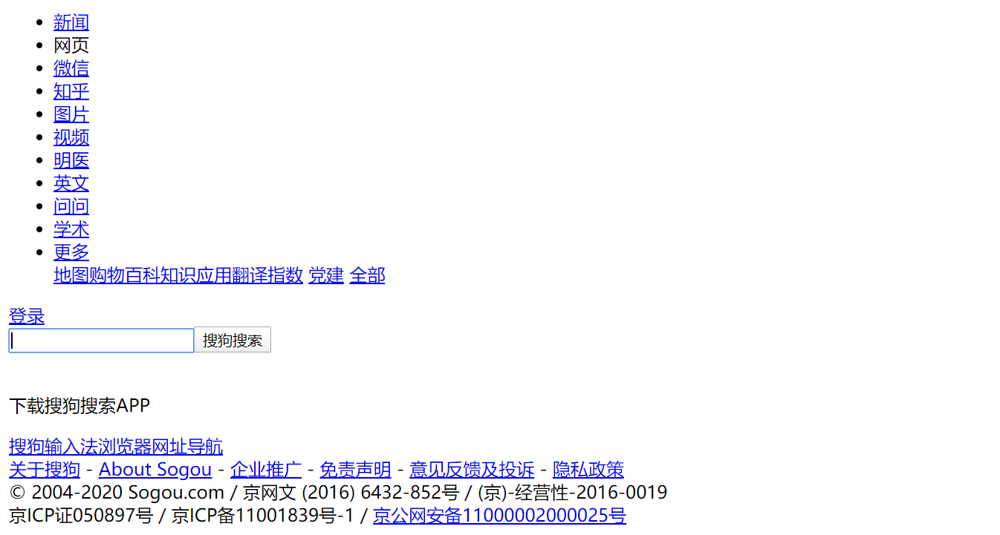
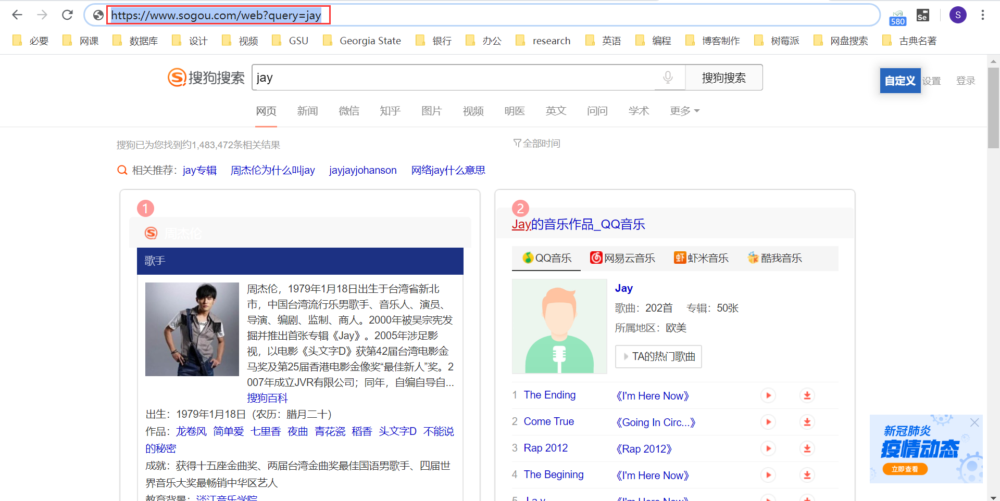
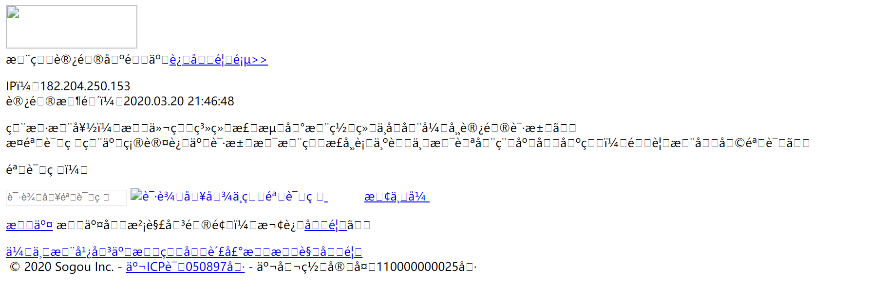
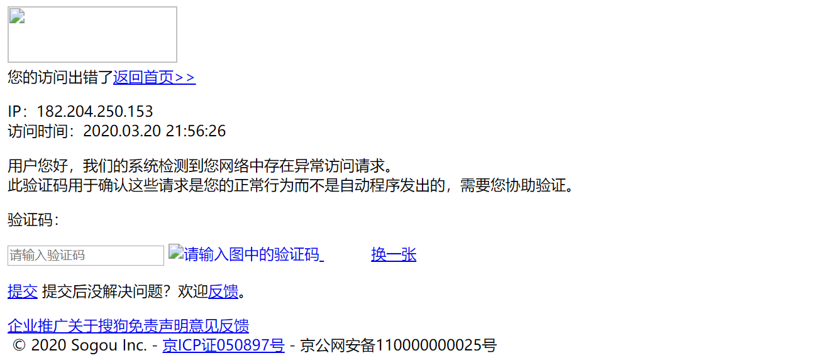
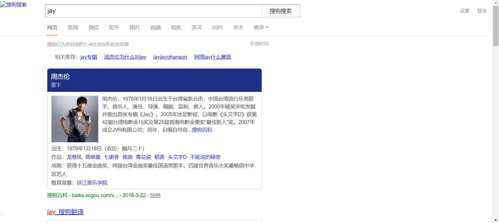
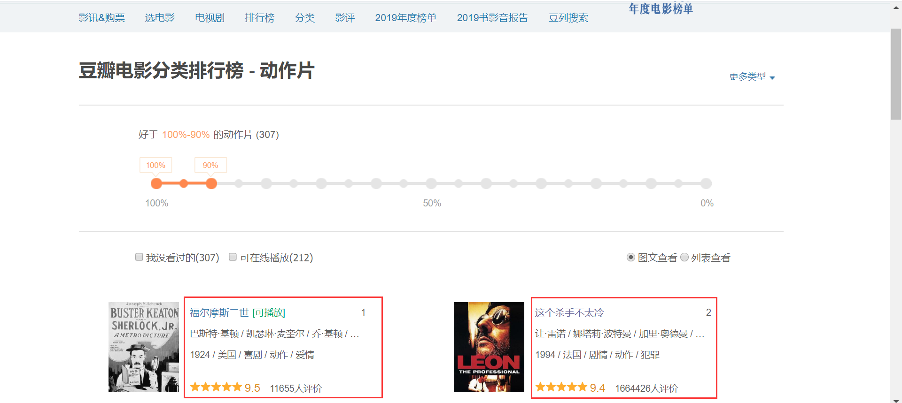
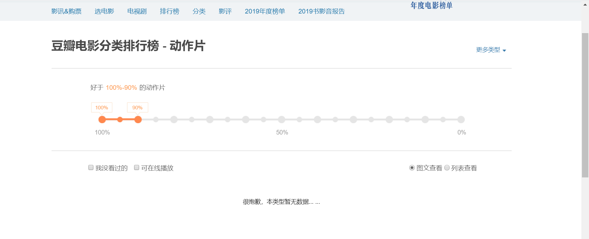
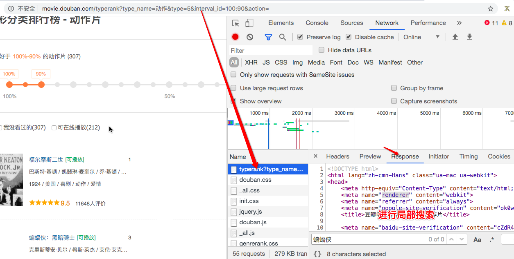
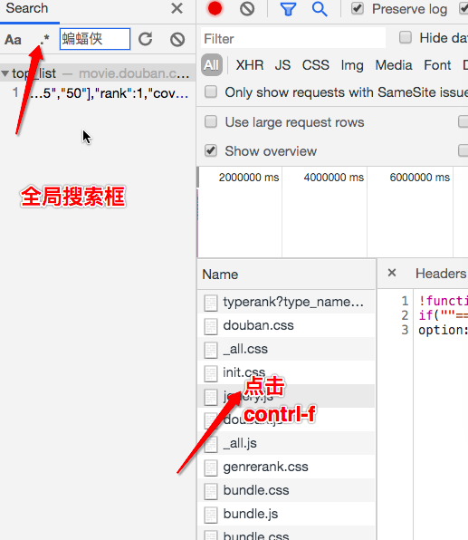

## requests 模块应对 UA 检测和爬取动态网页

[TOC]

### 【置顶】requests 常用方法

```python
url = '要爬取的网址'
headers = {
    'User-Agent': 'Mozilla/5.0 (Windows NT 10.0; WOW64) AppleWebKit/537.36 (KHTML, like Gecko) Chrome/80.0.3987.132 Safari/537.36'
}
response = requests(url=url, headers=headers)
response.encoding = 'utf-8'
page_text = response.text    # 获取返回的解码后的字符串数据
json_data = response.json()    # 获取返回的 json 解析后的数据
img_data = response.content    # 获取二进制的返回内容
```

### requests 模块初步使用

requests 是爬虫中一个基于网络请求的模块，安装方式：

```bash
pip install requests
```

不过如果你是用的是 Anaconda 环境，就不需要安装了，Anaconda 默认继承了 requests 模块。

requests 模块作用是模拟浏览器发起请求。

使用 requests 模块获取响应数据的代码编写流程：

1. 指定 url

2. 发起请求

3. 获取响应数据（爬取到的页面源码数据）

4. 持久化存储

实例：爬取搜狗首页的页面源码数据

```python
import requests
# 1 指定url
url = 'https://www.sogou.com/'
# 2 发起请求get方法的返回值为响应对象
response = requests.get(url=url)
# 3 获取响应数据
#.text：返回的是字符串形式的响应数据
page_text = response.text
# 4 持久化存储
with open('./sougou.html', 'w', encoding='utf-8') as fp:
    fp.write(page_text)
```

运行代码后，会在当前目录下新生成一个 `sougo.html` 文件。用浏览器打开后如下图所示，只有普通文本，样式都不见了。不过这没关系，因为爬虫往往只在意数据，不计较样式。



### 参数动态化、UA 检测和 UA 伪装

光拿到搜狗的首页是没有用的——这里什么都没有。如果我们想要拿到指定文本的搜索数据，该怎么办呢？

首先，要了解搜狗等搜索引擎的机制。一般情况下，搜索引擎的搜索请求都是 GET 请求。搜索的关键字放在路径中的查询字符串种传进去。搜狗也是如此。

比如，要搜索 jay，只需在浏览器中输入 `https://www.sogou.com/web?query=jay` 即可：



要搜索的内容是什么，就把路径中的 jay 改成什么就好了。

现在，让我们来实现一个简易网页采集器，基于搜狗针对指定不同的关键字将其对应的页面数据进行爬取。

这个需求，就是实现**参数动态化**。

如果请求的url携带参数，且我们想要将携带的参数进行动态化操作那么我们必须：

1. 将携带的动态参数以键值对的形式封装到一个字典中

2. 将该字典作用到 get 方法的 params 参数中即可

3. 需要将原始携带参数的 url 中将携带的参数删除

写成代码就是：

```python
keyword = input('enter a keyword:')

# 携带了请求参数的url，如果想要爬取不同关键字对应的页面，我们需要将url携带的参数进行动态化
# 实现参数动态化：
params = {
    'query': keyword
}
url = 'https://www.sogou.com/web'
#params参数（字典）：保存请求时url携带的参数
response = requests.get(url=url, params=params)

page_text = response.text
fileName = keyWord + '.html'
with open(fileName, 'w', encoding='utf-8') as fp:
    fp.write(page_text)
print(fileName, '爬取完毕！！！')
```

比如输入 jay，打开新生成的文件，它长这个样子：



我们发现上面建议的采集器代码会产生两个问题：

1. 页面乱码了
2. 页面中的数据明显太少了，我们丢失了数据

首先，让我们解决乱码问题。这很容易，只需要加一行代码，使用一个 encoding 命令即可实现：

```python
keyword = input('enter a keyword: ')

# 携带了请求参数的url，如果想要爬取不同关键字对应的页面，我们需要将url携带的参数进行动态化
# 实现参数动态化：
params = {
    'query': keyword
}
url = 'https://www.sogou.com/web'
# params参数（字典）：保存请求时url携带的参数
response = requests.get(url=url, params=params)
# 修改响应数据的编码格式
# encoding返回的是响应数据的原始的编码格式，如果给其赋值则表示修改了响应数据的编码格式
response.encoding = 'utf-8'
page_text = response.text
fileName = keyWord + '.html'
with open(fileName, 'w', encoding='utf-8') as fp:
    fp.write(page_text)
print(fileName, '爬取完毕！！！')
```

从结果来看，乱码问题是解决了。而且我们从中也了解到，数据量变少的原因：我们被搜狗的反爬策略限制了。




处理乱码后，页面显示 `异常访问请求` 导致请求数据的缺失。这是因为网站后台已经检测出该次请求不是通过浏览器发起的请求而是通过爬虫程序发起的请求（不是通过浏览器发起的请求都是异常请求）。

网站的后台主要是通过查看请求的请求头中的 user-agent 判定请求是不是通过浏览器发起的。

什么是 User-Agent

- 请求载体的身份标识，告诉服务器，使用的是什么工具（浏览器种类，操作系统类型，手机还是电脑，等）
- 请求载体有且只有两种：
  - 浏览器
    - 浏览器的身份标识是统一固定，身份标识可以从抓包工具中获取。
  - 爬虫程序
    - 身份标识各自不同

这里就涉及到我们的第二种反爬机制，UA 检测：网站后台会检测请求对应的 User-Agent，以判定当前请求是否为异常请求。

UA 检测对应的反反爬策略是 UA 伪装：我们使用一个浏览器的 User-Agent，而不是爬虫的，去访问网页。

伪装流程：
- 使用抓包工具捕获到某一个基于浏览器请求的 User-Agent 的值，将其伪装作用到一个字典中，将该字典作用到请求方法（get，post）的 headers 参数中即可。
- 因为 UA 检测机制很多网站都会有，所以一般我们写爬虫代码的时候，都会加上 User-Agent 请求头，有备无患

使用代码表示就是：

```python
keyword = input('enter a keyword:')
headers = {
    'User-Agent':'Mozilla/5.0 (Windows NT 10.0; WOW64) AppleWebKit/537.36 (KHTML, like Gecko) Chrome/80.0.3987.132 Safari/537.36'
}
# 携带了请求参数的url，如果想要爬取不同关键字对应的页面，我们需要将url携带的参数进行动态化
# 实现参数动态化：
params = {
    'query':keyword
}
url = 'https://www.sogou.com/web'
# params参数（字典）：保存请求时url携带的参数
# 实现了UA伪装
response = requests.get(url=url, params=params, headers=headers)
# 修改响应数据的编码格式
# encoding返回的是响应数据的原始的编码格式，如果给其赋值则表示修改了响应数据的编码格式
response.encoding = 'utf-8'
page_text = response.text
fileName = keyWord + '.html'
with open(fileName, 'w', encoding='utf-8') as fp:
    fp.write(page_text)
print(fileName, '爬取完毕！！！')
```

这样，我们就成功拿到搜索页面：



### 爬取动态页面

现在我们要爬取豆瓣电影中的电影详情数据

url 地址：https://movie.douban.com/typerank?type_name=%E5%8A%A8%E4%BD%9C&type=5&interval_id=100:90&action=

我们想要页面中的电影信息：



如果我们还像之前那样，直接爬取这个网址，把代码写成这样：

```python
url = 'https://movie.douban.com/typerank?type_name=%E5%8A%A8%E4%BD%9C&type=5&interval_id=100:90&action='
headers = {
    'User-Agent': 'Mozilla/5.0 (Windows NT 10.0; WOW64) AppleWebKit/537.36 (KHTML, like Gecko) Chrome/80.0.3987.132 Safari/537.36'
}
response = requests.get(url=url, headers=headers)
page_text = response.text
with open('movie.html', 'w', encoding='utf-8') as fp:
    fp.write(page_text)
```

执行完上面的代码，我们再打开生成的 `movie.html` 文件，却发现，里面并没有我们想要的电影详情信息：



这是因为这个网页的数据是**动态加载**的。

什么是动态加载的数据？
- 我们通过 requests 模块进行数据爬取无法每次都实现可见即可得。
- 有些数据是通过非浏览器地址栏中的 url 请求到的数据，而是通过其他请求方式（比如 ajax）请求到的数据。对于这些通过其他请求请求到的数据就是动态加载的数据。

那么该如何检测网页中是否存在动态加载数据呢？

我们当然可以想上面那样，先直接爬取页面看看，如果不能爬取到我们想要的数据，则说明网页很可能是动态加载的。

但是这个办法住农家有点蠢，我们更常用的检测网页是否是动态加载的方式是使用浏览器的**抓包工具**进行检测。

首先，基于抓包工具进行局部搜索。在当前网页中打开抓包工具，捕获到地址栏的url对应的数据包，在该数据包的response选项卡搜索我们想要爬取的数据，如果搜索到了结果则表示数据不是动态加载的，否则表示数据为动态加载的。



如果已经确定数据为动态加载，我们该如何捕获到动态加载的数据？

这就要基于抓包工具进行全局搜索。

定位到动态加载数据对应的数据包，从该数据包中就可以提取出
- 请求的 url
- 请求方式
- 请求携带的参数
- 看到响应数据



我们找到这个网址的动态请求的链接和各种请求参数，并且知道了请求的方法是 get。有了这些参数，我们就可以实现我们的数据请求：

```python
url = 'https://movie.douban.com/j/chart/top_list?type=5&interval_id=100%3A90&action=&start=0&limit=20'
headers = {
    'User-Agent': 'Mozilla/5.0 (Windows NT 10.0; WOW64) AppleWebKit/537.36 (KHTML, like Gecko) Chrome/80.0.3987.132 Safari/537.36'
}
# 注意data的键值都写成字符串形式，没有值的话，就写成空字符串
data = {
    'type': '5',
    'interval_id': '100:90',
    'action': '',
    'start': '0',
    'limit': '20',
}
response = requests.get(url=url, headers=headers, data=data)
# .json()将获取的字符串形式的json数据序列化成字典或者列表对象
data_list = response.json()
#解析出电影的名称+评分
for movie in data_list:
    title = movie['title']
    score = movie['score']
    print(title, score)
```

可以通过修改 data 中的 start 和 limit 等数据，获取不同范围不同数目的结果。

基于抓包工具进行全局搜索不一定可以每次都能定位到动态加载数据对应的数据包，因为有可能动态加载的数据是经过加密的密文数据。这种情况我们后面会有所提及。

### 分页数据的爬取

需求：爬取肯德基的餐厅位置数据

url：http://www.kfc.com.cn/kfccda/storelist/index.aspx

分析：

1. 在录入关键字的文本框中录入关键字按下搜索按钮，发起的是一个 ajax 请求。当前页面刷新出来的位置信息一定是通过 ajax 请求请求到的数据

2. 基于抓包工具定位到该 ajax 请求的数据包，从该数据包中捕获到：
   - 请求的 url
   - 请求方式
   - 请求携带的参数
   - 看到响应数据

首先，我们先爬取第一的内容，注意这次的请求方法是 post，而不是 get 了：

```python
# 爬取第一页的数据
url = 'http://www.kfc.com.cn/kfccda/ashx/GetStoreList.ashx?op=keyword'
headers = {
    'User-Agent': 'Mozilla/5.0 (Windows NT 10.0; WOW64) AppleWebKit/537.36 (KHTML, like Gecko) Chrome/80.0.3987.132 Safari/537.36'
}
data = {
    'cname': '',
    'pid': '',
    'keyword': '北京',
    'pageIndex': '1',
    'pageSize': '10',
}
# data参数是post方法中处理参数动态化的参数
response = requests.post(url=url, headers=headers, data=data)
data_list = response.json()
for store in data_list['Table1']:
    store_name = store['storeName']
    store_addr = store['addressDetail']
    print(store_name, store_addr)
```

很显然，要爬取其他页码的数据，我们只需要讲 pageIndex 的参数修改成需要的页码即可：

```python
url = 'http://www.kfc.com.cn/kfccda/ashx/GetStoreList.ashx?op=keyword'
headers = {
    'User-Agent': 'Mozilla/5.0 (Windows NT 10.0; WOW64) AppleWebKit/537.36 (KHTML, like Gecko) Chrome/80.0.3987.132 Safari/537.36'
}
for page in range(1, 11):
    data = {
        'cname': '',
        'pid': '',
        'keyword': '北京',
        'pageIndex': f'{page}',
        'pageSize': '10',
    }
    response = requests.post(url=url, headers=headers, data=data)
    data_list = response.json()
    for store in data_list['Table1']:
        store_name = store['storeName']
        store_addr = store['addressDetail']
        print(store_name, store_addr)
```

### 练习题

任务：爬取药监总局中的企业详情数据

url：http://125.35.6.84:81/xk/

需求：

- 将首页中每一家企业的详情数据进行爬取。
  - 每一家企业详情页对应的数据
- 将前5页企业的数据爬取即可。

难点：

- 用不到数据解析
- 所有的数据都是动态加载出来

提示：先试着将一家企业的详情页的详情数据爬取出来，然后再去爬取多家企业的数据。

完成代码如下：

```python
import requests
headers = {
    'User-Agent': 'Mozilla/5.0 (Windows NT 10.0; WOW64) AppleWebKit/537.36 (KHTML, like Gecko) Chrome/80.0.3987.132 Safari/537.36'
}
# 爬取前五页，每一家企业的详情
for page in range(1, 6):
    url = 'http://125.35.6.84:81/xk/itownet/portalAction.do?method=getXkzsList'
    data = {
        'on': True,
        'page': f'{page}',
        'pageSize': '15',
        'productName': '',
        'conditionType': '1',
        'applyname': '',
    }
    response = requests.post(url=url, headers=headers, data=data)
    response_data = response.json()
    for enterprise in response_data.get('list'):
        url = 'http://125.35.6.84:81/xk/itownet/portalAction.do?method=getXkzsById'
        data = {
            'id': enterprise.get('ID')
        }
        enterprise_response = requests.post(url=url, headers=headers, data=data)
        enterprise_response_data = enterprise_response.json()
        print(enterprise_response_data)
```