## scrapy 框架的基本用法

[TOC]

### scrapy 简要介绍

我们从前接触到过 DJango，是一个 Web 框架。那么什么是框架呢？

所谓的框架，其实就是一个被集成了很多功能且具有很强通用性的一个项目模板。

对于框架的学习，往往会经历两个阶段：

- 初级阶段，学习框架中集成好的各种功能的特性及作用，也就是知道怎么用
- 进阶阶段，逐步的探索框架的底层，知道为什么要这么用，进而知道该如何实现更高级的功能

我们写爬虫代码，需要经常写一些请求发送、数据解析、存储数据的代码。重复写代码当然不是一个好事情。同时，如果我们想要对爬虫代码进行优化，又要付出很大精力写很多代码才行。有时候，受限于自身水平，麻麻烦烦写好的优化代码效率仍然不让人满意。于是，scrapy 应运而生。

scrapy 是一个专门用于异步爬虫的框架，可以实现高性能的数据解析、请求发送、持久化存储、全站数据爬取，中间件、分布式......

### scrapy 环境的安装

macOS 和 Linux 系统可以直接 pip 安装：

```bash
pip install scrapy
```

Windows 系统的安装要稍微繁琐些，需要先安装 Twisted，然后才能使用 pip 安装 scrapy。Twisted 是一个网络引擎框架。scrapy 需要依赖 Twisted 环境。对于 macOS 和 Linux 系统来说，会自动安装 Twisted，但是 Windows 系统并不能自动安装，所以需要我们手动下载配置。

1. 安装 wheel，wheel 可以安装离线的 Python 包：

   ```
   pip3 install wheel
   ```

2. 下载 twisted 文件，下载地址：http://www.lfd.uci.edu/~gohlke/pythonlibs/#twisted

   找到指定版本的 twisted 文件，点击即可下载，比如我的 Python 版本是 3.6.8，操作系统是 64 位的，就选择这个：

   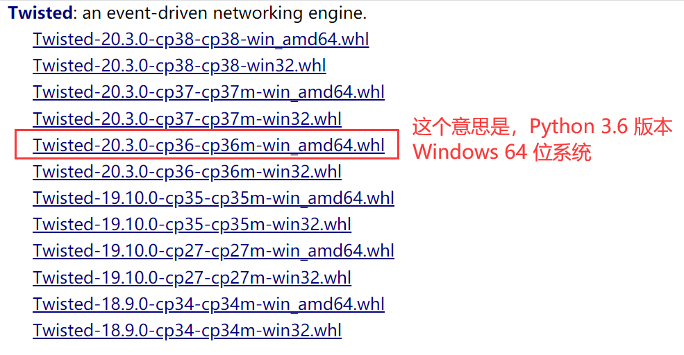

3. 进入下载目录，执行命令安装 Twisted（注意文件名要是刚刚下载的 Twisted 安装文件）：

   ```bash
   pip install Twisted‑20.3.0‑cp36‑cp36m‑win_amd64.whl
   ```

   Twisted 就是一个异步的架构，被作用在了 scrapy 中。

   如果安装报错，可以尝试更换另一个版本的 Twisted 文件进行安装。

4. 安装 pywin32：

   ```bash
   pip install pywin32
   ```

5. 安装 scrapy：

   ```bash
   pip install scrapy
   ```

测试：cmd 中输入 scrapy 按下回车，如果没有报错说明安装成功。

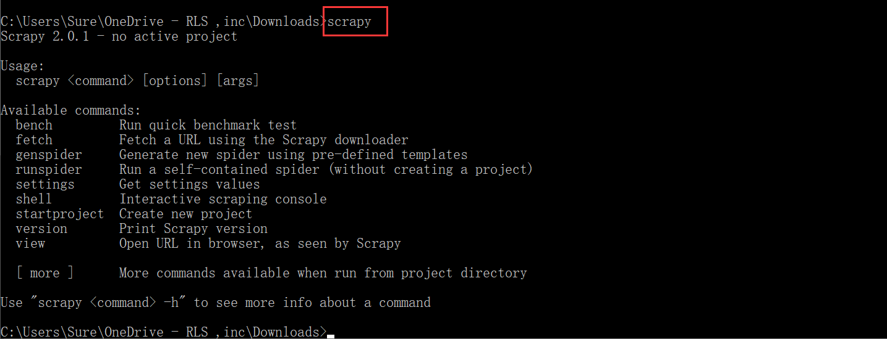

### scrapy 工程创建

在终端中输入命令，创建一个 scrapy 的工程项目：

```bash
scrapy startproject ProName
```

输入完上面的命令，会在当前目录下生成 scrapy 项目文件夹。文件夹的目录结构如下：

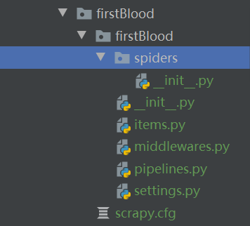

这些文件和文件夹，我们后面用到的时候会详细讨论，先简单介绍两个：

- spiders 文件夹，是爬虫文件夹，用来存放爬虫源文件。
- settings.py 文件，是工程项目的配置文件

### 创建爬虫源文件

进入到项目文件夹中，运行命令创建爬虫源文件：

```bash
cd ProName
scrapy genspider spiderName www.xxx.com
```

运行成功后，将会在 spiders 文件夹中生成一个爬虫源文件，长这样：

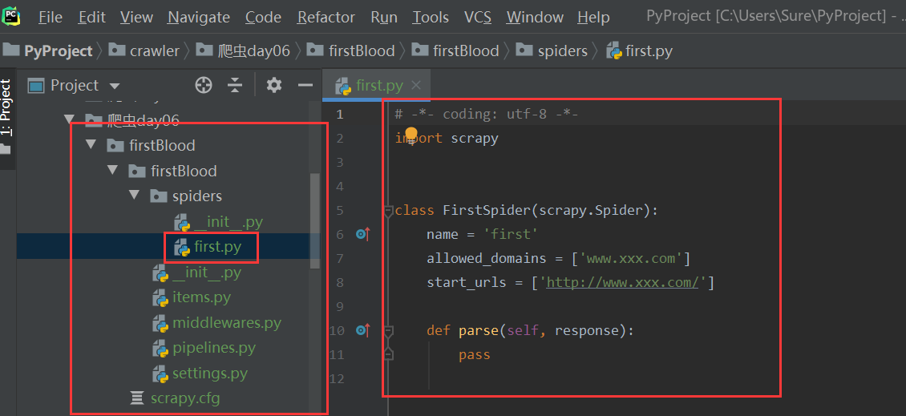

我们就可以在这个文件中编写爬虫代码了。比如写成这样：

```python
# -*- coding: utf-8 -*-
import scrapy

class FirstSpider(scrapy.Spider):
    # 爬虫文件名称：当前源文件的唯一标识
    name = 'first'
    # 允许的域名，一般不用，会注释掉
    # allowed_domains = ['www.xxx.com']

    # 起始的url列表：只可以存储url
    # 作用：列表中存储的url都会被进行get请求的发送
    start_urls = ['http://www.baidu.com/', 'http://www.sogou.com/']

    # 数据解析
    # parse方法调用的次数完全取决于请求的次数
    # 参数response：表示的就是服务器返回的响应对象
    def parse(self, response):
        print(response)
```

爬虫文件 spiderName 内容阐述：

- name：爬虫文件名称，该文件的唯一标识
- start_urls：起始 url 列表，存储的都是 url，url 可以被自动进行 get 请求的发送
- parse 方法：请求后的数据解析操作

### 执行工程和 settings.py 文件的配置

使用命令执行 scrapy 工程：

```bash
scrapy crawl spiderName
```

工程启动了吗？启动了，因为屏幕有输出显示内容来。但是看不懂，而且太乱：

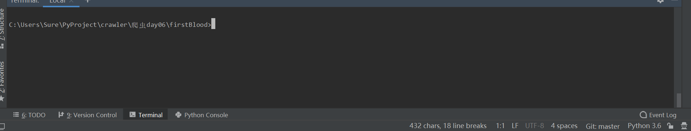

这是因为，执行工程后，默认会输出工程所有的日志信息。我们看到的满屏看不懂的东西，就是项目执行的日志记录。

但是我们往往并不希望看到这些日志。这些 info 级别的日志，不看也罢。

我们可以在 `settings.py` 文件中加入下面的配置来指定类型日志的输出：

```python
LOG_LEVEL = 'ERROR'
```

再次执行工程，日志确实没有了，但是我们要打印的东西也没打印出来。事实上，什么都没有显示出来：

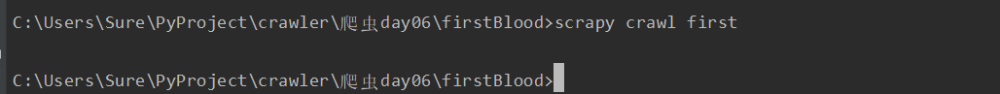

没有打印结果，说明我们的 parse 方法没有被执行。为什么没有被执行呢？

原来，scrapy 框架默认会遵守网站的 robots 协议。很显然，我们的网址都是在 robots 协议中禁止爬取的。

我们当然可以放弃爬取，但你一定不愿意这么做——如果严格遵守 robots 协议，网络中几乎什么数据都爬取不到了。我们可以通过配置，来无视掉网站的 robots 协议。

在 settings.py 中，修改 ROBOTSTXT_OBEY 的配置位 False：

```python
ROBOTSTXT_OBEY = False
```

再次执行工程，成功打印出 parse 方法的参数，response 的值，为两个对象：

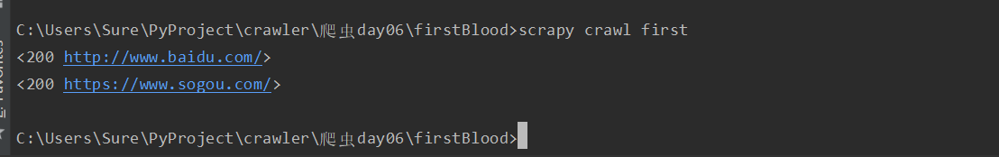

除了配置 robots 协议和日志外，我们还可以指定 user-agent 进行 UA 伪装。在设置中找到 User-Agent，取消注释，然后把 user-agent 配置过去即可：

```python
USER_AGENT = 'Mozilla/5.0 (Windows NT 10.0; WOW64) AppleWebKit/537.36 (KHTML, like Gecko) Chrome/80.0.3987.132 Safari/537.36'
```

小结一下，目前我们可以通过 `settings.py` 进行三个配置：

- 无视 robots
- 指定日志类型：`LOG_LEVEL = 'ERROR'`
- UA 伪装

### scrapy 数据解析

scrapy 给我们提供了通过 xpath 解析数据的方法，我们只需要在 scrapy 爬虫源文件重点 parse 方法的 response 参数使用 xpath 解析即可：

```python
response.xpath('xpath表达式')
```

比如，爬取段子王网站的经典段子页面（`https://duanziwang.com/category/经典段子/`）的段子内容，可以这样爬取解析：

```python
class DuanziSpider(scrapy.Spider):
    name = 'duanzi'
    # allowed_domains = ['https://duanziwang.com/category/经典段子/']
    start_urls = ['https://duanziwang.com/category/经典段子/']

    # 数据解析
    def parse(self, response):
        # 数据解析标题和内容
        article_list = response.xpath('//main/article')
        for article in article_list:
            title = article.xpath('./div[1]/h1/a/text()')[0]
            content = article.xpath('./div[2]/p/text()')[0]
            print(title, content)
            break
```

按照 lxml 模块的 etree 的 xpath 解析的话，title 和 content 应该是字符串。但是从打印出来的结果来看，我们获取到的却是 Selector 对象，字符串数据存放在对象的 data 属性中：

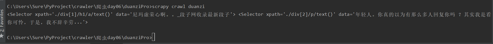

若要拿到对象的 data 属性，我们只需调用对象的 extract 方法即可：

```python
title = article.xpath('./div[1]/h1/a/text()')[0].extract()
content = article.xpath('./div[2]/p/text()')[0].extract()
```

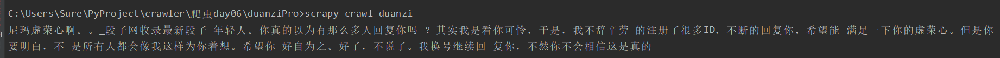

但是上面那种，拿到 Selector 对象再使用 extract 方法提取数据的方式并不常用。我们更常用的是直接对列表元素进行取值操作。

比如，使用 extract_first 方法可以提取列表中第一个 Selector 对象中的 data 数据：

```python
title = article.xpath('./div[1]/h1/a/text()').extract_first()
content = article.xpath('./div[2]/p/text()').extract_first()
```

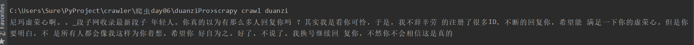

我们也可以对列表直接使用 extract 方法，提取到里面每一个 Selector 的 data 值。返回的数据也是列表：

```python
title = article.xpath('./div[1]/h1/a/text()').extract()
content = article.xpath('./div[2]/p/text()').extract()
```

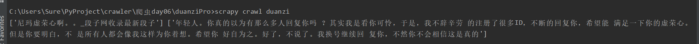

总结一下 scrapy 封装的 xpath 和 etree 中的 xpath 区别：

- scrapy 中的 xpath 直接将定位到的标签中存储的值或者属性值取出，返回的是 Selector 对象，且相关
  的数据值是存储在 Selector 对象的 data 属性中，需要调用 extract、extract_first() 取出字符串数据

### 数据持久化存储

我们爬取到的数据，最开始是储存到内存中。我们前面的例子，是将数据打印出来。但是这显然是不够的——如果我们关闭了窗口，数据将不复存在。数据分析也无从谈起。

我们需要通过持久化存储，将数据保存到硬盘中。或是以文件形式，或是存储到数据库中。这样我们将来就可以对数据进行查看和分析了。

#### 基于终端指令的持久化存储

首先，要将我们需要存储的数据在 parse 中整理并返回：

```python
class DuanziSpider(scrapy.Spider):
    name = 'duanzi'
    # allowed_domains = ['https://duanziwang.com/category/经典段子/']
    start_urls = ['https://duanziwang.com/category/经典段子/']

    # 将解析到的数据进行持久化存储:基于终端指令的持久化存储
    def parse(self, response):
        # 数据解析标题和内容
        article_list = response.xpath('//main/article')
        data = []
        for article in article_list:
            title = article.xpath('./div[1]/h1/a/text()').extract_first()
            content = article.xpath('./div[2]/p/text()').extract_first()
            data.append({
                'title': title,
                'content': content,
            })
        return data
```

然后，在执行工程的指令后面加上 -o 参数指定输出的文件位置：

```python
scrapy crawl spiderName -o filePath
```

需要注意的是，该种方式只可以将 parse 方法的返回值存储到本地指定后缀（json、jsonlines、jl、csv、xml、marshal、pickle）的文本文件中。

#### 基于管道的持久化存储（重点）

基于命令存储文件有两个主要的弊端：首先，文件必须是指定后缀名才可以；第二，只能保存到文件中，无法向数据库中存储。

好在 scrapy 给我们提供了管道，可以对数据进行任意的存储操作。文件可以是任意类型任意后缀，也可以把数据写入到数据库中。

首先，我们要在爬虫文件中进行数据解析，确定我们要保存的数据：

```python
class DuanziSpider(scrapy.Spider):
    name = 'duanzi'
    # allowed_domains = ['https://duanziwang.com/category/经典段子/']
    start_urls = ['https://duanziwang.com/category/经典段子/']

    # 基于管道的持久化存储
    def parse(self, response):
        # 数据解析标题和内容
        article_list = response.xpath('//main/article')
        for article in article_list:
            # title和content是我们解析出来要保存的数据
            title = article.xpath('./div[1]/h1/a/text()').extract_first()
            content = article.xpath('./div[2]/p/text()').extract_first()
```

然后，在 `items.py` 中定义相关属性。注意，我们需要保存哪些数据，就在这里定义对应的属性：

```python
import scrapy

class DuanziproItem(scrapy.Item):
    # Filed()定义好的属性当做是一个万能类型的属性
    title = scrapy.Field()
    content = scrapy.Field()
```

然后回到爬虫文件，导入我们刚刚写好的 Item 类。先实例化一个 Item 对象，然后把解析到的数据存储封装到 Item 类型的对象中。最后， 使用 yield 把 Item 类型的对象数据提交给管道：

```python
# -*- coding: utf-8 -*-
import scrapy
from duanziPro.items import DuanziproItem

class DuanziSpider(scrapy.Spider):
    name = 'duanzi'
    # allowed_domains = ['https://duanziwang.com/category/经典段子/']
    start_urls = ['https://duanziwang.com/category/经典段子/']

    # 基于管道的持久化存储
    def parse(self, response):
        # 数据解析标题和内容
        article_list = response.xpath('//main/article')
        for article in article_list:
            # title和content是我们解析出来要保存的数据
            title = article.xpath('./div[1]/h1/a/text()').extract_first()
            content = article.xpath('./div[2]/p/text()').extract_first()

            # 实例化一个item类型的对象，将解析到的数据存储到该对象中
            item = DuanziproItem()
            # 不可以通过.的形式调用属性
            item['title'] = title
            item['content'] = content

            # 将item对象提交给管道
            yield item
```

接下来，在管道文件 `pipelines.py` 中接收爬虫文件提交过来的 Item 类型对象，且对其进行任意形式的持久化存储操作。比如，将数据写入到本地文件中：

```python
class DuanziproPipeline(object):
    fp = None

    # 重写父类的两个方法，每次爬虫过程，只打开关闭文件一次，提高效率
    def open_spider(self, spider):
        print('我是open_spider()，我只会在爬虫开始的时候执行一次！')
        self.fp = open('duanzi.txt', 'w', encoding='utf-8')

    def close_spider(self, spider):
        print('我是close_spider()，我只会在爬虫结束的时候执行一次！')
        self.fp.close()

    # 该方法是用来接收item对象。一次只能接收一个item，说明该方法会被调用多次
    # 参数item：就是接收到的item对象
    def process_item(self, item, spider):
        # print(item)    # item其实就是一个字典
        self.fp.write(item['title'] + '：' + item['content'] + '\n')
        # 将item存储到本文文件
        return item
```

然后，需要在配置文件中开启管道机制，将下面的代码取消注释：

```python
ITEM_PIPELINES = {
   'duanziPro.pipelines.DuanziproPipeline': 300,
}
```

这里的 300 指代的是管道的优先级。数值越小优先级越高，优先级高的管道类先被执行。

#### 基于管道实现数据的备份

数据备份，就是将数据分别存储到不同的载体中。

需求：将数据一份存储到 MySQL，一份存储到 Redis

问题：管道文件中的一个管道类表示怎样的一组操作呢？

一个管道类对应一种形式的持久化存储操作。如果将数据存储到不同的载体中就需要使用多个管道类。

已经定义好了三个管道类，将数据写入到三个载体中进行存储：

```python
import pymysql
from redis import Redis

class DuanziproPipeline(object):
    fp = None

    # 重写父类的两个方法
    def open_spider(self, spider):
        print('我是open_spider()，我只会在爬虫开始的时候执行一次！')
        self.fp = open('duanzi.txt', 'w', encoding='utf-8')

    def close_spider(self, spider):
        print('我是close_spider()，我只会在爬虫结束的时候执行一次！')
        self.fp.close()

    # 该方法是用来接收item对象。一次只能接收一个item，说明该方法会被调用多次
    # 参数item：就是接收到的item对象
    def process_item(self, item, spider):
        # print(item)    # item其实就是一个字典
        self.fp.write(item['title'] + '：' + item['content'] + '\n')
        # 将item存储到本文文件
        return item

# 将数据存储到mysql中
class MysqlPipeline:
    conn = None
    cursor = None

    def open_spider(self, spider):
        self.conn = pymysql.Connect(host='127.0.0.1', port=3306, user='root', password='123', database='duanzi')
        print(self.conn)

    def process_item(self, item, spider):
        self.cursor = self.conn.cursor()
        sql = 'insert into duanziwang values ("%s", "%s")' % (item['title'], item['content'])
        # 事务处理
        try:
            self.cursor.execute(sql)
            self.conn.commit()
        except Exception as e:
            print(e)
            self.conn.rollback()
        return item

    def close_spider(self, spider):
        self.cursor.close()
        self.conn.close()

# 将数据写入redis
class RedisPipeline:
    conn = None
    def open_spider(self, spider):
        self.conn = Redis(host='127.0.0.1', port=6379)
        print(self.conn)

    def process_item(self, item, spider):
        # 这一步如果报错，将redis模块的版本指定成2.10.6即可。pip install -U redis==2.10.6
        self.conn.lpush('duanziData', item)
```

运行之前，别忘了在 MySQL 中创建新的数据库，并创建存放数据的数据表：

```mysql
create database duanzi;
use duanzi;
create table duanziwang (title varchar(100), content varchar(1000));
```

还要在设置中配置上这三个管道类：

```python
ITEM_PIPELINES = {
   'duanziPro.pipelines.DuanziproPipeline': 300,
   'duanziPro.pipelines.MysqlPipeline': 301,
   'duanziPro.pipelines.RedisPipeline': 302,
}
```

如果运行过程中， redis 出错，可以尝试更换 redis 的版本为 2.10.6：

```bash
pip install -U redis==2.10.6
```

item 不会依次提交给三个管道类，爬虫文件中的 item 只会被提交给优先级最高的那一个管道类。优先级高的管道类需要在 process_item 中返回 item，这样才能把 item 传递给下一个即将被执行的管道类。

运行 scrapy 项目，可以发现，文件、MySQL 和 Redis 中都有了数据。

#### scrapy 的手动请求发送实现全站数据爬取

有没有想过这样的问题：为什么 start_urls 列表中的 url 会被自动进行 get 请求的发送？

这是因为列表中的 url 其实是被 start_requests 这个父类方法实现的 get 请求发送。

在爬虫源文件中，可以通过改写父类（scrapy.Spider）的 start_requests 方法，自定义开始请求的方式。默认情况下，启动 scrapy 项目会依次对 start_urls 列表中的 url 发送 requests 请求。用代码表示，大致是这样的（实际实现要稍复杂些，因为要考虑一些条件）：

```python
def start_requests(self):
    for u in self.start_urls:
        yield scrapy.Request(url=u, callback=self.parse)
```

yield 后面跟随的是发起的 HTTP 请求。我们可以指定这个方法，来控制发起的是 GET 请求还是 POST 请求：

- GET 请求要使用 scrapy.Request 方法

  ```python
  yield scrapy.Request(url,callback)
  ```

  callback 指定的是回调的解析函数，用于解析数据

- POST 请求则使用 scrapy.FormRequest 方法

  ```python
  yield scrapy.FormRequest(url,callback,formdata)
  ```

  callback 的作用同样用于解析数据

  formdata 是一个字典，用来传递请求参数

如何将 start_urls 中的 url 默认进行 post 请求的发送？

重写爬虫源文件中的 start_requests 方法即可：

```python
def start_requests(self):
    for u in self.start_urls:
       yield scrapy.FormRequest(url=u,callback=self.parse)
```

有了这些基础，我们就可以实现手动请求爬取全站数据了。

需求：爬取段子王前 5 页的数据

网址 url：<https://duanziwang.com/category/经典段子/1/>

爬虫源文件实现代码：

```python
import scrapy
from handReqPro.items import HandreqproItem

class DuanziSpider(scrapy.Spider):
    name = 'duanzi'
    # allowed_domains = ['duanziwang.com/category/经典段子']
    start_urls = ['https://duanziwang.com/category/经典段子/1/']

    # 通用的url模板
    url = 'https://duanziwang.com/category/经典段子/%s/'
    page = 2

    # 父类方法：这个是该方法的原始实现
    def start_requests(self):
        for u in self.start_urls:
            yield scrapy.Request(url=u, callback=self.parse)

    # 将段子网中所有页码对应的数据进行爬取
    def parse(self, response):
        # 数据解析标题和内容
        article_list = response.xpath('//main/article')
        for article in article_list:
            # title和content是我们解析出来要保存的数据
            title = article.xpath('./div[1]/h1/a/text()').extract_first()
            content = article.xpath('./div[2]/p/text()').extract_first()

            # 实例化一个item类型的对象，将解析到的数据存储到该对象中
            item = HandreqproItem()
            # 不可以通过.的形式调用属性
            item['title'] = title
            item['content'] = content

            # 将item对象提交给管道
            yield item
        if self.page <= 5:    # 结束递归的条件
            new_url = self.url % self.page    # 其他页码对应的完整url
            self.page += 1
            # 对新的页码对应的url进行请求发送（手动请求GET发送）
            yield scrapy.Request(new_url, self.parse)
```

不要忘了在配置文件中，无视 robots，进行 UA 伪装，设置日志级别，配置管道 pipeline：

```python
LOG_LEVEL = 'ERROR'

USER_AGENT = 'Mozilla/5.0 (Windows NT 10.0; WOW64) AppleWebKit/537.36 (KHTML, like Gecko) Chrome/80.0.3987.132 Safari/537.36'

ROBOTSTXT_OBEY = False

ITEM_PIPELINES = {
   'handReqPro.pipelines.HandreqproPipeline': 300,
}
```

还要在 items 设置字段信息：

```python
class HandreqproItem(scrapy.Item):
    # define the fields for your item here like:
    # name = scrapy.Field()
    title = scrapy.Field()
    content = scrapy.Field()
```

在管道 `pipelines.py` 中可以进行数据的存储化操作，这里仅打印出来示例：

```python
class HandreqproPipeline(object):
    def process_item(self, item, spider):
        print(item)
        return item
```

运行 scrapy 项目，不出意外的话，即可打印出笑话网前五页的内容了。