## NumPy 的基本使用

[TOC]

NumPy（Numerical Python）是 Python 语言中做科学计算的基础库。重在于数值计算，也是大部分 Python 科学计算库的基础，多用于在大型、多维数组上执行的数值运算。

在开始之前，我们先简要介绍一种新的数据类型：数组。

数组的结构和用法和列表十分相似。不同的是，列表中的元素可以实任意数据类型，可以相同也可以不同，而数组中的元素必须是相同类型的。

如果初始化传入的数据数据类型不一致，将按照 `字符串 > 浮点型 > 整数` 的顺序确定数组中元素的数据类型。即，如果数据中有字符串，那么数组中所有元素都会转成字符串。如果没有字符串，但是又浮点型数据，那么所有元素都会按照浮点型存储。只有当所有元素都是整型的时候，数组才会将数据存储为整型。

### NumPy 的创建

创建之前，要导入 NumPy 数据包，一般情况下，大家会把 NumPy 取别名为 np：

```python
import numpy as np
```

NumPy  数据可以通过下面三种方式创建：

1. 使用 `np.array()` 创建
2. 使用 plt 创建
3. 使用 np 的 routines 函数创建

#### 使用 array 创建数组

使用 `array()` 创建一个一维数组，很简单也很直观，就相当于把列表转成了数组：

```python
# 创建一个一维的numpy数组
arr = np.array([1, 2, 3])
arr
```

返回的结果是一个一维数组：`array([1, 2, 3])`

使用 `array()` 创建一个多维数组，需要注意每个维度的数据数量要对应上，否则可能会出现问题：

```python
arr = np.array([[1, 2, 3], [4, 5, 6]])
arr
```

返回的结果是要给多维数组：

```python
array([[1, 2, 3],
       [4, 5, 6]])
```

我们前面提到，数组中的数据类型要统一，如果不统一，将会转成优先级高的数据类型：

```
arr = np.array([1, 'a', 3,4])
arr
```

返回的结果是，三个元素都为字符串的一维数组：

```python
array(['1', 'a', '3', '4'], dtype='<U11')
```

#### 使用 plt 创建图片数组

接下来，我们要将外部的一张图片读取加载到 NumPy 数组中，然后尝试改变数组元素的数值查看对原始图片的影响。

这里我们要用到数据分析中另一个很常用的模块，matplotlib。这个模块我们后面会讨论到，主要用来进行数据的可视化。事实上，只要是与图像相关的操作，都可以使用它来进行。这里我们将用这个模块进行图片数据的读取。

比如这张图片：


首先，读取图片，并加载到数组中：

```python
import matplotlib.pyplot as plt
img_arr = plt.imread('./bobo.jpg')
img_arr
```

我们成功获取到了一个三维数组数据。数组中存放的数据是图片中每个元素的 rgb 数值。

要将数组数据显示出来，只需要一条命令即可：

```python
plt.imshow(img_arr)
```

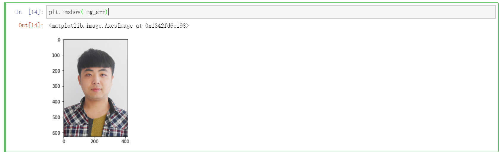

接下来，我们用数组 - 100，也就是对数组中每个元素都减少 100，看看会发生什么：

```python
plt.imshow(img_arr - 100)
```

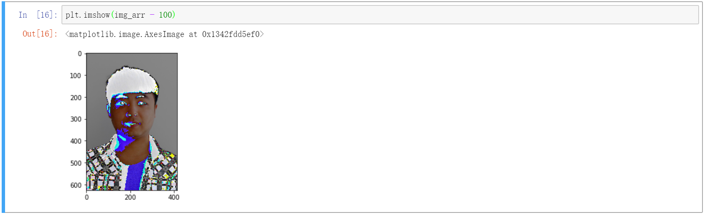

图片发生了奇怪的变化，人变黑了，因为每个颜色都有减少。不过究竟为什么变成这样并不重要，我们只需知道数组加上（或其他四则运算）一个常数意味着给每个元素都加上（或其他四则运算）一个常数即可。

#### 使用 np 的方法创建数组

np 中有很多可以创建数组的方法，比如：

- `zero()`
- `ones()`
- `linespace()`
- `arange()`
- random 系列

接下来，我们将逐个进行介绍。

##### zeros 和 ones

这两个方法可以创建指定尺寸的数组，数组中的元素会全部用 0 或 1 填充：

```python
zeros_arr = np.zeros(shape=(3, 4))
ones_arr = np.ones(shape=(3, 4))
print(zeros_arr)
print(ones_arr)
```

输出结果为（因为打印的缘故，显示的是类似列表的结构，其实是 array 数组类型的）：

```python
[[0. 0. 0. 0.]
 [0. 0. 0. 0.]
 [0. 0. 0. 0.]]
[[1. 1. 1. 1.]
 [1. 1. 1. 1.]
 [1. 1. 1. 1.]]
```

##### linspace 和 arange 等差数组

这两个方法都是用来创建一个等差的数组。

linspace 通过指定起始元素、终止元素和元素个数来创建：

```python
line_arr = np.linspace(0, 100, num=20)
line_arr
```

输出的结果为：

```python
array([  0.        ,   5.26315789,  10.52631579,  15.78947368,
        21.05263158,  26.31578947,  31.57894737,  36.84210526,
        42.10526316,  47.36842105,  52.63157895,  57.89473684,
        63.15789474,  68.42105263,  73.68421053,  78.94736842,
        84.21052632,  89.47368421,  94.73684211, 100.        ])
```

arange 通过指定起始元素、终止元素和步长来创建，终止元素有可能不会被包含在数组中：

```python
arange_arr = np.arange(0, 100, 5)
arange_arr
```

输出的结果为：

```python
array([ 0,  5, 10, 15, 20, 25, 30, 35, 40, 45, 50, 55, 60, 65, 70, 75, 80,
       85, 90, 95])
```

##### random 系列

random 系列方法用来随机生成一些数组。

我们最常用的是 randint，用一定范围的随机数字生成指定形状的数组：

```python
np.random.randint(0, 100, size=(4,))    # 一维数组
```

输出结果为：`array([62, 40, 96, 89])`

也可以生成多维数组：

```python
np.random.randint(0, 100, size=(3, 4, 5))
```

输出的结果为：

```python
array([[[33, 62, 98, 28, 23],
        [71, 25, 72, 92, 42],
        [10, 46, 32, 88,  8],
        [ 2, 58, 38, 80, 68]],

       [[45, 10, 74, 34, 74],
        [94, 39, 79, 69,  5],
        [82, 63, 32, 36, 84],
        [74, 48, 99,  0, 42]],

       [[98, 52, 69, 69,  4],
        [97, 71, 69, 42, 94],
        [92, 93,  3, 66, 57],
        [33, 53, 26, 67,  8]]])
```

### 数组维度讨论

上面的例子中，生成了一个三维数组。我们理解三维还是比较容易的，比如一本书表示三维，则书中的一页表示二维，一页中的一行数据表示一维。

上一个数组的形状 shape 是 `(3, 4, 5)`，这该如何理解呢？

anaconda 很友好地给我们做了区分：数组分成了三大块，四中块，每个中块里面有五个元素。三大块，是最外层的三个大数组，四中块，是中间的四个小数组。每个小数组里面有五个元素。

当然这是很简单的数据，我们可以一眼看出来维度的数目和含义。如果维度数很高，数据量很大，恐怕就不能这么直观看出来了。不过倒也不至于束手无策。

可以通过数开头或结尾的中括号数目来确定数组维度。一般情况下，是几维的数组，就会以几个中括号开头和结尾。

至于元素形状的含义，我们可以由内而外看。最后一个形状参数，在上面的例子中就是 5 的含义是最内层数组的元素个数。倒数第二个参数， 也就是 4 的含义是，内层数组每四个会组成一个中等大小的数组。最前面的 3 的含义是，每三个这样的数组组成一个大数组。这样从内而外，由简到繁，即可理解数组维度的含义。

### NumPy 的常用属性

NumPy 中比较常用的属性有：

- shape
- ndim
- size
- dtype

其用法为：

```python
arr = np.array([[1, 2, 3], [4, 5, 6]])
arr.shape    # (2, 3) 数组的形状
arr.ndim    # 2 数组的维度数
arr.size    # 6 数组元素总个数
arr.dtype    # dtype('int32') 数组元素的数据类型
type(arr)    # numpy.ndarray 数组的类型
```

### NumPy 的数据类型

`array(dtype=?)` 可以设定数据类型：

```python
arr = np.array([1, 2, 3], dtype='int64')
arr    # array([1, 2, 3], dtype=int64)
```

`arr.dtype` 可以查看数据类型：

```python
arr.dtype    # dtype('int64')
```

`arr.dtype = '?'` 可以修改数据类型：

```python
arr.dtype = 'int32'    # 直接改变了原始数组
```

需要注意，如果原数据是 int64 类型的，转成 int32 后，数组中会补充一些 0。这是因为 64 位数据在那个位置的数值为 0。如果数据量很大，超出了 int 32 能表示的范围，还可能会把数字拆分成两部分：

```python
arr = np.array([1, 2, 22222222222], dtype='int64')
arr.dtype = 'int32'
arr
```

上面的操作输出的结果为：

```python
array([        1,         0,         2,         0, 747385742,         5])
```

这种无用的 0 将来我们会有办法去掉。

如果不想要这些 0，可以考虑用 astype 来修改数据类型。

需要注意的是，dtype 是对数组本身进行数据类型修改操作。而 astype 则是生成一个新数组：

```python
new_arr = arr.astype('int8')
new_arr
```

这种方法如果数据超出范围，也是会截取的，只不过高位的数字将会被舍弃掉，仅保留低位数字。

附：NumPy 中的数据类型

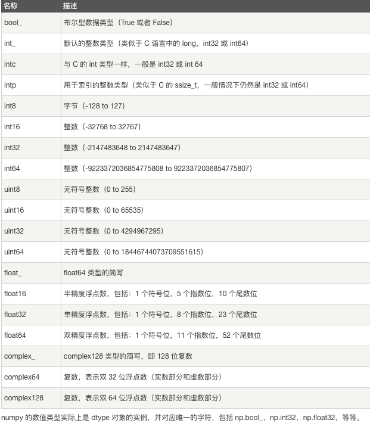

### NumPy 的索引和切片操作（重点）

先创建一个随机数组：

```python
arr = np.random.randint(0, 100, size=(5, 6))
```

得到一个 5 行 6 列的数组：

```python
array([[42, 24, 69, 19,  4, 76],
       [28, 71, 41, 50, 79, 64],
       [15,  7, 97, 38, 68, 59],
       [81, 24,  2, 38, 65, 83],
       [77, 93, 18, 44, 85, 17]])
```

#### 索引操作

索引操作和列表同理：

```python
arr[0]    # array([42, 24, 69, 19,  4, 76])
arr[2][4]    # 68
```

#### 切片操作

数组切片操作的方法为：

```python
arr[行切片,列切片]
arr[第一个维度切片, 第二个维度切片, 第三个维度切片 ...]
```

切出前两行数据，这和普通列表切片很相似了：

```python
arr[0:2]
```

切出前两列数据，也很简单，在行切片后面加上一个逗号即可：

```python
arr[:, 0:2]
```

输出的效果为：

```python
array([[42, 24],
       [28, 71],
       [15,  7],
       [81, 24],
       [77, 93]])
```

切出前两行的前两列的数据，把前两个例子结合起来即可：

```python
arr[:2, :2]
```

数组数据翻转，步长为 -1 是精髓：

```python
arr[::-1]    # 数组行翻转
arr[:, ::-1]    # 数组列翻转
arr[::-1, ::-1]    # 数组所有元素翻转
```

练习：将一张图片上下左右进行翻转操作

分析：可以看出，图片数组的第一个维度是纵向的像素，第二个维度是横向的像素。上下翻转，需要倒置第一个维度；左右翻转则要倒置第二个维度。

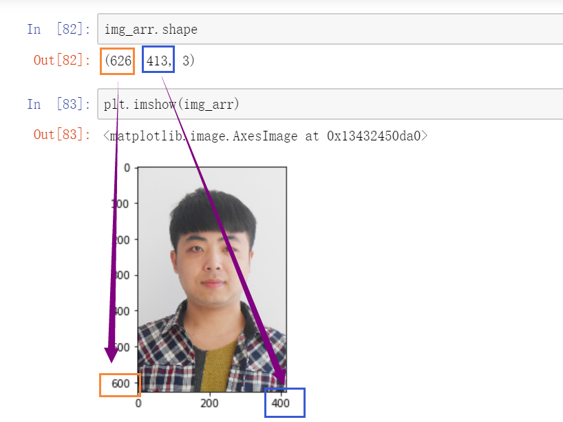

```python
plt.imshow(img_arr[:, ::-1])    # 左右翻转
plt.imshow(img_arr[::-1])    # 上下倒置
```

练习：将图片进行指定区域的裁剪

```python
plt.imshow(img_arr[50:400, 75:340])
```

效果：

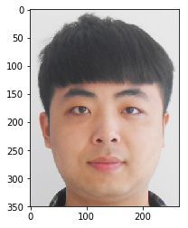

### 变形 reshape

先创建一个二维数组：

```python
arr = np.random.randint(0, 100, size=(3, 4))
```

创建好的数组为：

```python
array([[76, 59, 22, 57],
       [33, 50, 14, 91],
       [26, 31,  3, 62]])
```

将二维数组转为一维数组：

```python
arr_1 = arr.reshape((12,))
```

转换好的结果为：

```python
array([76, 59, 22, 57, 33, 50, 14, 91, 26, 31,  3, 62])
```

将一维数组转为二维数组：

```python
arr_2 = arr_1.reshape((4, 3))
```

转化后的结果为：

```python
array([[76, 59, 22],
       [57, 33, 50],
       [14, 91, 26],
       [31,  3, 62]])
```

要注意的是，这里转换的元素数目要对应上，不能多也不能少，多了少了都会报错。

如果我们已知行数，可以将列数设置为 -1，程序将自动计算列数，无需我们特别指定：

```python
arr_3 = arr_1.reshape((2, -1))
```

### 级联操作

级联操作就是将多个 NumPy 数组进行横向或者纵向的拼接

axis 轴向的理解

- 0：纵向拼接
- 1：横向拼接

对于更高维度（二维依然有效）的数组而言，axis 实际上是维度的索引，也就是在哪个维度进行拼接。

拼接的数组首先需要维度数目相同。不同维度的数组是无论如何也无法拼接的。

除此之外，还要要求除了待拼接的维度之外，所有其他维度的元素个数要相同。如果其他维度的元素个数不同，将无法进行拼接。待拼接的维度的元素数目可以不一致。

对于二维数组而言，就是行和列必须要只要有一个数目相同才能进行拼接，否则无法拼接。行的数目相同可以拼接列，列的数目相同可以拼接行。

我们还是使用上面的那个二维数组：

```python
array([[76, 59, 22, 57],
       [33, 50, 14, 91],
       [26, 31,  3, 62]])
```

我们想要让它自己对第二个维度进行拼接，可以这样写：

```python
np.concatenate((arr, arr), axis=1)
```

结果是横向拼接的数组：

```python
array([[76, 59, 22, 57, 76, 59, 22, 57],
       [33, 50, 14, 91, 33, 50, 14, 91],
       [26, 31,  3, 62, 26, 31,  3, 62]])
```

要纵向拼接，只需将 axis 设置为 0：

```python
np.concatenate((arr, arr), axis=0)
```

结果就是在第一个维度进行拼接：

```python
array([[76, 59, 22, 57],
       [33, 50, 14, 91],
       [26, 31,  3, 62],
       [76, 59, 22, 57],
       [33, 50, 14, 91],
       [26, 31,  3, 62]])
```

如果我们现在有一个三行两列的列表，那么它只能在第二个维度进行拼接。因为第二个维度是不同的，我们需要保证除了拼接维度外，其他维度的元素个数都相同才行：

```python
arr_new = np.array([[1, 2], [3, 4], [5, 6]])
np.concatenate((arr, arr_new), axis=1)
```

合并后的结果为：

```python
array([[76, 59, 22, 57,  1,  2],
       [33, 50, 14, 91,  3,  4],
       [26, 31,  3, 62,  5,  6]])
```

练习：把图片拼接九宫格的形式。

思路：同一张照片，肯定行列都相同，所以无需顾忌方向问题。可以先横向拼接，然后纵向拼接。

```python
img_3 = np.concatenate((img_arr, img_arr, img_arr), axis=1)    # 横向拼接
img_9 = np.concatenate((img_3, img_3, img_3), axis=0)    # 纵向拼接
plt.imshow(img_9)    # 显示图片
```

最终成功显示出九宫格图片：

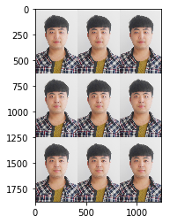

### 常用的聚合操作

常用的聚合操作有：

- sum
- max
- min
- mean

聚合操作默认是对所有元素进行运算的。也可以指定维度进行运算。聚合运算将会让数组坍缩一个维度。

对于二维数组而言，0 维可以理解为纵向运算，1 维可以理解为横向运算。

对于较高的维度，理解起来可能要稍复杂些。指定维度运算可以理解为将那个维度坍缩。数字按照坍缩方向进行聚合运算。

同样地，我们创建一个三维的随机数组进行演示操作：

```
arr_3 = np.random.randint(0, 100, size=(2, 3, 4))
arr_3
```

得到了一个三维数组：

```python
array([[[55, 62, 50, 69],
        [19, 68, 85, 11],
        [ 1, 16, 46, 71]],

       [[30, 11, 24, 68],
        [66,  8, 74, 46],
        [84, 13, 27, 97]]])
```

sum 用来对数组中的元素进行求和，默认是对所有元素求和，数组会完全坍缩成一个数字：

```python
arr.sum()    # 1101
```

当然我们可以指定维度进行求和运算。比如，我们让第一个维度坍缩：

```
arr.sum(axis=0)
```

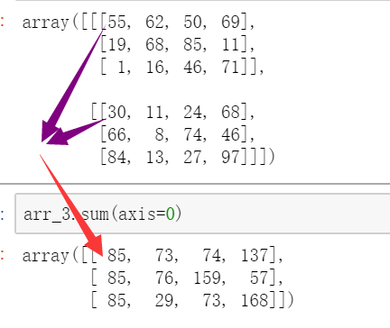

对另外两个维度坍缩也是同样道理：

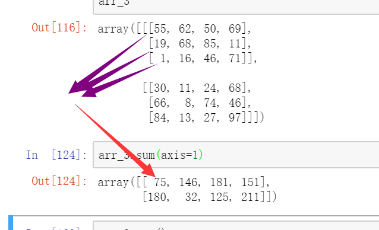

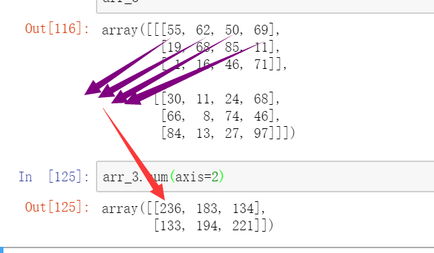

求和理解了，另外三个函数用法同理，max 用来求最大值，min 求最小值，mean 求均值，就不一一介绍了。

### 常用的数学函数

NumPy 为我们提供了标准的三角函数：`sin()`、`cos()`、`tan()`

`np.around(a,decimals)` 函数返回指定数字的四舍五入（四舍六入五成双）值，decimals 为正，从小数点右边保留；为负，从小数点左边保留。

- 参数说明：
  - a：数组
  - decimals：舍入的小数位数。 默认值为 0。 如果为负，整数将四舍五入到小数点左侧的位置

我们还使用上面的三维数组进行测试：

```python
array([[76, 59, 22, 57],
       [33, 50, 14, 91],
       [26, 31,  3, 62]])
```

可以对所有数值求解三角函数：

```
np.sin(arr)
```

输出的结果为：

```python
array([[ 0.56610764,  0.63673801, -0.00885131,  0.43616476],
       [ 0.99991186, -0.26237485,  0.99060736,  0.10598751],
       [ 0.76255845, -0.40403765,  0.14112001, -0.7391807 ]])
```

around 的取舍规则是四舍六入五成双：

```python
a = np.array([1.2, 4.5, 3.5, 6.7])
np.around(a)    # array([1., 4., 4., 7.])
np.around(np.sin(arr), decimals=2)
```

保留两位小数的结果为：

```python
array([[ 0.57,  0.64, -0.01,  0.44],
       [ 1.  , -0.26,  0.99,  0.11],
       [ 0.76, -0.4 ,  0.14, -0.74]])
```

### 常用的统计函数

`numpy.amin()` 和 `numpy.amax()`，用于计算数组中的元素沿指定轴的最小、最大值。

`numpy.ptp()`：计算数组中元素最大值与最小值的差（最大值 - 最小值），也就是极差。

`numpy.median()` 函数用于计算数组 a 中元素的中位数（中值）

标准差 `std()`：标准差是一组数据平均值分散程度的一种度量。

- 标准差计算公式：`std = sqrt(mean((x - x.mean())**2))`
- 如果数组是 `[1，2，3，4]`，则其平均值为 2.5。 因此，差的平方是 `[2.25,0.25,0.25,2.25]`，并且其平均值的平方根除以 4，即 `sqrt(5/4)` ，结果为 `1.1180339887498949`。

方差 `var()`：统计中的方差（样本方差）是每个样本值与全体样本值的平均数之差的平方值的平均数，即  `mean((x - x.mean())** 2)`。换句话说，标准差是方差的平方根。

注意：在求标准差时需要注意几个问题：

1. 在统计学中，标准差分为两种：

   总体标准差：标准差公式根号内除以 n，是有偏的。

   样本标准差：标准差公式根号内除以 n-1，是无偏的。

2. Pandas 与 NumPy 在计算标准差时的区别

   在 NumPy 中计算标准差时，括号内要指定 ddof 的值，ddof 表示自由度。当 ddof=0 时计算的是总体标准差；当 ddof=1 时计算的是样本标准差，当不为 ddof 设置值时，其默认为总体标准差。

   在使用 Pandas 计算标准差时，其与 NumPy 的默认情况是相反的，在默认情况下，Pandas 计算的标准差为样本标准差。

例如，求标准差和方差：

```python
a = np.array([1, 2, 3, 4])
a.std()    # 1.118033988749895 标准差
a.var()    # 1.25 方差
```

### 矩阵相关

NumPy 中包含了一个矩阵库 `numpy.matlib`，该模块中的函数返回的是一个矩阵，而不是 ndarray 对象。一个 的矩阵是一个由行（row）列（column）元素排列成的矩形阵列。

`numpy.matlib.identity()` 函数返回给定大小的单位矩阵。单位矩阵是个方阵，从左上角到右下角的对角线（称为主对角线）上的元素均为 1，除此以外全都为 0。

转置矩阵，也就是将矩阵的行列互换，通过 `.T` 方法实现。

```python
a = np.array([[2, 1], [4, 3]])
a.T
```

转置后的矩阵为：

```python
array([[2, 4],
       [1, 3]])
```

矩阵相乘 `numpy.dot(a, b, out=None)`

- a : ndarray 数组
- b : ndarray 数组

```python
a = np.array([[2, 1], [4, 3]])
b = np.array([[1, 2], [1, 0]])
np.dot(a, b, out=None)
```

矩阵相乘的结果为：

```python
array([[3, 4],
       [7, 8]])
```

矩阵乘法的规则：

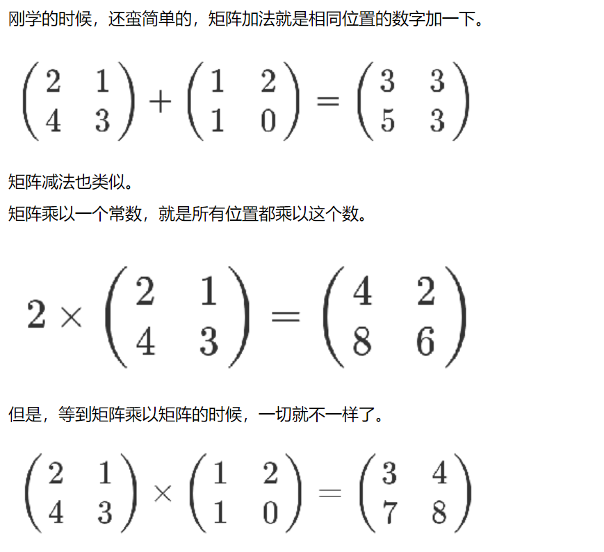

左行乘右列。第一个矩阵第一行的每个数字（2 和 1），各自乘以第二个矩阵第一列对应位置的数字（1 和 1），然后将乘积相加（ 2 x 1 + 1 x 1），得到结果矩阵左上角的那个值3。也就是说，结果矩阵第m行与第n列交叉位置的那个值，等于第一个矩阵第 m 行与第二个矩阵第n列，对应位置的每个值的乘积之和。

线性代数基于矩阵的推导：https://www.cnblogs.com/alantu2018/p/8528299.html

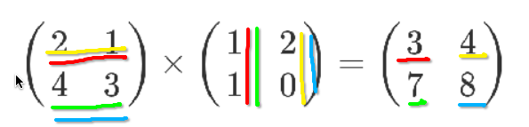

