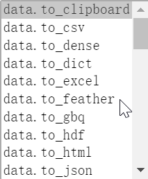

# DataFrame 基础操作巩固 - 股票分析

[TOC]

DataFrame 是一个十分强大的数据分析工具，功能很多，一时半会儿学不完。与其枯燥地学习每一个方法，不如结合实际项目应用，一边解决问题，一边学习方法。这样能加深理解，也不至于太乏味。

数据分析的一个很重要的应用领域，就是金融量化。我们今天以金融量化中的一种方法，双均值法，来学习 DataFrame 的操作。主要是以学习数据分析的方法为主，现实中的金融量化可要比这复杂多了。

## 基本的股票数据分析

需求：股票分析

- 使用 tushare 包获取某股票的历史行情数据。
- 输出该股票所有收盘比开盘上涨 3% 以上的日期。
- 输出该股票所有开盘比前日收盘跌幅超过 2% 的日期。
- 假如我从 2010 年 1 月 1 日开始，每月第一个交易日买入 1 手股票，每年最后一个交易日卖出所有股票，到今天为止，我的收益如何？

这里面提到了 tushare 模块，它是一个财经数据接口包，可以批量获取相关金融产品的历史数据。可以从官方网址找到各种数据的接口：http://tushare.org/index.html

使用之前，需要安装 tushare 模块：

```bash
pip install tushare
```

注意如果使用的是 anaconda 和 jupyter 开发，需要把模块安装在 anaconda 环境中。

最开始，导入我们要用到的模块和类：

```python
import tushare as ts
import pandas as pd
from pandas import Series, DataFrame
```

使用 tushare 包获取某股票的历史行情数据，这里以茅台的股票为例。`600519` 是茅台的股票代码。`1900-01-01` 是起始时间。事实上，我们想要拿到的是茅台上市以来的所有数据，这个时间一定是在茅台上市之前了。

```python
data = ts.get_k_data(code='600519', start='1900-01-01')
data.head()
```

我们可以看看前五条数据：

```python
	date	open	close	high	low	volume	code
0	2001-08-27	5.392	5.554	5.902	5.132	406318.00	600519
1	2001-08-28	5.467	5.759	5.781	5.407	129647.79	600519
2	2001-08-29	5.777	5.684	5.781	5.640	53252.75	600519
3	2001-08-30	5.668	5.796	5.860	5.624	48013.06	600519
4	2001-08-31	5.804	5.782	5.877	5.749	23231.48	600519
```

date 对应的是数据的日期，open 是开盘价，close 是收盘价，high 是当日最高价，low 是当日最低价，volume 是成交手数，code 是股票代码。

### 股票数据的持久化操作

我们看到，返回的股票数据其实是 DataFrame 类型的数据。对于 DataFrame 类型的数据，我们可以把它存储成文件，进行持久化保存。

我们可以使用 DataFrame 的 to 系列方法，将数据保存为文件。DataFrame 可以保存到文件格式十分丰富。



在这里，我们以 csv 格式为例，对 data 数据进行保存：

```python
# 将股票数据持久化存储：to_xxx()
data.to_csv('maotai.csv')
```

对于已经保存到文件，我们可以使用 pd 的 read 系列方法读取出来。DataFrame 可以保存的数据，pd 都能读取出来。这里，我们把刚刚保存的茅台股票信息的 csv 数据读取到：

```python
df = pd.read_csv('maotai.csv')
df.head()
```

读取到的数据看起来是正确的，但是似乎有些不大对劲：

```python
	Unnamed: 0	date	open	close	high	low	volume	code
0	0	2001-08-27	5.392	5.554	5.902	5.132	406318.00	600519
1	1	2001-08-28	5.467	5.759	5.781	5.407	129647.79	600519
2	2	2001-08-29	5.777	5.684	5.781	5.640	53252.75	600519
3	3	2001-08-30	5.668	5.796	5.860	5.624	48013.06	600519
4	4	2001-08-31	5.804	5.782	5.877	5.749	23231.48	600519
```

### 股票数据预处理

原来，第一列的隐式索引也被识别成了数据，因为没有列的显式索引，所以自动生成了一个名为 `Unnamed: 0` 的显式索引。

可是第一列我们是不需要的，可以将其删除。通过 DataFrame 的 drop 方法，可以删除指定的行或者列：

```python
df.drop(labels='Unnamed: 0', axis=1, inplace=True)
df.head()
```

参数解释：

- labels 用于指定索引
- axis 指定删除的方向，在 drop 系列方法中，axis=1 代表列，0 代表行
- inplace 指定是否在原 DataFrame 数据中删除。若 inplace 设置为 False，则原数据不会发生变化，而是会返回一个新的修改过的 DataFrame；若 inplace 为 True，则直接在原数据中进行修改，无返回值（返回 None）

查看前五行数据，第一列被顺利删除：

```python
	date	open	close	high	low	volume	code
0	2001-08-27	5.392	5.554	5.902	5.132	406318.00	600519
1	2001-08-28	5.467	5.759	5.781	5.407	129647.79	600519
2	2001-08-29	5.777	5.684	5.781	5.640	53252.75	600519
3	2001-08-30	5.668	5.796	5.860	5.624	48013.06	600519
4	2001-08-31	5.804	5.782	5.877	5.749	23231.48	600519
```

现在有一个问题：这些数据都是什么数据类型的呢？

这很重要，因为不同数据类型的方法种类会有差别，即便是相同的方法，计算方式也会有所不同。比如字符串的加法和整数的加法是不一样的。

我们可以通过指定列，使用 Series 的 dtype 方法，获取某一列数据的数据类型：

```python
df['date'].dtype
```

返回的结果为：`dtype('O')`

`dtype('O')`，是 objects 的缩写，也就是对象，一般指的是 pandas 中的字符串。

这样一列一列地查看数据类型似乎太麻烦，我们可以通过 DataFrame 的 info 方法，批量查看所有列的数据类型：

```python
df.info()
```

输出的结果就有每一列的数据类型了，还有 DataFrame 的一些其他常用信息：

```python
<class 'pandas.core.frame.DataFrame'>
RangeIndex: 4437 entries, 0 to 4436
Data columns (total 7 columns):
date      4437 non-null object
open      4437 non-null float64
close     4437 non-null float64
high      4437 non-null float64
low       4437 non-null float64
volume    4437 non-null float64
code      4437 non-null int64
dtypes: float64(5), int64(1), object(1)
memory usage: 242.7+ KB
```

其他的数据类型都还好，但是日期是字符串类型的数据就不是十分合适。我们需要把日期列的数据类型修改为时间类型。

我们可以先通过索引获取到 date 那一列的数据，然后通过 pandas 的 to_datetime 方法，将其全部转换成时间类型，最后将转换好的数据替换掉原来的 date 数据。实现起来其实只需要一行代码：

```python
df['date'] = pd.to_datetime(df['date'])    # dtype('<M8[ns]')
df.info()
```

再次查看数据类型，我们发现，date 列的数据成功转成了时间类型：

```python
<class 'pandas.core.frame.DataFrame'>
RangeIndex: 4437 entries, 0 to 4436
Data columns (total 7 columns):
date      4437 non-null datetime64[ns]
open      4437 non-null float64
close     4437 non-null float64
high      4437 non-null float64
low       4437 non-null float64
volume    4437 non-null float64
code      4437 non-null int64
dtypes: datetime64[ns](1), float64(5), int64(1)
memory usage: 242.7 KB
```

转换好数据类型，我们的数据看起来好很多。但是还有一个问题——纵向的数据没有显式索引。

显式索引可以让我们的数据更加易读，而且查找起来也更加方便。

索引需要唯一，而且最好含义明确，且数据直接有一定的关联。价格数据并不合适，因为有可能会出现重复的价格，而且每个价格是很随意的。这些数据中，最适合作为索引的是时间。

使用 set_index 方法将 date 列设置为源数据的行索引：

```python
df.set_index('date', inplace=True)    # inplace=True意味着直接在原数据中修改
df.head()
```

修改完成的数据前五行为：

```python
		open	close	high	low	volume	code
	date						
2001-08-27	5.392	5.554	5.902	5.132	406318.00	600519
2001-08-28	5.467	5.759	5.781	5.407	129647.79	600519
2001-08-29	5.777	5.684	5.781	5.640	53252.75	600519
2001-08-30	5.668	5.796	5.860	5.624	48013.06	600519
2001-08-31	5.804	5.782	5.877	5.749	23231.48	600519
```

### 简单的股票数据分析

#### 该股票所有收盘比开盘上涨 3% 以上的日期

需求：求出该股票所有收盘价格比开盘价格上涨 3% 以上的日期

分析：收盘价格比开盘价格的上涨幅度可以使用公式 `(收盘价格 - 开盘价格) / 开盘价格` 计算。将计算的结果和 0.03 作比较即可。因为需求中要的是日期，而我们刚好用日期做的索引，所以在获取到的

在计算之前，我们先学习一下 DataFrame 使用布尔值索引取值的方法。我们可以使用一个长度与 DataFrame 的行数相等的，由布尔值组成的列表作为索引取 DataFrame 的数据。我们取到的将是布尔值为 True 对应的那些行。比如，对前五行数据，我们使用列表 `[True, False, False, True, False]` 进行取值：

```python
# 将布尔值作为源数据的行索引，则保留True对应的行数据，舍弃False对应的行数据
df.head().loc[[True, False, False, True, False]]
```

我们成功拿到第一行和第四行的数据：

```python
	open	close	high	low	volume	code
date						
2001-08-27	5.392	5.554	5.902	5.132	406318.00	600519
2001-08-30	5.668	5.796	5.860	5.624	48013.06	600519
```

有了这个基础，我们就可以首先通过拿到是否当日涨幅超过 3% 的布尔值，然后以布尔值数组为索引，获得所有符合条件的数据行了。

首先，获取布尔值数组：

```python
(df['close'] - df['open']) / df['open'] > 0.03
```

结果的数据量太大，我只截取前几天数据：

```python
date
2001-08-27     True
2001-08-28     True
2001-08-29    False
2001-08-30    False
2001-08-31    False
2001-09-03    False
2001-09-04    False
```

然后，以此为索引，获取所有符合条件的数据行：

```python
df.loc[(df['close'] - df['open']) / df['open'] > 0.03]
```

同样，因为结果太长，我只截取前几行数据：

```python
	open	close	high	low	volume	code
date						
2001-08-27	5.392	5.554	5.902	5.132	406318.00	600519
2001-08-28	5.467	5.759	5.781	5.407	129647.79	600519
2001-09-10	5.531	5.734	5.757	5.470	18878.89	600519
2001-12-21	5.421	5.604	5.620	5.421	8135.04	600519
2002-01-18	5.437	5.726	5.762	5.421	32262.08	600519
```

最后使用 index 属性取索引，即可获取到需求中的获取该股票所有收盘价格比开盘价格上涨 3% 以上的日期：

```python
df.loc[(df['close'] - df['open']) / df['open'] > 0.03].index
```

结果就是：

```python
DatetimeIndex(['2001-08-27', '2001-08-28', '2001-09-10', '2001-12-21',
               '2002-01-18', '2002-01-31', '2003-01-14', '2003-10-29',
               '2004-01-05', '2004-01-14',
               ...
               '2019-05-10', '2019-05-15', '2019-06-11', '2019-06-20',
               '2019-09-12', '2019-09-18', '2020-02-11', '2020-03-02',
               '2020-03-05', '2020-03-10'],
              dtype='datetime64[ns]', name='date', length=307, freq=None)
```

#### 该股票所有开盘比前日收盘跌幅超过 2% 的日期

需求：求出该股票所有开盘价格比前日收盘价格跌幅超过 2% 的日期。

分析：计算公式应该是 `(今日开盘价 - 昨日收盘价) / 昨日收盘价`，要让这个结果小于 `-0.02`。

Series 之间的运算都是建立在索引相同的数据之上的。在这个例子中就是，某一个天的数据只能和当天的数据进行计算。

可问题是，需求要去要用当天的开盘价格和前日的收盘价格作比较。这时，我们可以用到 shift 方法。参数为正数时，数据整体下移指定的行数；参数为负时，则向上移动指定的行数。

我们先看正常的输盘价格的前五条数据：

```python
df['close'].head()
```

结果为：

```python
date
2001-08-27    5.554
2001-08-28    5.759
2001-08-29    5.684
2001-08-30    5.796
2001-08-31    5.782
Name: close, dtype: float64
```

使用 shift 方法下移一行：

```python
df['close'].shift(1).head()
```

结果就成了：

```python
date
2001-08-27      NaN
2001-08-28    5.554
2001-08-29    5.759
2001-08-30    5.684
2001-08-31    5.796
Name: close, dtype: float64
```

数据整体下移一位，第一行因为没有数据，就成了 NaN。我们后面会学到数据的清洗将会处理这些空的数据。这里无视它即可，不影响我们的运算。

我们通过 shift 方法，把前一天的数据放到了和当天相同的行里面。这样，就可以完成今天的开盘价和昨天的收盘价的计算了。

首先通过公式，判断当天的开盘价是否较前一日的收盘价下跌幅度超过 2%：

```python
(df['open'] - df['close'].shift(1)) / df['close'].shift(1) < -0.02
```

得到一系列的布尔值（茅台股很强劲，跌幅很大的数据不多）：

```python
date
2001-08-27    False
2001-08-28    False
2001-08-29    False
2001-08-30    False
2001-08-31    False
2001-09-03    False
2001-09-04    False
2001-09-05    False
2001-09-06    False
2001-09-07    False
2001-09-10    False
2001-09-11    False
2001-09-12     True
2001-09-13    False
```

然后，把符合条件的数据筛选出来：

```python
df.loc[(df['open'] - df['close'].shift(1)) / df['close'].shift(1) < -0.02]
```

还是，数据量太大，我只截取前几行：

```python
	open	close	high	low	volume	code
date						
2001-09-12	5.520	5.621	5.656	5.515	25045.19	600519
2002-06-26	5.824	5.757	5.843	5.712	15423.00	600519
2002-12-13	4.508	4.628	4.670	4.508	2223.10	600519
2004-07-01	6.357	6.792	6.810	6.355	2781.62	600519
2004-10-29	9.658	9.899	9.986	9.658	14363.14	600519
2006-08-21	26.888	27.632	27.651	26.807	7293.21	600519
2006-08-23	27.401	27.789	27.958	27.401	21056.23	600519
```

然后，取索引，就得到最终的结果了：

```python
df.loc[(df['open'] - df['close'].shift(1)) / df['close'].shift(1) < -0.02].index
```

最终的结果，茅台股票所有开盘价较前日收盘价跌幅超过 2% 的日期（可以见到，2008 年的金融危机对茅台股价冲击比较大）：

```python
DatetimeIndex(['2001-09-12', '2002-06-26', '2002-12-13', '2004-07-01',
               '2004-10-29', '2006-08-21', '2006-08-23', '2007-01-25',
               '2007-02-01', '2007-02-06', '2007-03-19', '2007-05-21',
               '2007-05-30', '2007-06-05', '2007-07-27', '2007-09-05',
               '2007-09-10', '2008-03-13', '2008-03-17', '2008-03-25',
               '2008-03-27', '2008-04-22', '2008-04-23', '2008-04-29',
               '2008-05-13', '2008-06-10', '2008-06-13', '2008-06-24',
               '2008-06-27', '2008-08-11', '2008-08-19', '2008-09-23',
               '2008-10-10', '2008-10-15', '2008-10-16', '2008-10-20',
               '2008-10-23', '2008-10-27', '2008-11-06', '2008-11-12',
               '2008-11-20', '2008-11-21', '2008-12-02', '2009-02-27',
               '2009-03-25', '2009-08-13', '2010-04-26', '2010-04-30',
               '2011-08-05', '2012-03-27', '2012-08-10', '2012-11-22',
               '2012-12-04', '2012-12-24', '2013-01-16', '2013-01-25',
               '2013-09-02', '2014-04-25', '2015-01-19', '2015-05-25',
               '2015-07-03', '2015-07-08', '2015-07-13', '2015-08-24',
               '2015-09-02', '2015-09-15', '2017-11-17', '2018-02-06',
               '2018-02-09', '2018-03-23', '2018-03-28', '2018-07-11',
               '2018-10-11', '2018-10-24', '2018-10-25', '2018-10-29',
               '2018-10-30', '2019-05-06', '2019-05-08', '2019-10-16',
               '2020-01-02', '2020-02-03', '2020-03-13', '2020-03-23'],
              dtype='datetime64[ns]', name='date', freq=None)
```

#### 月初买股票，年底卖股票，计算收益

问题：假如我从 2010 年 1 月 1 日开始，每月第一个交易日买入 1 手股票，每年最后一个交易日卖出所有股票，到今天为止，我的收益如何？

分析：

1. 将数据从 2010 切到 2020 年
2. 买股票：
   - 一个完整的年，需要买 12 次股票（12 手）
   - 一手股票为一百支
3. 卖股票：
   - 一个完整的年，需要卖出1次股票（1200 支）
4. 买卖股票的单价：
   - 以当天的收盘价买卖
5. 在 2020 年只能买入 4 手股票，无法卖出。需要将剩余的股票价值按照最后一个交易日的收盘价计算到总收益中。

首先，切取时间从 2010 年至今的所有数据。因为索引是时间类型，我们可以直接使用年份切取：

```python
new_df = df['2010':]
new_df
```

切片后的数据为：

```python
	open	close	high	low	volume	code
date						
2010-01-04	109.760	108.446	109.760	108.044	44304.88	600519
2010-01-05	109.116	108.127	109.441	107.846	31513.18	600519
2010-01-06	107.840	106.417	108.165	106.129	39889.03	600519
...	...	...	...	...	...	...
2020-03-30	1060.250	1072.000	1077.000	1057.000	30687.00	600519
2020-03-31	1082.000	1111.000	1115.000	1081.800	47984.00	600519
2020-04-01	1117.000	1103.000	1129.000	1103.000	33205.00	600519
```

然后，我们要计算买入股票的总花费。因为我们只会在每月的第一个交易日买入股票，所以只需找到这些交易日的收盘价，即可计算买入股票的总花费。

如何能找到每月的第一个交易日呢？

我们可以使用 resample 方法，对数据进行重新取样，让它们以月份分组，然后我们提取每组的第一行数据，就是每月第一个交易日的数据了：

```python
# 数据的重新取样（根据指定条件在df中取出指定的数据）
df_monthly = new_df.resample('M').first()
df_monthly.head()
```

取样的结果如果看索引的话，似乎不太对劲：

```python
	open	close	high	low	volume	code
date						
2010-01-31	109.760	108.446	109.760	108.044	44304.88	600519
2010-02-28	107.769	107.776	108.216	106.576	29655.94	600519
2010-03-31	106.219	106.085	106.857	105.925	21734.74	600519
2010-04-30	101.324	102.141	102.422	101.311	23980.83	600519
2010-05-31	81.676	82.091	82.678	80.974	23975.16	600519
```

索引是每月的最后一天，而非第一个交易日！这是 resample 的 bug，不必理会。如果观察数据可以发现，每一行的数据都是每月第一个交易日的数据。我们其实已经成功取到了数据。

然后，我们只需要找到每月第一个交易日（每月的第一行数据）的收盘价，乘以 100 则表示买入了 1 手股票。根据乘法分配律，每只股票的收盘价乘以 100 再求和与先求和再乘以 100 的结果是一样的：

```python
# 收盘价为单价买入股票
cost_money = df_monthly['close'].sum() * 100
cost_money    # 4232833.300000001
```

花费的钱数已经计算出来，接下来可以计算卖出股票的收入了。

我们每年的最后一个交易日会卖出股票。每年会买入 12 手，总共 1200 支股票，以每年最后一个交易日的收盘价卖出。我们可以以年份为单位，重新取样，拿到每年最后一个数据：

```python
new_df.resample('A').last()
```

那取到的结果为：

```python
	open	close	high	low	volume	code
date						
2010-12-31	117.103	118.469	118.701	116.620	46084.0	600519
2011-12-31	138.039	138.468	139.600	136.105	29460.0	600519
2012-12-31	155.208	152.087	156.292	150.144	51914.0	600519
2013-12-31	93.188	96.480	97.179	92.061	57546.0	600519
2014-12-31	157.642	161.056	161.379	157.132	46269.0	600519
2015-12-31	207.487	207.458	208.704	207.106	19673.0	600519
2016-12-31	317.239	324.563	325.670	317.239	34687.0	600519
2017-12-31	707.948	687.725	716.329	681.918	76038.0	600519
2018-12-31	563.300	590.010	596.400	560.000	63678.0	600519
2019-12-31	1183.000	1183.000	1188.000	1176.510	22588.0	600519
2020-12-31	1117.000	1103.000	1129.000	1103.000	33205.0	600519
```

有一点要注意的是，今年（2020 年）尚未到最后一个交易日，所以今年买入的股票是不会卖出的。所以今年的数据要排除出去：

```python
df_yearly = new_df.resample('A').last()[:-1]
df_yearly
```

结果中就没有今年的数据了：

```python
	open	close	high	low	volume	code
date						
2010-12-31	117.103	118.469	118.701	116.620	46084.0	600519
2011-12-31	138.039	138.468	139.600	136.105	29460.0	600519
2012-12-31	155.208	152.087	156.292	150.144	51914.0	600519
2013-12-31	93.188	96.480	97.179	92.061	57546.0	600519
2014-12-31	157.642	161.056	161.379	157.132	46269.0	600519
2015-12-31	207.487	207.458	208.704	207.106	19673.0	600519
2016-12-31	317.239	324.563	325.670	317.239	34687.0	600519
2017-12-31	707.948	687.725	716.329	681.918	76038.0	600519
2018-12-31	563.300	590.010	596.400	560.000	63678.0	600519
2019-12-31	1183.000	1183.000	1188.000	1176.510	22588.0	600519
```

将每年最后一个交易日的收盘价乘以 1200，即是当年的卖出收入。把这些收入加和，即可得到这些年卖出股票的总收入。根据乘法分配律，我们可以用所有收盘价的和乘以 1200 得到同样的结果：

```python
recv_money = df_yearly['close'].sum() * 1200
recv_money    # 4391179.2
```

总的买入花费和卖出收入已经计算完毕，我们还需要计算当前持有股份的价值。

今年已经过去 4 个月，只需要将今年最后一个交易日的收盘价乘以 400 即可得到持有股份的总价值：

```python
hold_money = new_df['close'][-1] * 400
hold_money    # 441200.0
```

最后，使用公式 `当前持有股票价值 + 卖出股票总收入 - 买入股票总花费` 即可计算出需求中的总收益：

```python
# 总收益
recv_money + hold_money - cost_money
```

这个数值是：`599545.8999999994`

可见，即便不用任何技巧，买茅台股票也能赚好多钱。

## 双均线策略制定

双均线是一个比较简单的股票买卖策略，通过建立 m 天移动平均线，n 天移动平均线，则两条均线必有交点。若 m>n，n 天平均线“上穿越”m 天均线则为买入点，反之为卖出点。

### 数据准备

这次我们使用平安银行的股票来进行分析。首先还是使用 tushare 来获取平安银行的历史数据，然后进行数据的持久化，接着读取数据（真实的案例不必需要这两部，这里是在练习），清楚不必要的列，修改数据类型，设置行索引：

```python
data = ts.get_k_data(code='000001', start='1900-01-01')    # 从网络接口获取数据
data.to_csv('pingan.csv')    # 将数据持久化存储
df = pd.read_csv('pingan.csv')    # 读取文件中的数据
df.drop('Unnamed: 0', axis=1, inplace=True)    # 删除隐式索引列
df['date'] = pd.to_datetime(df['date'])    # 将date列的数据类型更换为时间类型
df.set_index('date', inplace=True)    # 将date列设置为索引
df.info()    # 查看数据类型
df.head()    # 查看前五行数据
```

数据类型为：

```python
<class 'pandas.core.frame.DataFrame'>
DatetimeIndex: 6967 entries, 1991-01-02 to 2020-04-01
Data columns (total 6 columns):
open      6967 non-null float64
close     6967 non-null float64
high      6967 non-null float64
low       6967 non-null float64
volume    6967 non-null float64
code      6967 non-null int64
dtypes: float64(5), int64(1)
memory usage: 381.0 KB
```

前五行的数据为：

```python
	open	close	high	low	volume	code
date						
1991-01-02	0.185	0.188	0.188	0.185	759.00	1
1991-01-03	0.429	0.429	0.429	0.429	212.40	1
1991-01-04	0.428	0.428	0.428	0.428	167.90	1
1991-01-05	0.426	0.426	0.426	0.426	131.50	1
1991-01-07	0.426	0.426	0.426	0.426	161.36	1
```

### 5 日均线和 30 日均线

需求：计算该股票历史数据的 5 日均线和 30 日均线。

什么是均线？

对于每一个交易日，都可以计算出前N天的移动平均值，然后把这些移动平均值连起来，成为一条线，就叫做N日移动平均线。移动平均线常用线有 5 天、10 天、30 天、60 天、120 天和 240 天的指标。

- 5 天和 10 天的是短线操作的参照指标，称做日均线指标；
- 30 天和 60 天的是中期均线指标，称做季均线指标；
- 120 天和 240 天的是长期均线指标，称做年均线指标。

均线计算方法：`MA = (C1 + C2 + C3 +...+ Cn) / N`。其中，C 为某日收盘价，N 为移动平均周期（天数）

对于某一天来说，5 日均线就是之前 4 天的价格之和加上今天的价格，然后除以 5。30 日均线道理相同。

要计算 5 日均线，我们就需要获取前 4 天的数据。如果使用循环就太麻烦。DataFrame 为我们提供了 rolling 方法，这个方法可以将指定个数的数组组合，然后进行聚合运算。

比如 `rolling(5)` 的运算操作可以用下面的表格表示：

|    索引    |  0   |  1   |  2   |  3   |   4   |   5   |   6   |   7   |
| :--------: | :--: | :--: | :--: | :--: | :---: | :---: | :---: | :---: |
| rolling(5) | NaN  | NaN  | NaN  | NaN  | 01234 | 12345 | 23456 | 34567 |
|   平均值   | NaN  | NaN  | NaN  | NaN  |   2   |   3   |   4   |   5   |

我们可以通过 rolling 方法来计算出 5 日均值：

```python
ma5 = df['close'].rolling(5).mean()
ma5
```

前四个元素为 NaN，因为它们凑不齐 5 天，所以 5 日均值对于前四天而言是没有意义的：

```python
date
1991-01-02        NaN
1991-01-03        NaN
1991-01-04        NaN
1991-01-05        NaN
1991-01-07     0.3794
1991-01-08     0.4266
1991-01-09     0.4252
1991-01-10     0.4236
1991-01-11     0.4220
1991-01-12     0.4200
1991-01-14     0.4178
```

同样方法，我们还可以求出 30 日均值，同样，前 29 天将会是 NaN：

```python
ma30 = df.rolling(30).mean()
ma30
```

有了 5 日均值和 30 日均值，我们可以用这些数据来画曲线：

```python
import matplotlib.pyplot as plt
plt.plot(ma5[300:600], label='ma5', c='red')
plt.plot(ma30[300:600], label='ma30', c='blue')
plt.legend()
plt.show()
```

画出来的曲线如下：


### 金叉和死叉

我们发现，5 日均线和 30 日均线会有很多的交叉点，这些交叉点有其特有的名称：金叉和死叉。

股票分析技术中的金叉和死叉，可以简单解释为：

- 分析指标中的两根线，一根为短时间内的指标线，另一根为较长时间的指标线；
- 如果短时间的指标线方向拐头向上，并且穿过了较长时间的指标线，这种状态叫“金叉”；
- 如果短时间的指标线方向拐头向下，并且穿过了较长时间的指标线，这种状态叫“死叉”；
- 一般情况下，出现金叉后，操作趋向买入；死叉则趋向卖出。当然，金叉和死叉只是分析指标之一，要和其他很多指标配合使用，才能增加操作的准确性。

需求：分析输出所有金叉日期和死叉日期。

不难看出，在金叉的左侧，30 日均值要高于 5 日均值，金叉的右侧，30 日均值要低于 5 日均值，死叉则刚好反过来。那么我们就可以这样来找到金叉和死叉的位置：

- 30 日均值从高于 5 日均值变成低于 5 日均值的位置为金叉
- 30 日均值从低于 5 日均值变成高于 5 日均值的位置为死叉

比如，下面的表格表示了金叉和死叉的位置（数据为凭空捏造）：

| 索引       | 0    | 1    | 2    | <span style="color: orange">3</span>  | 4    | 5    | <span style="color: red">6</span>  | 7    | 8    | <span style="color: orange">9</span>  | 10   |
| ---------- | ---- | ---- | ---- | ------------------------------------- | ---- | ---- | ---------------------------------- | ---- | ---- | ------------------------------------- | ---- |
| ma30 > ma5 | T    | T    | T    | <span style="color: orange">F</span>  | F    | F    | <span style="color: red">T</span>  | T    | T    | <span style="color: orange">F</span>  | F    |
| 金叉/死叉  |      |      |      | <span style="color: orange">金</span> |      |      | <span style="color: red">死</span> |      |      | <span style="color: orange">金</span> |      |

那么如何来求出金叉和死叉的位置呢？

我们不妨令 `s1 = ma30 > ma5`，s2 为 s1 取反的结果，即 `s2 = ~s1`。s1 和 s2 的值在下表中表示：

| 索引 | 0    | 1    | 2    | <span style="color: orange">3</span> | 4    | 5    | <span style="color: red">6</span> | 7    | 8    | <span style="color: orange">9</span> | 10   |
| ---- | ---- | ---- | ---- | ------------------------------------ | ---- | ---- | --------------------------------- | ---- | ---- | ------------------------------------ | ---- |
| s1   | T    | T    | T    | <span style="color: orange">F</span> | F    | F    | <span style="color: red">T</span> | T    | T    | <span style="color: orange">F</span> | F    |
| s2   | F    | F    | F    | <span style="color: orange">T</span> | T    | T    | <span style="color: red">F</span> | F    | F    | <span style="color: orange">T</span> | T    |

现在似乎还是无法轻易计算金叉和死叉的位置。不过，如果我们将 s2 整体向后移动一位，就像下面这样：

| 索引        | 0    | 1    | 2    | <span style="color: orange">3</span> | 4    | 5    | <span style="color: red">6</span> | 7    | 8    | <span style="color: orange">9</span> | 10   |
| ----------- | ---- | ---- | ---- | ------------------------------------ | ---- | ---- | --------------------------------- | ---- | ---- | ------------------------------------ | ---- |
| s1          | T    | T    | T    | <span style="color: orange">F</span> | F    | F    | <span style="color: red">T</span> | T    | T    | <span style="color: orange">F</span> | F    |
| s2.shift(1) |      | F    | F    | F                                    | T    | T    | T                                 | F    | F    | F                                    | T    |
| s2          | F    | F    | F    | <span style="color: orange">T</span> | T    | T    | <span style="color: red">F</span> | F    | F    | <span style="color: orange">T</span> | T    |

注意看金叉和死叉的位置。我们发现，普通位置上，s1 和 s2.shift(1) 的值一定是相反的，但是在金叉和死叉的位置上，两个值相同了。如果两个值同为 False，则该位置为金叉；如果同为 True，则该位置为死叉。

我们可以通过与操作，得到同为 True 的位置，也就是死叉；通过或非（先或操作，然后取反）操作，得到同为 False 的位置，也就是金叉。操作结果如下表所示：

| 索引                 | 0    | 1    | 2    | <span style="color: orange">3</span> | 4    | 5    | <span style="color: red">6</span> | 7    | 8    | <span style="color: orange">9</span> | 10   |
| -------------------- | ---- | ---- | ---- | ------------------------------------ | ---- | ---- | --------------------------------- | ---- | ---- | ------------------------------------ | ---- |
| s1                   | T    | T    | T    | <span style="color: orange">F</span> | F    | F    | <span style="color: red">T</span> | T    | T    | <span style="color: orange">F</span> | F    |
| s2.shift(1)          |      | F    | F    | F                                    | T    | T    | T                                 | F    | F    | F                                    | T    |
| s2                   | F    | F    | F    | <span style="color: orange">T</span> | T    | T    | <span style="color: red">F</span> | F    | F    | <span style="color: orange">T</span> | T    |
| s1 & s2.shift(1)     |      | F    | F    | F                                    | F    | F    | <span style="color: red">T</span> | F    | F    | F                                    | F    |
| ~(s1 \| s2.shift(1)) |      | F    | F    | <span style="color: orange">T</span> | F    | F    | F                                 | F    | F    | <span style="color: orange">T</span> | F    |

运算结果成功找到了金叉和死叉的位置，然后我们就可以通过布尔值索引找到金叉和死叉所在的行了。


接下来我们开始操作吧！

首先我们来判断一下每个交易日的 30 日均值是否高于 5 日均值，也就是求出 s1：

```python
s1 = ma5[30:] < ma30[30:]    # 切片是为了舍弃空值
s1
```

s1 的部分结果为：

```python
date
1991-02-06     True
1991-02-07     True
1991-02-08     True
1991-02-09     True
1991-02-11     True
1991-02-12    False    # 金叉
1991-02-13    False
1991-02-22    False
...
1991-03-05    False
1991-03-06    False
1991-03-07    False
1991-03-08    False
1991-03-09    False
1991-03-11     True    # 死叉
1991-03-12     True
...
```

然后，s2 为 s1 取反的结果：

```python 
s2 = ~s1
s2
```

死叉日期：

```python
death_date = df[30:].loc[s1 & s2.shift(1)].index
death_date
```

输出的结果成功找到死叉的位置：

```python 
DatetimeIndex(['1991-03-11', '1991-11-28', '1992-01-17', '1992-06-05',
               '1992-08-17', '1992-10-21', '1993-03-23', '1993-05-04',
               '1993-08-25', '1993-11-29',
               ...
               '2018-08-16', '2018-10-16', '2018-11-13', '2019-03-28',
               '2019-05-08', '2019-08-06', '2019-08-30', '2019-09-18',
               '2019-11-13', '2020-01-21'],
              dtype='datetime64[ns]', name='date', length=153, freq=None)
```

金叉日期：

```python 
golden_date = df[30:].loc[~(s1 | s2.shift(1))].index
golden_date
```

金叉日期也成功被找到：

```python 
DatetimeIndex(['1991-02-12', '1991-10-03', '1991-12-27', '1992-01-30',
               '1992-07-03', '1992-09-15', '1992-12-02', '1993-04-09',
               '1993-08-02', '1993-11-10',
               ...
               '2018-07-25', '2018-08-23', '2018-10-18', '2019-01-14',
               '2019-04-01', '2019-06-14', '2019-08-12', '2019-09-05',
               '2019-09-20', '2019-12-17'],
              dtype='datetime64[ns]', name='date', length=153, freq=None)
```

### 按照金叉炒股，收益如何？

问题：如果我从假如我从 2010 年 1 月 1 日开始，初始资金为 100000 元。在金叉处尽量买入，死叉处全部卖出，则到今天为止，我的炒股收益率如何？

分析：

- 买卖股票的单价使用开盘价
- 买卖股票的时机
- 最终手里会有剩余的股票没有卖出去
  - 会有。如果最后一个为金叉，则买入股票。估量剩余股票的价值计算到总收益。
  - 剩余股票的单价就是用最后一天的收盘价。

首先，分别以金叉日期和死叉日期创建 Series，金叉日期对应的值为 1，死叉日期对应的值为 0：

```python
# 创建一个Series，sr1存储的value值全部为1，索引为金叉日期
sr1 = Series(data=1, index=golden_date)
# sr2的value值为0，索引为死叉日期
sr2 = Series(data=0, index=death_date)
```

然后，将两个 Series 合并到一起，并以索引（时间）进行排序：

```python
# 将sr1和sr2这两个Series中的数据整合到一起
s = sr1.append(sr2)
s.sort_index(inplace=True)
s
```

排序后的 Series 为：

```python
date
1991-02-12    1
1991-03-11    0
1991-10-03    1
1991-11-28    0
1991-12-27    1
1992-01-17    0
...
```

金叉和死叉交替出现，因为金叉后面必定是死叉，死叉后面必定是金叉。

数据中的 1 表示的时间为金叉时间，0 表示的时间为死叉时间。

因为问题要求是 2010 年以来，所以我们要对数据进行切片截取：

```python
new_s = s['2010':]
new_s
```

就拿到了 2010 年以来的所有数据：

```python 
date
2010-02-22    1
2010-04-09    0
2010-06-23    1
2010-09-10    0
2010-10-13    1
...
```

然后，通过循环 new_s 中的数据，在金叉时买入股票，在死叉时卖出股票，即可计算总收益了：

```python
START_MONEY = 100000    # 本金，不可变
money = START_MONEY    # 现金总金额，可变，买卖股票从money中进行加减操作
hold = 0    # 持有股票的数量（支）
for i in range(len(new_s)):
    if new_s[i]:    # 金叉的值为1，如果是金叉的话，需要买入股票
        price = df.loc[new_s.index[i]]['close']    # 买入价格，以当日收盘价买入
        hand = money // (price * 100)    # 剩余的钱共可以买的手数。股票只能整手买，也就是100的倍数支
        hold = hand * 100
        money -= hold * price
    else:    # 死叉的值为0，如果是死叉，将卖出全部股票
        price = df.loc[new_s.index[i]]['close']    # 卖出价格，以当日收盘价卖出
        money += price * hold
        hold = 0
# 剩余股票的价值
hold_money = hold * df['close'][-1]
print('总收益：', money + hold_money - START_MONEY)
```

最终计算得到的总结过为：`127010.79999999996`

还有一个很有趣的现象，如果把买入和卖出的价格换成开盘价格，这个数值会翻将近两番，为：`331508.3`

原因可能是开盘时跟接近金叉和死叉的位置吧。