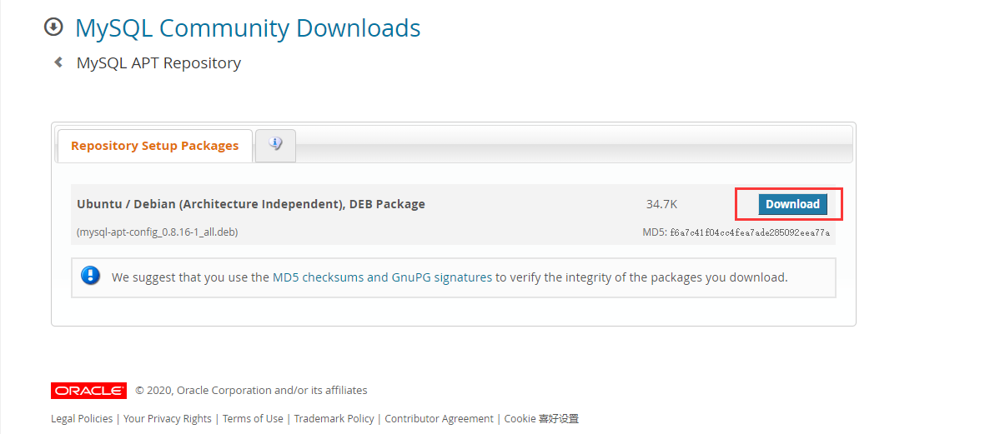
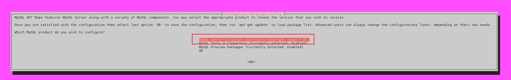

# MySQL 8.0 的安装和配置

[toc]

## Ubuntu 系统 apt 安装

从 [MySQL 官网](https://dev.mysql.com/downloads/repo/apt/)下载 deb 包，配置 MySQL 官方 apt 源，以安装 MySQL。



将下载好的安装包上传至 Ubuntu 系统中，使用 dpkg 命令安装：

```bash
sudo dpkg -i mysql-apt-config_0.8.16-1_all.deb
```

选择 8.0 版本的 MySQL，如无必要，不要选择集群版本：



使用 apt 安装 MySQL：

```bash
sudo apt install mysql-server
```

期间会让你设置 root 用户的密码。如果是在服务器上，建议使用复杂些的密码确保安全。

测试是否安装成功：

```bash
sudo mysql -uroot -p
```

若输入密码后成功进入 MySQL，则一切安好。注意初次登陆需使用 sudo 权限。

## 创建和配置用户

登陆 MySQL：

```bash
sudo mysql -uroot -p
```

使用 user 数据库：

```mysql
USE mysql;
```

创建用户并指定密码：

```mysql
CREATE USER 'YOUR_SYSTEM_USER'@'localhost' IDENTIFIED BY 'YOUR_PASSWD';
```

指定该用户的权限：

```mysql
GRANT ALL PRIVILEGES ON *.* TO 'YOUR_SYSTEM_USER'@'localhost';
```

刷新权限配置：

```mysql
FLUSH PRIVILEGES;
```

## 创建数据库

创建一个字符集为 utf8mb4 的数据库：

```mysql
CREATE DATABASE  `db` DEFAULT CHARACTER SET utf8mb4 COLLATE utf8mb4_unicode_ci;
```

