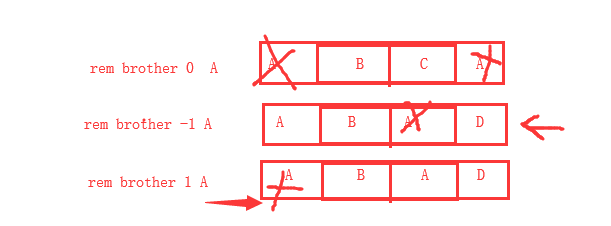

## Redis 的基本使用

[TOC]

### Redis 初识

Redis 是一个高性能的 key-value 数据格式的内存缓存，是一种 NOSQL 数据库。

NOSQL，Not Only SQL，泛指非关系型数据库。

关系型数据库（MySQL、Oracle、SQL server、db2、SQLlite、PostgreSQL）的特征：

1. 数据存放在表中，表之间有关系
2. 通用的 SQL 操作语言
3. 大部分支持事务

非关系型数据库（Redis、Hadoop、mangoDB）的特征：

1. 没有数据表的概念，不同的 NOSQL 数据库存放数据位置不同
2. NOSQL 数据库没有通用的操作语言
3. 基本不支持事务，Redis 支持简单事务

Redis 是一种内存型（数据存放在内存中）的非关系型（NOSQL）key-value（键值存储）数据库，支持数据的持久化（注：数据持久化时将数据存放到文件中，每次启动 Redis 之后会先将文件中数据加载到内存），经常用做缓存（用来缓存一些经常用到的数据，提高读写速度）。

Redis 是一款基于 C/S 架构的数据库，所以 Redis 既有客户端，也有服务端。

Redis 的客户端可以使用 Python 等编程语言，也可以终端命令行工具，还可以是 Redis Desktop Manager 管理工具：


Redis 客户端连接服务器：

```
redis-cli -h redis服务器ip -p redis服务器port
```

### Redis 的几个站点地址

中文官网： http://www.redis.cn/

英文官网：https://redis.io

参考命令：http://doc.redisfans.com/

### Redis 的数据类型

Redis 中的数据类型主要有 5 中：string 字符串、hash 哈希、list 列表、set 无序集合以及 zset 有序集合。接下来，我们将逐一进行讨论。

#### string 字符串类型

字符串类型是 Redis 中最为基础的数据存储类型，它在 Redis 中是二进制安全的，也就是字符串存储过程中，不会改变二进制数据的代码。比如 C 语言是二进制不安全的，因为 C 语言会在字符串末尾加上 `\0` 标识。Redis 是二进制安全的，就不会加上这种标识。

字符串类型的数据单个数据的最大容量是 512M。

```
key: string
```

#### hash 哈希类型

hash 用于存储对象，对象的结构为属性、值，值的类型为 string。

```
key: {
    域: 值[这里的值只能是字符串],
    域: 值,
    域: 值,
    域: 值,
    ...
}
```

#### list 列表类型

列表的元素类型为 string。

```
key: [ 值1, 值2, 值3 ...]
```

#### set 无序集合类型

无序集合的元素为 string 类型，元素唯一不重复，没有修改操作。

```
key: {值1, 值4, 值3, 值5}
```

#### zset 有序集合类型

有序集合的官方名称是 sortedset，元素为 string 类型，元素唯一不重复，没有修改操作，按照权重值进行排序。

```
key: {
    值1 权重值4,
    值2 权重值3,
    值3 权重值2,
    值4 权重值1,
}
```

### 通用命令

启动 redis-cli 客户端连接服务端

如果在配置文件中设置了访问密码，则需要在连接 Redis 时填写密码。

```bash
redis-cli -h <IP地址，默认127.0.01> -p <端口,默认6379>    # 进入redis，如果是本地，则不需要声明-h参数。
redis-cli auth <密码>    # 填写密码
```

切换数据库

默认情况下，我们在终端下面连接 Redis，进入的数据库是 0 号数据库。如果要切换数据库，则可以使用 select 命令：

```redis
select <db>
```

### string 字符串操作

#### 增/改

设置键值，如果设置的键不存在则为添加，如果设置的键已经存在则修改

```
set key value
```

例：设置键为 name 值为 xiaoming 的数据:

```redis
set name xiaoming
```


设置键值及过期时间，以秒为单位

```redis
setex key seconds value
```

例：设置键为 name 值为 xiaoming过期时间为 3 秒的数据：

```redis
setex name 20 xiaoming
```

查看有效时间，以秒为单位。如果没有设置过期时间，返回值为 -1，如果数据不存在，返回值为 -2。

```
ttl key
```

例：查看键 name 的有效时间

```
ttl name
```

string 是 Redis 中唯一能够设置保存数据有效期的数据类型。我们可以通过两种方式设定数据的有效期：

- setex 添加保存数据到 redis，同时设置有效期，格式为：

  ```redis
  setex key time value
  ```

- expire 给已有的数据重新设置有效期，格式为：

  ```redis
  expire key time
  ```

批量设置多个键值。如果有很多数据，如果每次设置一组键值对，那真的是很蛮烦。这时，我们可以使用 mset，一次性设置多个键值：

```redis
mset key1 value1 key2 value2 ...
```

例：设置键为 a1 值为 python、键为 a2 值为 java、键为 a3 值为 c

```redis
mset a1 python a2 java a3 c
```

拼接值

```redis
append key value
```

例：向键为 title 的值拼接 llo

```redis
set title he
append title llo 
get title
```

输出结果：`hello`

#### 查

根据键获取值，如果不存在此键则返回 `(nil)`，一次只能查看一个数据：

```redis
get key
```

例5：获取键 name 的值

```redis
get name
```

根据多个键获取多个值

```redis
mget key1 key2 ...
```

例：获取键 a1、a2、a3 的值

```redis
mget a1 a2 a3
```

#### 删

删除指定键对应的值，可以同时删除多个：

```redis
del key1 key2 key3 ...
```

例：删除 title：

```redis
del title
```

### 键操作

#### 查

查找当前数据库中的键，参数中可用 `*` 指代多个或 0 个任意字符，使用 `?` 指代 1 个任意字符。

```redis
keys pattern
```

例：查看所有键

```redis
keys *
```

例：查看名称中包含 a 的键

```redis
keys a*
```


判断键是否存在，如果存在返回 1，不存在返回 0。如果是多个数据，返回的是存在的个数

```redis
exists key
exists key1 key2 key3 ...
```

例：判断键 a1 是否存在

```redis
exists a1
```


查看键对应的 value 的类型，返回的值为 redis 支持的五种类型中的⼀种

```redis
type key
```

例：查看键 a1 的值类型

```redis
type a1
```

#### 删

删除键及对应的值

```redis
del key1 key2 ...
```

例5：删除键 a2 和 a3

```redis
del a2 a3
```

清空当前数据库中所有的键

```redis
flushall
```

### hash 哈希操作

哈希表，类似于 Python 的字典，其基本建构为：

```
键key: {
   	域field: 值value,
   	域field: 值value,
}
```

#### 增/改

设置单个属性

```redis
hset key field value
```

例：设置键 user 的属性 name 为 xiaohong

```redis
hset user name xiaohong
```

批量设置多个属性

```redis
hmset key field1 value1 field2 value2 ...
```

例：设置键 user2 的属性 name 为 xiaohong、属性 age 为 11

```redis
hmset user2 name xiaohongage age 11
```

#### 查

获取指定键所有的属性

```redis
hkeys key
```

例：获取键 user2 的所有属性

```redis
hkeys user2
```

获取⼀个属性的值

```redis
hget key field
```

例：获取键 user2 属性 name 的值

```redis
hget user2 name
```

获取多个属性的值

```redis
hmget key field1 field2 ...
```

例：获取键 user2 属性 name、age 的值

```redis
hmget user2 name age
```

获取所有属性的值

```redis
hvals key
```

例：获取键 user2 所有属性的值

```redis
hvals user2
```

获取成员个数

```redis
hlen key
```

例：获取jian user2 的成员个数

```redis
hlen user2
```

输出结果：3

#### 删

删除属性，属性对应的值会被⼀起删除

```redis
hdel key field1 field2 ...
```

例：删除键 u2 的属性 age

```redis
hdel u2 age
```

### list 列表操作

列表中的元素类型只能为 string，列表元素按照插入顺序排序。

#### 增

在列表左侧插⼊数据

```redis
lpush key value1 value2 ...
```

例：向键为 a1 的列表左侧加⼊数据 a、b、c

```redis
lpush a1 a b c
```

在列表右侧插⼊数据

```redis
rpush key value1 value2 ...
```

例：从键为 a1 的列表右侧插入数据 0、1

```redis
rpush a1 0 1
```

在指定元素的前或后插⼊新元素

```redis
linsert key before/after 现有元素 新元素
```

例：在键为 a1 的列表中元素 b 前插入 3

```redis
linsert a1 before b 3
```

#### 改

设置指定索引位置的元素值

- 索引从左侧开始，第⼀个元素为0

- 索引可以是负数，表示尾部开始计数，如`-1`表示最后⼀个元素

```redis
lset key index value
```

例：修改键为 a1 的列表中下标为 1 的元素值为 z

```redis
lset a1 1 z
```

对列表进行裁剪切片操作，切片索引超出范围不报错：

```
ltrim key start stop
```

例：裁剪 a1 列表，只保存第 2 到第 4 个元素

```
ltrim a1 2 4
```

#### 查

获取指定列表的长度

```redis
llen key
```

例：查看列表 a1 的长度

```redis
llen a1
```

查看一定索引范围内的列表元素，起始和终止索引对应的元素都会被查询到（顾头顾腚）

```
lrange key start stop
```

例：查看 a1 列表第 2 到第 5 个元素；查看 a1 列表的全部元素

```redis
lrange a1 2 5
lrange a1 0 -1
```

通过索引获取列表中的元素

```redis
lindex key index
```

例：查看 a1 列表中，索引为 1 的数据

```redis
lindex a1 1
```

#### 删

删除指定元素

将列表中前 count 次出现的值为 value 的元素移除

- `count > 0`：从头往尾移除，如果 `count == 2`，则从头开始，删除 2 个成员 value
- `count < 0`：从尾往头移除，如果 `count == -2`，则从尾开始，删除 2 个成员 value
- `count == 0`：移除所有

```
lrem key count value
```



例：创建列表 a2，向其中插入元素 `a b c a b c a b c`。然后从 a2 列表右侧开始删除 2 个 b，从左侧开始删除 1 个 a，删除所有 c

```redis
lpush a2 a b c a b c a b c
lrem a2 -2 b
lrem a2 1 a
lrem a2 0 c
```

注意，上面的例子中，因为是向左侧插入，所以生成的列表其实是 `c b a c b a c b a`。

移出并获取列表左侧第一个元素

```redis
lpop key
```

例：移除列表 a2 左侧第一个元素并返回结果

```redis
lpop a2
```

移除列表右侧第一个元素，并将移除的元素返回。

```redis
rpop key
```

例：移除列表 a2 右侧第一个元素

```
rpop a2
```

### set 无序集合操作

#### 增

添加元素。无序集合是去重复的，若元素不存在会增加，若元素存在则不增加

```redis
sadd key member1 member2 ...
```

例：向键 a3 的集合中添加元素 zhangsan、lisi、wangwu

```redis
sadd a3 zhangsan sili wangwu
```

#### 查

查看集合中所有的元素

```redis
smembers key
```

例：获取键 a3 的集合中所有元素

```redis
smembers a3
```

获取集合的成员个数

```
sadd name_list liubei caocao sunquan
scard name_list
```

输出结果：3

随机抽取任意数目（默认为一个）集合的成员，不会删除这些成员

```redis
srandmember key [count]
```

例：随机抽取一个 a3 集合的成员，随机抽取两个 name_list 集合的成员

```redis
srandmember a3
srandmember name_list
```

#### 删

删除指定元素

```
srem key value
```

例：删除键 a3 集合中的元素 wangwu

```redis
srem a3 wangwu
```

随机抽取指定个数（默认为一个）成员返回并从集合中删除这个成员

```
spop key [count]
```

例：随机抽取并删除集合 a3 中的一个成员，随机抽取并删除集合 name_list 中的两个成员

```redis
spop a3
spop name_list 2
```

### zset 有序集合操作（了解）

Redis 的有序集合并不常用，这里简单介绍几个用法。

#### 增

向有序集合中增加一个或多个元素

```redis
zadd key score1 member1 score2 member2
```

例：向有序集合中插入数据

```redis
zadd brother 1 liubei 2 guanyu 3 zhangfei
```

#### 查

查询一定权重范围内的有序集合数据。加上 withscores，可以把权重打印出来

```
zrange key start stop [withscores]
```

例：查看有序集合 brother 的第 2 到第 3 个元素，并显示每个元素的权重

```
zrange brother 1 2 withscores
```

查询有序列表中，元素的总个数

```redis
zcard key
```

#### 删

删除有序集合中指定的元素，可同时删除多个：

```redis
zrem key member1 member2 ...
```

例：删除有序集合 brother 的元素 guanyu 和 zhangfei

```redis
zrem brother guanyu zhangfei
```

### Redis 中各个数据类型的应用场景

针对各种数据类型它们的特性，使用场景如下:

- 字符串 string：用于保存一些项目中的普通数据或者**有时效**的数据，只要键值对的都可以保存，例如，保存 session。定时记录状态，保存一个倒计时时间值。

- 哈希 hash：用于保存项目中的一些字典数据，但是不能保存多维的字典。例如，商城的购物车或者登陆用户的信息。

- 列表 list：用于保存项目中的列表数据，但是也不能保存多维的列表。例如，队列，秒杀系统，挂号系统，排单系统，访问历史记录。

- 无序集合 set：用于保存项目中的一些不能重复的数据，可以用于过滤。例如，投票海选的时候，过滤候选人，收藏（去重）。

- 有序集合 zset：用于保存项目中一些不能重复，但是需要进行排序的数据。例如，分数排行榜。