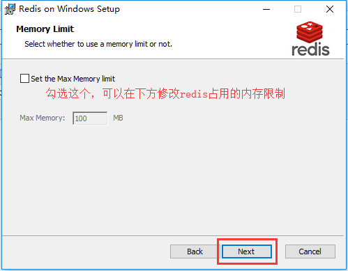

## Redis 的安装和配置

[TOC]

Redis 是一款高性能，内存数据存储的非关系型数据库。通常用来进行数据缓存，也就是存放一些需要经常读取的数据。

Redis 官方原版网址：https://redis.io/

Redis 中文官网：http://www.redis.cn

### Windows 系统 Redis 的下载和安装

Redis 官方已经不再提供 Windows 版本的 Redis。我们现在常用的 Windows 系统的 Redis 数据库是微软团队根据官方的 Linux 版本高仿的。正因如此，我们不太会在生产环境中，使用 Windows 的 Redis。但是如果在学习测试的情况下，Windows 系统中的 Redis 已经足够了。

下载地址：https://github.com/MicrosoftArchive/redis/releases


下载好之后，双击 msi 安装包，基本上一路点击下一步即可。只有两个地方需要稍微注意，不注意的话问题也不大。

首先是这里，安装路径当然不要有中文、空格和特殊符号。最好勾选上把安装路径加入到环境变量中。


然后是这里，默认端口一般就是 6379 不要变。像这种官方默认的端口号，如果不是有不可避免的冲突，不要轻易改。MySQL 默认就是 3306，Redis 就是 6379。这样以后配置起来都使用默认的，不至于乱套。

下面的让防火墙忽略也要勾选上。


这个无所谓，看需求咯。



然后就没啥好说的，一路下一步就好。

### 启动和关闭 Redis 服务

使用以下命令启动 Redis 服务端，`redis.windows.conf` 文件就在刚刚安装的时候指定到 Redis 的安装路径中：

```
redis-server C:/redis/redis.windows.conf
```


这样开启 Redis 服务有个弊端是，关闭上面这个 cmd 窗口就关闭 Redis 服务器服务了。

若要 Redis 长期在后台运行，不会随着我们关闭 cmd 窗口而关闭，我们可以让 Redis 作为 Windows 服务的方式启动（同样，注意 `redis.windows.conf` 的位置在 Redis 的安装路径中）：

```
redis-server --service-install C:/redis/redis.windows.conf
```

若按下回车后一段时间无响应，可以使用 ctrl + C 强制退出。这没关系，你会看到，服务成功安装了：


客户端启动和终止 Redis 服务：

```bash
redis-server --service-start    # 启动Redis服务
redis-server --service-stop    # 终止Redis服务
```

启动内置客户端连接 Redis 服务：

```bash
redis-cli
```


### Ubuntu 系统 Redis 的安装

Ubuntu 下安装 Redis 就十分简单了，一条命令即可：

```bash
sudo apt-get install redis-server
```

启动 Redis 服务同样只需一条命令：

```bash
redis-server
```

启动内置的客户端连接 Redis 服务：

```bash
redis-cli
```

### Redis 的配置

Redis 安装成功以后，Window 下的配置文件保存在 Redis 的安装目录下，文件名为 `redis.windows.conf`。如果是 macOS 或者 Linux，配置文件则位于 `/etc/redis/redis.conf`

绑定 IP，如果需要远程访问，可将此行注释，或绑定⼀个真实 IP：

```
bind 127.0.0.1  ::1
```

端⼝，默认为 6379

```
port 6379
```

是否以守护进程运行（这里的配置主要是 Linux 和 macOS 下面需要配置的）

- 如果以守护进程运行，则不会在命令行阻塞，类似于服务
- 如果以非守护进程运行，则在启动服务时，当前终端将会被阻塞
- 设置为 yes 表示守护进程，设置为 no 表示非守护进程
- 推荐设置为 yes

```
daemonize yes
```

数据文件

```
dbfilename dump.rdb
```

数据文件存储路径

```
dir /var/lib/redis
```

日志文件保存位置

```
logfile /var/log/redis/redis-server.log
```

数据库数目，默认有 16 个

```
database 16
```

主从复制，类似于双机备份

```
slaveof
```

访问密码，连接 Redis 时需要输入指定密码，默认是注释状态的，一般情况也不会开启密码，因为 Redis 多数情况都是运行在 127.0.0.1，不会被外网访问到

```
requirepass foobared
```