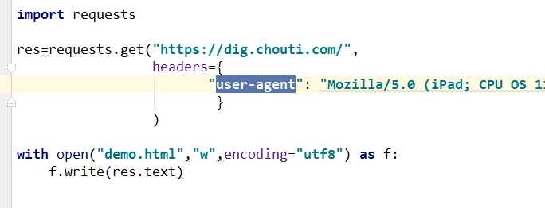
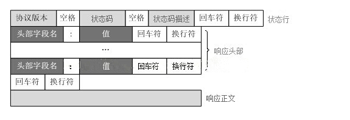

## HTTP 协议

### HTTP 协议简介

超文本传输协议（英文：**H**yper**T**ext **T**ransfer **P**rotocol，缩写：**HTTP**）是一种用于分布式、协作式和超媒体信息系统的应用层协议。HTTP 是万维网的数据通信的基础。

HTTP 是由蒂姆·伯纳斯·李于 1989 年在欧洲核子研究组织（CERN）所发起。HTTP 的标准制定由万维网协会（World Wide Web Consortium，W3C）和互联网工程任务组（Internet Engineering Task Force，IETF）进行协调，最终发布了一系列的 RFC，其中最著名的是 1999 年 6 月公布的 RFC 2616，定义了 **HTTP 协议中现今广泛使用的一个版本——HTTP 1.1**。

2014 年 12 月，互联网工程任务组（IETF）的 Hypertext Transfer Protocol Bis（httpbis）工作小组将 HTTP/2 标准提议递交至 IESG 进行讨论，于 2015 年 2 月 17 日被批准。 HTTP/2 标准于 2015 年 5 月以 RFC 7540 正式发表，取代 HTTP 1.1 成为 HTTP 的实现标准。

### HTTP 协议概述

HTTP 是一个客户端终端（用户）和服务器端（网站）请求和应答的标准（TCP）。通过使用网页浏览器、网络爬虫或者其它的工具，客户端发起一个 HTTP 请求到服务器上指定端口（默认端口为 80）。我们称这个客户端为用户代理程序（user agent）。应答的服务器上存储着一些资源，比如 HTML 文件和图像。我们称这个应答服务器为源服务器（origin server）。在用户代理和源服务器中间可能存在多个“中间层”，比如代理服务器、网关或者隧道（tunnel）。

尽管 TCP/IP 协议是互联网上最流行的应用，HTTP 协议中，并没有规定必须使用它或它支持的层。事实上，HTTP 可以在任何互联网协议上，或其他网络上实现。HTTP 假定其下层协议提供可靠的传输。因此，任何能够提供这种保证的协议都可以被其使用。因此也就是其在 TCP/IP 协议族使用 TCP 作为其传输层。

通常，由 HTTP 客户端发起一个请求，创建一个到服务器指定端口（默认是 80 端口）的 TCP 连接。HTTP 服务器则在那个端口监听客户端的请求。一旦收到请求，服务器会向客户端返回一个状态，比如 `HTTP/1.1 200 OK`，以及返回的内容，如请求的文件、错误消息、或者其它信息。

### HTTP工 作原理

HTTP 协议定义 Web 客户端如何从 Web 服务器请求 Web 页面，以及服务器如何把 Web 页面传送给客户端。HTTP 协议采用了请求/响应模型。客户端向服务器发送一个请求报文，请求报文包含请求的方法、URL、协议版本、请求头部和请求数据。服务器以一个状态行作为响应，响应的内容包括协议的版本、成功或者错误代码、服务器信息、响应头部和响应数据。

以下是 HTTP 请求/响应的步骤：

1. 客户端连接到 Web 服务器
   一个 HTTP 客户端，通常是浏览器，与 Web 服务器的 HTTP 端口（默认为 80）建立一个 TCP 套接字连接。例如，对于网址 `http://www.luffycity.com` 浏览器实际上访问的是 `http://www.luffycity.com:80`。
2. 发送 HTTP 请求
   通过 TCP 套接字，客户端向 Web 服务器发送一个文本的请求报文，一个请求报文由请求行、请求头部、空行和请求数据 4 部分组成。
3. 服务器接受请求并返回 HTTP 响应
   Web 服务器解析请求，定位请求资源。服务器将资源复本写到 TCP 套接字，由客户端读取。一个响应由状态行、响应头部、空行和响应数据 4 部分组成。
4. 释放连接 TCP 连接
   若 connection 模式为 close，则服务器主动关闭 TCP 连接，客户端被动关闭连接，释放 TCP 连接；若 connection 模式为 keepalive，则该连接会保持一段时间，在该时间内可以继续接收请求；
5. 客户端浏览器解析 HTML 内容
   客户端浏览器首先解析状态行，查看表明请求是否成功的状态代码。然后解析每一个响应头，响应头告知以下为若干字节的 HTML 文档和文档的字符集。客户端浏览器读取响应数据 HTML，根据 HTML 的语法对其进行格式化，并在浏览器窗口中显示。

例如：在浏览器地址栏键入 URL，按下回车之后会经历以下流程：

1. 浏览器向 DNS 服务器请求解析该 URL 中的域名所对应的 IP 地址；
2. 解析出 IP 地址后，根据该 IP 地址和默认端口 80，和服务器建立TCP连接；
3. 浏览器发出读取文件（URL 中域名后面部分对应的文件）的 HTTP 请求，该请求报文作为 TCP 三次握手的第三个报文的数据发送给服务器；
4. 服务器对浏览器请求作出响应，并把对应的 html 文本发送给浏览器；
5. 释放 TCP连接；
6. 浏览器将该 HTML文本并显示内容；

 

HTTP 协议是基于 TCP/IP 协议之上的**应用层**协议，基于**请求-响应**的模式。

HTTP 协议规定，请求从客户端发出，最后服务器端响应该请求并返回。换句话说，肯定是先从客户端开始建立通信的，服务器端在没有接收到请求之前不会发送响应。

#### 无状态保存

HTTP 是一种不保存状态，即无状态（stateless）协议。HTTP协议自身不对请求和响应之间的通信状态进行保存。也就是说在 HTTP 这个级别，协议对于发送过的请求或响应都不做持久化处理。

　　　　

使用 HTTP 协议，每当有新的请求发送时，就会有对应的新响应产生。协议本身并不保留之前一切的请求或响应报文的信息。这是为了更快地处理大量事务，确保协议的可伸缩性，而特意把 HTTP 协议设计成如此简单的。

可是，随着 Web 的不断发展，因无状态而导致业务处理变得棘手的情况增多了。比如，用户登录到一家购物网站，即使他跳转到该站的其他页面后，也需要能继续保持登录状态。针对这个实例，网站为了能够掌握是谁送出的请求，需要保存用户的状态。HTTP/1.1 虽然是无状态协议，但为了实现期望的保持状态功能，于是引入了 **Cookie** 技术。有了 Cookie 再用 HTTP 协议通信，就可以管状态了。有关 Cookie 的详细内容稍后讲解。

#### 无连接

无连接的含义是限制每次连接只处理一个请求。服务器处理完客户的请求，并收到客户的应答后，即断开连接。采用这种方式可以节省传输时间，并且可以提高并发性能，不能和每个用户建立长久的连接，请求一次响应一次，服务端和客户端就中断了。

无连接有两种方式，早期的 HTTP 协议是**一个请求一个响应之后，直接就断开**，但是现在的 HTTP 协议 1.1 版本不是直接就断开了，而是**等几秒钟**，这几秒钟是等什么呢，等着用户有后续的操作，如果用户在这几秒钟之内有新的请求，那么还是通过之前的连接通道来收发消息，如果过了这几秒钟用户没有发送新的请求，那么就会断开连接，这样可以提高效率，减少短时间内建立连接的次数，因为建立连接也是耗时的。默认的好像是 3 秒钟。这个时间是可以通过后端的代码来调整的，自己网站根据自己网站用户的行为来分析统计出一个最优的等待时间。

### HTTP 请求方法

HTTP/1.1 协议中共定义了八种方法（也叫“动作”）来以不同方式操作指定的资源：

#### GET

向指定的资源发出“显示”请求。GET 方法也被称作查询。使用 GET 方法应该只用在读取数据，而不应当被用于产生“副作用”的操作中，例如在 Web Application 中。其中一个原因是 GET 可能会被网络蜘蛛（爬虫）等随意访问。

#### HEAD

与 GET 方法一样，都是向服务器发出指定资源的请求。只不过服务器将不传回资源的本文部分。它的好处在于，使用这个方法可以在不必传输全部内容的情况下，就可以获取其中“关于该资源的信息”（元信息或称元数据）。

#### POST

向指定资源提交数据，请求服务器进行处理（例如提交表单或者上传文件）。数据被包含在请求本文中。这个请求可能会创建新的资源或修改现有资源，或二者皆有。

#### PUT

向指定资源位置上传其最新内容。

#### DELETE

请求服务器删除 Request-URI 所标识的资源。

#### TRACE

回显服务器收到的请求，主要用于测试或诊断。

#### OPTIONS

这个方法可使服务器传回该资源所支持的所有 HTTP 请求方法。用 `*` 来代替资源名称，向 Web 服务器发送 OPTIONS 请求，可以测试服务器功能是否正常运作。

#### CONNECT

HTTP/1.1 协议中预留给能够将连接改为管道方式的代理服务器。通常用于 SSL 加密服务器的链接（经由非加密的 HTTP 代理服务器）。

#### 注意事项

1. 方法名称是区分大小写的。当某个请求所针对的资源不支持对应的请求方法的时候，服务器应当返回状态码 405（Method Not Allowed），当服务器不认识或者不支持对应的请求方法的时候，应当返回状态码 501（Not Implemented）。
2. HTTP 服务器至少应该实现 GET 和 HEAD 方法，其他方法都是可选的。当然，所有的方法支持的实现都应当匹配下述的方法各自的语义定义。此外，除了上述方法，特定的 HTTP 服务器还能够扩展自定义的方法。例如 PATCH（由 RFC 5789 指定的方法）用于将局部修改应用到资源*。*

#### get 与 post 请求

通过 form 表单我们自己写写看

- GET 提交的数据会放在 URL 之后，也就是请求行里面，以 ? 分割 URL 和传输数据，参数之间以 & 相连，如 `EditBook?name=test1&id=123456`。（请求头里面那个 content-type 做的这种参数形式，后面讲） POST 方法是把提交的数据放在 HTTP 包的请求体中.
- GET 提交的数据大小有限制（因为浏览器对 URL 的长度有限制），而 POST 方法提交的数据没有限制。
- GET 与 POST 请求在服务端获取请求数据方式不同，就是我们自己在服务端取请求数据的时候的方式不同了，这句废话昂。

### HTTP 状态码

所有 HTTP 响应的第一行都是状态行，依次是当前 HTTP 版本号，3 位数字组成的状态代码，以及描述状态的短语，彼此由空格分隔。

状态代码的第一个数字代表当前响应的类型：

- 1xx 消息——请求已被服务器接收，继续处理
- 2xx 成功——请求已成功被服务器接收、理解、并接受
- 3xx 重定向——需要后续操作才能完成这一请求
- 4xx 请求错误——请求含有词法错误或者无法被执行
- 5xx 服务器错误——服务器在处理某个正确请求时发生错误

虽然 RFC 2616 中已经推荐了描述状态的短语，例如 `200 OK`，`404 Not Found`。但是 WEB 开发者仍然能够自行决定采用何种短语，用以显示本地化的状态描述或者自定义信息。

### URL

超文本传输协议（HTTP）的统一资源定位符将从因特网获取信息的五个基本元素包括在一个简单的地址中：

- 传送协议
- 层级 URL 标记符号（为 `//`，固定不变）
- 访问资源需要的凭证信息（可省略）
- 服务器（通常为域名，有时为IP地址）
- 端口号（以数字方式表示，若为 HTTP 的默认值 `:80` 或 HTTPS 默认的 `:443` 可省略）
- 路径（以 `/` 字符区别路径中的每一个目录名称）
- 查询（GET 模式的窗体参数，以 `?` 字符为起点，每个参数以 `&` 隔开，再以 `=` 分开参数名称与数据，通常以 UTF8 的 URL 编码避开字符冲突的问题）
- 片段（以 `#` 字符为起点）

以 `http://www.luffycity.com:80/news/index.html?id=250&page=1` 为例, 其中：

http 是协议；
`www.luffycity.com` 是服务器；
80 是服务器上的默认网络端口号，默认不显示；
`/news/index.html` 是路径（URI：直接定位到对应的资源）；
`?id=250&page=1` 是查询。
大多数网页浏览器不要求用户输入网页中 `http://` 的部分，因为绝大多数网页内容是超文本传输协议文件。同样，80 是超文本传输协议文件的常用端口号，因此一般也不必写明。一般来说用户只要键入统一资源定位符的一部分（`www.luffycity.com:80/news/index.html?id=250&page=1`）就可以了。

由于超文本传输协议允许服务器将浏览器重定向到另一个网页地址，因此许多服务器允许用户省略网页地址中的部分，比如 www。从技术上来说这样省略后的网页地址实际上是一个不同的网页地址，浏览器本身无法决定这个新地址是否通，服务器必须完成重定向的任务。

### HTTP 请求格式（请求协议）

URL 包含：`/index/index2?a=1&b=2`；路径和参数都在这里。

请求头里面的内容举个例子：这个 length 表示请求体里面的数据长度，其他的请求头里面的这些键值对，陆续我们会讲的，大概知道一下就可以了。其中有一个 user-agent，算是需要你记住的吧，就是告诉你的服务端，我是用什么给你发送的请求。

　　　　　　

以京东为例，看一下 user-agent。

 

看一个爬虫的例子，爬京东的时候没问题，但是爬抽屉的时候必须带着 user-agent，因为抽屉对 user-agent 做了判断，来判断你是不是一个正常的请求，算是反扒机制的一种。

打开新生成的 `demo.html` 文件，然后通过浏览器打开看看就能看到页面效果。

写上面这些内容的意思是让你知道有这么个请求头的存在，有些是有意义的，请求头我们还可以自己定义，就在 requests 模块里面那个 `headers={}`，这个字典里面加就行。

### HTTP 响应格式（响应协议）

