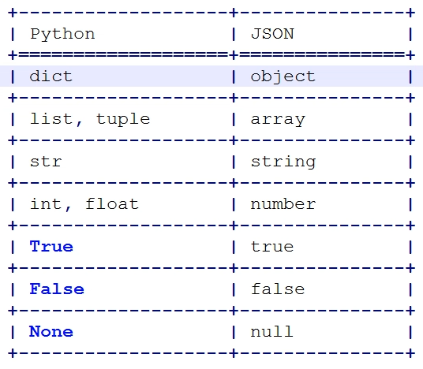
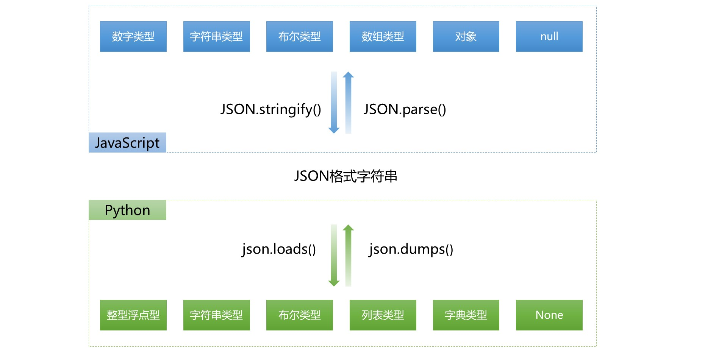

## JsonResponse

### json

json，JavaScript Object Notation，JS 对象标记，是一种通用性极强的轻量级数据交互格式。其基础数据格式与 Python 中的基本数据格式比较如下：



在 JSON 中，并不能表示所有的 Python 数据类型。比如，datetime 类型的数据就无法表示。我们可以通过重写 JSON 编码的方式，实现对时间的序列化：

```python
import json
from datetime import datetime
from datetime import date

# 对含有日期格式数据的 json 数据进行转换
class JsonCustomEncoder(json.JSONEncoder):
    def default(self, field):
        if isinstance(field, datetime):
            return field.strftime('%Y-%m-%d %H:%M:%S')
        elif isinstance(field, date):
            return field.strftime('%Y-%m-%d')
        else:
            return json.JSONEncoder.default(self, field)

d1 = datetime.now()
dd = json.dumps(d1, cls=JsonCustomEncoder)
print(dd)
```

在 JS 中，同样可以使用 json。JS 与 Python 间使用 json 进行数据交互的方式为：



### JsonResponse

如果使用 HttpResponse 返回数据，我们首先需要把字典或者列表类型的数据格式化为字符串，然后发送给前端。前端通过 js 代码，反序列化成为前端可以识别的自定义对象或者数组。当然，也可以指定 content type 为 json 类型，这样前端可以直接识别，少了前端的转换步骤。

不过不管怎样，我们都是需要两个步骤。如果这样的代码很多，还是会造成代码重复。这时，我们就可以使用到 JsonResopnse。

Django 封装了 JsonResoponse 类，将其配合 ajax 使用，可以实现传输诸如字典之类的数据：

```python
from django.http import JsonResponse
def data(request):
    if request.method == 'GET':
        d1 = {'name': 'chao', 'age': 18}
        # d1_str = json.dumps(d1)
        # return HttpResponse(d1_str, content_type='application/json')
        return JsonResponse(d1)  
    	# 干了上面两步，序列化以及加 content_type 响应头
        # 这样，ajax 在处理数据时会自动将 json 数据反序列化
        # return JsonResponse(d1, safe=False)
        # 如果要传输的数据不是字典，需要设置参数 safe=False
```

需要注意的是，如果 JsonResponse 的数据不是字典，需要加上 safe 参数，并将值设置为 False。

我们在 js 中可以直接接收并使用传递过来的数据，这个 res 就是反序列化之后的数据了，直接可以使用：

```js
success: function(res){
	console.log(res)
} 
```

