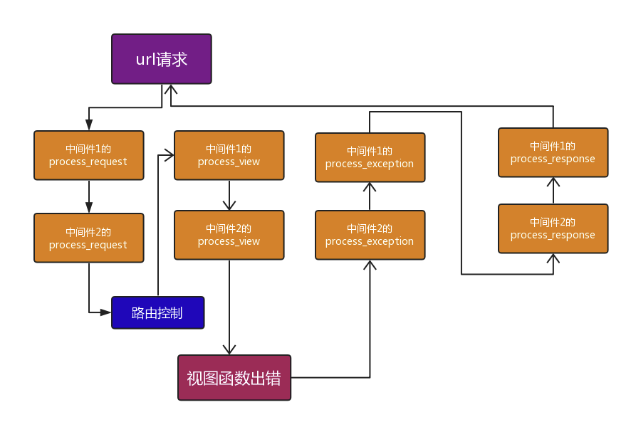

## Django 中间件和请求的生命周期

### 自定义中间件流程（以 process_request 方法为例）

1. 在应用下面创建一个文件夹，名字随便，比如 `mymiddleware`。在这个文件夹下创建一个 py 文件，名字也随便，比如叫做 `xx.py`。

2. 在 xx.py 文件中定义类，类方法用来处理请求，写法如下：

   ```python
   from django.shortcuts import redirect,HttpResponse,render
   from django.utils.deprecation import MiddlewareMixin    # 引入django这个类
   
   class Auth(MiddlewareMixin):    # 继承这个类
       # 白名单，认证白名单
       white_list = ['/login/',]
       # 想对请求进行统一的处理，那么就定义一个process_request方法
       def process_request(self,request):    
           # 如果方法返回值是None，那就通过了这个方法的认证或者处理，请求会继续处理下去。如果返回的值HttpResponse对象，那么请求到这里就结束了，直接返回给了浏览器。
           if request.path in self.white_list:
               pass
           else:
               is_login = request.session.get('is_login')
               if is_login == True:
                   pass    # 通过验证，继续执行逻辑
               else:
                   return HttpResponse('滚犊子!!')    # 验证未通过，直接返回给浏览器
   ```

3. 写完中间件是没有用的，我们需要在 `settings.py` 配置文件中写上这个类的路径，应用上中间件：

   ```python
   MIDDLEWARE = [
       'django.middleware.security.SecurityMiddleware',
       'django.contrib.sessions.middleware.SessionMiddleware',
       'django.middleware.common.CommonMiddleware',
       'django.middleware.csrf.CsrfViewMiddleware',
       'django.contrib.auth.middleware.AuthenticationMiddleware',
       'django.contrib.messages.middleware.MessageMiddleware',
       'django.middleware.clickjacking.XFrameOptionsMiddleware',
   
       'app01.mymiddleware.xx.Auth',    # 按照导包路径，应用中间件
   ]
   ```

### process_response 方法

用来处理

```python
def process_response(self,request,response):
    '''
    :param request:
    :param response:  就是视图的返回值(HttpResponse对象)
    :return:
    '''
    # print(response)
    return response
```

### process_view 以及中间件执行顺序检验

```python
from django.shortcuts import redirect,HttpResponse,render

# 引入django的模块
from django.utils.deprecation import MiddlewareMixin


class MD1(MiddlewareMixin):

    def process_request(self,request):

        print('MD1--process_request')

        return HttpResponse('xxxlpapsjdfoajsdfh')

    def process_response(self, request,response):
        print('MD1--process_response')
        return response

    def process_view(self, request, view_func, view_args, view_kwargs):
        print('MD1---',view_func.__name__)
		# view_func就是url对应那个views里面的视图函数,视图函数的参数view_args, view_kwargs

class MD2(MiddlewareMixin):

    def process_request(self, request):
        print('MD2--process_request')

    def process_response(self, request, response):
        print('MD2--process_response')
        return response
    def process_view(self, request, view_func, view_args, view_kwargs):
        print('MD2---',view_func.__name__)
```

### 中间件其他方法

我们已经学到了中间件的三个方法：process_request、process_respond 和 process_view：

- process_request 在路由分发之前被调用，用来处理请求的数据；
- process_respond 在wsgi响应之前进行一些处理；
- process_view 在路由分发之后，进入视图函数之前执行。

此外，中间件还有两个方法，process_exception 和 porcess_remplate_response：

- process_exception 是当视图出现异常时执行，如果没有出现异常则不执行；
- process_template_response 只对重写了响应对象中 render 方法的响应有作用。

其基本用法为：

```python
from django.shortcuts import redirect,HttpResponse,render
from django.utils.deprecation import MiddlewareMixin

class MD1(MiddlewareMixin):

    def process_request(self,request):
        print('MD1--process_request')
        
    def process_response(self, request,response):
        print('MD1--process_response')
        return response
        
    def process_view(self, request, view_func, view_args, view_kwargs):
        print('MD1---',view_func.__name__)

    # 视图有错误,执行中间件的process_exception方法,没错不执行
    def process_exception(self, request, exception):
        print('MD1:process_exception',exception)

    def process_template_response(self, request, response):
        print("MD1 中的process_template_response")
        return response


class MD2(MiddlewareMixin):

    def process_request(self, request):
        print('MD2--process_request')

    def process_response(self, request, response):
        print('MD2--process_response')
        return response
    def process_view(self, request, view_func, view_args, view_kwargs):
        print('MD2---',view_func.__name__)

    def process_exception(self, request, exception):
        print('MD2:process_exception',exception)

    def process_template_response(self, request, response):
        print("MD2 中的process_template_response")
        return response
```

重写响应对象中 render 方法的示例：

```python
def index(request):

    def render():
        print('index函数内部的render')
        return HttpResponse('xxxx')

    ret = HttpResponse('ok')
    ret.render = render
    return ret
```

中间件的执行顺序大致是这样的：


带有异常处理的中间件的执行流程：



### Django 请求的生命周期

Django 处理浏览器发出的请求过程如下图锁时：


更详细的 Django 请求流程图：

