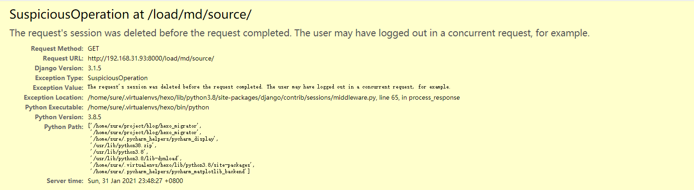

# 解决 Django 项目中启动多进程报错的问题

[toc]

## 问题概要

写 Django 项目时，因有一个请求涉及到很大的计算量，需要使用多进程来提高效率。涉及到的代码如下：

```python
from concurrent.futures import ProcessPoolExecutor

class OriginalFileHandler:
    def single_import_original(self, file_dict: dict, blog_gen_dir=settings.BLOG_GEN_DIR) -> None:
        """
        需要很多计算，涉及到了 Django 的 ORM 数据库操作
        """
        ...

    def bulk_import_original(self, file_detail_list: list, blog_gen_dir=settings.BLOG_GEN_DIR):
        """
        相当于执行很多次 single_import_original 方法，如果同步执行效率会很低，于是考虑使用多进程
        """
        size = 4
        with ProcessPoolExecutor(size) as executor:
            for file_dict in file_detail_list:
                executor.submit(self.single_import_original, file_dict, blog_gen_dir)
```

这完全就是普通的进程池写法，很基本，不太可能会出错。可是一访问页面上这个接口，却硬生生报了个错：



报的错英文很容易理解，会话意外中断。偶尔终端可以理解，可是一直终端就是代码的问题了。而且一旦我把进程池去掉，又可以正常访问了。

报错提示对改 bug 一点帮助都没有，这种问题是最难解决的。

## 问题的解决

遇到问题就上网搜，我找到了这篇博客，给我很大启示：https://blog.csdn.net/orangleliu/article/details/46919453

问题的原因很可能是子进程中会使用数据库，和主进程的数据库连接发生了冲突，从而导致连接中断。解决办法是，在启动子进程之前，关闭主进程的数据库连接。这样每个子进程会重新连接数据库，从而避免了冲突。

就是加上如下代码：

```python
db.close_old_connections()
```

完整代码就是：

```python
from concurrent.futures import ProcessPoolExecutor
from django import db

class OriginalFileHandler:
    def single_import_original(self, file_dict: dict, blog_gen_dir=settings.BLOG_GEN_DIR) -> None:
        """
        需要很多计算，涉及到了 Django 的 ORM 数据库操作
        """
        ...

    def bulk_import_original(self, file_detail_list: list, blog_gen_dir=settings.BLOG_GEN_DIR):
        """
        相当于执行很多次 single_import_original 方法，如果同步执行效率会很低，于是考虑使用多进程
        """
        size = 4
        db.close_old_connections()
        with ProcessPoolExecutor(size) as executor:
            for file_dict in file_detail_list:
                executor.submit(self.single_import_original, file_dict, blog_gen_dir)
```

页面就可以正常显示了。