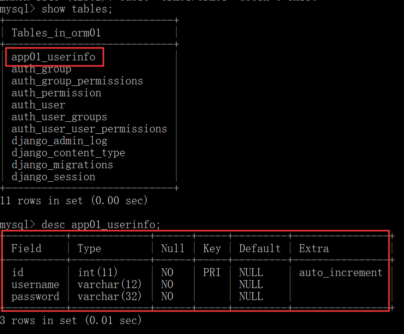

# Django 模型 model 数据库 ORM 单表操作

[TOC]

## ORM 的介绍和基本用法

 ORM，**o**bject **r**elational **m**apping，对象关系映射，是 Django 中调用和使用数据库的方法。ORM 封装了连接和操作数据库的 SQL 语句，我们可以通过熟悉的 Python 面向对象代码实现对数据库的操作，而不需要记住复杂的 SQL 语句。

ORM 极大地简化了我们操作数据库的代码，但同时，也会造成一定的效率影响。如何取舍，还是要看实际的应用需要。

使用：

1. 在应用文件夹下面的 `models.py` 文件中写数据表对应的类，看下面的示例：

   ```python
   class UserInfo(models.Model):
       id = models.AutoField(primary_key=True)  
       username = models.CharField(max_length=10)
       password = models.CharField(max_length=32)
   ```

2. 到 MySQL 数据库中创建一个库，比如名为 orm01：

   ```mysql
   create database orm01;
   ```

3. 做数据库配置，默认使用的数据库是轻量的 SQLite：

   ```python
   DATABASES = {
       'default': {
           'ENGINE': 'django.db.backends.sqlite3',
           'NAME': os.path.join(BASE_DIR, 'db.sqlite3'),
       }
   }
   ```

   若要使用 MySQL 数据库，我们需要在 `settings.py` 文件将数据库配置修改成以下格式：

   ```python
   #连接mysql的配置:	
   DATABASES = {
       'default': {
           'ENGINE': 'django.db.backends.mysql',
           'NAME':'orm01',
           'HOST':'127.0.0.1',
           'PORT':3306,
           'USER':'root',
           'PASSWORD':'123'
       }
   }
   ```

4. 在项目文件夹（项目目录）下的的 `__init__.py` 文件中写上以下内容，用来指定 `pymysql` 作为连接客户端。因为虽然本地已安装了pymyql 驱动，但 Django 连接 MySQL 时仍默认使用 MySQLdb 驱动，但 MySQLdb 并不支持 Python 3，所以需要手动在项目中进行配置。

   ```python
   import pymysql
   pymysql.install_as_MySQLdb()
   ```

5. 执行数据库同步指令，在终端中执行下面的代码：

   ```python
   python manage.py makemigrations  #在migrations文件夹下面生成记录文件
   python manage.py migrate         #执行记录文件
   ```

这样，数据表就创建好了。我们的表名默认是:  应用名_类名小写。

在终端中，通过数据库命令就能看到我们刚刚建好的表了。



ORM 字段与 MySQL 实际字段的对应关系：

```python
'AutoField': 'integer AUTO_INCREMENT',
'BigAutoField': 'bigint AUTO_INCREMENT',
'BinaryField': 'longblob',
'BooleanField': 'bool',
'CharField': 'varchar(%(max_length)s)',
'CommaSeparatedIntegerField': 'varchar(%(max_length)s)',
'DateField': 'date',
'DateTimeField': 'datetime',
'DecimalField': 'numeric(%(max_digits)s, %(decimal_places)s)',
'DurationField': 'bigint',
'FileField': 'varchar(%(max_length)s)',
'FilePathField': 'varchar(%(max_length)s)',
'FloatField': 'double precision',
'IntegerField': 'integer',
'BigIntegerField': 'bigint',
'IPAddressField': 'char(15)',
'GenericIPAddressField': 'char(39)',
'NullBooleanField': 'bool',
'OneToOneField': 'integer',
'PositiveIntegerField': 'integer UNSIGNED',
'PositiveSmallIntegerField': 'smallint UNSIGNED',
'SlugField': 'varchar(%(max_length)s)',
'SmallIntegerField': 'smallint',
'TextField': 'longtext',
'TimeField': 'time',
'UUIDField': 'char(32)',
```

### 指定新生成数据表的表名

有的时候，我们并不希望表名为系统默认的格式，这时，也可以通过声明表明的方式，告诉系统表名是什么：

```python
from django.db import models

# Create your models here.
class Student(models.Model):
    # 模型字段
    name = models.CharField(max_length=100,verbose_name="姓名")
    sex = models.BooleanField(default=1,verbose_name="性别")
    age = models.IntegerField(verbose_name="年龄")
    class_number = models.CharField(max_length=5,verbose_name="班级编号")
    description = models.TextField(max_length=1000,verbose_name="个性签名")

    class Meta:
        db_table="tb_student"    # 指定表名为tb_student
        verbose_name = "学生"
        verbose_name_plural = verbose_name
```

指定表名的另一个作用是，如果数据库中有这个表，且各个字段符合要求，则不需要进行数据库迁移也可以使用这个表。

## 表中数据的增删改查

### 增加（创建）

#### 通过模型类保存创建

```python
obj = models.UserInfo(
    username='alex',
    password='sb'
)
obj.save()
```

#### 通过 create 方法创建（常用）

create 方法的返回值就是你创建的这个记录的 model 对象

```python
models.UserInfo.objects.create(
    username='一峰',
    password='666'
)
```

### 修改（更新）

#### 通过 update 方法修改（常用）

首先要找到要修改的数据的模型对象，然后调用 update 方法进行修改。update 只能是 querset 类型才能调用，model 对象不能直接调用更新方法，所以使用 get 方法获取对象的时候是不能 update 的。

```python
models.UserInfo.objects.filter(id=1).update(
    username='alexxx',
    password='bigsb',
)
```

#### 通过模型对象保存修改（DRF 中会用到）

若得到的数据是模型对象，可以通过这种，修改模型对象后保存的方式现象数据的更新修改。

```python
obj = models.UserInfo.objects.filter(id=1)[0]
obj.username = 'alex222'
obj.password = '11111'
obj.save()
```

### 批量创建

```python
list_obj = []
for i in range(10):
    obj = models.UserInfo(
        username='xx%s'%i,
        password='66%s'%i,
    )
	list_obj.append(obj)
print(list_obj)
models.UserInfo.objects.bulk_create(list_obj)
```

### update_or_create 有就更新，没有就创建

需要注意的是，查找到的数据只能是没有或者只有一条。如果满足条件的数据不止一条，会报错。

```python
a,b = models.UserInfo.objects.update_or_create(
    username='alex',
    defaults={
        'id':20,
        'password':'ooooo',
        'age':84,
    }
)
print(a)  # 当前更新后的model对象,或者是你新增的记录的model对象
print(b)  # 新增就是True,查询就False
```

### 删除

`delete()` 方法的调用者可以是一个 model 对象，也可以是一个 queryset 集合。

```python
models.UserInfo.objects.filter(id=1).delete()
```

### 查询

#### 简单查询示例

```python
ret = models.UserInfo.objects.filter(id=1)
print(ret) #<QuerySet [<UserInfo: UserInfo object>]> -- []
obj = ret[0]
print(obj.id,obj.username)
```

#### 比较查询

可以通过双下划线 `__` 加上命令，进行简单的比较查询，比如判断值是否为空，是否大于或小于某个数值：

```python
article_list = Article.objects.filter(pub_date__isnull=False, pub_date__lte=datetime.now())
```

这样的方法常用的有：

```
isnull    # 字段为空
lt        # 小于
lte       # 小于等于
gt        # 大于
gte       # 大于等于
in        # 在里面
```

#### 查询方法

一共有13个方法，必知必会。

##### `all()`

查询所有结果，结果是 queryset 类型

```python
ret = models.UserInfo.objects.all()
```

##### `filter(**kwargs)`

它包含了与所给筛选条件相匹配的对象，结果也是 queryset 类型：

```python
Book.objects.filter(title='linux',price=100)
```

里面的多个条件用逗号分开，并且这几个条件必须都成立，是and的关系，or关系的我们后面再学，直接在这里写是搞不定 or 的。

除了直接使用 objects 对象外，还可以使用 queryest 使用 filter 方法：

```python
ret = models.UserInfo.objects.all().filter() 
```

##### get(**kwargs)

返回与所给筛选条件相匹配的对象，不是 queryset 类型，是行记录对象，返回结果**有且只有**一个，如果符合筛选条件的对象超过一个或者没有都会抛出错误。捕获异常 try。

```python
Book.objects.get(id=1)
```

##### filter 和 get 比较

```python
ret = models.UserInfo.objects.get(age=18)
ret = models.UserInfo.objects.filter(age=180)
```

- get 只能获取一条数据。如果超找不到数据或者查找到两条数据会报错，get 请求返回的结果就是那个 model 对象而不是查询结果集：

```python
# 1 UserInfo matching query does not exist. 啥也没查到
# 2 get() returned more than one UserInfo -- it returned 11!  结果多了,不行! 
```

- fitler 不会报错，返回结果是一个 queryset 类型的集合，称为结果集，里面是一个一个的 model 对象

##### `exclude(**kwargs)`

排除的意思，它包含了与所给筛选条件不匹配的对象，没有不等于的操作昂，用这个 exclude，返回值是 queryset 类型。

```python
Book.objects.exclude(id=6)
```

返回 id 不等于 6 的所有的对象。

exclude 也可以在 queryset 基础上调用

```python
Book.objects.all().exclude(id=6)
```

##### `order_by(field)`

queryset 类型的数据来调用，对查询结果排序，默认是按照 id 来升序排列的，返回值还是 queryset 类型：

```python
models.Book.objects.all().order_by('price','id')
```

直接写 price，默认是按照 price 升序排列。若想要按照字段降序排列，就写个负号就行了，也就是 `order_by('-price')`。`order_by('price','id')` 是多条件排序，按照 price 进行升序，price 相同的数据，按照 id 进行升序

##### `reverse()`

queryset 类型的数据来调用，对查询结果反向排序，返回值还是 queryset 类型

##### `count()`

queryset 类型的数据来调用，返回数据库中匹配查询（QuerySet）的对象数量。

```python
ret = models.UserInfo.objects.all().count()
```

##### `first()`

queryset 类型的数据来调用，返回第一条记录

```python
Book.objects.all()[0] = Book.objects.all().first()
```

得到的都是 model 对象，不是 queryset

##### `last()`

queryset 类型的数据来调用，返回最后一条记录，使用方法与 `first` 相同。

##### `exists()`

queryset 类型的数据来调用，如果 QuerySet 包含数据，就返回 True，否则返回 False。

空的 queryset 类型数据也有布尔值 True 和 False，但是有时候不适合直接用它来判断数据库里面是不是有数据。如果有大量的数据，你用它来判断，那么就需要查询出所有的数据，效率太差了。用 count 或者 exits，比如：

```python
all_books = models.Book.objects.all().exists()
```

翻译成的 SQL 语句是：

```MySQL
SELECT (1) AS a FROM app01_book LIMIT 1
```

就是通过 limit 1，取一条来看看是不是有数据，效率就高了很多。

##### `values(*field)`

用的比较多。queryset 类型的数据来调用，返回一个 ValueQuerySet——一个特殊的 QuerySet。运行后得到的并不是一系列 model 的实例化对象，而是一个可迭代的字典序列。只要是返回的 queryset 类型，就可以继续链式调用 queryset 类型的其他的查找方法，其他方法也是一样的。

queryset 调用：

```python
ret = models.UserInfo.objects.all().values('age','username')
```

objects 调用 -- 对所有数据进行取值：

```python
ret = models.UserInfo.objects.values('age','username')
```

##### `values_list(*field)`

它与 `values()` 非常相似，它返回的是一个元组序列，values 返回的是一个字典序列

##### `distinct()`

values 和 values_list 得到的 queryset 类型的数据来调用，从返回结果中剔除重复纪录

```python
ret = models.UserInfo.objects.all().values('age','username').distinct()
ret = models.UserInfo.objects.values('age','username').distinct()
```

## MRO 创建时间的格式

创建时,日期字段数据的添加方式

```python
models.Book.objects.create(
    publish_date = "2019-08-01",    # 字符串
    # publish_date = datetime.datetime.now(), 时间日期数据
)
```

## update 和 delete

update 更新数据时，只能使用 queryset 类型数据：

```python
models.Book.objects.filter(id=2).update(username='xxx')  #update的调用者是queryset类型数据
```

delete 删除数据时，可以使用 queryset 类型数据，也可以直接使用数据对象：

```python
models.Book.objects.filter(id=2).delete()
models.Book.objects.get(id=2).delete()
```

## 练习

1. 查询某某出版社出版过的价格大于 200 的书籍
2. 查询 2017 年 8 月出版的所有以 py 开头的书籍名称
3. 查询价格为 50，100 或者 150 的所有书籍名称及其出版社名称
4. 查询价格在 100 到 200 之间的所有书籍名称及其价格
5. 查询所有人民出版社出版的书籍的价格（从高到低排序，去重）