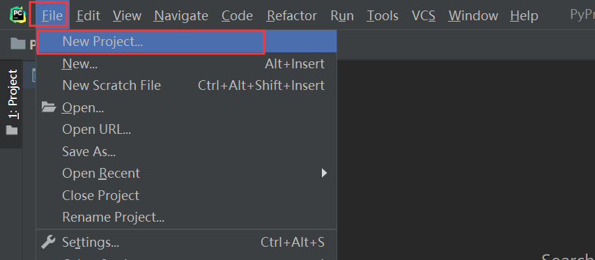
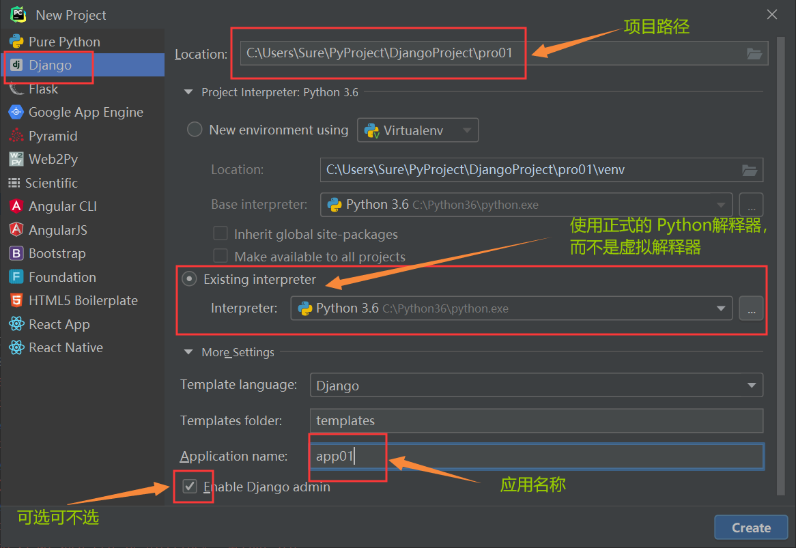

## Django 初识

### wsgi

wsgi，web service gateway interface，网络服务网关接口，是应用程序和服务器程序之间沟通数据的格式要求

返回动态页面可以通过模板渲染的方式，可以用到 Python 中的 `jinja2` 模块。

模板渲染的含义：

- 模板 -- HTML 文件
- 渲染 -- 字符串替换

### MVC和MTV模式

MVC 模式：所谓 MVC 就是把 Web 应用分为模型（M）、控制器（C）和视图（V）

MTV：

- M：model 数据库相关操作
- T：template 模板（html）相关操作
- V：views 视图（业务逻辑，函数或类）

+ +：urls（url 控制器）

### Django 项目的创建

#### 指令创建项目

下载安装（1.11.9 指代的是 Django 版本，可按需指定）

```bash
pip install django==1.11.9 -i https://pypi.douban.com/simple
```

创建项目（找到一个文件夹，切换到这个文件夹下执行下面的指令）

```bash
django-admin startproject 项目名称
```

创建应用，使用 cd 命令切换到项目所在的文件夹，使用 Python 运行 `manage.py` 中的 startapp 方法

```bash
python manage.py startapp 应用名称
```

在和项目同名的那个文件夹里面的 `settings.py` 配置文件中找到下面的配置：

```python
INSTALLED_APPS = [
    'django.contrib.admin',
    'django.contrib.auth',
    'django.contrib.contenttypes',
    'django.contrib.sessions',
    'django.contrib.messages',
    'django.contrib.staticfiles',

	'app01',  #加上咱们项目文件夹下面的这个应用名称,将项目和应用关联到一起
]
```

启动项目：

```python
python manage.py runserver 127.0.0.1:8001
#如果端口不写,默认是8000
#如果ip地址和端口号都不写,默认是127.0.0.1:8000
```

#### PyCharm 创建 Django 项目的流程

首先，点击 File，选择 New Project...



指定要项目路径。暂时不需要使用 Python 虚拟环境，选择正式的解释器即可。Django admin 暂时也用不上。通过 Django 创建项目可以顺便创建一个应用，而且 Django 回直接帮我们把应用在 settings.py 中注册好。



#### 项目目录文件介绍

项目文件夹中的文件：

- `manage.py` ----- Django 项目的管理工具，通过它可以调用 django shell 和数据库，启动关闭项目与项目交互等。不管你将框架分了几个文件，必然有一个启动文件，其实他们本身就是一个文件。
- `settings.py` ---- 包含了项目的默认设置，包括数据库信息，调试标志以及其他一些工作的变量。
- `urls.py` ----- 负责把 URL 模式映射到应用程序。
- `wsgi.py` ---- runserver 命令就使用 wsgiref 模块做简单的 web server，后面会看到renserver命令。所有与 socket 相关的内容都在这个文件里面了，目前不需要关注它。

### 视图函数

#### request 对象

```python
request.path  #request.path当前请求路径
request.method #当前请求方法(get,post...)

request.GET # 获取所有get请求携带过来的数据
request.POST # 获取所有post请求携带过来的数据
request.body # 获取所有post请求携带过来的数据的原始格式
```

验证post请求时，记得改一下配置，在settings配置文件中

```python
MIDDLEWARE = [
    'django.middleware.security.SecurityMiddleware',
    'django.contrib.sessions.middleware.SessionMiddleware',
    'django.middleware.common.CommonMiddleware',
    # 'django.middleware.csrf.CsrfViewMiddleware',
    'django.contrib.auth.middleware.AuthenticationMiddleware',
    'django.contrib.messages.middleware.MessageMiddleware',
    'django.middleware.clickjacking.XFrameOptionsMiddleware',
]
```

### 响应方法

```python
# render回复html页面
# HttpResponse 回复字符串
```
