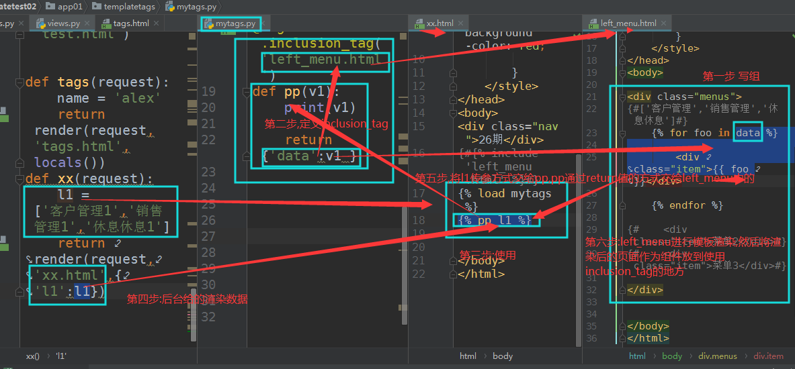

## Django 模板 template

### settings 配置

```python
TEMPLATES = [
    {
        'BACKEND': 'django.template.backends.django.DjangoTemplates',
        'DIRS': [os.path.join(BASE_DIR, 'templates')]  #别忘了配置这个路径
        ,
        'APP_DIRS': True,
        'OPTIONS': {
            'context_processors': [
                'django.template.context_processors.debug',
                'django.template.context_processors.request',
                'django.contrib.auth.context_processors.auth',
                'django.contrib.messages.context_processors.messages',
            ],
        },
    },
]
```

### 模板语法

```html
{{ 变量 }}  
```

### 万能的句点号 `.`

```html
<h1>{{ num }}</h1>
<h1>{{ s }}</h1>
<h1>{{ l1.1 }}</h1>
<h1>{{ d1.number }}</h1>
<h1>{{ a.yue }}</h1>  <!-- 注意，调用方法时不能加括号，所以如果方法带参数就没法用了 -->
<h1>{{ a.xx }}</h1>
```

`views.py` 的写法

```python
def home(request):

    num = 100
    s = 'hello my girl I love you'
    l1 = [11,22,33]
    d1 = {'name':'冠希哥','number':1000}
    class A:
        balance = 2000
        def __init__(self):
            self.xx = 'oo'
        def yue(self):
            return 'how much!'
    a = A()
    # render({'xx':'oo'})
    return render(request,'home.html',{'num':num,'s':s,'l1':l1,'d1':d1,'a':a})
```

### 过滤器

过滤器用法：

```jinja2
{{ 变量|过滤器名称:'参数' }}
```

不是所有过滤器都有参数，没参数的话写法：

```jinja2
{{ 变量|过滤器名称 }}
```

#### 内置过滤器

```html
<h1>{{ s|truncatechars:n }}</h1> # 过滤器里面的参数都可以写后端返回的变量

default -- <h1>{{ xx|default:'抱歉,没有数据!!' }}</h1> # 默认值
length  -- <h1>{{ l1|length }}</h1>  # 获取变量数据长度
filesizeformat -- <h2>{{ file_size|filesizeformat }}</h2> # 大小按照人类可读的显示
slice -- <h2>{{ s|slice:'0:7' }}</h2> #切片 顾头不顾腚
date -- <h3>{{ now|date:'Y-m-d H:i:s' }}</h3>  # 日期格式化显示
safe -- <h1>{{ a_tag|safe }}</h1> # 数据：a_tag = "<a href='http://www.baidu.com'>百度</a>"
truncatechars -- <h1>{{ s|truncatechars:'6' }}</h1>   # 如果字符串字符多于指定的字符数量，那么会被截断。可用来截取长文本为一行。
join -- <h1>{{ l1|join:'+' }}</h1>    # 将数组拼接成字符串
```

##### safe 介绍

Django 的模板中在进行模板渲染的时候会对 HTML 标签和 JS 等语法标签进行自动转义。原因显而易见，这样是为了安全。Django 担心这是用户添加的数据，比如如果有人给你评论的时候写了一段 js 代码。这个评论一提交，js 代码就执行啦。这样你是不是可以搞一些坏事儿了，写个弹窗的死循环，那浏览器还能用吗，是不是会一直弹窗啊。这叫做 xss 攻击。所以浏览器不让你这么搞，给你转义了。但是有的时候我们可能不希望这些 HTML 元素被转义，比如我们做一个内容管理系统，后台添加的文章中是经过修饰的，这些修饰可能是通过一个类似于 FCKeditor 编辑加注了 HTML 修饰符的文本，如果自动转义的话显示的就是保护 HTML 标签的源文件。为了在 Django 中关闭 HTML 的自动转义有两种方式，如果是一个单独的变量我们可以通过过滤器 `|safe` 的方式告诉 Django 这段代码是安全的不必转义。

### 标签

#### for 循环标签

示例：

```jinja2
<ul>
      # 循环列表
        <li>{{ i }}</li>
    
</ul>

<ul>
      # 翻转循环列表时
        <li>{{ i }}</li>
    
</ul>

<ol>
      # 循环字典的键
        <li>{{ key }}</li>

    
     # 循环字典的值
        <li>{{ key }}</li>

    
     # 循环字典的键值对
{#        {{ forloop.counter }}#}
        <li>{{ forloop.last }}>>>>{{ key }}---{{ value }}</li>
        
            {{ forloop.parentloop.counter }}---{{ forloop.counter }}<a href="">{{ foo }}</a>

        

    

</ol>
```

forloop 计数

```
forloop.counter            当前循环的索引值(从1开始)，forloop是循环器，通过点来使用功能
forloop.counter0           当前循环的索引值（从0开始）
forloop.revcounter         当前循环的倒序索引值（从1开始）
forloop.revcounter0        当前循环的倒序索引值（从0开始）
forloop.first              当前循环是不是第一次循环（布尔值）
forloop.last               当前循环是不是最后一次循环（布尔值）
forloop.parentloop         本层循环的外层循环的对象，再通过上面的几个属性来显示外层循环的计数等
```

empty 判断迭代对象是否为空

```jinja2
 #当没有数据时,会生成empty的内容
	<li>{{ i }}</li>

	<p>啥数据也没有!</p>

```

#### if 标签

if 语句支持 `and`、`or`、`==`、`>`、`<`、`!=`、`<=`、`>=`、`in`、`not in`、`is`、`is not`判断，注意条件两边都有空格。

##### 单条件判断

```jinja2

    <a href="">详细些</a>

    <p>hahahhahah</p>

```

##### 多条件判断

```jinja2

	<p>无效</p>  <!--不满足条件，不会生成这个标签-->

	<p>优秀</p>
  <!--也是在if标签结构里面的-->
	<p>凑活吧</p>

```

##### 结合过滤来使用

```jinja2
  <!--结合过滤器来使用-->
七座豪华SUV

黄包车

```

#### with 标签

```jinja2
<h1>
      # 给长的数据调用起名字,只能在with标签内部使用
        {{ sb }}  
        <a href="">{{ sb }}</a>
    
{#    {{ l2.1.name }}#}
</h1>


    {{ total }} <!--只能在with语句体内用-->

```

需要注意的是，要记得使用 endwith 标签闭合 with 标签，而且别名只在一对闭合的 with 标签中起作用。

#### csrf_token 通过 csrf 认证机制

当使用 Django 框架以 post 方式提交表单的时候，会报错。还记得我们在 settings 里面的中间件配置里面把一个 csrf 的防御机制给注销了。但我们真正该做的不是注销它，而是应该学会怎么使用它，并且不让自己的操作被 forbiden。通过 csrf_token 标签就能搞定。

这个标签用于防止跨站请求伪造（Cross-site request forgery，csrf）。

在页面的 form 表单里面（注意是在 form 表单里面）任何位置写上

```jinja2

```

这个东西模板渲染的时候替换成了隐藏的 `<input type="hidden" name="csrfmiddlewaretoken" value="8J4z1wiUEXt0gJSN59dLMnktrXFW0hv7m4d40Mtl37D7vJZfrxLir9L3jSTDjtG8">` 标签。这个标签的值是个随机字符串。提交表单的时候，这个东西也被提交了。因为这个东西是后端渲染的时候给页面加上的，那么当你通过我给你的 form 表单提交数据的时候，你带着这个内容我就认识你，不带着，我就禁止你。因为后台我们 django 也存着这个东西，和你这个值相同的一个值，可以做对应验证是不是我给你的 token。

存储这个值的东西我们后面再学，你先知道一下就行了，就像一个我们后台给这个用户的一个通行证，如果你用户没有按照我给你的这个正常的页面来 post 提交表单数据，或者说你没有先去请求我这个登陆页面，而是直接模拟请求来提交数据，那么我就能知道，你这个请求是非法的，反爬虫或者恶意攻击我的网站，以后将中间件的时候我们在细说这个东西，但是现在你要明白怎么回事，明白为什么 Django 会加这一套防御。

##### post 爬虫

```python
import requests

ret = requests.post('http://127.0.0.1:8000/login/', data={
    'uname':'chao',
    'pwd':'123',
})
print(ret.content.decode('utf-8'))
```

### 模板继承

Django 模版引擎中最强大也是最复杂的部分就是模版继承了。模版继承可以让您创建一个基本的“骨架”模版，它包含您站点中的全部元素，并且可以定义能够被子模版覆盖的 blocks 。

定义模板：

```html
<!DOCTYPE html>
<html lang="en">
<head>
    <link rel="stylesheet" href="style.css" />
    <title>My amazing site</title>
</head>

<body>
    <div id="sidebar">
        
        <ul>
            <li><a href="/">Home</a></li>
            <li><a href="/blog/">Blog</a></li>
        </ul>
        
    </div>

    <div id="content">
        
    </div>
</body>
</html>
```

这个模版，我们把它叫作 `base.html`， 它定义了一个可以用于两列排版页面的简单 HTML 骨架。“子模版”的工作是用它们的内容填充空的 blocks。

在这个例子中， block 标签定义了三个可以被子模版内容填充的 block。 block 告诉模版引擎： 子模版可能会覆盖掉模版中的这些位置。

子模版可能看起来是这样的：

```jinja2

 
My amazing blog
 


    <h2>{{ entry.title }}</h2>
    <p>{{ entry.body }}</p>


```

extends 标签是这里的关键。它告诉模版引擎，这个模版“继承”了另一个模版。当模版系统处理这个模版时，首先，它将定位父模版——在此例中，就是 `base.html`。

那时，模版引擎将注意到 `base.html` 中的三个 block 标签，并用子模版中的内容来替换这些 block。

#### block.super

```jinja2

    {{ block.super }} # 将模板中的content这个名称的块中的内容拿过来
    菜单1的内容

```

为了更好的可读性，你也可以给你的 endblock 标签一个 *名字* 。例如：

```jinja2

...
　　
```

### 组件

1. 写好一个组件 `.html` 文件
2. 在使用这个组件的 `html` 文件中写上下面的内容

```jinja2

```

### 自定义标签和过滤器

1. 在app应用文件夹中创建 `templatetags` 文件夹，模块名只能是 `templatetags`

2. 创建任意 .py 文件，如：`my_tags.py`

3. 文件中写上以下内容，自定义过滤器（参数最多两个）

   ```python
   from django import template
   register = template.Library()  #register变量名称必须是它
   @register.filter  
   def oo(v1,v2):
       print(v1)
       return v2 + v1 + 'oo'
   ```

4. 使用，在 html 文件中写上下面的代码

   ```jinja2
   
   <h1>{{ name|oo:'xxxx' }}</h1>
   ```

5. 自定义标签，流程和上面一样，但是装饰器变了，使用也不同

   ```python
   @register.simple_tag
   def ootag(v1,v2,v3):  #参数没有限制
       print(v1,v2,v3)
       return v1 + 'ootag!!' + v2 + v3
   ```

6. 自定义标签的用法

   ```
   
   <h1></h1>
   ```

7. inclusion_tag，组件标签，详见图解:

   

### 静态文件配置

在项目中，js、css、jgp 图片等等都称为静态文件。
在 django 中的使用：

1. 配置。在 `settings` 配置文件中写上以下配置：

   ```python
   STATIC_URL = '/static/' #127.0.0.1:8000/static/bootstrap/css.
   
   STATICFILES_DIRS = [
       os.path.join(BASE_DIR,'jingtaiwenjianjia'),    # 文件夹名称尽量不要和别名的名称冲突
   ]
   ```

2. `html` 文件中使用：

   ```html
   <link rel="stylesheet" href="/static/bootstrap-3.3.7-dist/css/bootstrap.min.css">
   ```

   相对路径引入静态文件时，前置斜杠必须加上。不管是什么，a标签也是一样，相对路径访问必须加上前面的斜杠。

除此之外，我们还可以在项目的子应用中创建一个名为 static 的文件夹，将静态文件放到里面。这时，不必再 `settings.py` 中进行任何配置。相较于上面的方式，这种方法更为常用。因为通过这种方式导入静态文件，PyCharm 会有操作提示。

使用时，在 html 页面的最顶端，声明要加载静态文件：

```jinja2

```

在标签中，可以直接使用 static 方法找到我们的静态文件：

```html
<link rel="stylesheet" href="">
```

在 html 文件中的写法就是：

```html

<!DOCTYPE html>
<html lang="en">
<head>
    <meta charset="UTF-8">
    <title>Title</title>
    <link rel="stylesheet" href="">
</head>
<body>

</body>
<script src=""></script>
<script src=""></script>
</html>
```