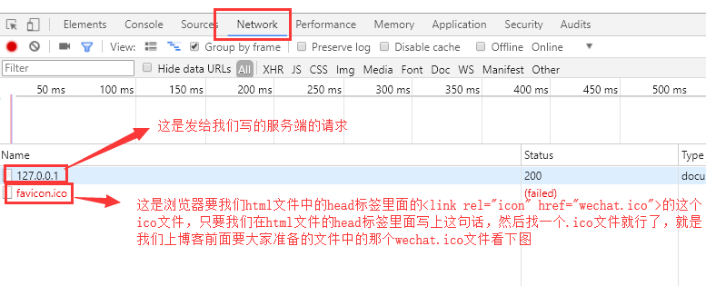
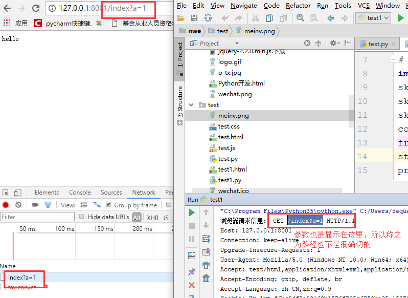
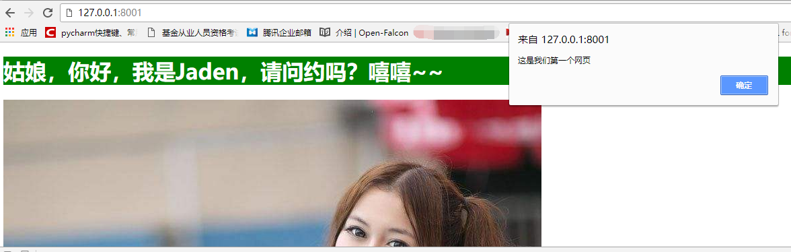
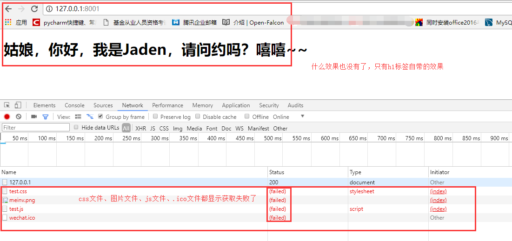

## 动手搭建 Web 框架深入了解 Web 框架的本质

### Web 框架的本质及自定义 Web 框架

我们可以这样理解：所有的 Web 应用本质上就是一个 socket 服务端，而用户的浏览器就是一个 socket 客户端，基于请求做出响应。客户都先请求，服务端做出对应的响应，按照 HTTP 协议的请求协议发送请求，服务端按照 HTTP 协议的响应协议来响应请求。依据这样的原理进行网络通信，我们就可以实现自己的 Web 框架了。

通过对 socket 的学习，我们已经知道如何网络通信，我们完全可以自己写了。因为 socket 就是做网络通信用的。下面我们就基于 socket 来自己实现一个 Web 框架。写一个 Web 服务端，让浏览器来请求，并通过自己的服务端把页面返回给浏览器，浏览器渲染出我们想要的效果。在后面的学习中，大家提前准备一些文件：

HTML 文件内容如下，名称为 `test.html`：　　

```html
<!DOCTYPE html>
<html lang="en">
<head>
    <meta charset="UTF-8">
    <title>Title</title>
    <link rel="stylesheet" href="test.css">
    <link rel="icon" href="wechat.ico"> 
    <!--直接写在html页面里面的css样式是直接可以在浏览器上显示的-->
    <!--<style>-->
        <!--h1{-->
            <!--background-color: green;-->
            <!--color: white;-->
        <!--}-->
    <!--</style>-->
</head>
<body>

<h1>姑娘，你好，我是Jaden，请问约吗？嘻嘻~~</h1>
<!--直接写在html页面里面的img标签的src属性值如果是别人网站的地址（网络地址）是直接可以在浏览器上显示的-->
<!----> <!--如果都是网络地址，那么只要你的电脑有网，就可以看到，不需要自己在后端写对应的读取文件，返回图片文件信息的代码，因为别人的网站已经做了这个事情了-->
 <!--如果你是本地的图片想要返回给页面，你需要对页面上的关于这个图片的请求要自己做出响应，这个src就是来你本地请求这个图片，你只要将图片信息读取出来，返回给页面，页面拿到这个图片的数据，就能够渲染出来了，是不是很简单-->

<!--直接写在html页面里面的js操作是直接可以在浏览器上显示的-->
<!--<script>-->
    <!--alert('这是我们第一个网页')-->
<!--</script>-->

<script src="test.js"></script>
</body>
</html>
```

css文件内容如下，名称为`test.css`：

```css
h1{
    background-color: green;
    color: white;
}
```

js文件内容如下，名称为`test.js` ：

```js
alert('这是我们第一个网页');
```

再准备一个图片，名称为 `meinv.jpg`，再准备一个 ico 文件，名称为 `wechat.ico`，其实就是个图片文件，微信官网打开之后，在浏览器最上面能够看到，把它保存下来

上面的文件都准备好之后，你用 PyCharm 新建一个项目，把文件都放到一个文件夹里面去，留着备用，像下面这个样子：


 

 

然后开始写我们的 Web 框架，我们分这么几步来写：

#### 一、简单的 Web 框架

创建一个 Python 文件，内容如下，名称为 `test.py`：

```python
import socket
sk = socket.socket()
sk.bind(('127.0.0.1',8001))
sk.listen()
conn,addr = sk.accept()
from_b_msg = conn.recv(1024)
str_msg = from_b_msg.decode('utf-8')
#socket是应用层和传输层之间的抽象层，每次都有协议，协议就是消息格式，那么传输层的消息格式我们不用管，因为socket帮我们搞定了，但是应用层的协议还是需要咱们自己遵守的，所以再给浏览器发送消息的时候，如果没有按照应用层的消息格式来写，那么你返回给浏览器的信息，浏览器是没法识别的。而应用层的协议就是我们的HTTP协议，所以我们按照HTTP协议规定的消息格式来给浏览器返回消息就没有问题了，关于HTTP我们会细说，首先看一下直接写conn.send(b'hello')的效果，然后运行代码，通过浏览器来访问一下，然后再看这一句conn.send(b'HTTP/1.1 200 ok \r\n\r\nhello')的效果
#下面这句就是按照http协议来写的
# conn.send(b'HTTP/1.1 200 ok \r\n\r\nhello')
#上面这句还可以分成下面两句来写
conn.send(b'HTTP/1.1 200 ok \r\n\r\n')
conn.send(b'hello')
```

我们来浏览器上看一下浏览器发送的请求：



目前我们还没有写如何返回一个 HTML 文件给浏览器，所以这里暂时不用管它。那么我们点开这个 `127.0.0.1` 看看：


我们在 Python 文件中打印一下浏览器发送过来的请求信息是啥：


重启我们的代码，然后在网址中输入这个：


再重启我们的代码，然后在网址中输入这个：




浏览器发过来一堆的消息，我们给浏览器回复（响应）信息的时候，也要按照一个消息格式来写，这些都是 HTTP 协议规定的。要了解 HTTP 协议的更多内容，可以参考 [HTTP 协议](django-http.md)。

#### 二、返回 HTML 文件的 Web 框架

我们刚刚写过一个名称为 `test.html` 的 HTML 文件，先把 CSS、JS 和图片相关的注释取消掉，让它们可以直接显示：

```html
<!DOCTYPE html>
<html lang="en">
<head>
    <meta charset="UTF-8">
    <title>Title</title><link rel="stylesheet" href="test.css">

    <!--直接写在html页面里面的css样式是直接可以在浏览器上显示的-->
    <style>
        h1{
            background-color: green;
            color: white;
        }
    </style>
</head>
<body>

<h1>姑娘，你好，我是Jaden，请问约吗？嘻嘻~~</h1>
<!--直接写在html页面里面的img标签的src属性值如果是别人网站的地址（网络地址）是直接可以在浏览器上显示的-->
 
<!--如果都是网络地址，那么只要你的电脑有网，就可以看到，不需要自己在后端写对应的读取文件，返回图片文件信息的代码，因为别人的网站就做了这个事情了-->

<!--直接写在html页面里面的js操作是直接可以在浏览器上显示的-->
<script>
    alert('这是我们第一个网页')
</script>

</body>
</html>
```

准备我们的 Python 代码，服务端程序，文件内容如下，文件名称为 `test.py`：　　　　　　　

```python
import socket
sk = socket.socket()
sk.bind(('127.0.0.1',8001))
sk.listen()
conn,addr = sk.accept()
from_b_msg = conn.recv(1024)
str_msg = from_b_msg.decode('utf-8')
print('浏览器请求信息：',str_msg)

# conn.send(b'HTTP/1.1 200 ok \r\ncontent-type:text/html;charset=utf-8;\r\n') 
conn.send(b'HTTP/1.1 200 ok \r\n\r\n')

with open('test1.html','rb') as f:
    f_data = f.read()
# 将HTML页面返回
conn.send(f_data)
```

页面上输入网址看效果，css 和 js 代码的效果也有，very good：



但是我们知道，我们的 css 和 js 基本都是写在本地的文件里面的啊，而且我们的图片基本也是我们自己本地的啊。怎么办？我们将上面我们提前准备好的 js 和 css 还有那个 `.ico` 结尾的图片文件都准备好，来我们在来一个升级版的 Web 框架。其实 css、js、图片等文件都叫做网站的静态文件。

首先我们先看一个效果，如果我们直接将我们写好的 css 和 js 还有 `.ico` 和图片文件插入到我们的 HTML 页面里面，就是下面这个 HTML 文件。

名称为 `test.html`，内容如下：　　　　

```html
<!DOCTYPE html>
<html lang="en">
<head>
    <meta charset="UTF-8">
    <title>Title</title>
    <link rel="stylesheet" href="test.css">
    <!--加上下面这句，那么我们看浏览器调试窗口中的那个network里面就没有那个favicon.ico的请求了，其实这就是页面title标签文字左边的那个页面图标,但是这个文件是我们自己本地的，所以我们需要在后端代码里面将这个文件数据读取出来返回给前端-->
    <link rel="icon" href="wechat.ico">
    <!--直接写在html页面里面的css样式是直接可以在浏览器上显示的-->
    <!--<style>-->
        <!--h1{-->
            <!--background-color: green;-->
            <!--color: white;-->
        <!--}-->
    <!--</style>-->
</head>
<body>

<h1>姑娘，你好，我是Jaden，请问约吗？嘻嘻~~</h1>
<!--直接写在html页面里面的img标签的src属性值如果是别人网站的地址（网络地址）是直接可以在浏览器上显示的-->
<!----> <!--如果都是网络地址，那么只要你的电脑有网，就可以看到，不需要自己在后端写对应的读取文件，返回图片文件信息的代码，因为别人的网站就做了这个事情了-->
 <!--如果你是本地的图片想要返回给页面，你需要对页面上的关于这个图片的请求要自己做出响应，这个src就是来你本地请求这个图片，你只要将图片信息读取出来，返回给页面，页面拿到这个图片的数据，就能够渲染出来了，是不是很简单-->

<!--直接写在html页面里面的js操作是直接可以在浏览器上显示的-->
<!--<script>-->
    <!--alert('这是我们第一个网页')-->
<!--</script>-->

<script src="test.js"></script>
</body>
</html>
```

同样使用我们之前的 Python 程序，来看效果：


发现 js 和 css 的效果都没有出来，并且我们看一下浏览器调试窗口的那个 network：



在下来我们在 network 里面点击那个 `test.css` 文件，看看请求是什么：


还有就是当我们直接在浏览器上保存某个页面的时候，随便一个页面，我们到页面上点击右键另存为，然后存到本地的一个目录下，你会发现这个页面的 html、css、js、图片等文件都跟着保存下来了，我保存了一下博客园首页的页面，看，是一个文件夹和一个 HTML 文件：


 

我们点开博客园那个文件夹看看里面都有什么：


发现 js、css 还有图片什么的都被保存了下来。这说明什么？说明这些文件本身就存在浏览器上了。哦，原来就是将 HTML 页面需要的 css、js、图片等文件也发送给浏览器就可以了。并且这些静态文件都是浏览器单独过来请求的，其实和标签的属性有有关系。css 文件是 link 标签的 href 属性：`<link rel="stylesheet" href="test.css">`，js 文件是 script 标签的 src 属性：`<script src="test.js"></script>`，图片文件是 img 标签的 src 属性：` `，那个 .ico 文件是 link 标签的属性：`<link rel="icon" href="wechat.ico">`。其实这些属性都会在页面加载的时候，单独到自己对应的属性值里面取请求对应的文件数据。而且我们如果在值里面写的都是自己本地的路径，那么都会来自己的本地路径来找。如果我们写的是相对路径，就会到我们自己的网址 + 文件名称，这个路径来找它需要的文件。所以我们只需要将这些请求做一些响应，将对应的文件数据相应给浏览器就可以了！

并且我们通过前面的查看，能够发现，浏览器 url 的请求路径我们知道是什么，静态文件不是也这样请求的吗，好，我们针对不同的路径给它返回不同的文件，非常好！我们来尝试一下！

#### 三、返回静态文件的高级 Web框架

还是用第二个 Web 框架里面的那个 HTML 文件，我们只需要写一些我们的服务端程序就可以了。同样是 `test.py` 文件，内容如下：

```python
import socket

sk = socket.socket()
sk.bind(('127.0.0.1',8001))
sk.listen()

#首先浏览器相当于给我们发送了多个请求，一个是请求我们的html文件，而我们的html文件里面的引入文件的标签又给我们这个网站发送了请求静态文件的请求，所以我们要将建立连接的过程循环起来，才能接受多个请求，没毛病
while 1:
    conn,addr = sk.accept()
    from_b_msg = conn.recv(1024)
    str_msg = from_b_msg.decode('utf-8')
    #通过http协议我们知道，浏览器请求的时候，有一个请求内容的路径，通过对请求信息的分析，这个路径我们在请求的所有请求信息中可以提炼出来，下面的path就是我们提炼出来的路径
    path = str_msg.split('\r\n')[0].split(' ')[1]
    print('path>>>',path)
    conn.send(b'HTTP/1.1 200 ok \r\n\r\n')
    #由于整个页面需要html、css、js、图片等一系列的文件，所以我们都需要给人家浏览器发送过去，浏览器才能有这些文件，才能很好的渲染你的页面
    #根据不同的路径来返回响应的内容
    if path == '/': #返回html文件
        print(from_b_msg)
        with open('test.html','rb') as f:
        # with open('Python开发.html','rb') as f:
            data = f.read()
        conn.send(data)
        conn.close()
    elif path == '/meinv.png': #返回图片
        with open('meinv.png','rb') as f:
            pic_data = f.read()
        # conn.send(b'HTTP/1.1 200 ok \r\n\r\n')
        conn.send(pic_data)
        conn.close()
    elif path == '/test.css': #返回css文件
        with open('test.css','rb') as f:
            css_data = f.read()
        conn.send(css_data)
        conn.close()

    elif path == '/wechat.ico':#返回页面的ico图标
        with open('wechat.ico','rb') as f:
            ico_data = f.read()
        conn.send(ico_data)
        conn.close()

    elif path == '/test.js': #返回js文件
        with open('test.js','rb') as f:
            js_data = f.read()
        conn.send(js_data)
        conn.close()

    #注意：上面每一个请求处理完之后，都有一个conn.close()是因为，HTTP协议是短链接的，一次请求对应一次响应，这个请求就结束了，所以我们需要写上close，不然浏览器自己断了，你自己写的服务端没有断，就会出问题。
```

运行起来我们的 py 文件，然后在浏览器访问一下我们的服务端，看效果：


666666，完全搞定了。自己通过 socket 已经完全搞定了 web 项目，激动不。哈哈，我们再来完善一下。

#### 四、函数版高级 Web 框架

HTML 文件和其他的静态文件还是我们上面使用的，我们这次只是用函数把方法封装一下。

Python 代码如下：　

```python
import socket

sk = socket.socket()
sk.bind(('127.0.0.1',8001))
sk.listen()

#处理页面请求的函数
def func1(conn):
    with open('test.html', 'rb') as f:
        # with open('Python开发.html','rb') as f:
        data = f.read()
    conn.send(data)
    conn.close()

#处理页面img标签src属性值是本地路径的时候的请求
def func2(conn):
    with open('meinv.png', 'rb') as f:
        pic_data = f.read()
    # conn.send(b'HTTP/1.1 200 ok \r\n\r\n')
    conn.send(pic_data)
    conn.close()
#处理页面link（ <link rel="stylesheet" href="test.css">）标签href属性值是本地路径的时候的请求
def func3(conn):
    with open('test.css', 'rb') as f:
        css_data = f.read()
    conn.send(css_data)
    conn.close()

#处理页面link（<link rel="icon" href="wechat.ico">）标签href属性值是本地路径的时候的请求
def func4(conn):
    with open('wechat.ico', 'rb') as f:
        ico_data = f.read()
    conn.send(ico_data)
    conn.close()

#处理页面script（<script src="test.js"></script>）标签src属性值是本地路径的时候的请求
def func5(conn):
    with open('test.js', 'rb') as f:
        js_data = f.read()
    conn.send(js_data)
    conn.close()

while 1:
    conn,addr = sk.accept()
    # while 1:
    from_b_msg = conn.recv(1024)
    str_msg = from_b_msg.decode('utf-8')
    path = str_msg.split('\r\n')[0].split(' ')[1]
    print('path>>>',path)
    conn.send(b'HTTP/1.1 200 ok \r\n\r\n')
    print(from_b_msg)
    if path == '/':
        func1(conn)
    elif path == '/meinv.png':
        func2(conn)
    elif path == '/test.css':
        func3(conn)
    elif path == '/wechat.ico':
        func4(conn)

    elif path == '/test.js':
        func5(conn)
```

#### 五、更高级版（多线程版）Web 框架

应用上我们并发编程的内容，反正 HTML 文件和静态文件都直接给浏览器，那大家就一块并发处理。HTML 文件和静态文件还是上面的。

Python 代码如下：

```python
import socket
from threading import Thread
# 注意一点，因为HTTP是无连接的，一次请求完成即断开连接。
# 所以即便有打开多个页面，只要不恰好同时发出请求，不开多线程完全是可以搞定的。
# 在这里只是教大家要有并发编程的思想，所以我使用了多线程

sk = socket.socket()
sk.bind(('127.0.0.1',8001))
sk.listen()

def func1(conn):
    with open('test.html', 'rb') as f:
        data = f.read()
    conn.send(data)
    conn.close()

def func2(conn):
    with open('meinv.png', 'rb') as f:
        pic_data = f.read()
    # conn.send(b'HTTP/1.1 200 ok \r\n\r\n')
    conn.send(pic_data)
    conn.close()

def func3(conn):
    with open('test.css', 'rb') as f:
        css_data = f.read()
    conn.send(css_data)
    conn.close()

def func4(conn):
    with open('wechat.ico', 'rb') as f:
        ico_data = f.read()
    conn.send(ico_data)
    conn.close()

def func5(conn):
    with open('test.js', 'rb') as f:
        js_data = f.read()
    conn.send(js_data)
    conn.close()

while 1:
    conn,addr = sk.accept()
    # while 1:
    from_b_msg = conn.recv(1024)
    str_msg = from_b_msg.decode('utf-8')
    path = str_msg.split('\r\n')[0].split(' ')[1]
    print('path>>>',path)
    conn.send(b'HTTP/1.1 200 ok \r\n\r\n')
    print(from_b_msg)
    if path == '/':
        # func1(conn)
        t = Thread(target=func1,args=(conn,))
        t.start()
    elif path == '/meinv.png':
        # func2(conn)
        t = Thread(target=func2, args=(conn,))
        t.start()
    elif path == '/test.css':
        # func3(conn)
        t = Thread(target=func3, args=(conn,))
        t.start()
    elif path == '/wechat.ico':
        # func4(conn)
        t = Thread(target=func4, args=(conn,))
        t.start()
    elif path == '/test.js':
        # func5(conn)
        t = Thread(target=func5, args=(conn,))
        t.start()
```

#### 六、更更高级版 Web 框架

if 判断太多了，开线程的方式也比较恶心，有多少个if判断，就写多少次创建线程，简化一下：

```python
import socket
from threading import Thread

sk = socket.socket()
sk.bind(('127.0.0.1',8001))
sk.listen()

def func1(conn):

    conn.send(b'HTTP/1.1 200 ok\r\ncontent-type:text/html\r\ncharset:utf-8\r\n\r\n')
    with open('test.html', 'rb') as f:
        # with open('Python开发.html','rb') as f:
        data = f.read()
    conn.send(data)
    conn.close()

def func2(conn):
    conn.send(b'HTTP/1.1 200 ok\r\n\r\n')
    with open('meinv.png', 'rb') as f:
        pic_data = f.read()
    # conn.send(b'HTTP/1.1 200 ok \r\n\r\n')
    conn.send(pic_data)
    conn.close()

def func3(conn):
    conn.send(b'HTTP/1.1 200 ok\r\n\r\n')
    with open('test.css', 'rb') as f:
        css_data = f.read()
    conn.send(css_data)
    conn.close()

def func4(conn):
    conn.send(b'HTTP/1.1 200 ok\r\n\r\n')
    with open('wechat.ico', 'rb') as f:
        ico_data = f.read()
    conn.send(ico_data)
    conn.close()

def func5(conn):
    conn.send(b'HTTP/1.1 200 ok\r\n\r\n')
    with open('test.js', 'rb') as f:
        js_data = f.read()
    conn.send(js_data)
    conn.close()

#定义一个路径和执行函数的对应关系，不再写一堆的if判断了
l1 = [
    ('/',func1),
    ('/meinv.png',func2),
    ('/test.css',func3),
    ('/wechat.ico',func4),
    ('/test.js',func5),
]

#遍历路径和函数的对应关系列表，并开多线程高效的去执行路径对应的函数，
def fun(path,conn):
    for i in l1:
        if i[0] == path:
            t = Thread(target=i[1],args=(conn,))
            t.start()
    # else:
    #     conn.send(b'sorry')

while 1:
    conn,addr = sk.accept()
    #看完这里面的代码之后，你就可以思考一个问题了，很多人要同时访问你的网站，你在请求这里是不是可以开起并发编程的思想了，多进程+多线程+协程，妥妥的支持高并发，再配合服务器集群，这个网页就支持大量的高并发了，有没有很激动，哈哈，但是咱们写的太low了，而且功能很差，容错能力也很差，当然了，如果你有能力，你现在完全可以自己写web框架了，写一个nb的，如果现在没有这个能力，那么我们就来好好学学别人写好的框架把，首先第一个就是咱们的django框架了，其实就是将这些功能封装起来，并且容错能力强，抗压能力强，总之一个字：吊。
    from_b_msg = conn.recv(1024)
    str_msg = from_b_msg.decode('utf-8')
    path = str_msg.split('\r\n')[0].split(' ')[1]
    print('path>>>',path)
    # 注意：因为开启的线程很快，可能导致你的文件还没有发送过去，其他文件的请求已经来了，导致你文件信息没有被浏览器正确的认识，所以需要将发送请求行和请求头的部分写道前面的每一个函数里面去，并且防止出现浏览器可能不能识别你的html文件的情况，需要在发送html文件的那个函数里面的发送请求行和请求头的部分加上两个请求头content-type:text/html\r\ncharset:utf-8\r\n
    # conn.send(b'HTTP/1.1 200 ok\r\n\r\n')  不这样写了
    # conn.send(b'HTTP/1.1 200 ok\r\ncontent-type:text/html\r\ncharset:utf-8\r\n\r\n')  不这样写了
    print(from_b_msg)
    #执行这个fun函数并将路径和conn管道都作为参数传给他
    fun(path,conn)
```


#### 七、根据不同路径返回不同页面的 Web 框架

既然知道了我们可以根据不同的请求路径来返回不同的内容，那么我们可不可以根据用户访问的不同路径，返回不同的页面啊，嗯，应该是可以的。

自己创建两个 HTML 文件，写几个标签在里面，名为 `index.html` 和 `home.html`。然后根据不同的路径返回不同的页面，我就给大家写上 Python 代码吧：

```python
"""
根据URL中不同的路径返回不同的内容
返回独立的HTML页面
"""

import socket
sk = socket.socket()
sk.bind(("127.0.0.1", 8080))  # 绑定IP和端口
sk.listen()  # 监听


# 将返回不同的内容部分封装成函数
def index(url):
    # 读取index.html页面的内容
    with open("index.html", "r", encoding="utf8") as f:
        s = f.read()
    # 返回字节数据
    return bytes(s, encoding="utf8")


def home(url):
    with open("home.html", "r", encoding="utf8") as f:
        s = f.read()
    return bytes(s, encoding="utf8")


# 定义一个url和实际要执行的函数的对应关系
list1 = [
    ("/index/", index),
    ("/home/", home),
]

while 1:
    # 等待连接
    conn, add = sk.accept()
    data = conn.recv(8096)  # 接收客户端发来的消息
    # 从data中取到路径
    data = str(data, encoding="utf8")  # 把收到的字节类型的数据转换成字符串
    # 按\r\n分割
    data1 = data.split("\r\n")[0]
    url = data1.split()[1]  # url是我们从浏览器发过来的消息中分离出的访问路径
    conn.send(b'HTTP/1.1 200 OK\r\n\r\n')  # 因为要遵循HTTP协议，所以回复的消息也要加状态行
    # 根据不同的路径返回不同内容
    func = None  # 定义一个保存将要执行的函数名的变量
    for i in list1:
        if i[0] == url:
            func = i[1]
            break
    if func:
        response = func(url)
    else:
        response = b"404 not found!"

    # 返回具体的响应消息
    conn.send(response)
    conn.close()
```


#### 八、返回动态页面的 Web 框架

这网页能够显示出来了，但是都是静态的啊。页面的内容都不会变化的，我想要的是动态网站，动态网站的意思是里面有动态变化的数据，而不是页面里面有动态效果，这个大家要注意啊。

没问题，我也有办法解决。我选择使用字符串替换来实现这个需求。（这里使用时间戳来模拟动态的数据，还是只给大家 Python 代码吧）

```python
"""
根据URL中不同的路径返回不同的内容
返回HTML页面
让网页动态起来
"""

import socket
import time

sk = socket.socket()
sk.bind(("127.0.0.1", 8080))  # 绑定IP和端口
sk.listen()  # 监听


# 将返回不同的内容部分封装成函数
def index(url):
    with open("index.html", "r", encoding="utf8") as f:
        s = f.read()
        now = str(time.time())
        s = s.replace("@@oo@@", now)  # 在网页中定义好特殊符号，用动态的数据去替换提前定义好的特殊符号
    return bytes(s, encoding="utf8")


def home(url):
    with open("home.html", "r", encoding="utf8") as f:
        s = f.read()
    return bytes(s, encoding="utf8")


# 定义一个url和实际要执行的函数的对应关系
list1 = [
    ("/index/", index),
    ("/home/", home),
]

while 1:
    # 等待连接
    conn, add = sk.accept()
    data = conn.recv(8096)  # 接收客户端发来的消息
    # 从data中取到路径
    data = str(data, encoding="utf8")  # 把收到的字节类型的数据转换成字符串
    # 按\r\n分割
    data1 = data.split("\r\n")[0]
    url = data1.split()[1]  # url是我们从浏览器发过来的消息中分离出的访问路径
    conn.send(b'HTTP/1.1 200 OK\r\n\r\n')  # 因为要遵循HTTP协议，所以回复的消息也要加状态行
    # 根据不同的路径返回不同内容
    func = None  # 定义一个保存将要执行的函数名的变量
    for i in list1:
        if i[0] == url:
            func = i[1]
            break
    if func:
        response = func(url)
    else:
        response = b"404 not found!"

    # 返回具体的响应消息
    conn.send(response)
    conn.close()
```

这八个框架让大家满意了吧，这下子明白整个 Web 框架的原理了吧，哈哈。但是我们写的框架还是太 low 了，不够强壮。那别人已经开发好了很多nb的框架了，如：Django、Flask、Tornado 等等，我们学学怎么用就可以啦。但是注意一个问题，我们在里面获取路径的时候，是按照 `\r\n` 来分割然后再通过空格来分割获取到的路径。但是如果不是 HTTP 协议的话，你自己要注意消息格式了。

接下来我们看一个别人写好的模块来搞的 Web 框架，这个模块叫做 wsgiref。

#### 九、wsgiref 模块版 Web 框架

wsgiref 模块其实就是将整个请求信息给封装了起来，不需要你自己处理了。假如它将所有请求信息封装成了一个叫做 request 的对象，那么你直接 `request.path` 就能获取到用户这次请求的路径，`request.method` 就能获取到本次用户请求的请求方式（get 还是 post）等。那这个模块用起来，我们再写 Web 框架是不是就简单了好多啊。

对于真实开发中的 Python Web 程序来说，一般会分为两部分：服务器程序和应用程序。

服务器程序负责对 socket 服务器进行封装，并在请求到来时，对请求的各种数据进行整理。

应用程序则负责具体的逻辑处理。为了方便应用程序的开发，就出现了众多的 Web 框架，例如：Django、Flask、`web.py` 等。不同的框架有不同的开发方式，但是无论如何，开发出的应用程序都要和服务器程序配合，才能为用户提供服务。

这样，服务器程序就需要为不同的框架提供不同的支持。这样混乱的局面无论对于服务器还是框架，都是不好的。对服务器来说，需要支持各种不同框架，对框架来说，只有支持它的服务器才能被开发出的应用使用。最简单的 Web 应用就是先把 HTML 用文件保存好，用一个现成的 HTTP 服务器软件，接收用户请求，从文件中读取HTML，返回。如果要动态生成 HTML，就需要把上述步骤自己来实现。不过，接受 HTTP 请求、解析 HTTP 请求、发送 HTTP 响应都是苦力活，如果我们自己来写这些底层代码，还没开始写动态 HTML 呢，就得花个把月去读 HTTP 规范。

正确的做法是底层代码由专门的服务器软件实现，我们用 Python 专注于生成 HTML 文档。因为我们不希望接触到 TCP 连接、HTTP 原始请求和响应格式。所以，需要一个统一的接口协议来实现这样的服务器软件，让我们专心用 Python 编写 Web 业务。

这时候，标准化就变得尤为重要。我们可以设立一个标准，只要服务器程序支持这个标准，框架也支持这个标准，那么他们就可以配合使用。一旦标准确定，双方各自实现。这样，服务器可以支持更多支持标准的框架，框架也可以使用更多支持标准的服务器。

WSGI（Web Server Gateway Interface）就是一种规范，它定义了使用 Python 编写的 Web 应用程序与 Web 服务器程序之间的接口格式，实现 Web 应用程序与 Web 服务器程序间的解耦。

常用的 WSGI 服务器有 uwsgi、Gunicorn。而 Python 标准库提供的独立 WSGI 服务器叫 wsgiref。Django 开发环境用的就是这个模块来做服务器。

好，接下来我们就看一下（能理解就行，了解就可以了）：先看看 wsfiref 怎么使用：

```python
from wsgiref.simple_server import make_server
# wsgiref本身就是个web框架，提供了一些固定的功能（请求和响应信息的封装，不需要我们自己写原生的socket了也不需要咱们自己来完成请求信息的提取了，提取起来很方便）
#函数名字随便起
def application(environ, start_response):
    '''
    :param environ: 是全部加工好的请求信息，加工成了一个字典，通过字典取值的方式就能拿到很多你想要拿到的信息
    :param start_response: 帮你封装响应信息的（响应行和响应头），注意下面的参数
    :return:
    '''
    start_response('200 OK', [('k1','v1'),])
    print(environ)
    print(environ['PATH_INFO'])  #输入地址127.0.0.1:8000，这个打印的是'/',输入的是127.0.0.1:8000/index，打印结果是'/index'
    return [b'<h1>Hello, web!</h1>']

#和咱们学的socketserver那个模块很像啊
httpd = make_server('127.0.0.1', 8080, application)

print('Serving HTTP on port 8080...')
# 开始监听HTTP请求:
httpd.serve_forever()
```

来一个完整的 Web 项目，用户登录认证的项目。我们需要连接数据库了，所以先到 MySQL 数据库里面准备一些表和数据：

```mysql
mysql> create database db1;
Query OK, 1 row affected (0.00 sec)

mysql> use db1;
Database changed
mysql> create table userinfo(id int primary key auto_increment,username char(20) not null unique,password char(20) not null);
Query OK, 0 rows affected (0.23 sec)

mysql> insert into userinfo(username,password) values('chao','666'),('sb1','222');
Query OK, 2 rows affected (0.03 sec)
Records: 2  Duplicates: 0  Warnings: 0

mysql> select * from userinfo;
+----+----------+----------+
| id | username | password |
+----+----------+----------+
|  1 | chao     | 666      |
|  2 | sb1      | 222      |
+----+----------+----------+
2 rows in set (0.00 sec)
```

然后再创建这么几个文件：

Python 文件名称 `webmodel.py`，内容如下：

```python
#创建表，插入数据
def createtable():
    import pymysql
    conn = pymysql.connect(
        host='127.0.0.1',
        port=3306,
        user='root',
        password='666',
        database='db1',
        charset='utf8'
    )
    cursor = conn.cursor(pymysql.cursors.DictCursor)
    sql = '''
        -- 创建表
        create table userinfo(id int primary key auto_increment,username char(20) not null unique,password char(20) not null);
        -- 插入数据
        insert into userinfo(username,password) values('chao','666'),('sb1','222');
    '''
    cursor.execute(sql)
    conn.commit()
    cursor.close()
    conn.close()
```

Python 的名为 `webauth.py` 文件，内容如下：

```python
#对用户名和密码进行验证
def auth(username,password):
    import pymysql
    conn = pymysql.connect(
        host='127.0.0.1',
        port=3306,
        user='root',
        password='123',
        database='db1',
        charset='utf8'
    )
    print('userinfo',username,password)
    cursor = conn.cursor(pymysql.cursors.DictCursor)
    sql = 'select * from userinfo where username=%s and password=%s;'
    res = cursor.execute(sql, [username, password])
    if res:
        return True
    else:
        return False
```

用户输入用户名和密码的文件，名为 `web.html`，内容如下：

```html
<!DOCTYPE html>
<html lang="en">
<head>
    <meta charset="UTF-8">
    <title>Title</title>
</head>
<body>
<!--如果form表单里面的action什么值也没给，默认是往当前页面的url上提交你的数据，所以我们可以自己指定数据的提交路径-->
<!--<form action="http://127.0.0.1:8080/auth/" method="post">-->
<form action="http://127.0.0.1:8080/auth/" method="get">
    用户名<input type="text" name="username">
    密码 <input type="password" name="password">
    <input type="submit">
</form>

<script>

</script>
</body>
</html>
```

用户验证成功后跳转的页面，显示成功，名为 `websuccess.html`，内容如下：

```html
<!DOCTYPE html>
<html lang="en">
<head>
    <meta charset="UTF-8">
    <title>Title</title>
    <style>
        h1{
            color:red;
        }
    </style>
</head>
<body>
<h1>宝贝儿，恭喜你登陆成功啦</h1>
 

</body>
</html>
```

Python 服务端代码（主逻辑代码），名为 `web_python.py`：

```python
from urllib.parse import parse_qs
from wsgiref.simple_server import make_server
import webauth
def application(environ, start_response):

    # start_response('200 OK', [('Content-Type', 'text/html'),('k1','v1')])
    # start_response('200 OK', [('Content-Type', 'text/html'),('charset','utf-8')])
    start_response('200 OK', [('Content-Type', 'text/html')])
    print(environ)
    print(environ['PATH_INFO'])
    path = environ['PATH_INFO']
    #用户获取login页面的请求路径
    if path == '/login':
        with open('web.html','rb') as f:
            data = f.read()
    #针对form表单提交的auth路径，进行对应的逻辑处理
    elif path == '/auth/':
        #登陆认证
        #1.获取用户输入的用户名和密码

        #2.去数据库做数据的校验，查看用户提交的是否合法
        # user_information = environ['']
        if environ.get("REQUEST_METHOD") == "POST":
            #获取请求体数据的长度,因为提交过来的数据需要用它来提取,注意POST请求和GET请求的获取数据的方式不同
            try:
                request_body_size = int(environ.get('CONTENT_LENGTH', 0))
            except (ValueError):
                request_body_size = 0
            #POST请求获取数据的方式
            request_data = environ['wsgi.input'].read(request_body_size)
            print('>>>>>',request_data) # >>>>> b'username=chao&password=123'，是个bytes类型数据
            print('?????',environ['QUERY_STRING']) #????? 空的，因为post请求只能按照上面这种方式取数据
            #parse_qs可以帮我们解析数据
            re_data = parse_qs(request_data)
            print('拆解后的数据',re_data) #拆解后的数据 {b'password': [b'123'], b'username': [b'chao']}
            #post请求的返回数据我就不写啦
　　　　　　  pass

        if environ.get("REQUEST_METHOD") == "GET":
            #GET请求获取数据的方式，只能按照这种方式取
            print('?????',environ['QUERY_STRING']) #????? username=chao&password=123,是个字符串类型数据
            request_data = environ['QUERY_STRING']

            # parse_qs可以帮我们解析数据
            re_data = parse_qs(request_data)
            print('拆解后的数据', re_data) #拆解后的数据 {'password': ['123'], 'username': ['chao']}
            username = re_data['username'][0]
            password = re_data['password'][0]
            print(username,password)
            #进行验证：
            status = webauth.auth(username,password)
            if status:
            # 3.将相应内容返回
                with open('websuccess.html','rb') as f:
                    data = f.read()
            else:
                data = b'auth error'
        # 但是不管是post还是get请求都不能直接拿到数据，拿到的数据还需要我们来进行分解提取，所以我们引入urllib模块来帮我们分解


        #注意昂，我们如果直接返回中文，没有给浏览器指定编码格式，默认是gbk，所以我们需要gbk来编码一下，浏览器才能识别
        # data='登陆成功！'.encode('gbk')
    else:
        data = b'sorry 404!,not found the page'
    return [data]


#和咱们学的socketserver那个模块很像啊
httpd = make_server('127.0.0.1', 8080, application)

print('Serving HTTP on port 8080...')
# 开始监听HTTP请求:
httpd.serve_forever()
```

把代码拷走，创建文件，放到同一个目录下，运行一下 `we_python.py` 文件的代码就能看到效果。注意先输入的网址是 `127.0.0.1:8080/login` ，还要注意你的 MySQL 数据库没有问题。


 

#### 十、起飞版 Web 框架

我们上一个 Web 框架把所有的代码都写在了一个 py 文件中，我们拆到其他文件里面去，并且针对不用的路径来进行分发请求的时候都用的if判断，很多值得优化的地方，好，结合我们前面几个版本的优势我们来优化一下，分几个文件和文件夹。

文件的目录结构为：

```
web_framework/
   ├── templates/    # 用于存放 HTML 文档
   |       ├── index.html/
   |       ├── web.html/
   |       ├── websuccess.html/
   ├── manage.py/    # 主应用
   ├── model.py/    # 数据库相关操作
   ├── urls.py/    # 
   ├── views.py/
   └── webauth.py/
```

首先是三个 HTML 文件。

`index.html`

```html
<!DOCTYPE html>
<html lang="en">
<head>
    <meta charset="UTF-8">
    <title>Title</title>
</head>
<body>
<!--看一下百度的登陆-->
<a href="http://127.0.0.1:8080/login">请登录</a>

</body>
</html>
```

`web.html`

```html
<!DOCTYPE html>
<html lang="en">
<head>
    <meta charset="UTF-8">
    <title>Title</title>
</head>
<body>
<!--<form action="http://127.0.0.1:8080/auth/" method="post">-->
<form action="http://127.0.0.1:8080/auth/" method="get">
    用户名<input type="text" name="username">
    密码 <input type="password" name="password">
    <input type="submit">
</form>

<script>

</script>
</body>
</html>
```

`websuccess.html`

```html
<!DOCTYPE html>
<html lang="en">
<head>
    <meta charset="UTF-8">
    <title>Title</title>
    <style>
        h1{
            color:red;
        }
    </style>
</head>
<body>
<h1>宝贝儿，恭喜你登陆成功啦</h1>


</body>
</html>
```

然后就是整个框架的入口，`manage.py`

```python
from urls import urlpatterns
from wsgiref.simple_server import make_server


#这个文件里面是框架的主体内容
def application(environ, start_response):
    start_response('200 OK', [('Content-Type', 'text/html')])
    path = environ['PATH_INFO']
    for url_tuple in urlpatterns:
        if url_tuple[0] == path:
            data = url_tuple[1](environ) #environ要传进去，因为处理逻辑里面可能要用
            break
        else:
            data = b'sorry 404!,not found the page'
    return [data]
        #注意昂，我们如果直接返回中文，没有给浏览器指定编码格式，默认是gbk，所以我们需要gbk来编码一下，浏览器才能识别
        # data='登陆成功！'.encode('gbk')


#和咱们学的socketserver那个模块很像啊
httpd = make_server('127.0.0.1', 8080, application)

print('Serving HTTP on port 8080...')
# 开始监听HTTP请求:
httpd.serve_forever()

#整个框架写好了，那么我们将来想添加一些新的功能，比如说有人想在网址里面输入http://127.0.0.1:8080/timer 来查看当前时间，你只需要两步，写一个url映射关系，写一个应对的处理函数就搞定了，有了框架就不需要你在重新写一遍这所有的逻辑了，简单两步搞定新功能
```

然后是数据库相关的 `model.py`

```python
#创建表，插入数据
def createtable():
    import pymysql
    conn = pymysql.connect(
        host='127.0.0.1',
        port=3306,
        user='root',
        password='666',
        database='db1',
        charset='utf8'
    )
    cursor = conn.cursor(pymysql.cursors.DictCursor)
    sql = '''
        -- 创建表
        create table userinfo(id int primary key auto_increment,username char(20) not null unique,password char(20) not null);
        -- 插入数据
        insert into userinfo(username,password) values('chao','666'),('sb1','222');
    '''
    cursor.execute(sql)
    conn.commit()
    cursor.close()
    conn.close()
```

url 相关的 `urls.py`

```python
from views import login,auth,favicon,index,timer

#url与视图函数的对应关系
urlpatterns=[
    ('/login',login),
    ('/auth/',auth),
    ('/favicon.ico',favicon),
    ('/',index),
    ('/timer',timer),

]
```

每一个请求方法的 `views.py`

```python
import datetime
import webauth
from urllib.parse import parse_qs

def login(environ):
    with open('templates/web.html', 'rb') as f:
        data = f.read()
    return data

def auth(environ):
    # 登陆认证
    # 1.获取用户输入的用户名和密码

    # 2.去数据库做数据的校验，查看用户提交的是否合法
    # user_information = environ['']
    if environ.get("REQUEST_METHOD") == "POST":
        # 获取请求体数据的长度,因为提交过来的数据需要用它来提取,注意POST请求和GET请求的获取数据的方式不同
        try:
            request_body_size = int(environ.get('CONTENT_LENGTH', 0))
        except (ValueError):
            request_body_size = 0
        # POST请求获取数据的方式
        request_data = environ['wsgi.input'].read(request_body_size)
        print('>>>>>', request_data)  # >>>>> b'username=chao&password=123'，是个bytes类型数据
        print('?????', environ['QUERY_STRING'])  # ????? 空的，因为post请求只能按照上面这种方式取数据
        # parse_qs可以帮我们解析数据
        re_data = parse_qs(request_data)
        print('拆解后的数据', re_data)  # 拆解后的数据 {b'password': [b'123'], b'username': [b'chao']}
        #post请求的返回数据我就不写啦
        pass
    if environ.get("REQUEST_METHOD") == "GET":
        # GET请求获取数据的方式，只能按照这种方式取
        print('?????', environ['QUERY_STRING'])  # ????? username=chao&password=123,是个字符串类型数据
        request_data = environ['QUERY_STRING']

        # parse_qs可以帮我们解析数据
        re_data = parse_qs(request_data)
        print('拆解后的数据', re_data)  # 拆解后的数据 {'password': ['123'], 'username': ['chao']}
        username = re_data['username'][0]
        password = re_data['password'][0]
        print(username, password)
        # 进行验证：
        status = webauth.auth(username, password)
        if status:
            # 3.将相应内容返回
            with open('templates/websuccess.html', 'rb') as f:
                data = f.read()
        else:
            data = b'auth error'
    return data

def favicon(environ):
    with open('wechat.ico','rb') as f:
        data = f.read()
    return data

def index(environ):
    with open('templates/index.html','rb') as f:
        data = f.read()
    return data

#查看当前时间的
def timer(environ):
    data = str(datetime.datetime.now()).encode('utf-8')
    return data
```

最后还有权限相关的 `webauth.py`

```python
#对用户名和密码进行验证
def auth(username,password):
    import pymysql
    conn = pymysql.connect(
        host='127.0.0.1',
        port=3306,
        user='root',
        password='123',
        database='db1',
        charset='utf8'
    )
    print('userinfo',username,password)
    cursor = conn.cursor(pymysql.cursors.DictCursor)
    sql = 'select * from userinfo where username=%s and password=%s;'
    res = cursor.execute(sql, [username, password])
    if res:
        return True
    else:
        return False
```

