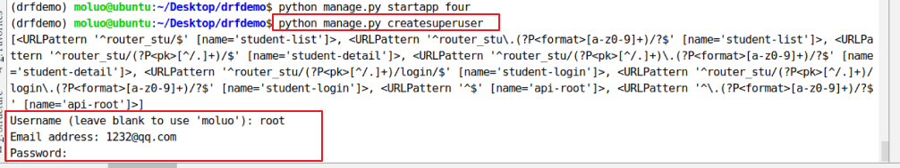
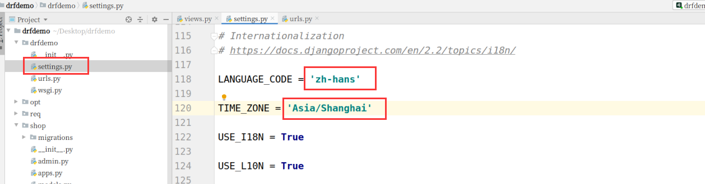
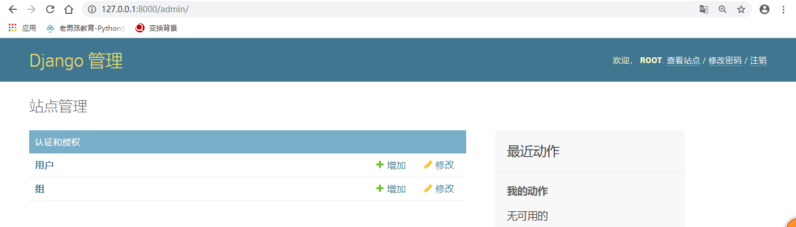

## 认证 Authentication 和权限 Permission

为了方便接下来的学习，我们创建一个新的子应用 opt，不要忘了将它添加到 settings.py 的 INSTALLED_APPS 里面：

```python
python manage.py startapp opt
```

因为接下来的功能中需要使用到登陆功能，所以我们使用 django 内置 admin 站点并创建一个管理员。

```bash
python manage.py createsuperuser 
```



创建管理员以后，访问 admin 站点，先修改站点的语言和时区配置，在 `settings.py` 文件中：

```python
LANGUAGE_CODE = 'zh-hans'

TIME_ZONE = 'Asia/Shanghai'
```




访问 admin 站点效果：




### 认证 Authentication

可以在配置文件中配置全局默认的认证方案 `/home/moluo/.virtualenvs/drfdemo/lib/python3.6/site-packages/rest_framework/settings.py`

```python
REST_FRAMEWORK = {
    'DEFAULT_AUTHENTICATION_CLASSES': (
        'rest_framework.authentication.SessionAuthentication',  # session认证，浏览器关闭，认证不会立即失效，注销后认证失效
        'rest_framework.authentication.BasicAuthentication',   # 基本认证，浏览器关闭，认证即失效，注销当然也会失效
    )
}
```

也可以在每个视图中通过设置 authentication_classess 属性来设置

```python
from rest_framework.authentication import SessionAuthentication, BasicAuthentication
from rest_framework.views import APIView

class ExampleView(APIView):
    # 类属性
    authentication_classes = [SessionAuthentication, BasicAuthentication]
    def get(self,request):
        pass
```

认证失败会有两种可能的返回值，这个需要我们配合权限组件来使用：

- 401 Unauthorized 未认证
- 403 Permission Denied 权限被禁止

授权要和下面的权限配合使用。只有当程序向我们索要权限时，才需要判断是否已经授权。

### 权限 Permissions

权限控制可以限制用户对于视图的访问和对于具体数据对象的访问。

- 在执行视图的as_view()方法的dispatch()方法前，会先进行视图访问权限的判断
- 在通过get_object()获取具体对象时，会进行模型对象访问权限的判断

#### 使用

权限配置有两种方式：全局配置和局部配置。全局配置很少用，对所有的视图都会应用上，会被局部配置的权限覆盖。

可以在配置文件中全局设置默认的权限管理类，如

```python
REST_FRAMEWORK = {
    ....

    'DEFAULT_PERMISSION_CLASSES': (
        'rest_framework.permissions.IsAuthenticated',
    )
}
```

如果未指明，则采用如下默认配置

```python
'DEFAULT_PERMISSION_CLASSES': (
   'rest_framework.permissions.AllowAny',
)
```

也可以在具体的视图中通过permission_classes属性来设置，如

```python
from rest_framework.permissions import IsAuthenticated
from rest_framework.views import APIView

class ExampleView(APIView):
    permission_classes = (IsAuthenticated,)
    ...
```

#### 提供的权限

- AllowAny 允许所有用户
- IsAuthenticated 仅通过登录认证的用户
- IsAdminUser 仅管理员用户
- IsAuthenticatedOrReadOnly 已经登陆认证的用户可以对数据进行增删改操作，没有登陆认证的只能查看数据。

#### 举例

```python
from rest_framework.authentication import SessionAuthentication
from rest_framework.permissions import IsAuthenticated
from rest_framework.generics import RetrieveAPIView

class StudentAPIView(RetrieveAPIView):
    queryset = Student.objects.all()
    serializer_class = StudentSerializer
    authentication_classes = [SessionAuthentication]
    permission_classes = [IsAuthenticated]
```

#### 自定义权限

如需自定义权限，需继承 `rest_framework.permissions.BasePermission` 父类，并实现以下两个任何一个方法或全部

- `.has_permission(self, request, view)`

  是否可以访问视图， view 表示当前视图对象

- `.has_object_permission(self, request, view, obj)`

  是否可以访问数据对象， view 表示当前视图， obj 为模型数据对象

例如：

在当前子应用下，创建一个权限文件 `permissions.py` 中声明自定义权限类:

```python
from rest_framework.permissions import BasePermission

class IsXiaoMingPermission(BasePermission):
    def has_permission(self, request, view):
        if( request.user.username == "xiaoming" ):
            return True
```

在局部视图中，可以这样引用自定义的权限类：

```python
from .permissions import IsXiaoMingPermission
class StudentViewSet(ModelViewSet):
    queryset = Student.objects.all()
    serializer_class = StudentSerializer
    permission_classes = [IsXiaoMingPermission]
```

