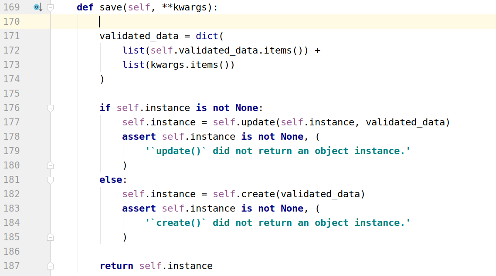

## 反序列化

反序列化，就是将用户输入的信息存储到数据库中。但是用户的操作往往是不可控的，也是不可预测的。鬼知道他们会输入些什么东西进来。所以，在将数据存储进数据库之前，我们必须指定一些规则。只有满足这些规则的数据，我们才能将其存入数据库。这就是数据验证的意义。

对于序列化来说，只有读取数据一种操作。而对与反序列化来说，可能是要增加数据、修改数据，也可能会删除数据。每一种操作都有其对应的方法流程。所以相较于序列化，反序列化就显得有些绕了。

### 数据验证

使用序列化器进行反序列化时，需要对数据进行验证后，才能获取验证成功的数据或保存成模型类对象。

在获取反序列化的数据前，必须调用 `is_valid()` 方法，序列化器内部是再 `is_valid` 方法内部进行验证，验证成功返回 True，否则返回 False。

验证失败，可以通过序列化器对象的 `errors` 属性获取错误信息。这是一个字典，包含了字段和字段的错误。如果是非字段错误，可以通过修改 REST framework 配置中的 NON_FIELD_ERRORS_KEY 来控制错误字典中的键名。

验证成功，可以通过序列化器对象的 validated_data 属性获取数据。

在定义序列化器时，指明每个字段的序列化类型和选项参数，本身就是一种验证行为。

为了方便演示，我们这里采用一个图书模型来完成反序列化的学习。当然也创建一个新的子应用 unsers。

```
python manage.py startapp unsers
```

在 `setting.py` 中注册子应用，代码：

```python
INSTALLED_APPS = [
    'django.contrib.admin',
    'django.contrib.auth',
    'django.contrib.contenttypes',
    'django.contrib.sessions',
    'django.contrib.messages',
    'django.contrib.staticfiles',

    'rest_framework', # 把drf框架注册到django项目中

    'students', # 注册子应用
    'sers',     # 演示序列化
    'unsers',     # 演示反序列化
]
```

模型代码：

```python
from django.db import models

# Create your models here.
class BookInfo(models.Model):
    """图书信息"""
    title = models.CharField(max_length=20, verbose_name='标题')
    pub_date = models.DateField(verbose_name='发布日期')
    image = models.ImageField(verbose_name='图书封面')
    price = models.DecimalField(max_digits=8, decimal_places=2, verbose_name="价格")
    read = models.IntegerField(verbose_name='阅读量')
    comment = models.IntegerField(verbose_name='评论量')
    class Meta:
        # db_table = "表名"
        db_table = "tb_book_info"
        verbose_name = "图书"
        verbose_name_plural = verbose_name
```

注意：因为当前模型中，设置到图片上传处理，所以我们需要安装 `PIL` 库

```bash
pip install Pillow
```

数据迁移

```bash
python manage.py makemigrations
python manage.py migrate
```

经过上面的准备工作，我们接下来就可以给图书信息增加图书的功能，那么我们需要对来自客户端的数据进行处理，例如，验证和保存到数据库中，此时，我们就可以使用序列化器的反序列化器，接下来，我们就可以参考之前定义学生信息的序列化器那样，定义一个图书的序列化器，当然，不同的是，接下来的序列化器主要用于反序列化器阶段，在 unsers 子应用，创建 `serializers.py`，代码如下：

```python
from rest_framework import serializers

class BookInfoSerializer(serializers.Serializer):
    # 这里声明的字段用于进行反序列化器
    # 字段名 = serializers.字段类型(验证选项)
    title = serializers.CharField(max_length=20, label="标题", help_text="标题")
    # required=True 当前字段必填
    pub_date = serializers.DateField(required=True,label="发布日期", help_text="发布日期")
    image = serializers.ImageField(max_length=3*1024*1024, label="图书封面", help_text="图书封面")
    price = serializers.DecimalField(max_digits=8, decimal_places=2, required=True, label="价格", help_text="价格")
    read  = serializers.IntegerField(min_value=0, default=0, label="阅读量", help_text="阅读量")
    comment = serializers.IntegerField(min_value=0, default=0, label="评论量", help_text="评论量")

    # 关于继承数据库选项

    # 验证部分的代码

    # 数据库
```

通过构造序列化器对象，并将要反序列化的数据传递给 data 构造参数，进而进行验证。

视图函数 `views.py` 的代码如下：

```python
from django.views import View
from django.http.response import HttpResponse
from .serializers import BookInfoSerializer
class BookInfoView(View):
    def get(self,request):
        """模拟客户端发送过来的数据"""
        data = {
            "title":"西厢记",
            "pub_date":"1980-10-10",
            "price": 19.80,
            "read": 100,
            "comment": -1,
        }

        # 对上面的数据进行反序列化器处理
        # 1. 初始化，填写data属性
        serializer = BookInfoSerializer(data=data)
        # 2. 调用序列化器提供的is_valid方法进行验证
        # raise_exception=True 表示若验证不通过，终断程序，直接抛出错误
        ret = serializer.is_valid(raise_exception=True)
        print(ret) # is_valid的方法值就是验证结果，只会是True/False
        if ret:
            # 3.1 验证通过后，可以通过validated_data得到数据
            print("验证成功，ret=%s" % ret)
            print(serializer.validated_data)  # 验证处理后的数据
            """打印结果：
            OrderedDict([('title', '西厢记'), ('pub_date', datetime.date(1980, 10, 10)), ('price', Decimal('19.80')), ('read', 100), ('comment', 15)])
            """
        else:    # 需要将上面的is_valid中的raise_exception参数设置为False，否则走不到这里来
            print("验证失败，ret=%s" % ret)
            # 3.2 验证没通过，可以通过errors打印错误信息
            print( serializer.errors )
            """打印结果：
            {'comment': [ErrorDetail(string='Ensure this value is greater than or equal to 0.', code='min_value')]}
            """
        return HttpResponse("ok")
```

`is_valid()` 方法还可以在验证失败时抛出异常 `serializers.ValidationError`，可以通过传递 `raise_exception=True` 参数开启。REST framework 接收到此异常，会向前端返回 `HTTP 400 Bad Request` 响应。

```python
# Return a 400 response if the data was invalid.
serializer.is_valid(raise_exception=True)
```

如果觉得字段中提供的验证条件还不够，需要再补充定义验证行为，可以使用以下三种方法。

#### validate_<字段名>

对 `<字段名>` 字段进行验证，如

```python
class BookInfoSerializer(serializers.Serializer):
    """图书数据序列化器"""
    ...

    # 单个字段的验证，方法名必须： validate_<字段名>(self,data)    # data 就是当前字段中客户端提交的数据
    # validate_price 会被is_valid调用
    def validate_price(self, data):
        """"""
        if data < 0:
            raise serializers.ValidationError("对不起，价格不能低于0元")
        # 验证通过以后，必须要返回验证的结果数据，否则序列化器的validated_data无法得到当前字段的结果
        return data
```

把前面的例子的 price 改为 -19.80，运行就可以测试了。

#### validate

在序列化器中需要同时对多个字段进行比较验证时，可以定义 validate 方法来验证，如

```python
class BookInfoSerializer(serializers.Serializer):
    """图书数据序列化器"""
    ...

    # 多个字段的验证，必须方法名叫 "validate"
    # data 表示客户端发送过来的所有数据，字典格式
    def validate(self, data):
        # 判断图书的阅读量不能低于评论量
        read = data.get("read")
        comment = data.get("comment")
        if read < comment:
            raise serializers.ValidationError("对不起，阅读量不能低于评论量")
        return data
```

运行之前的例子，把 read 改为 1，comment 改为 100，访问测试。

#### validators

在字段中添加 validators 选项参数，也可以补充验证行为，如

```python
from rest_framework import serializers

# 可以把验证函数进行多次使用，提供给不同的字段或者不同的序列化器使用
def about_django(data):
    if "django" in data:
        raise serializers.ValidationError("对不起，图书标题不能出现关键字django")
    # 返回验证以后的数据
    return data

class BookInfoSerializer(serializers.Serializer):
    # 这里声明的字段用于进行反序列化器
    # 字段名 = serializers.字段类型(验证选项)
    title = serializers.CharField(max_length=20,validators=[about_django], label="标题", help_text="标题")
    # required=True 当前字段必填
    pub_date = serializers.DateField(required=True, label="发布日期", help_text="发布日期")
    # max_length 文件的大小
    # allow_null=True 允许传递的image数据为None
    image = serializers.ImageField(required=False, allow_null=True, max_length=3*1024*1024, label="图书封面", help_text="图书封面")
    price = serializers.DecimalField(max_digits=8, decimal_places=2, required=True, label="价格", help_text="价格")
    # min_value 数值大小
    # default 设置默认值
    read  = serializers.IntegerField(min_value=0, default=0, label="阅读量", help_text="阅读量")
    comment = serializers.IntegerField(min_value=0, default=0, label="评论量", help_text="评论量")
```

把前面的例子修改成 `title=“西厢记django版本”`，然后运行测试

视图代码：

```python
# Create your views here.
from django.views import View
from django.http.response import HttpResponse
from .serializers import BookInfoSerializer
class BookInfoView(View):
    def get(self,request):
        """模拟客户端发送过来的数据"""
        data = {
            "title":"西厢记django版本",
            "pub_date":"1980-10-10",
            "price": 19.80,
            "read": 10000,
            "comment": 100,
        }

        # 对上面的数据进行反序列化器处理
        # 1. 初始化，填写data属性
        serializer = BookInfoSerializer(data=data)
        # 2. 调用序列化器提供的is_valid方法进行验证
        # raise_exception=True 表示终断程序，直接抛出错误
        ret = serializer.is_valid(raise_exception=True)
        print(ret) # is_valid的方法值就是验证结果，只会是True/False
        if ret:
            # 3.1 验证通过后，可以通过validated_data得到数据
            print("验证成功，ret=%s" % ret)
            print(serializer.validated_data)  # 验证处理后的数据
            """打印结果：
            OrderedDict([('title', '西厢记'), ('pub_date', datetime.date(1980, 10, 10)), ('price', Decimal('19.80')), ('read', 100), ('comment', 15)])
            """
        else:
            print("验证失败，ret=%s" % ret)
            # 3.1 验证没通过，可以通过
            print( serializer.errors )
            """打印结果：
            {'comment': [ErrorDetail(string='Ensure this value is greater than or equal to 0.', code='min_value')]}
            """
        return HttpResponse("ok")
```

#### is_valid 的验证过程

is_valid 实际上内部执行了三种不同的验证方式：

1. 先执行字段内置的验证选项
2. 再执行 validators 自定义选项
3. 最后执行 validate 自定义验证方法（包含 validate_<字段> 和 validate）

### 操作数据

完成数据的更新或者添加，只需在序列化器通过 is_valid 方法验证完毕后，若数据符合规范，即可调用 `serializer.save()` 方法保存，即可使用序列化器来完成数据反序列化的过程。这个过程可以把数据转成模型类对象。但是在调用 save 方法之前，必须要在 序列化器中定义 `create()` 和 `update()` 两个方法来，这样才能实现数据的增加和修改。

序列化器 `serializers.py` 的代码如下：

```python
from rest_framework import serializers

# 可以把验证函数进行多次使用，提供不用的字段或者不同的序列化器里面使用
def about_django(data):
    if "django" in data:
        raise serializers.ValidationError("对不起，图书标题不能出现关键字django")
    # 返回验证以后的数据
    return data

class BookInfoSerializer(serializers.Serializer):
    # 这里声明的字段用于进行反序列化器
    # 字段名 = serializers.字段类型(验证选项)
    title = serializers.CharField(max_length=20,validators=[about_django], label="标题", help_text="标题")
    # required=True 当前字段必填
    pub_date = serializers.DateField(required=True, label="发布日期", help_text="发布日期")
    # max_length 文件的大小
    # allow_null=True 允许传递的image数据为None
    image = serializers.ImageField(required=False, allow_null=True, max_length=3*1024*1024, label="图书封面", help_text="图书封面")
    price = serializers.DecimalField(max_digits=8, decimal_places=2, required=True, label="价格", help_text="价格")
    # min_value 数值大小
    # default 设置默认值
    read  = serializers.IntegerField(min_value=0, default=0, label="阅读量", help_text="阅读量")
    comment = serializers.IntegerField(min_value=0, default=0, label="评论量", help_text="评论量")

    # 关于继承数据库选项

    # 自定义验证的代码
    # 单个字段的验证，方法名必须： validate_<字段名>(self,data)    # data 就是当前字段中客户端提交的数据
    # validate_price 会被is_valid调用
    def validate_price(self, data):
        """"""
        if data < 0:
            raise serializers.ValidationError("对不起，价格不能低于0元")
        # 验证通过以后，必须要返回验证的结果数据，否则序列化器的validated_data无法得到当前字段的结果
        return data

    # 多个字段的验证，必须方法名叫 "validate"
    # data 表示客户端发送过来的所有数据，字典格式
    def validate(self, data):
        # 判断图书的阅读量不能低于评论量
        read = data.get("read")
        comment = data.get("comment")
        if read < comment:
            raise serializers.ValidationError("对不起，阅读量不能低于评论量")

        return data

    # 数据库操作
    def create(self, validated_data): # 这里会在调用时，由序列化器补充验证成功以后的数据进来
        """完成添加操作"""
        print(validated_data) # 字典
        # 导入模型
        from .models import BookInfo
        # 添加数据
        book = BookInfo.objects.create(
            title=validated_data.get("title"),
            price=validated_data.get("price"),
            pub_date=validated_data.get("pub_date"),
            read=validated_data.get("read"),
            comment=validated_data.get("comment"),
        )

        return book

    # instance就是要修改的模型，系统会自动从对象初始化时的instance提取过来
    # validated_data 就是经过验证以后的客户端提交的数据
    def update(self, instance, validated_data):
        """更新操作"""
        instance.title = validated_data.get('title')
        instance.pub_date = validated_data.get('pub_date')
        instance.comment = validated_data.get('comment')
        instance.price = validated_data.get('price')
        instance.read = validated_data.get('read')
        instance.save()

        return instance
```

视图代码：

```python
from django.views import View
from django.http.response import HttpResponse
from .serializers import BookInfoSerializer
class BookInfoView(View):
    # ...
    def get(self,request):
        """保存数据[更新]"""
        # 客户端提交数据过来
        id = 2
        data = { # 模拟客户端发送过来的数据
            "title": "东游记",
            "pub_date": "1998-10-01",
            "price": 19.98,
            "read": 330,
            "comment": 100,
        }
        from .models import BookInfo
        book = BookInfo.objects.get(pk=id)

        # 使用序列化器验证数据[如果是更新操作，需要传入2个参数，分别是instance和data]
        serializer = BookInfoSerializer(instance=book,data=data)
        serializer.is_valid()
        book = serializer.save() # 此时，我们必须在序列化器中预先声明update方法
        """
        serailzier对象调用的save方法是什么？怎么做到自动调用update和create?
        1. 这里的save不是数据库ORM模型对象的save，是BaseSerializer定义的。
        2. save方法中根据实例化serializer时是否传入instance参数来判断执行update还是create的
           当传入instance时，则instance.save调用的就是update方法
           没有传入instance，则instance.save调用的就是create方法
        3. serializer.save使用前提是必须在序列化器中声明create或者update方法，否则报错！！！
        """
        print(book)
        """打印结果：
        BookInfo object (2)
        """
        return HttpResponse("ok")
```

在序列化器实现了 create 和 update 两个方法后，在反序列化数据的时候，就可以通过 `save()` 方法返回一个数据对象实例

```python
book = serializer.save()
```

如果创建序列化器对象的时候，没有传递 instance 实例，则调用 `save()` 方法的时候，`create()` 被调用，相反，如果传递了 instance 实例，则调用 `save()` 方法的时候，`update()` 被调用。

在视图函数中，serailzier 对象调用的 save 方法是什么？怎么做到自动调用 update 和 create 的？

1. 这里的 save 不是数据库 ORM 模型对象的 save，而是 BaseSerializer 定义的。
2. save 方法中根据实例化 serializer 时是否传入 instance 参数来判断执行 update 还是 create 的
   - 当传入 instance 时，则 `instance.save` 调用的就是 update 方法
   - 若没有传入 instance，则 `instance.save` 调用的就是 create 方法
3. `serializer.save` 使用前提是必须在序列化器中声明 create 或者 update 方法，否则报错！！！

BaseSerializer 中定义的 save 方法源码：



### 附加说明

1. 在对序列化器进行 `save()` 保存时，可以额外传递数据，这些数据可以在 `create()` 和 `update()` 中的validated_data 参数获取到

   ```python
   # request.user 是django中记录当前登录用户的模型对象
   serializer.save(owner=request.user)
   ```

2. 默认序列化器必须传递所有 required 的字段，否则会抛出验证异常。但是我们可以使用 partial 参数来允许部分字段更新

   ```python
   # Update BookInfo with partial data
   serializer = BookInfoSerializer(book, data=data, partial=True)
   ```

