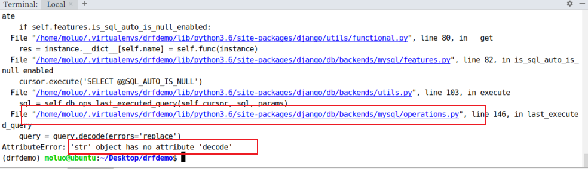

# DRF 环境安装与配置

DRF 需要以下依赖：

- Python（2.7，3.2 以上）
- Django（1.10，1.11，2.0 以上）

DRF 是以 Django 的子应用方式提供的，所以我们可以直接利用已有的 Django 环境而无需从新创建。（若没有 Django 环境，需要先创建环境安装 Django）

## 安装 DRF

前提是已经安装了 Django，建议安装在虚拟环境。如无特殊说明，以下所有操作均在虚拟环境中进行。

虚拟环境的常用操作命令如下：

```bash
# 创建虚拟环境。第一次使用命令创建虚拟环境后，会自动进入虚拟环境
mkvirtualenv drfdemo -p python3
# 退出虚拟环境
deactivate
# 再次进入虚拟环境
workon drfdemo
# 查看有哪些虚拟环境
workon
```

在安装好的虚拟环境中，安装 Django 和 Django REST Framework，也可以顺便安装上 pymysql。为了安装快速，可以使用豆瓣源：

```python
pip install django==2.2.0  -i https://pypi.douban.com/simple
pip install djangorestframework -i https://pypi.douban.com/simple
# 因为我们需要接下来，需要开发api接口肯定要操作数据，所以安装pymysql
pip install pymysql -i https://pypi.douban.com/simple
```

这里补充两个 Linux 中的快捷键：

```
复制    ctrl+insert
粘贴    shift+insert
```

## 创建 Django 项目

```
cd ~/Desktop
django-admin startproject drfdemo
```


使用 PyCharm 打开项目，设置虚拟环境的解析器，并修改 manage.py 中的后缀参数。

## 添加 rest_framework 应用

在 settings.py 的 INSTALLED_APPS 中添加 `'rest_framework'`。

```python
INSTALLED_APPS = [
    ...
    'rest_framework',
]
```

接下来就可以使用 DRF 提供的功能进行 api 接口开发了。在项目中如果使用 rest_framework 框架实现 API 接口，开发过程中编写视图为主，视图里面的代码无非有以下三个步骤：

- 将请求的数据（如 JSON 格式）转换为模型类对象【json -> 字典 -> 模型对象】
- 通过模型类对象操作数据库【操作数据库】
- 将模型类对象转换为响应的数据（如 JSON 格式）【模型对象 -> 字典 -> json】

接下来，我们快速体验下学习完成 drf 以后的开发代码。代码大家不需要理解，先看步骤，是不是上面的三个步骤。

## 体验 drf 完全简写代码提供 api 接口的过程

首先需要创建一个子应用来开发。在终端下面，创建 students 子应用。

```bash
python manage.py startapp students
```

把创建好的子应用注册到 `settings.py`，代码：

```python
# Application definition

INSTALLED_APPS = [
    'django.contrib.admin',
    'django.contrib.auth',
    'django.contrib.contenttypes',
    'django.contrib.sessions',
    'django.contrib.messages',
    'django.contrib.staticfiles',

    'rest_framework', # 把drf框架注册到django项目中

    'students', # 注册子应用
]
```

在开发中，不管是开发一个 api 接口还是一个普通的业务功能，在 Django/drf中都会有一个套路：

1. 先考虑考虑好整个功能应用到的外部工具（配置信息，第三方模块）
2. 创建相关数据模型（`models.py`）
3. 编写序列化器（Django 不需要这个步骤）
4. 编写视图代码
5. 编写路由，绑定视图

为了方便测试，所以我们可以先创建一个数据库。

```mysql
create database students charset=utf8mb4;
```


初始化数据库连接。我们之前已经安装了 pymysql，若没安装，可使用下面的命令安装：

```bash
pip install pymysql
```

主引用中 `__init__.py` 设置使用 pymysql 作为数据库驱动

```python
import pymysql

pymysql.install_as_MySQLdb()
```

`settings.py` 配置文件中设置 MySQL 的账号密码

```python
DATABASES = {
    'default': {
        'ENGINE': 'django.db.backends.mysql',
        'NAME': "students",
        "HOST": "127.0.0.1",
        "PORT": 3306,
        "USER": "root",
        "PASSWORD":"123",
    },
}
```

### 创建模型操作类

也就是编写 `students/models.py`，代码：

```python
class Student(models.Model):
    # 模型字段
    name = models.CharField(max_length=100,verbose_name="姓名")
    sex = models.BooleanField(default=1,verbose_name="性别")
    age = models.IntegerField(verbose_name="年龄")
    class_number = models.CharField(max_length=5,verbose_name="班级编号")
    description = models.TextField(max_length=1000,verbose_name="个性签名")

    class Meta:
        db_table="tb_student"
        verbose_name = "学生"
        verbose_name_plural = verbose_name
```

#### 执行数据迁移

在终端下执行如下命令

```bash
python manage.py makemigrations
python manage.py migrate
```

执行数据迁移 `python manage.py makemigrations` 时可能会报如下错误：


解决方案：注释掉 `backends/mysql/base.py` 中的第 35 和 36 行关于 pymysql 版本检查的代码：


若执行数据迁移发生以下错误：



解决方法：修改 `backends/mysql/operations.py` 第 146 行代码，将 decode 改为 encode：

```python
if query is not None:
    # query = query.decode(errors='replace') # 原代码
    query = query.encode(errors='replace')
```

经过上面错误解决以后，执行数据迁移。效果如下：


### 创建序列化器

在 students 应用目录中新建 `serializers.py` 用于保存该应用的序列化器。

创建一个 StudentModelSerializer 用于对接收客户端提供的数据时进行反序列化以及在提供数据给客户端时进行序列化。

```python
# 创建序列化器类，回头会在试图中被调用
from rest_framework import serializers
from .models import Student
class StudentModelSerializer(serializers.ModelSerializer):
    class Meta:
        model = Student
        fields = "__all__"
```

- model 指明该序列化器处理的数据字段从模型类 BookInfo 参考生成
- fields 指明该序列化器包含模型类中的哪些字段，`'__all__'`指明包含所有字段

### 编写视图

在 students 应用的 `views.py` 中创建视图 StudentViewSet，这是一个视图集合。

```python
from rest_framework.viewsets import ModelViewSet
from .models import Student
from .serializers import StudentModelSerializer
# Create your views here.
class StudentViewSet(ModelViewSet):
    queryset = Student.objects.all()
    serializer_class = StudentModelSerializer
```

- queryset 指明该视图集在查询数据时使用的查询集
- serializer_class 指明该视图在进行序列化或反序列化时使用的序列化器

### 定义路由

在 students 应用的 `urls.py` 中定义路由信息。

```python
from . import views
from rest_framework.routers import DefaultRouter

# 路由列表
urlpatterns = []

router = DefaultRouter()  # 可以处理视图的路由器
router.register('students', views.StudentViewSet)  # 向路由器中注册视图集

urlpatterns += router.urls  # 将路由器中的所以路由信息追到到django的路由列表中
```

最后把 students 子应用中的路由文件加载到主应用的总路由文件中.

```python
from django.contrib import admin
from django.urls import path,include

urlpatterns = [
    path('admin/', admin.site.urls),
    path("stu/",include("students.urls")),
]
```

### 运行测试

运行当前程序（与运行 Django 一样）

```bash
python manage.py runserver
```

在浏览器中输入网址 `127.0.0.1:8000`，可以看到 DRF 提供的 API Web 浏览页面：


进入链接 `127.0.0.1:8000/stu/students` 可以访问获取所有数据的接口，呈现如下页面：


在页面底下表单部分填写学生信息，可以访问添加新学生的接口，保存学生信息：


点击 POST 后，返回如下页面信息：


在浏览器中输入网址127.0.0.1:8000/stu/students/5/，可以访问获取单一学生信息的接口（id 为 5 的学生），呈现如下页面：


在页面底部表单中填写学生信息，可以访问修改学生的接口：


点击 PUT，返回如下页面信息：


点击DELETE按钮，可以访问删除学生的接口：


返回，如下页面：


