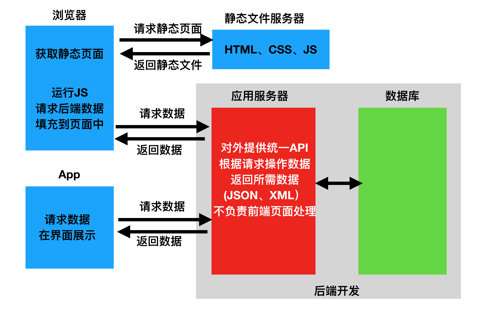

## 前后端分离相关概念

### Web 应用模式

在开发 Web应用中，有两种应用模式：

1. 前后端不分离（客户端看到的内容和所有界面效果都是由服务端提供出来的）。


2. 前后端分离（把前端的界面效果 html、css、js 分离到另一个服务端，Python 服务端只需要返回数据即可）。

   前端形成一个独立的网站，服务端构成一个独立的网站。



### API 接口

API 就是开发提供给第三方或者外界通过**方法**或 **url 地址**进行调用的一个数据功能，可以理解为 Django 里面的一个视图的方法或者一个能够被访问的函数。

为了在团队内部形成共识、防止个人习惯差异引起的混乱，我们需要找到一种大家都觉得很好的接口实现规范，而且这种规范能够让后端写的接口，用途一目了然，减少双方之间的合作成本。

目前市面上大部分公司开发人员使用的接口服务架构主要有：restful、rpc、soap。

rpc：翻译成中文就是，远程过程调用（远程服务调用）。

服务端提供一个统一的访问地址：http://api.renran.cn/，通过参数声明调用哪一个方法，以及调用方法的参数。

rpc 基本都会要求使用 http 的 post 请求，请求内容类似这样

```
action=get_all_student&params=301&sex=1
```

接口多了，对应函数名和参数就多了。前端在请求api接口时就会比较难找，容易出现重复的接口。

RESTful：翻译成中文就是，资源状态转换。

把后端所有的数据和文件都看成资源，那么接口请求数据本质上来说就是对资源的操作了。

Web 项目中操作资源，无非就是增删查改。所以要求在地址栏中声明要操作的资源是什么，然后通过 http 请求动词来说明对资源进行哪一种操作。资源对应的往往就是数据表的表名。

POST http://www.renran.cn/api/students/   添加学生数据

GET    http://www.renran.cn/api/students/   获取所有学生

DELETE http://www.renran.cn/api/students/<pk>/   删除id=pk的一个学生

PUT   http://www.renran.cn/api/students/<pk>/       修改一个学生的全部信息 [id,name,sex,age,]

PATCH  http://www.renran.cn/api/students/<pk>/    修改一个学生的部分信息[age]

### RESTful API 规范


REST 全称是 Representational State Transfer，中文意思是表述（编者注：通常译为表征）性状态转移。 它首次出现在 2000 年 Roy Fielding 的博士论文中。

RESTful 是一种定义 Web API 接口的设计风格，尤其适用于前后端分离的应用模式中。

这种风格的理念认为后端开发任务就是提供数据的，对外提供的是数据资源的访问接口。所以在定义接口时，客户端访问的 URL 路径就表示这种要操作的数据资源。

而对于数据资源分别使用 POST、DELETE、GET、UPDATE 等请求动作来表达对数据的增删查改。

| 请求方法 | 请求地址       | 后端操作           |
| -------- | -------------- | ------------------ |
| GET      | /students      | 获取所有学生       |
| POST     | /students      | 增加学生           |
| GET      | /students/<pk> | 获取编号为pk的学生 |
| PUT      | /students/<pk> | 修改编号为pk的学生 |
| DELETE   | /students/<pk> | 删除编号为pk的学生 |

事实上，我们可以使用任何一个框架都可以实现符合 restful 规范的 AP I接口。

参考文档：http://www.runoob.com/w3cnote/restful-architecture.html

接口实施过程中，会存在幂等性。所谓幂等性是指代客户端发起多次请求是否对于服务端里面的资源产生不同结果。如果多次请求，服务端结果还是一样，则属于幂等接口，如果多次请求，服务端产生结果是不一样的，则属于非幂等接口。在 http 请求，get/put/patch/delete 都属于幂等性接口，post 属于非幂等接口。

### 序列化

api 接口开发，最核心最常见的一个过程就是序列化，所谓序列化就是把**数据转换格式**，序列化可以分两个阶段：

**序列化**：把我们识别的数据转换成指定的格式提供给别人。

例如：我们在 Django 中获取到的数据默认是模型对象，但是模型对象数据无法直接提供给前端或别的平台使用，所以我们需要把数据进行序列化，变成字符串或者 json 数据，提供给别人。

**反序列化**：把别人提供的数据转换/还原成我们需要的格式。

例如：前端 js 提供过来的 json 数据，对于 Python 而言就是字符串，我们需要进行反序列化换成模型类对象，这样我们才能把数据保存到数据库中。

### Django Rest Framework

核心思想：缩减编写 api 接口的代码

Django REST framework 是一个建立在 Django 基础之上的 Web 应用开发框架，可以快速的开发 REST API 接口应用。在 REST framework 中，提供了序列化器 Serialzier 的定义，可以帮助我们简化序列化与反序列化的过程，不仅如此，还提供丰富的类视图、扩展类、视图集来简化视图的编写工作。REST framework 还提供了认证、权限、限流、过滤、分页、接口文档等功能支持。REST framework 提供了一个 API 的 Web 可视化界面来方便查看测试接口。


中文文档：https://q1mi.github.io/Django-REST-framework-documentation/#django-rest-framework

github：https://github.com/encode/django-rest-framework/tree/master

### DRF 特点

- 提供了定义序列化器 Serializer 的方法，可以快速根据 Django ORM 或者其它库自动序列化/反序列化；
- 提供了丰富的类视图、Mixin 扩展类，简化视图的编写；
- 丰富的定制层级：函数视图、类视图、视图集合到自动生成 API，满足各种需要；
- 多种身份认证和权限认证方式的支持；
- 内置了限流系统；
- 直观的 API web 界面（方便我们调试开发api接口）；
- 可扩展性，插件丰富