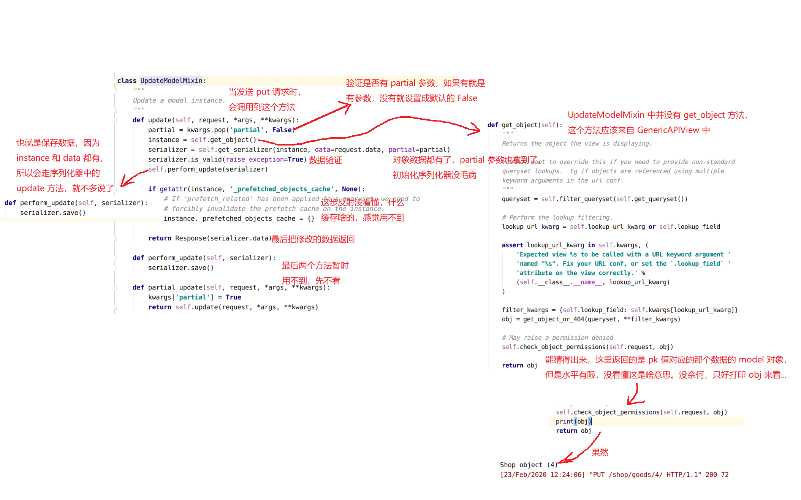
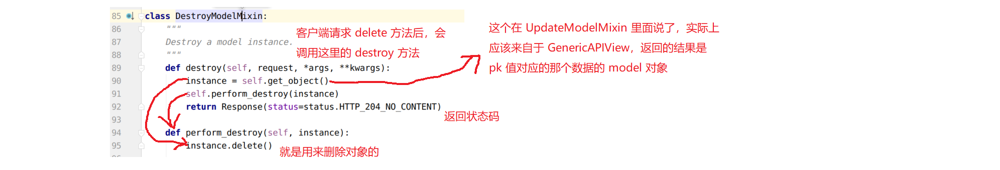

## 5 个视图扩展类 ModelMixin

作用：

提供了几种后端视图（对数据资源进行曾删改查）处理流程的实现，如果需要编写的视图属于这五种，则视图可以通过继承相应的扩展类来复用代码，减少自己编写的代码量。

这五个扩展类需要搭配 GenericAPIView 父类，因为五个扩展类的实现需要调用 GenericAPIView 提供的序列化器与数据库查询的方法。

### ListModelMixin

列表视图扩展类，提供 `list(request, *args, **kwargs)` 方法快速实现列表视图，返回 200 状态码。

该 Mixin 的 list 方法会对数据进行过滤和分页。

源代码：

```python
class ListModelMixin(object):
    """
    List a queryset.
    """
    def list(self, request, *args, **kwargs):
        # 过滤
        queryset = self.filter_queryset(self.get_queryset())
        # 分页
        page = self.paginate_queryset(queryset)
        if page is not None:
            serializer = self.get_serializer(page, many=True)
            return self.get_paginated_response(serializer.data)
        # 序列化
        serializer = self.get_serializer(queryset, many=True)
        return Response(serializer.data)
```

举例：

```python
from rest_framework.mixins import ListModelMixin

class StudentMinxinAPIView(GenericAPIView, ListModelMixin):
    queryset = Student.objects.all()
    serializer_class = StudentModelSerializer

    def get(self, request):
        return self.list(request)
```


### CreateModelMixin

创建视图扩展类，提供 `create(request, *args, **kwargs)` 方法快速实现创建资源的视图，成功返回 201 状态码。

如果序列化器对前端发送的数据验证失败，返回400错误。

源代码：

```python
class CreateModelMixin(object):
    """
    Create a model instance.
    """
    def create(self, request, *args, **kwargs):
        # 获取序列化器
        serializer = self.get_serializer(data=request.data)
        # 验证
        serializer.is_valid(raise_exception=True)
        # 保存
        self.perform_create(serializer)
        headers = self.get_success_headers(serializer.data)
        return Response(serializer.data, status=status.HTTP_201_CREATED, headers=headers)

    def perform_create(self, serializer):
        serializer.save()

    def get_success_headers(self, data):
        try:
            return {'Location': str(data[api_settings.URL_FIELD_NAME])}
        except (TypeError, KeyError):
            return {}
```

实例：

```python
from rest_framework.mixins import CreateModelMixin

class StudentMinxinAPIView(GenericAPIView, CreateModelMixin):
    queryset = Student.objects.all()
    serializer_class = StudentModelSerializer

    def post(self, request):
        return self.create(request)
```

### RetrieveModelMixin

详情视图扩展类，提供 `retrieve(request, *args, **kwargs)` 方法，可以快速实现返回一个存在的数据对象。

如果存在，返回 200， 否则返回 404。

源代码：

```python
class RetrieveModelMixin(object):
    """
    Retrieve a model instance.
    """
    def retrieve(self, request, *args, **kwargs):
        # 获取对象，会检查对象的权限
        instance = self.get_object()
        # 序列化
        serializer = self.get_serializer(instance)
        return Response(serializer.data)

```

举例：

```python
class Student2MinxinAPIView(GenericAPIView, RetrieveModelMixin):
    queryset = Student.objects.all()
    serializer_class = StudentModelSerializer

    def get(self, request, pk):
        return self.retrieve(request, pk=pk)
```

### UpdateModelMixin

更新视图扩展类，提供 `update(request, *args, **kwargs)` 方法，可以快速实现更新一个存在的数据对象。

同时也提供 `partial_update(request, *args, **kwargs)` 方法，可以实现局部更新。

成功返回200，序列化器校验数据失败时，返回400错误。

源代码：

```python
class UpdateModelMixin(object):
    """
    Update a model instance.
    """
    def update(self, request, *args, **kwargs):
        partial = kwargs.pop('partial', False)
        instance = self.get_object()
        serializer = self.get_serializer(instance, data=request.data, partial=partial)
        serializer.is_valid(raise_exception=True)
        self.perform_update(serializer)

        if getattr(instance, '_prefetched_objects_cache', None):
            # If 'prefetch_related' has been applied to a queryset, we need to
            # forcibly invalidate the prefetch cache on the instance.
            instance._prefetched_objects_cache = {}

        return Response(serializer.data)

    def perform_update(self, serializer):
        serializer.save()

    def partial_update(self, request, *args, **kwargs):
        kwargs['partial'] = True
        return self.update(request, *args, **kwargs)
```

源代码解析图：



示例代码：

```python
class Student2MinxinAPIView(GenericAPIView, UpdateModelMixin):
    queryset = Student.objects.all()
    serializer_class = StudentModelSerializer

    def put(self, request, pk):
        return self.update(request, pk=pk)
```

### DestroyModelMixin

删除视图扩展类，提供 `destroy(request, *args, **kwargs)` 方法，可以快速实现删除一个存在的数据对象。

成功返回 204，不存在返回 404。

源代码：

```python
class DestroyModelMixin(object):
    """
    Destroy a model instance.
    """
    def destroy(self, request, *args, **kwargs):
        instance = self.get_object()
        self.perform_destroy(instance)
        return Response(status=status.HTTP_204_NO_CONTENT)

    def perform_destroy(self, instance):
        instance.delete()
```

源代码解析图：



示例代码：

```python
class Student2MinxinAPIView(GenericAPIView, DestroyModelMixin):

    def delete(self, request, pk):
        return self.destroy(request, pk=pk)
```

### 综合使用示例代码

使用 GenericAPIView 和视图扩展类，实现 api 接口，代码：

```python
"""
Mixins是drf框架为了配合GenricAPIView提供出来的视图扩展类
"""
from rest_framework.mixins import CreateModelMixin,\
    UpdateModelMixin,\
    DestroyModelMixin,\
    ListModelMixin,\
    RetrieveModelMixin

class StudentMinxinAPIView(GenericAPIView, ListModelMixin, CreateModelMixin):
    queryset = Student.objects.all()
    serializer_class = StudentModelSerializer

    def get(self, request):
        """获取多个学生信息"""
        return self.list(request)

    def post(self, request):
        """添加学生信息"""
        return self.create(request)

class Student2MinxinAPIView(GenericAPIView, RetrieveModelMixin, UpdateModelMixin, DestroyModelMixin):
    queryset = Student.objects.all()
    serializer_class = StudentModelSerializer

    # 在使用GenericAPIView视图获取或操作单个数据时,视图方法中的代表主键的参数最好是pk
    def get(self, request, pk):
        """获取一条数据"""
        return self.retrieve(request, pk=pk)

    def put(self, request, pk):
        """更新一条数据"""
        return self.update(request, pk=pk)

    def delete(self, request, pk):
        """删除一条数据"""
        return self.destroy(request, pk=pk)
```

路由配置：

```python
urlpatterns = [
    # Mixins+GenricAPIView
    path("mixins/students/", views.StudentMinxinAPIView.as_view()),
    re_path("^mixins/students/(?P<pk>\d+)/$", views.Student2MinxinAPIView.as_view()),
]
```

