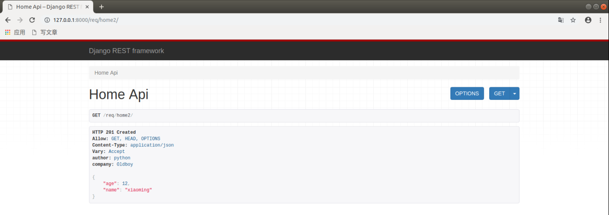

## 请求与响应

### 视图相关

drf 除了在数据序列化部分简写代码以外，还在视图中提供了简写操作。在 Django 原有的 `django.views.View` 类基础上，drf 封装了多个视图子类出来提供我们使用。

Django REST framwork 提供的视图的主要作用：

- 控制序列化器的执行（检验、保存、转换数据）
- 控制数据库查询的执行
- 调用请求类和响应类（这两个类也是由 drf 帮我们再次扩展了一些功能类）

为了方便我们学习，所以先创建一个子应用 req

```python
python manage.py startapp req
```

注册子引用：

```python
INSTALLED_APPS = [
    'django.contrib.admin',
    'django.contrib.auth',
    'django.contrib.contenttypes',
    'django.contrib.sessions',
    'django.contrib.messages',
    'django.contrib.staticfiles',

    'rest_framework', # 把drf框架注册到django项目中

    'sers',     # 演示序列化
    'unsers',     # 演示反序列化
    'mod',     # 模型类序列化器
    'req',     # 请求与响应
]

```

注册路由

```python
# 子应用路由
from django.urls import path
from . import views
urlpatterns = [

]


# 总路由
from django.contrib import admin
from django.urls import path,include
# django.urls.path 匹配一个普通字符串的url地址
# django.urls.re_path 匹配一个正则的url地址
# re_path("^/sms/(?P<mobile>\d{11})/$", views.视图类.as_view()),
urlpatterns = [
    path('admin/', admin.site.urls),
    path("sers/",include("sers.urls")),
    path("un/",include("unsers.urls")),
    path("mod/",include("mod.urls")),
    path("req/",include("req.urls")),
]
```

### 请求 Request

REST framework 传入视图的 request 对象不再是 Django 默认的 HttpRequest 对象，而是 REST framework 提供的扩展了 HttpRequest 类的 Request 类的对象。

REST framework 提供了 Parser 解析器，在接收到请求后会自动根据 Content-Type 指明的请求数据类型（如JSON、表单等）将请求数据进行 parse 解析，解析为类字典（QueryDict）对象保存到 Request 对象中。

Request 对象的数据是自动根据前端发送数据的格式进行解析之后的结果。

无论前端发送的哪种格式的数据，我们都可以以统一的方式读取数据。

#### 常用属性

##### .data

`request.data` 返回解析之后的请求体数据。类似于 Django 中标准的 `request.POST` 和 `request.FILES` 属性，但提供如下特性：

- 包含了解析之后的文件和非文件数据
- 包含了对 POST、PUT、PATCH 请求方式解析后的数据
- 利用了 REST framework 的 parsers 解析器，不仅支持表单类型数据，也支持 JSON 数据

##### .query_params

`request.query_params` 与 Django 标准的 `request.GET` 相同，只是更换了更正确的名称而已。

### 响应 Response

```
rest_framework.response.Response
```

REST framework 提供了一个响应类 `Response`，使用该类构造响应对象时，响应的具体数据内容会被转换（render 渲染器）成符合前端需求的类型。

REST framework 提供了 `Renderer`  渲染器，用来根据请求头中的 `Accept`（接收数据类型声明）来自动转换响应数据到对应格式。如果前端请求中未进行 Accept 声明，则会采用默认方式处理响应数据，我们可以通过配置来修改默认响应格式。

可以在 `rest_framework.settings` 查找所有的 drf 默认配置项

```python
REST_FRAMEWORK = {
    'DEFAULT_RENDERER_CLASSES': (  # 默认响应渲染类
        'rest_framework.renderers.JSONRenderer',  # json渲染器
        'rest_framework.renderers.BrowsableAPIRenderer',  # 浏览器API渲染器
    )
}
```

#### 构造方式

```python
Response(data, status=None, template_name=None, headers=None, content_type=None)
```

`data` 数据不要是 render 处理之后的数据，只需传递 python 的内建类型数据即可，REST framework 会使用 `renderer` 渲染器处理 `data`。

`data` 不能是复杂结构的数据，如 Django 的模型类对象，对于这样的数据我们可以使用 `Serializer` 序列化器序列化处理后（转为 Python 字典类型）再传递给 `data` 参数。

参数说明：

- `data`：为响应准备的序列化处理后的数据；
- `status`：状态码，默认 200，可通过 `rest_framework.status` 指定；
- `template_name`：模板名称，如果使用 `HTMLRenderer` 时需指明；
- `headers`：用于存放响应头信息的字典；
- `content_type`：响应数据的 Content-Type，通常此参数无需传递，REST framework 会根据前端所需类型数据来设置该参数。

#### 常用属性

##### .data

传给 response 对象的序列化后，但尚未 render 处理的数据

##### .status_code

状态码的数字

##### .content

经过 render 处理后的响应数据


#### 状态码

为了方便设置状态码，REST framewrok 在 `rest_framework.status` 模块中提供了常用状态码常量。

##### 信息告知 - 1xx

```python
HTTP_100_CONTINUE
HTTP_101_SWITCHING_PROTOCOLS
```

##### 成功 - 2xx

```python
HTTP_200_OK
HTTP_201_CREATED
HTTP_202_ACCEPTED
HTTP_203_NON_AUTHORITATIVE_INFORMATION
HTTP_204_NO_CONTENT
HTTP_205_RESET_CONTENT
HTTP_206_PARTIAL_CONTENT
HTTP_207_MULTI_STATUS
```

##### 重定向 - 3xx

```python
HTTP_300_MULTIPLE_CHOICES
HTTP_301_MOVED_PERMANENTLY
HTTP_302_FOUND
HTTP_303_SEE_OTHER
HTTP_304_NOT_MODIFIED
HTTP_305_USE_PROXY
HTTP_306_RESERVED
HTTP_307_TEMPORARY_REDIRECT
```

##### 客户端错误 - 4xx

```python
HTTP_400_BAD_REQUEST
HTTP_401_UNAUTHORIZED
HTTP_402_PAYMENT_REQUIRED
HTTP_403_FORBIDDEN
HTTP_404_NOT_FOUND
HTTP_405_METHOD_NOT_ALLOWED
HTTP_406_NOT_ACCEPTABLE
HTTP_407_PROXY_AUTHENTICATION_REQUIRED
HTTP_408_REQUEST_TIMEOUT
HTTP_409_CONFLICT
HTTP_410_GONE
HTTP_411_LENGTH_REQUIRED
HTTP_412_PRECONDITION_FAILED
HTTP_413_REQUEST_ENTITY_TOO_LARGE
HTTP_414_REQUEST_URI_TOO_LONG
HTTP_415_UNSUPPORTED_MEDIA_TYPE
HTTP_416_REQUESTED_RANGE_NOT_SATISFIABLE
HTTP_417_EXPECTATION_FAILED
HTTP_422_UNPROCESSABLE_ENTITY
HTTP_423_LOCKED
HTTP_424_FAILED_DEPENDENCY
HTTP_428_PRECONDITION_REQUIRED
HTTP_429_TOO_MANY_REQUESTS
HTTP_431_REQUEST_HEADER_FIELDS_TOO_LARGE
HTTP_451_UNAVAILABLE_FOR_LEGAL_REASONS
```

##### 服务器错误 - 5xx

```python
HTTP_500_INTERNAL_SERVER_ERROR
HTTP_501_NOT_IMPLEMENTED
HTTP_502_BAD_GATEWAY
HTTP_503_SERVICE_UNAVAILABLE
HTTP_504_GATEWAY_TIMEOUT
HTTP_505_HTTP_VERSION_NOT_SUPPORTED
HTTP_507_INSUFFICIENT_STORAGE
HTTP_511_NETWORK_AUTHENTICATION_REQUIRED
```

### 示例代码

```python
"""drf提供的视图类"""
"""drf提供的视图类非常多,其中最基础的是APIView"""
from rest_framework.views import APIView
from rest_framework.response import Response
from rest_framework.request import Request
class BookInfoAPIView(APIView):
    def get(self,request):
        # 有好看页面
        print(isinstance(request, Request))    # True
        return Response("ok")

    def post(self,request):
        print(request)
        """打印结果:
        <rest_framework.request.Request object at 0x7f5df58c3dd8>
        """
        print(request._request.body)    # 注意这一条不能放在request.data下面，否则会报错
        """打印结果：
        b'{\n\t"name": "xiaoming",\n\t"age": 17\n}'
        """
        print(request.data) # 接受客户端的请求体数据
        """打印结果:
        {'name': 'xiaoming', 'age': 17}
        """
        print(request._request) # 获取原来的django的http请求对象
        """打印效果:
        <WSGIRequest: POST '/req/book/'>
        """

        print(request.query_params) # 获取地址栏上面的查询字符串
        """
        url: http://127.0.0.1:8000/req/book/?id=1
        打印效果:
        <QueryDict: {'id': ['1']}>
        """
        print(request.POST) # 获取表单post提交的数据
        """
        postman表单中提交数据pwd=123
        """
        print(request.query_params.get("id")) # 1
        print(request._request.GET.get("id")) # 1
        print(request.user) # 获取当前登录用户信息
        return Response("ok")

from rest_framework import status
class HomeAPIView(APIView):
    def get(self,request):
        student = {"age":12, "name":"xiaoming"}
        return Response(
            data=student,
            status=status.HTTP_201_CREATED,
            # 可以指定返回响应头信息
            headers={"company":"Oldboy","author":"python"},
            # content_type="", 指定返回的数据类型
        )
```

继承了 APIView 之后，浏览器访问会出现好看的页面，比如上面演示自定义响应信息的例子，页面效果是这样的：



对比 Django 自带的：

```python
from django.views import View
from django.http.request import HttpRequest
from django.http.response import HttpResponse
"""django的视图类"""
class HomeView(View):
    def get(self,request):
        print(request)
        """打印效果:
        <WSGIRequest: POST '/req/home/'>
        """
        # request 就是django里面的HttpRequest子类的实力对象
        print(isinstance(request,HttpRequest)) # True
        return HttpResponse("ok")

    def post(self,request):
        # 只能获取表单提交的post数据
        # print(request.POST.get("name"))
        """
        postman发送json数据：
            {
                "name": "xiaoming",
                "age": 17
            }
        """
        print(request.body)

        # 在django视图中获取json需要使用body获取原始数据,然后通过json转换
        """打印结果:
        b'{\n\t"name":"xiaoming",\n\t"age": 17\n}'
        """
        import json
        data = json.loads(request.body)
        print(data) # 得到字典
        """打印效果:
        {'name': 'xiaoming', 'age': 17}
        """
        return HttpResponse("ok")
```

