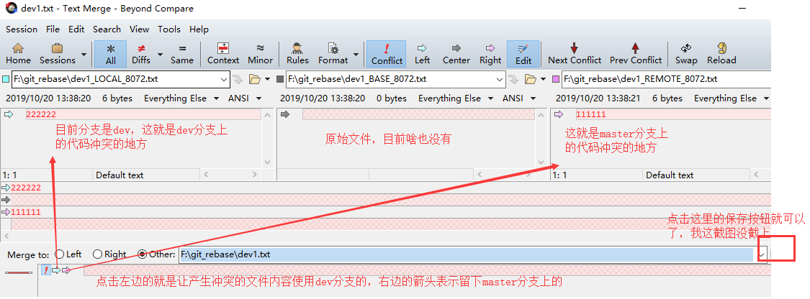

## Git 配合 Beyond Compare 来解决冲突

第一步： 安装 beyond compare 软件，下载地址：http://www.scootersoftware.com/download.php

直接点击下载安装，然后和安装其他软件一样，点点点就可以了。

第二步：在 Git 中进行以下配置

```bash
git config --local merge.tool bc3    # --local的意思是只对当前项目有效，其他的本地仓库是不生效的
git config --local mergetool.path '/usr/local/bin/bcomp'    # beyond compare的执行程序的安装路径
git config --local mergetool.keepBackup false
```

如果通过上面的指令配置不能正常生效的话，可以尝试改动以下配置文件。打开 `.gitconfig` 配置文件 （Windows 在 `C:\Users\Administrator [Administrator 为你当前用户名]`，macOS 在 `~/`），加入以下内容：

```ini
[merge]
tool = bc3

[mergetool "bc3"]
path = D:/Program Files (x86)/Beyond Compare 3/BCompare.exe    # 注意win下是这个/路径分隔符，文件路径尽量不要出现空格昂
```

第三步：应用这个软件来解决冲突 

当我们执行 merge 合并的时候，比如说，我们执行了一下 `git merge dev` 分支的指令，会报错。报一个代码冲突的错误，然后我们知道产生冲突了。此时我们就可以使用我们的 beyond compare 来进行冲突排查和修改。使用下面的指令来调用工具：

```bash
git mergetool
```

执行上面的指令之后，自动会打开 beyond compare，你会看到下面的页面： 

