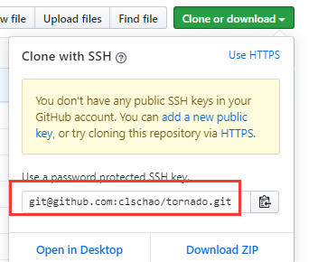

## Git 远程仓库免密登陆

其实之前的 git 版本在我们进行 push 的时候，每次都需要输入用户名和密码，很麻烦。好在出现了免密登陆的形式，可以让提交代码更方便。下面我们介绍三种免密登陆的形式。 

#### 在 url 中进行体现

仓库本来的地址为：`https://github.com/wuchao/dbhot.git`，我们可以把地址修改成：`https://用户名:密码@github.com/wuchao/dbhot.git`，这样就在使用远程地址的时候直接加上了用户名和密码，就不需要每次都重新输入了。

具体用法就是：

```bash
git remote add origin https://用户名:密码@github.com/wuchao/dbhot.git
git push origin master
```

上面的这种形式还可以通过修改配置文件来搞：找到项目的 `.git` 文件夹中的 config 文件，然后打开修改。这里我就不做演示了，简单看一下图吧：

 

#### 通过 SSH 实现（公私钥）

其实远程仓库的每个项目都可以获取一个 ssh 的地址，看图：

 

点击这个 `Use SSH` 之后，就看到下面的内容： 

 

这里我们看到了一个地址，其实这个地址是不能直接用的，需要下面的步骤才能通过它来进行免密登陆：

1. 先在自己的电脑上生成公钥和私钥，使用指令：

   ```bash
   ssh-keygen   #或者ssh-keygen -r rsa
   ```

   这样的话就会在 `C:\Users\<用户名>\.ssh` 目录下生成两个文件（macOS 和 Linux 是在 `~/.ssh` 文件夹下）

   

2. 拷贝公钥文件中的内容，放到GitHub的配置中：

   

   找到 GitHub 的 settings 配置：

   

   关联新的 SSH 公钥：

   

   然后添加一下公钥文件中的内容就可以了：

   

   然后可能会提示你确认密码：

   

   看到下面的页面，就已经配置好了 ：

   

3. 在本地的 git 中配置远程的 SSH 地址（注意区分 HTTPS 地址和 SSH 地址）：

   ```bash
   git remote add origin git@github.com:gitflowchao/gitflowtest.git
   ```

   

4. 以后再提交代码就不需要用用户名和密码了：

   ```bash
   git push origin master
   ```

#### git 自动管理凭证

其实你会发现，我们输入过一次用户名和密码之后，其实之后的操作一直也不需要再次输入用户名和密码了。因为 git 自动帮我们管理起来了。这个也在一个地方存着，大致了解即可。这种方式其实我们用起来比较方便，但是其实企业里面一般都是用的第二种，也就是 SSH 的那种。