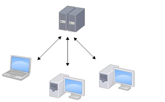

# Git 基本语法

### Git 的背景介绍

#### 版本控制与源代码管理

目前市面上比较流行的代码版本控制器有：git、svn、csv

2005 年 4 月3 日，Git 诞生。随后迅速发展为目前世界上最先进的分布式版本控制系统（没有之一）。

作用：源代码管理。

为什么要进行源代码管理？

- 方便多人协同开发[防止代码冲突，相互覆盖]
- 方便版本控制[利于以后的开发人员快速了解项目的开发过程，利于需求变更的时候进行代码回滚]

如果没有版本控制的话，为了保存之前的版本，我想应该也只能像我写毕业论文这样做了：


这样做混乱且不直观，所以要学习使用版本控制工具，比如 git。

#### Git 与 SVN 区别

SVN 都是集中控制管理的，也就是有一个中央服务器，大家都把代码提交到中央服务器。缺点是一旦中央服务器出问题，所有代码都要遭殃。

git 是分布式的版本控制工具，也就是说没有中央服务器，每个节点的地位平等。即便中央服务器出问题也没关系，因为每个节点都保存完整的代码版本。

SVN：



Git：


### Git 初始化

1. 下载安装。 下载地址： https://git-scm.com/downloads 每个系统的都有（Linux、macOS、Windows等）。看官网的安装教程，很详细，也很简单。安装好之后用法基本一样。

2. 首先创建一个文件夹，这个文件夹就是我们将来通过 git 来管理的所有文件的存放地点 。

3. 在文件夹中右键，然后点击 Git Bash Here：

   

4. 在弹出的窗口中执行初始化指令，让 git 帮我们对这个文件夹中的所有文件以及文件夹进行管理 

5. 创建 git 版本管理的本地仓库

   ```bash
   git init
   ```

6. 产生的 `.git` 文件夹用来存放你管理的文件的所有版本以及 git 配置相关的内容，不要轻易动它。

   

#### 仓库目录结构

```bash
branches    分支管理目录
config      当前项目仓库的配置信息
description 当前项目的描述
HEAD        当前项目仓库的当前版本信息
hooks       当前项目仓库的钩子目录（可以利用这个目录下面的文件实现自己拉取代码到服务器）
info        仓库相关信息
objects     仓库版本信息
refs        引用信息
```

### 简单指令使用

#### 基本操作

首先，创建一个 test.txt 文档，然后执行下面的操作：

```bash
git status    # 查看仓库中所有的文件夹和文件的状态
git status –s    # 简约显示
git add test.txt    # 让git管理单独的文件夹或者文件
git add .    # 管理所有文件和文件夹

# 配置用户名和邮箱
$ git config --global user.name <用户名>
$ git config --global user.email <邮箱地址>
# 例如：
$ git config --global user.name "刘硕"
$ git config --global user.email "liushuo432@outlook.com"

# 然后就可以提交版本了，看指令
git commit -m '描述信息'
# 例如：
git commit -m 'v1版本'
```


`git status` 和 `git status -s` 结果对比：


管理之后进行二次开发，修改一些文件之后：

```bash
git add test.txt
git commit -m 'v2版本'
```

#### 查看日志

```bash
git log   或者   git reflog
 
过滤查看日志
  git log –p 
  退出按【q】键
  ctrl+f向下分页
  ctrl+b 向上分页

显示指定日期之后的日志   git log --after  '2018-11-6'
显示指定日期之前的日志   git log --before '2018-11-6'

指定显示指定开发者的日志  git log --author 'lisi'
```


#### 简单总结

1. 进入要管理的目录
2. `git init` 初始化  即：让 git 管理我们当前的文件夹
3. `git status` 检测当前文件夹中的文件状态
4. 三种颜色的变化
   - <span style="color:red;background-color:black">红色</span>：新增文件或者修改的老文件，都在工作区 --> 执行 `git add .`（或者单个文件或文件夹的名称）  
   - <span style="color:green;background-color:black">绿色</span>：git 已经管理起来了，在暂存区 --> 执行 `git commit -m '描述信息'`
   - <span style="color:white;background-color:black">白色</span>：生成版本了，在版本库
5. `git log` 查看版本记录

### Git 三大区域

介绍：工作区（写代码的地方）—— git add 暂存区（临时存储）—— git commit 本地库（历史版本）

- 工作区：就是在你本要电脑磁盘上能看到的目录。
- 暂存区：一般存放在 `.git` 目录下的 index 文件（`.git/index`） 中，所以我们有时也把暂存区叫作索引。
- 版本库：工作区有一个隐藏目录 `.git`，这个不算工作区，而是 Git 的版本库。git 中的 `head/master` 是分支，是版本库。

Git 工作区、暂存区和版本库：


工作区有一个隐藏目录.git，这个不算工作区，而是Git的版本库。git中的head/master是分支，是版本库。

  

Git 的版本库里存了很多东西，其中最重要的就是称为 stage（或者叫 index）的暂存区。还有 Git 为我们自动创建的第一个分支 master，以及指向 master 的一个指针叫 HEAD。

文件往 Git 版本库里添加的时候，是分两步执行的：

1. 用 `git add` 把文件添加进去，实际上就是把文件修改添加到暂存区。
2. 用 `git commit` 提交更改，实际上就是把暂存区的所有内容提交到当前分支。

### Git 回滚

假如我们现在写了三个版本了，但是你发现第三个版本有问题，或者说被迫的下线第三个版本添加的新功能，那么我们是不是要将代码回到第二个版本的状态啊，如果我们自己手动去修改是不是就非常的麻烦了，所以此时就用到我们git回滚功能了 。

```bash
git log    # 查看日志，每个版本都有版本号
```

 

Git 回滚操作指令

```bash
git reset --hard 版本号
# 例如：
git reset --hard 190af3bcac3eb5c3c7b5e2f78fd71da6023ed86c    # 第二个版本的版本号
```

不过，后来你又觉得第三个版本的功能还是挺好的，接着拿回来用吧。但是我们已经回滚到第二个版本了啊，这可怎么办？

先尝试执行 `git log`，却发现，`git log` 里面没有显示我们原来的第三个版本：


此时我们不能用这个指令来查看了，需要下面这个指令：

```bash
git reflog    # 也是查看日志，但是包括回滚操作的版本
```


再通过命令来回滚。一般情况下，我们没必要输入完整的版本号，只需要输入前六七位，足够区分版本即可：

```bash
git reset --hard 3e7bff2
```

Git 的强大之处，在于能够让我们在任意版本之间来回切换。 

除了指定版本号，我们还可以通过指定据当前版本的版本数目来回退版本：

- `HEAD` 表示当前最新版本

- `HEAD^` 表示当前最新版本的前一个版本

- `HEAD^^` 表示当前最新版本的前两个版本，以此类推……

- `HEAD~1` 表示当前最新版本的前一个版本

- `HEAD~10` 表示当前最新版本的前 10 个版本，以此类推……

  ```bash
  git reset --hard HEAD^^^^^
  ```

我们接着学两个指令：

```bash
git checkout -- 文件名    # 将文件从已修改的工作区回滚到未修改的状态
```


如果我们将修改的文件已经添加到了暂存区了，又怎么回滚呢？看指令

```bash
git reset HEAD 文件名
```


如果想让他再回到未修改时的状态，那么就又用到了我们那个 `git checkout -- 文件名` 那个指令了 。

关于回滚，git 里面还有几个其他的指令，就不一个一个的演示了，大家看图就明白了： 


#### 指令总结 

```bash
git status    # 查看暂存区和改动文件的差别
git init
git add
git commit
git log
git reflog
git reset --hard 版本号    # 回滚版本
git checkout -- 文件名    # 将已修改的文件恢复成修改前的状态
git reset HEAD 文件名    # 将文件从暂存区放回修改区
```

#### Git 文件状态

针对与文件所处的不同分区，文件所处的状态:

- 未追踪：文件第一次出现在工作区，版本库还没有存储该文件的状态

- 已追踪：只要第一次，`git add` 了文件，文件就已被追踪

- 未修改：文件在工作区未被编辑

- 已修改：文件在工作区被修改

- 未暂存：文件已修改，但是没有 add 到暂存区

- 已暂存：已经将修改的文件 add 到暂存区

- 未提交：已暂存的文件，没有 commit 提交，处于暂存区

- 已提交：提交到版本库的文件修改，只有 commit 以后才会有仓库的版本号生成

### Git 分支

分支可以给使用者提供多个开发环境，也就是说可以将你的工作从主线中分离出来，以免影响开发主线。等分支的代码开发完之后，再合并到主线代码上。就比如说，我们写了一个毕业论文，大致的流程写完了，但是我们可能觉得某些地方写的太少了（添加新功能），需要丰富一下。或者有些地方可能写的有问题需要调整一下（之前的代码有 bug，需要修改），那么我们怎么做呢，是不是会复制一份这个论文，然后再修改，改完之后如果没有什么问题，就将改完之后的作为了最新的版本（分支上添加了新功能或者修复了 bug，然后进行分支合并）。

大家在这里先不用去考虑公司里面到底是怎么使用 git 来进行工作的。我们首先先来看看，如果你在自己的电脑上开发程序，用 git 是怎么个流程，怎样开分支，分支是个什么样子。

比如，我们现在的代码开发到了第三个版本。之前我们没有说什么分支的概念，其实我们开发代码的时候，默认的分支叫做主分支（master 分支），只是我们一直还不知道。

  

#### 指令总结

```bash
git branch    # 查看当前分支
git branch dev    # 创建一个名为dev的分支
git checkout dev    # 将工作切换到dev分支上

git checkout -b dev    # 创建并切换到dev分支上，和上面两个指令的效果一样

git checkout master
git merge bug    # 分支合并---首先切换到master分支，然后在master分支上执行merge指令来合并bug分支的代码

git branch -d bug    # 删除bug分支
```

#### 分支冲突处理

我们在 test.py 中开发文件，里面有 test1、test2 和 test3 三个功能：


假如我们现在想给我们的代码添加一个新的功能 test4，那么我就创建了一个 dev 分支，并在 dev 分支上添加了 test4，比如说 test4 需要打印两行内容：


但是我现在写了一行内容的时候，发现之前线上使用的代码（线上使用的代码一般是 master 分支上的），出现了 bug。那么我们需要切换到 master 分支，并且在 master 分支上再创建一个 bug 分支，在 bug 分支上修复 bug。


修复完成之后，需要合并到 master 分支上，合并之后的版本我们暂且称为 v7 版本。


记着，v7 版本的代码和 dev 开分支时的 v6 版本代码是有些变动的，因为修复了 test3 中的 bug。但是 dev 分支上还是使用的 master 分支上的 v6 版本进行的新功能的开发。那么 bug 修复完之后，我们现在又要回到 dev 分支上继续新功能的开发，开发完成之后，需要合并到 master 分支上。合并的时候，你会发现报了一个错误。其实也不是错误，就是提示你，代码有冲突：


这冲突怎么来的？你想，master 分支已经到了 v7 版本，但是 dev 分支上的代码还是从 master 分支的 v6 版本的基础进行添加新功能的.所以合并的时候 v7 版本的其他代码（这里是 test3 中的代码）和它 v6 版本的代码本身就有一些不一样的地方（就是那个 bug 修复的地方），所以出现了冲突的问题。

那么怎么办呢？没办法，我们只能手动来修复冲突。

怎么修复呢？git 会将所有的冲突全部标记在你的代码文件中。有冲突的方法，找到它手动修改一下就可以了。其实，只要我们两个分支中的相同的文件的同一行出现了不同的内容，合并时就会出现冲突。

出现了 bug，我们看看 bug 在哪里。其实 git 会将冲突在你的代码文件中标识出来，看图：

 

这里提示你了，dev 分支上是哪些内容，master 分支上是哪些内容。我们把没用的删除就可以了，然后提交一个新的版本。这样就完成了分支代码合并。比如改成这样：


### Git 工作流

看图：

 

公司一般最少有两个分支，master 只保留正式（线上）版本，dev（develop）分支，开发都在 dev 分支上搞。 