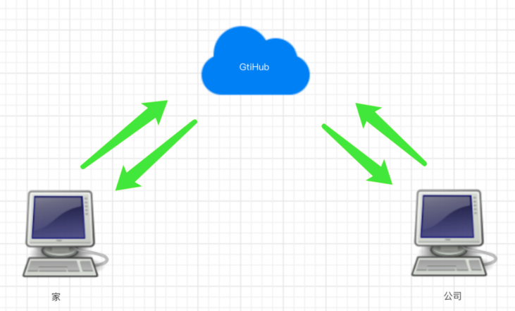
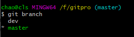

## GitHub 代码管理仓库

我们做开发的时候，写程序，可能会有多个人一起开发，或者你自己有多个电脑，家里一个电脑，办公室一个电脑。但是你如果刚开始的代码都是在家里的电脑写的，然后你到了公司，你想继续开发你的程序，那么就需要你自己来回的拷贝自己的代码，并随身携带，非常麻烦。

于是就出现了代码网络托管站（就类似于行李托管站一样），可以帮你保存你的代码，以及各个版本的代码和所有分支。这样的话，你在家里开发完了之后，把代码放到托管站，就不用自己随身携带了。等到了公司，使用公司的电脑开发的时候，就可以直接通过网络托管站把自己已经开发好的代码拉下来到自己的本机，然后继续开发。开发完了之后，在交给托管站托管，这样就方便多了。

这样的托管站有很多，比如今天我们要说的 GitHub，还有 GitLab、码云、开源中国、CSDN 等都在做代码托管平台。 其实这些代码托管平台的用法大同小异，了解了 GitHub 的用法，其他的平台也都信手拈来了。

 

	使用 GitHub 有这么几步：

1. 注册 GitHub 账号
2. 创建仓库
3. 本地代码推送到仓库

### 注册 GitHub 账号

注册就很简单了，网址： https://github.com/  。点击右上角的 `Sign up` 就可以注册了
 

注册号账号之后，点击上面的 `Sign in` 进行登陆，登陆成功之后，会来到这个页面，也就是你的首页 

 

### 创建仓库

也就是我们说的托管站里面开辟一个自己的代码托管的空间，看操作 

 

然后会看到下面的页面，看介绍 

 

创建好之后我们会看到下面这个页面，其实在 GitHub 这个托管站上，就相当于我们创建了一个叫做 dbhot（就上面我起的那个仓库名称）的文件夹，用来管理我们的项目。 

 

### GitHub 保存代码

将我们的代码和分支推送到 GitHub 上保存 

打开我们的终端，也就是我们那个 `git bash`，查看一下状态。


然后看一下推送代码的指令：


查看一下当前的分支



然后执行指令：

 

然后执行它：

 

会给你弹出一个窗口，让你输入 GitHub 的账号和密码，这里我的截图失败了，导致大家在这里看不到效果了，但是没关系，你应该可以搞定的。然后接着看：

 

等代码都推送成功了之后，我们来 GitHub 上刷新一下我们的仓库页面，就会看到变化了：


推送一下 dev 分支到 GitHub 上：


刷新我们的 GitHub 页面，就看到有两个分支了


### 拉取 GitHub 上的代码继续开发

换一个电脑，然后拉取 GitHub 上的代码继续开发，我这里简单模拟一下，就在本地重新创建一个文件夹了，然后在这个文件夹里面来搞我们的代码。

比如：我又创建了一个 gitpro2 文件夹，然后在这个目录里面使用我们的 `git bash`：

 

在这里面克隆一下远程 GitHub 上的代码到我们的这个文件夹里面：

先看一下我们远程仓库的地址是什么，看 GitHub：

 

然后执行下面的指令： 

```bash
git clone 地址
# 例如：
git clone https://github.com/clschao/dbhot.git
```

然后整个仓库就被我们克隆下来了（包括所有分支，所有代码，所有版本），在我们的 gitpro2 文件夹里面了，然后我们需要进入到仓库里面才能看到我们的代码： 

 

 

查看一下分支： 

 

切换到 dev 分支上试试，通过查看提交的版本，你会发现就是我们之前的 dev 分支： 

 

### 换一个电脑继续开发指令总结

#### 上传代码

1. 给远程仓库起名
   
    ```bash
    git remote add origin 远程仓库地址
    ```
    
2. 向远程推送代码
   
    ```bash
    git push -u origin 分支
    ```

#### 在新电脑上第一次获取代码

1. 克隆远程仓库代码
   
    ```bash
    git clone 远程仓库地址    # 内部已实现git remote add origin 远程仓库地址
    ```
    
2. 切换分支
   
    ```bash
    git checkout 分支
    ```

在新电脑上进行开发
1. 切换到 dev 分支进行开发
   
    ```bash
    git checkout dev
    ```
    
2. 把 master 分支合并到 dev（仅一次）
   
    ```bash
    git merge master
    ```
    
3. 修改代码

4. 提交代码
   
    ```bash
    git add .
    git commit -m 'xx'
    git merge master    # 推送前的好习惯，和master分支合并
    git push origin dev
    ```

回老电脑上继续写代码
1. 切换到 dev 分支进行开发
   
    ```bash
    git checkout dev
    ```
    
2. 拉代码

    ```bash
    git pull origin dev
    ```

3. 继续开发

4. 提交代码

    ```bash
    git add .
    git commit -m 'xx'
    git merge master    # 推送前的好习惯，和master分支合并
    git push origin dev
    ```

开发完毕之后，在 dev 分支上 commit。然后切换到 master 分支上合并一下 dev 分支，然后推送到 GitHub 上的 master 分支，就算是完成了 。

最后，因为我们 dev 分支上也是最新的代码了，也可以将我们的 dev 分支推送到 GitHub 上的 dev 分支上。推送之前有个好习惯就是在 dev 分支上合并一下 master 分支的代码 `git merge master`，不强制要求，但是个好习惯。

以后如果我们还想继续开发，我们可以将我们的 dev 和 master 分支上的最新的代码都拉下来进行继续开发：

```bash
git pull origin dev
git pull origin master
```

### **如果在公司忘记提交代码，怎么搞？** 

在公司开发的时候
1. 拉代码
   
    ```bash
    git pull origin dev
    ```
    
2. 继续开发

3. 提交代码
   
    ```bash
git add .
    git commit -m 'xx'
    git merge master    # 推送前的好习惯，和master分支合并
    # 注：在这里忘记push了,没有推给GitHub
    ```

回到家继续开发
1. 拉代码，发现在公司写的代码忘记提交到 GitHub 上了
   
    ```bash
    git pull origin dev
    ```
    
2. 继续开发其他功能
    但是在家里写的功能有可能和你在公司开发的代码有些冲突（在同一行）
    
3. 把 dev 分支也推送到了远程
   
    ```bash
    git add .
    git commit -m 'xxx'
    git merge master    # 推送前的好习惯，和master分支合并
    git push origin dev
    ```

第二天到了公司继续写代码
1. 拉代码，把昨天晚上在家里写的其他功能的代码拉到本地（有合并、可能产生冲突）
   
    ```bash
    git pull origin dev
    ```
    
2. 如果有冲突,手动解决冲突（公司电脑上昨天忘记 push 的代码和昨日回到家后写的代码可能有些冲突）

3. 继续开发其他功能

4. 把 dev 分支也推送到远程
   
    ```bash
    git add .
    git commit -m 'xxxx'
    git merge master    # 推送前的好习惯，和master分支合并
    git push origin dev
    ```

其实 `git pull origin dev` 等价于下面两个指令： 

```bash
git fetch origin dev   #将远程仓库dev分支的代码拉到本地git的版本库中，为了和本地dev分支做个区分，远程拉下来的dev分支会叫另外一个名字：origin/dev  
git merge origin/dev  # 合并远程拉取下来的dev分支的代码
```

看图：

