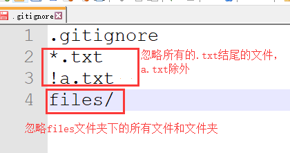
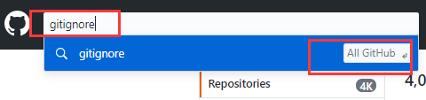
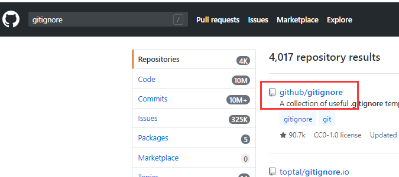

## Git 忽略文件 .gitignore

我们让 git 管理文件的时候，可以设置一些让 git 忽略的文件或者文件夹。通过一个叫做 `.gitignore` 的文件，告诉 git 那些文件或文件夹不需要它帮我们进行版本控制。

首先在我们的 git 本地仓库中创建一个这样名为 `.gitignore` 的文件，文件中写上一下内容，看例子：

添加让 git 忽略的文件：

 

还可以添加 `.gitignore` 自己，通过 `*.txt` 能够将所有的 `.txt` 结尾的文件全部让 git 忽略掉：

举个会用到 gitignore 的例子：当我们使用 python 语言的 django 框架来进行代码开发的时候，这个框架会自动生成一个 sqlite 数据库文件在项目中。其实这样项目将来在我们提交代码的时候，往往是不需要提交的。所以就可以将它设置为忽略。

gitignore 文件中还有下面的一些写法：

其实我们在写项目的时候，不管你用什么开发语言，其实都会有一些你关注不到的，但是自动生成的，还不需要提交的一些文件。GitHub 给我们提供了一个各种开发语言的一个可忽略的文件汇总，只需要将对应语言的文件中的内容拷贝到我们的 gitignore 文件中，然后根据实际情况稍作修改就可以了。看下图，在 GitHub 中搜索 gitingore。

然后看到下面的内容： 地址：https://github.com/github/gitignore

然后： 

注意，在公司进行开发的时候，一定要加上 gitignore，不然容易将一些敏感的信息提交到远程，不安全。