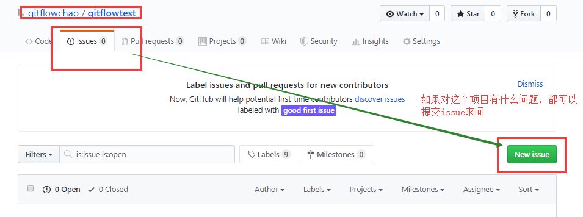
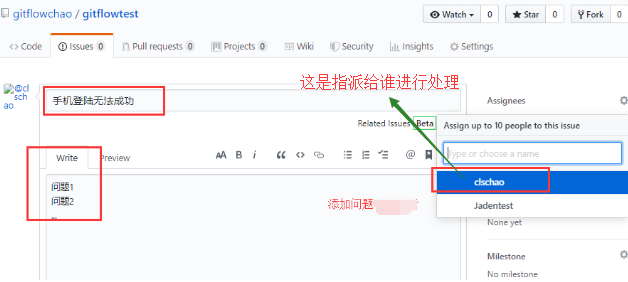
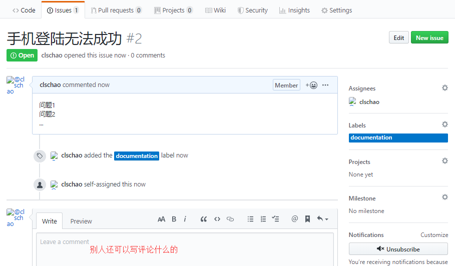
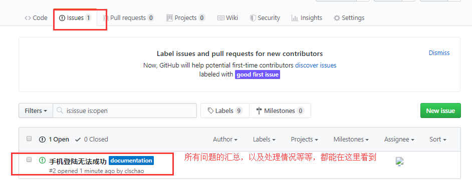

## GitHub 做任务管理相关 Issues 和 Wiki

### issues

issues 就是问题，在项目使用过程中遇到了什么操作上的问题，或者发现了什么 bug，可以通过提交 issues 向作者反映。具体做法很简单，点点点就行了：

然后看下图：

还可以看下图，给问题打个标签，你是提的bug啊还是文档啊还是什么的。

还可以做bug管理，比如你提的这个问题是个bug，你可以选择bug类型，然后指派给别人进行处理。

然后我们再点击上面这个issues选项，会看到下面的页面：

### 2.wiki

项目介绍，百科，其实写一个项目，都需要写wiki，来做项目的整体描述和说明，其他人来参与项目的时候，先看wiki。

然后看到下面的页面：

到这里，我们的git就学完了，谢谢大家！