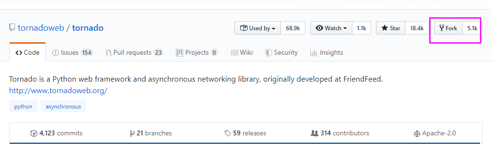
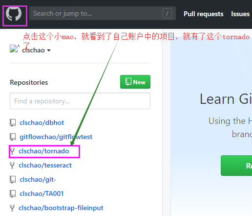
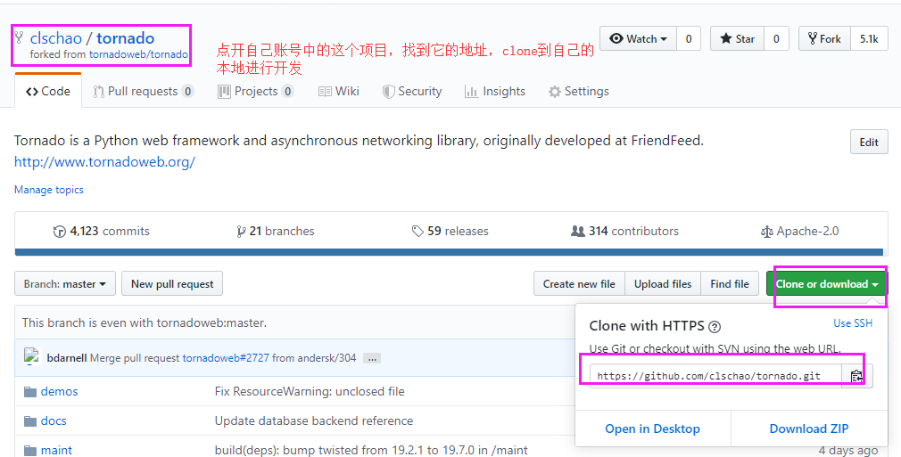
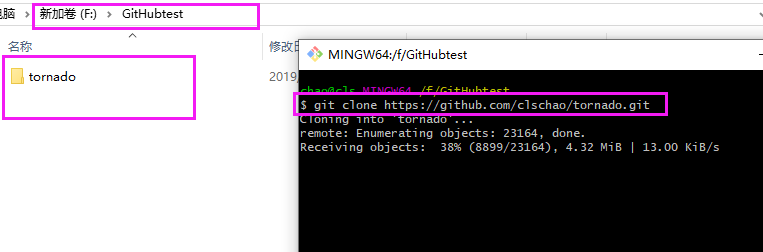
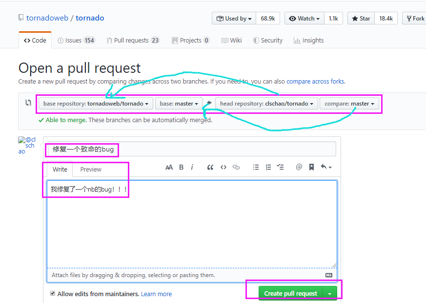

## 给开源项目贡献代码

### 找项目

找到一个项目，比如 tornado 框架。直接在 GitHub 上搜索 tornado 就可以了：

如果你发现这个框架有 bug，或者是有些功能不够完善，那么我们就可以拿来进行修改。

### fork

先进行 fork。点击一下 fork 就能够将这个项目放到自己账号的空间中了。其实就是将别人仓库中的代码拷贝到了自己的账户中：

然后会看到下面的页面：

选择自己的账户之后，就可以在自己的账户中看到这个项目了，看下图：

### 在自己的仓库中修改代码

就又回到了我们之前的流程。

然后在本地创建文件夹，clone 代码：

比如，我创建了一个 bug 文件。写上一些内容，然后提交 push 到自己远程仓库中的这个 tornado 项目里面。

### 提交 pull request

给源代码作者提交修复 bug 或者拓展功能的申请，其实就是提交一个 pull request。

这样我们添加的 `bug.txt` 文件就保存到了我们的远程仓库的 tornado 项目中了。

然后如果我们想将修改的内容提交给源代码的话，需要发一个 pull request 申请：

然后看到下面的页面：下面是你的仓库中的这个项目的 master 分支往源代码的作者的仓库中的 master 分支上请求合并。只要点击 pull request，那么申请就发过去了，如果人家合并了你的申请，你就 nb 了。

这就是为开源项目贡献代码的过程。

