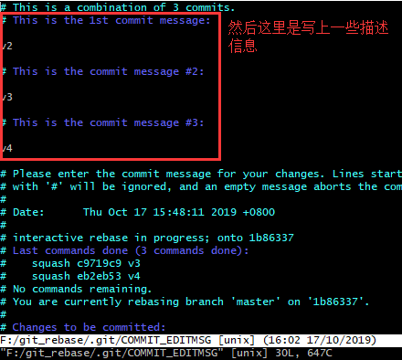
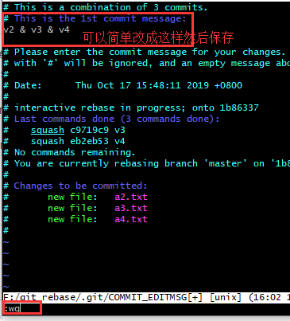

## rebase 变基

这个 rebase 和前面学的东西关联性不大，是一个独立的概念。rebase 能够让我们的 git 提交记录变得非常简洁，看图：

 

### rebase 的第一个场景

比如看下图，我重新创建了一个文件夹，里面创建了 4 个文件，每创建一个文件就提交一个版本，现在有下面 4 个版本了，但是 v2、v3 和 v4 版本只是一些没有太大改动的版本，你想把这些记录合并成为一个，就用到了我们的 rebase：

 

方式 1：

将指定版本号的版本一直到当前最新版本全部合并到一起

```bash
git rebase -i 版本号
# 例如：
git rebase -i 281f2525fb3600b663a6554ed9e301781239bd69    # 这个是v2版本的版本号，那么执行这个指令的意思就是将v2版本一直到目前最新版本v4，全部合并到一起
```

方式2：常用

以当前最新版本为基准，合并指定数目的版本

```bash
git rebase -i HEAD~3    # 3表示合并3个版本，而HEAD~3的意思是以当前最新的版本开始，合并最近的三个版本，也就是v4、v3、v2将合并到一起
```

那我们执行一下 `git rebase -i HEAD~3` 这个指令看一下效果，执行完之后你会看到这样一个界面： 

 

然后修改 ：

 

然后你会看到下面的页面： 

 

然后我们在描述信息的地方可以改一些描述信息，比如改成下面的样子： 

 

 

这样我们的提交记录就更加简洁了，但是有个注意事项，**<u>如果你合并版本之前，已经将v2版本push到远程了，这样你再合并v2版本的话，等你再push到远程会导致远程的版本变的很混乱，所以建议不要将已经push到远程的版本进行合并，我们最好只合并自己本地的，然后再push到远程。</u>** 

### rebase 的第二个场景 

看图：

 

操作流程：

1. 创建 dev 分支和切换到 dev 分支上

   ```bash
   git branch dev
   git checkout dev
   ```

2. 创建一个 `dev.txt` 文件

3. 提交版本

   ```bash
   git add .
   git commit -m 'dev branch'
   ```

4. 切换到 master 分支上

   ```bash
   git checkout master
   ```

5. 创建一个 `master.txt` 文件

6. 在 master 分支上提交一下最新添加的 master.txt 文件也作为 master 分支上的一个版本

   ```bash
   git add .
   git commit -m 'master branch'
   ```

在 dev 分支上执行一个 `git log` 查看一下 dev 分支提交的版本
在 master 分支上执行一个 `git log` 查看一下 master 分支提交的版本

```bash
git log --graph    # 图形化界面显示所有的提交记录
git log --graph --pretty=format:'%h %s'    # 让图形化界面显示记录的时候更清晰一些：%h是显示版本号，%s是显示版本描述。
```

到目前为止，我们就做出了上面那个图的效果，在 dev 分支上有一个版本，在 master 分支上有其他的版本。


那么以后我们再开发的时候，可以通过 rebase 来让 dev 分支上的记录合并到 master 分支上。那么我们在 master 分支上再查看 `git log --graph` 的时候就只能看到一条线的记录了
现在我们通过 rebase 来合并一下 dev 分支上的版本，让git log显示的记录编程一条线

1. 切换到 dev 分支

   ```bash
   git checkout dev
   ```

2. 注意，因为 dev 分支上的代码没有 master 分支上的全，所有先合并一下 master 分支，然后再进行后面的操作

   ```bash
   git merge master
   ```

3. 创建一个 `dev1.txt` 文件

   ```bash
   git add .
   git commit -m 'dev branch commit 1'
   ```

4.  切换到 master 分支

   ```bash
   git checkout master
   ```

5. 创建一个 `master1.txt` 文件

   ```bash
   git add .
   git commit -m 'master branch commit 1'
   ```

6. 这样的话我们在 dev 分支上有个版本，master 分支上又一个版本

7. 再次切换到 dev 分支

   ```bash
   git checkout dev
   ```

8. 将 dev 分支上的这个新记录并到 master 分支的记录上

   ```bash
   git rebase master
   ```

9. 切换回 master 分支

   ```bash
   git checkout master
   ```

10.  合并分支

  ```bash
  git merge dev
  ```

11. 然后我们再执行日志查看命令，就看到了一条线，并且这条线上有dev分支开发的那个版本

   ```bash
   git log --graph
   ```


### rebase 的第三个场景

不做演示了，看看图吧：

 

其实第三个场景有点类似我们的第二个场景。不过是产生在当我们执行 pull 的时候，如果本地代码和远程的代码有冲突，会导致我们本地的分支进行 git log 日志的分叉。为了防止这种分叉，我们使用 fetch 和 rebase 两个指令来代替，rebase 也能够合并代码。（这个就作为了解吧）

注意：既然 rebase 操作其实也是合并代码的操作，那么我们如果在进行 rebase 指令的时候，代码有冲突怎么办？手动解决冲突，然后执行一下 git 提示的指令，比如git add等。然后执行一个 `git rebase --continue`，来继续执行 rebase 指令就可以了。