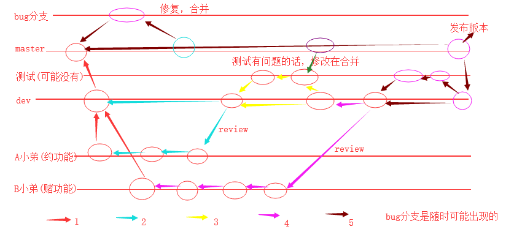

## Git 多人协作开发

多人协作开发 gitflow 工作流思路，看图：

 

创建新项目，我们来玩一下整个工作流。

### 创建组织

先去我们远程的 GitHub 上创建一个组织（其实还有另外一种邀请其他人员进行协同开发的方式，不适合公司内部开发，所以我们给大家说一种正规的，就是创建组织）。

 

然后进入这个页面： 

 

再然后进入这个页面：

 

点击 next 会看到下面的页面： 

 

然后 skip 之后，我们看到下面的页面： 

 

点击创建仓库之后，就又到了我们创建仓库的页面： 

 

然后就看到了我们仓库，这样我们的组织和仓库就创建好了。 

**注意，我们现在创建的项目仓库是在我们创建的组织里面创建的，和之前单纯的创建仓库是不太一样的，因为我们公司将来可能有多个项目，那么我们就可以通过这个组织来管理多个仓库就可以了。** 

好了，创建我们的本地 git 仓库，然后关联一下我们远程的这个仓库（和远程仓库名称要一致）。执行一下 GitHub 上创建仓库后提示的指令就可以了： 

 

 

然后刷新一下我们的 GitHub 页面，就看到了我们 push 上来的代码了： 

 

到这里我们的仓库就创建好并且和本地关联好了，那么我们继续学一个新东西，叫做 tag（标签）。公司一般都是用标签来管理版本的。比如看下图，我们 `git log` 查看一下当前版本： 

 

这样去看版本的时候，一长串的版本号看着其实不太好看，我们就可以给这个版本打上一个标签 tag。

#### Git 标签

看指令： 

```bash
git tag -a 'v1' -m '第一版'
```

再看 `git log`：

 

此时，我们就给第一个版本打上了一个标签，我们还需要将他推到远程仓库：

```bash
git push origin --tags    # 将所有的tag推送到远程仓库 
```

执行完这个指令之后，我们再去 GitHub 上看一下： 

点击 release 看一下： 


创建组织，创建仓库，关联仓库，给版本打标签，我们就学完了，接下来我们学一下如何邀请其他成员。 

### GitHub 组织中邀请成员

按照我们的 gitflow 工作流程图来看，此时我们的 master 分支和第一个版本已经创建好了。接下来，我们应该创建一个 dev 分支，然后邀请其他成员来完成其他功能的开发。

#### 创建 dev 分支

```bash
git checkout -b dev
```

 

#### 将 dev 分支推送到远程

```bash
git push origin dev
```

查看一下 GitHub，就有了我们的 dev 分支： 

 

#### 邀请两个成员

1. 两个成员都需要先去 GitHub 上注册一下自己的 GitHub 账号。其他的代码托管平台也是这么玩，先去注册账号。这里我自己又通过其他的邮箱创建了一个名为 shuoliuchina 的账号，用它来测试。

2. 邀请成员


然后看到下面的页面：

 

输入成员名称，然后点击 invite，看到下面的页面，先选择一个普通成员就行了（期间可能会要求输入密码）： 

 

那么这个 shuoliuchina 在创建账户时留下的邮箱就会收到一个邮件，点击查看这个邮件，然后点击加入组织：

 

然后会看到下面这个页面：

 

再点击 join 加入就可以了。但是记着，上面的页面是出现在了 shuoliuchina 这个 GitHub 账户中的页面。所以如果你是用一个电脑在玩，需要先登陆上这个账户，再点击邮件加入组织。


看一下 GitHub 我们的组织中 people 这个选项中，就有了两个成员： 

 

重新登陆回我们的 shuoliuchn 这个账户，然后看一下组织的权限以及项目的权限。

##### 组织权限

在组织的 settings 中：

 

因为我们的组织中可能有很多的项目，而我邀请的成员不能说上来就对所有的项目都有修改的权限，所以是只读的，可以看看。那么如果我们想让某些成员对某些项目有修改的权限，就需要到项目中去做相关设置。

##### 项目权限

点击项目，在项目页面的 settings 中：

 

这样的话，这个 shuoliuchina 成员就有了对我们这个 gitflowtest 项目的修改权限了，也就是可以正常的推送代码了。

成员已经邀请好了，然后这个成员需要在自己的本地将我们远程仓库的项目下载到自己的本地，比如我在本地创建了一个 shuoliuchina 的文件夹作为它自己的本地 Git 仓库。

##### 新成员进行项目协作开发

将我们的远程仓库的这个 gitflowtest 项目的地址给他：

 

然后他在自己的本地下载我们的代码，使用 `git clone` 命令：

 

进入到 gitteamtest 文件夹中，就看到了我们远程仓库中的所有内容。进入这个文件夹，然后再运行一下 `git bash`：

 

开始开发 yue 功能。比如，开发就创建了一个 `yue.py` 文件，然后这个成员就要回家了。临走前将自己开发的文件推到远程仓库（如果是 shuoliuchina 这个账号第一次 push，可能会要输入用户名和密码）：

 

然后回到家之后，继续又想开发了：

 

接下来需要干什么呢？需要代码的 review，一般是小组长或者技术主管或者总监等。怎么做呢，一般是通过 pull request。 

##### pull request 合并请求

首先我们的 GitHub 上的项目中进行一些配置：

 

点击添加规则按钮之后，我们一下页面： 

 

然后点击最底下那个绿色的 create 按钮，然后再点击一下左边的 branches 菜单： 

 

其实 master 分支也可以继续添加一个这样的规则，这里我就不做演示了。 

然后我们的 shuoliuchina 成员将 yue 功能开发完了，需要提交一个 pull request 请求。在哪里做呢？在他自己的 GitHub 上。比如我们登陆一下这个用户，然后看一下 GitHub 上的操作：

 

点击这个 `New pull request` 按钮，就进入到提交 pull request 的页面：

 

然后我这个管理员 shuoliuchn 就能在自己的 GitHub 上看到 shuoliuchina 这个成员发来的请求了：

 

然后点击这个 yue 功能，进来之后，点击 `Add your review`：

 

然后就看到下面所有的文件以及代码了：

 

然后看到下面的页面：

 

然后切换会我们的这个页面：

 

然后还需要确定一下：

 

还可以删除这个分支，如果没有用了，就可以点击下面的按钮进行删除：

 

然后再看我们的远程仓库中的 dev 分支，就有了这些 shuoliuchina 新开发的代码了：

 

然后其他成员就可以在自己的本地通过 `git pull origin dev`，就能将自己的本地的代码变成最新的了。 

如果是做测试的，一般是从我们的 dev 分支上去获取代码进行测试。测试如果出现了 bug，开分支进行修复，然后再合并会dev分支，然后再测试。没有问题的话，合并到 master 分支上，然后进行项目上线。 