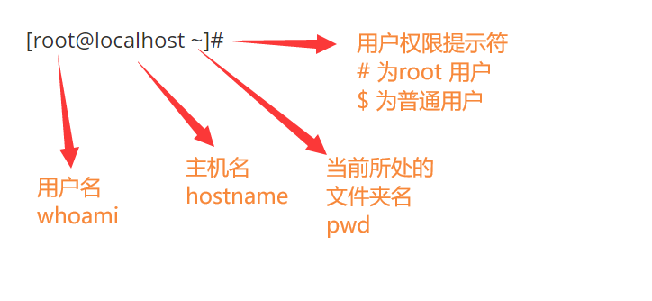

## Linux 基本的文件增删改查命令

[TOC]

在这里，介绍一些 Linux 系统中简单的文件增删改查命令
语法，Linux 的语法格式为：

```
命令   可选参数   你要操作的对象
```

### 增

#### mkdir 创建文件夹

mkdir 命令用于创建新的文件夹，可使用相对路径或绝对路径创建：

```shell
mkdir  test  # 创建名为test的文件夹，等同于 mkdir  ./test
mkdir  /tmp/linux
```

若要同时创建两个或多个文件夹，可以用空格分隔开，例如在 test 目录中创建 boy 和 girl 两个文件夹：

```shell
cd  test
mkdir  boy gilr
 # 另一种写法：
mkdir  /root/test/{man,woman}    # 注意不要乱加空格
```

mkdir 默认是无法创建多层文件夹的。若要创建多层文件夹，需要指定 `-p` 参数递归创建文件夹：

```shell
mkdir  -p  /root/test/男同学/豹哥
```

#### touch 创建文本文件

 使用 touch 命令的可以创建普通文本文件，也就是用来存放字符串的文件：

```shell
touch 今天学Linux贼开心  # 创建一个文本文件，文件名为："今天学Linux贼开心"
```

### 删

#### rm 删除

rm，即 remove，用来删除文件或文件夹（Linux 中一切接文件，所以文件夹也是一种文件）。其基本语法为：

```shell
rm  可选参数   文件名
```

例如，删除 `test.txt` 文件：

```shell
rm test.txt  # 默认会让用户确认是否删除，输入y删除，输入n取消
```

如果需要强制删除文件，不必给我们提示，可以在删除的时候加上 -f 参数：

```shell
rm -f  test.txt
```

注意！！`rm -f` 是强制删除文件，不给用户任何提示，危险慎用！！！

注意！！`rm -f` 是强制删除文件，不给用户任何提示，危险慎用！！！

注意！！`rm -f` 是强制删除文件，不给用户任何提示，危险慎用！！！

rm 命令默认只能删除文件。若要删除文件夹，需要加上 -r 参数。此时，会递归删除指定文件夹以及其中全部内容：

```shell
rm -r  /test  # 递归删除根目录下的浩哥，及其子文件夹
```

同样地，对于每个即将删除的文件/文件夹，系统都会向用户再次确认。只有当用户输入 y 确认后，才会删除掉。

接下来要提到的命令，很好用，但也很危险，一定要看仔细了。

危险命令！！！！！！！！！！！慎用！！！！看好了

危险命令！！！！！！！！！！！慎用！！！！看好了

危险命令！！！！！！！！！！！慎用！！！！看好了

如果文件夹中的内容过多，我们不想每个文件都确认一下，可以使用 -rf 参数，强制递归删除文件和文件夹，且不会给用户任何提示。

因为不会有提示，所以敲命令时一定要仔细，其用法为：

```shell
rm  -rf  /tmp/*  # 删除tmp下所有内容 
rm  -rf  /tmp/   # 不加*是会直接删除这个文件夹
```

下面这条命令，无论何时何地，断然不要用！！！

下面这条命令，无论何时何地，绝对不要用！！！

下面这条命令，无论何时何地，千万不要用！！！

```shell
rm -rf /*    # 删除所有文件
```


### 改

#### cd 切换目录

cd，即 change  directory 更改目录。其用法为：

```shell
cd  /   # 切换目录到 根目录下  
cd  ./tmp   # 切换到当前目录下的tmp文件夹中
```

#### exit 退出 Linux

exit 命令用来退出 Linux 系统：

```shell
exit
```

#### clear 清空屏幕

clear 命令用来清空屏幕，删除屏幕中显示的左右内容：

```clear
clear
```

#### hostnamectl 主机名控制

```shell
hostnamectl   set-hostname  linuxlearning # 修改主机名，重新登陆生效
```


#### Linux 的特殊重定向符号

```
>  # 重定向输出覆盖符，类似于Python的w模式，覆盖写
>> # 重定向追加输出符，类似于Python的a模式，追加写入

<  # 重定向写入覆盖符，数据库数据导入时候用到
<< # 重定向追加写入符
```
我们用的比较多的是前两个符号，作用是将前一个命令输出的内容写入到文件中：

```shell
[root@localhost ~]# echo "大师兄，三师弟被妖怪抓走了~"  >  test.txt
[root@localhost ~]# echo "大师兄，师傅被妖怪抓走了~" >> test.txt
[root@localhost ~]# echo "大师兄，快来救我！！" >> test.txt
[root@localhost ~]# cat -n test.txt
     1	大师兄，三师弟被妖怪抓走了~
     2	大师兄，师傅被妖怪抓走了~
     3	大师兄，快来救我！！
[root@localhost ~]# 
```

#### cp 复制


cp，即 copy，用于复制文件或文件夹。其基本语法为：

```shell
cp  源文件  拷贝后的文件
```

直接使用 cp 命令可以拷贝单个的文件：

```shell
cp  test.txt   test.txt.bak  #拷贝单个文件
```

但是如果要拷贝文件夹，需要使用 -r 参数，进行递归拷贝：

```shell
cp -r test /tmp    # 递归拷贝当前目录下的test文件夹所有内容到/tmp目录下
```

#### mv 移动和重命名


mv，即 move，主要有两个作用：一个是移动文件的作用，另一个是重命名的作用。

mv 可以用来移动文件或文件夹的路径：

```shell
mv    /tmp/test/  /    # 移动test文件夹至根目录
mv   ./test.txt  ../   # 把当前目录下的test.txt移动到上一级目录去
```

mv 也可以起到重命名文件的作用

```shell
mv shi.txt  好诗.txt    # 将“shi.txt”重命名为“好诗.txt”
```

mv 也可以用来重命名文件夹，但是有个小小的坑：
第一种情况，新的文件夹名字不存在，则成功实现重命名：

```shell
mv test/   linuxtest
```

第二种情况，新的文件夹名字存在，则是移动到该文件夹的目录下：

```shell
[root@localhost test]# ls
linuxtest  test
[root@localhost test]# mv test linuxtest
[root@localhost test]# ls
linuxtest
[root@localhost test]# ls linuxtest/
test
```

### 查

很多信息其实直接从命令行前的提示就可以看出来：



#### pwd 打印工作目录

pwd，即 print working direcotry，用来打印当前所在的工作目录，也就是我在哪的意思，输出当前所处的绝对路径。

```shell
[root@localhost test]# pwd
/root/test
```

#### whoami 查看用户名

whoami，即 who am I，我是谁的意思，用来查看当前登录用户的用户名：

```shell
[root@localhost ~]# whoami
root
```

#### hostname 主机名

用来查看主机名字：

```shell
[root@localhost ~]# hostname
localhost
```

#### which 命令位置

which，哪一个，用来查看命令所处的位置。是去环境变量中查找是否有相应的命令文件： 

```shell
which python  # 去环境变量中寻找是否存在python解释器，也就是PATH变量
```

#### ls 查看文件夹内容

ls，即 list，列出文件夹中所有的文件和文件夹内容的命令：

```shell
[root@localhost ~]# ls    # ls不接参数，查看当前目录中的内容
anaconda-ks.cfg  dj  test  test.py  test.txt  test.txt.bak
[root@localhost ~]# ls /usr/    # 查看指定文件夹中的内容
bin  etc  games  include  lib  lib64  libexec  local  sbin  share  src  tmp
```

ls 可以接 `-l` 参数，查看文件详细信息，可简写作 `ll`：

```shell
[root@localhost ~]# ls -l
total 16
-rw-------. 1 root root 1253 Feb  4 20:00 anaconda-ks.cfg
drwxr-xr-x. 4 root root   64 Feb  5 14:44 dj
drwxr-xr-x. 3 root root   23 Feb 10 16:24 test
-rw-r--r--. 1 root root  118 Feb  6 19:59 test.py
-rw-r--r--. 1 root root  110 Feb 10 15:53 test.txt
-rw-r--r--. 1 root root  110 Feb 10 16:06 test.txt.bak
[root@localhost ~]# ll
total 16
-rw-------. 1 root root 1253 Feb  4 20:00 anaconda-ks.cfg
drwxr-xr-x. 4 root root   64 Feb  5 14:44 dj
drwxr-xr-x. 3 root root   23 Feb 10 16:24 test
-rw-r--r--. 1 root root  118 Feb  6 19:59 test.py
-rw-r--r--. 1 root root  110 Feb 10 15:53 test.txt
-rw-r--r--. 1 root root  110 Feb 10 16:06 test.txt.bak
```

可以使用 `-a` 参数查看隐藏文件，Linux 中以 `.` 开头的文件夹即是隐藏文件：

```shell
[root@localhost ~]# ls -a
.                .bash_logout   .cshrc          .python_history    test          .viminfo
..               .bash_profile  dj              .rediscli_history  test.py
anaconda-ks.cfg  .bashrc        .mysql_history  .ssh               test.txt
.bash_history    .cache         .pki            .tcshrc            test.txt.bak
```

Linux 有几个比较特殊的文件夹，可以通过 ls 命令来查看：

```shell
ls .    # 点代表特殊文件夹，代表当前目录
ls ..   # 上级目录
ls  -   # 上一次的工作目录
ls  ~   # 当前登录用户的 家目录  
```

#### cat 查看文件内容

cat 命令用来查询文件内容的，其基本语法为：

```shell
cat  文件名
```

例如：

```shell
[root@localhost ~]# cat test.txt
大师兄，三师弟被妖怪抓走了~
大师兄，师傅被妖怪抓走了~
大师兄，快来救我！！
```

cat 后接 -n 可以显示出行号：

```shell
[root@localhost ~]# cat -n test.txt
     1	大师兄，三师弟被妖怪抓走了~
     2	大师兄，师傅被妖怪抓走了~
     3	大师兄，快来救我！！
```

cat 命令可以结合 [特殊重定向符号](#Linux 的特殊重定向符号) 向文件中写入内容：

```shell
[root@localhost ~]# touch first.py
[root@localhost ~]# cat >> first.py<<EOF
> #!coding:utf8
> print('来左边跟我一起画个龙，在你右边划一刀彩虹')
> EOF
[root@localhost ~]# cat first.py
#!coding:utf8
print('来左边跟我一起画个龙，在你右边划一刀彩虹')
[root@localhost ~]# python first.py 
来左边跟我一起画个龙，在你右边划一刀彩虹
[root@localhost ~]# 
```

#### echo 打印

echo 命令用于打印的内容，例如：

```shell
[root@localhost ~]# echo "大郎，起来喝药了"
大郎，起来喝药了
```

也可以将内容赋值给变量，然后直接打印变量名。Linux 这样定义一个变量：

```
name="大郎"
```

通过在变量名前加一个 `$` 符号的形式取出变量的值：

```shell
echo $name
```

#### Linux 的命令帮助信息查看

有 `--help` 和 `man` 两种方式查看命令的帮助信息：

```shell
ls --help   # 查看简单帮助信息
man ls      # man手册，查看命令的详细说明文档
info ls    # 类似于man
```

#### find 查询

find 命令用来查询搜索，其基本语法为：

```shell
find  从哪找   -name   你要找的东西名字是什么
```


例如，在 Linux 下全局搜索以 `.txt` 结尾的文件，其中 `*` 为通配符，可以匹配任意内容：

```shell
find  /   -name   "*.txt"
```

再比如，在 `/etc/` 目录下，进行局部搜索，找出网卡的文件，提示，网卡文件名字以 `ifcfg` 开头：

```shell
find   /etc     -name     "ifcfg*"
```

除了指定文件名查找，还可以附加 -type 参数查找某一类型的文件，诸如：

```
b - 块设备文件
d - 目录
c - 字符设备文件
p - 管道文件
l - 符号链接文件
f - 普通文件
s - socket文件
```

全局搜索和 Python 相关的文件夹：

```shell
find  /  -type  d   -name "python*"
```

全局搜索，和 Python 相关的文件：

```shell
find  /  -type  f   -name "python*"
```

#### head 和 tail

head 命令用来显示文件开头一定行数的内容，默认看前 10 行；

tail 命令用来显示文件末尾一定行数的内容，默认倒序看后 10 行。

显示前 5 行：

```shell
head -5 file.txt
```

显示后 3 行：

```shell
tail -3 file.txt
```

tail 命令通过使用参数 `-f` 可以实现实时监控，是 flush 刷新的意思：

```shell
tail -f  /var/log/nginx/access.log
```