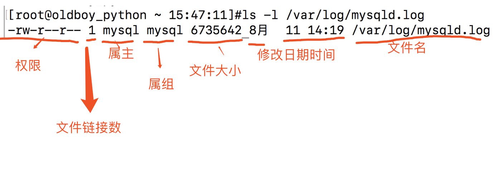
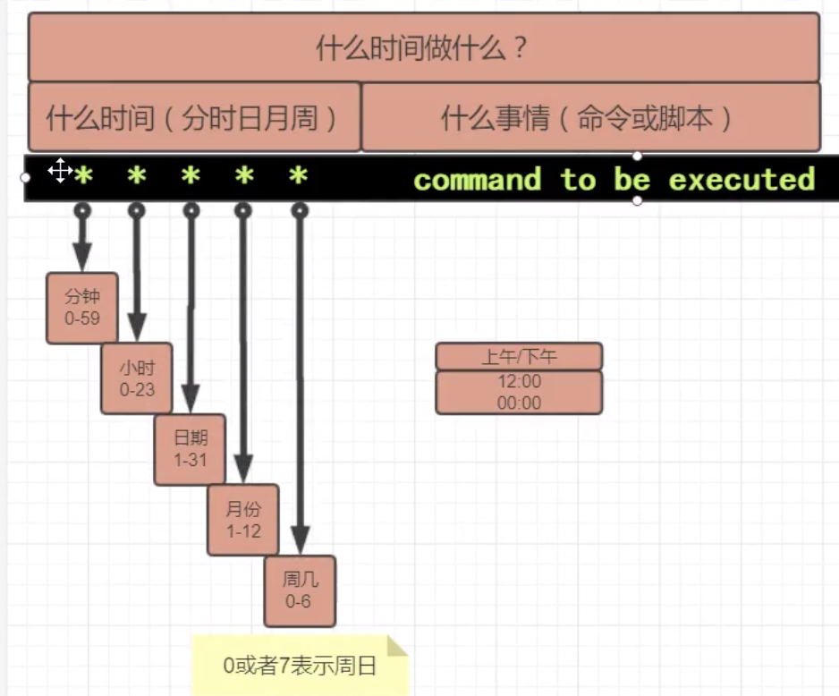

## Linux 常用命令

[TOC]

### Linux 命令在线查询网站

首先介绍一个 Linux 命令的在线查询网站，里面有几乎所有的 Linux 的命令和参数信息。基本上就是英文文档的中文翻译，很好用。

http://linux.51yip.com/

### 查看命令的帮助文档

系统命令一般都会有帮助文档，可以通过命令查看：

```bash
man 命令
info 命令
```

比如：

```bash
man ls
```

### 关机和重启

直接拔电源关闭计算机是不可取的，可能会丢失数据。即便使用虚拟机，也不建议直接关闭。更好的方式是使用命令关机和重启：

```bash
init 0    # 关机
shutdown -h now    # 关机
reboot    # 重启
init 6    # 重启
```

### alias 别名

alias 命令用来给一个命令加上一个昵称，当你以后需要经常输入一个很长的命令的时候，可以创建一个别名，会让操作变得简单许多。

直接输入alias，查看当前系统中已经设置了的别名：

```shell
alias
```

取消别名：

```shell
unalias
```

创建别名：

```shell
alias rm='rm -i'    # 这里 -i 的含义是删除文件时会有确认提示
```

案例

1. 当用户输入rm命令的时候，给他一个提示，"你这个傻蛋，求你别瞎用 rm 了！"

   ```shell
   alias rm='echo 你这个傻蛋，别瞎用 rm 了！'
   ```

2. 例如每次都要ssh登录，命令太长

   ```shell
   ssh root@123.206.16.61
   alias  ssh1='ssh root@123.206.16.61'
   ```

工作中常见的四个环境：

- 本地开发环境

- 测试服务器环境

- 预生产服务器环境（和线上的标准几乎一致）

- 生产服务器环境（线上）

### 管道符 `|`

管道符 `|` 用来将前一个命令输出的返回结果作为后一个命令的参数输入。

1. 可以常用来检测进程信息

   ```shell
   ps -ef|grep mysql
   ```

2. 检测端口情况

   ```shell
   netstat -tunlp|grep 80
   ```

### netstat 网络状态

netstat 命令用于显示 Linux 的网络端口情况。

```shell
#参数解释  -tunlp    显示tcp  upd 所有的socket连接信息
netstat -tunlp
```
过滤出 nginx 是否存活的命令，查看 nginx 的 80 端口是否存在

```shell
[root@localhost tmp]# netstat -tunlp  |  grep  'nginx'
tcp        0      0 0.0.0.0:80              0.0.0.0:*               LISTEN      2041/nginx: master
```

### ps 进程状态

ps 命令用于检测进程情况。

```shell
ps -ef    # 列出 Linux 上所有的进程信息，以及进程 id 号等
ps -aux    # 效果跟-ef差不多
```

与 grep命令联用，过滤出出 vim 有关的进程：

```shell
[root@chaogelinux ~]# ps -ef | grep vim
root     28692 27546  0 10:07 pts/0    00:00:00 vim 你说爱我就要喵喵喵.txt
root     28715 28654  0 10:08 pts/1    00:00:00 grep --color=auto vim
```

### kill 根据 pid 杀进程

杀死进程的命令，基本语法为：

```shell
kill  进程id号
```

基本用法：

1. 获取进程的 id 号：

   ```shell
   ps -ef
   ```

2. 用 kill 命令杀死进程：

   ```shell
   kill 进程id
   kill -9 进程id    # 强制杀死进程，-9 为强制性的信号参数
   ```

### pkill 根据进程名杀进程

若进程 id 不可知，或者明确知道进程名。可以通过 pkill 的命令，根据进程名杀进程：

```shell
pkill nginx
```

### grep 过滤

grep 命令是 shell 三剑客之一，用于过滤字符串。其基本语法为：

```shell
grep 参数 你要过滤的文件
```

它的常用参数有：

- i：忽略大小写
- n：输出行号
- v：反向选择

过滤字符串信息：

```shell
[root@localhost tmp]# grep -i  'all'  settings.py
ALLOW_HOSTS=[]
```

过滤掉某字符串的行：

```shell
[root@localhost tmp]# grep -vi 'all'  settings.py
```

过滤掉空白行（支持正则）：

```shell
[root@localhost tmp]# grep  -v '^$'  settings.py
qweqweqweqwe
#qweqweqweqwe
ALLOW_HOSTS=[]
```

过滤掉注释行：

```shell
[root@localhost tmp]# grep -v '^#'  settings.py
```

过滤掉，空白行和注释行，可以用管道符，多次过滤：

```shell
# 1.先过滤掉空白行
# 2.再过滤掉注释行
[root@localhost tmp]# grep  -v '^$'  settings.py |  grep -v '^#'
qweqweqweqwe
ALLOW_HOSTS=[]
```

### scp 安全复制

scp 命令用于在两台 Linux 服务器之间远程传输文件，其基本语法为：

```shell
scp 待发送的文件 目标路径
```

案例 1：把本地的某文件，发送到另一台服务器的 `/tmp` 目录下（本地的局域网机器，是能发送给远程机器的，通过路由器出去）：

```shell
yumac: ~ yuchao$scp   ./yasuo.txt  root@123.206.16.61:/tmp/  # 发送普通的文件给远程服务器
yasuo.txt                        100%   10     0.2KB/s   00:00
yumac: ~ yuchao$mkdir -p lol/盖伦/大宝剑
yumac: ~ yuchao$scp  -r  ./lol  root@123.206.16.61:/tmp/ # -r参数递归发送整个文件夹下所有内容
```

案例 2：把远程机器的东西，给拿到我本地来

```shell
yumac: lol yuchao$scp root@123.206.16.61:/tmp/好好学习奥力给.txt  ./
好好学习奥力给.txt               100%  384     6.6KB/s   00:00
yumac: lol yuchao$ls
盖伦				好好学习奥力给.txt
```

再举两个案例：

准备 2 台 Linux 虚拟机，确保互相可以通信，它们的 IP 分别为 `192.168.178.181` 和 `192.168.178.253`。

情况 1，我登录在 `192.168.178.181`，我要把 181 这台机器的资料，发给 253 的那台机器：

```shell
scp ./test.txt root@192.168.178.253:/tmp/
```

情况 2，我还是登录在 181 的机器，我要拿到远程机器 253 的一个文件：

```shell
scp root@192.168.178.253:/tmp/test.txt /tmp/
```

### 修改 Linux 语言为中文

```shell
export LC_ALL=zh_CN.UTF-8
```

### lrzsz 工具

这个可以用于 Windows 和 Linux 之间互相传递文件，主要用于 Xshell 的文件拖拽功能。

使用 lrzsz 工具之前，需要安装这个工具包：

```shell
yum install lrzsz -y
```

这个工具提供了两个命令：rz 和 sz。

- 直接在 Xshell 上输入 rz，就会蹦出一个文件接收的界面，用于获取 Windows 的文件
- 在 Xshell 上输入 `sz file.txt`，也会蹦出一个界面，用于发送资料给 Windows
- 也可以直接用鼠标，拖动 Windows 的资料，发给 Linux

### xftp 工具

用于 Windows 和 Linux 之间传递大量的文件，支持断点续传。

直接下载使用即可

### du 文件夹大小

统计文件，文件夹大小有两种方式：

使用 ls 命令：

```shell
ls -lh /tmp    # -h 参数用来给文件大小加单位
```

使用 du 命令：

```shell
du -h  .    #显示出当前文件夹下所有内容的大小
du -sh  .    #显示当前文件夹大小的合计  -s 显示合计  -h显示 kb MB GB的单位
```

### top 资源管理器

top 命令相当于 Linux 系统的任务管理器和资源管理器：

```shell
top
```

- 输入命令 top 进入任务管理器
- 按下 q 键退出 top 命令

### uptime 运行时间

uptime 用于查看系统运行时长：

```shell
uptime
```

### free 内存占用

free 命令用于显示内存的使用情况

```shell
free -m  #以M单位显示内存情况
```

### chattr 和 lsattr 权限设置

这两条命令不常见，其应用场景可以参见 [记录腾讯云中矿机病毒处理过程(重装系统了fu*k)](https://www.cnblogs.com/pyyu/p/10297623.html)。

chattr 是给文件设置特殊权限的命令；

lsattr 是检查文件特殊权限的命令。

```shell
chattr +i  file  #给文件加上禁止删除的锁
chattr -i fiel  #去掉锁
lsattr file #显示文件的特殊权限
```

### date 查看系统时间

可以直接输入 date 命令查看当前时间：

```bash
date
```

### ntpdate 时间同步

用于同步 Linux 系统时间的命令。

服务器的时间是非常重要的，会影响到程序的正常运行，尤其是一些定时任务。

如果使用 date 命令发现系统时间不正确，使用如下命令即可时间同步：

```
ntpdate -u ntp.aliyun.com  #和阿里的ntp时间服务器同步，更新时间
```

注：这是永久修改时间的命令。

### wget 下载

在线获取一个 url 资源的命令，可以用作爬虫命令。

在使用之前，需要单独安装 wget：

```shell
yum install wget -y
```

使用：

- 获取一个图片 url 资源

  ```shell
  wget https://pythonav.com/media/teacher/wupeiqi.png
  ```

- 支持俩递归爬取的参数，能获取网站静态资源

  ```shell
  wget -r -p  www.luffycity.com  #递归爬取路飞的静态资源，css js font等
  ```

### curl 访问网址

curl 向指定地址发送 http 请求，并接收返回响应，基本用法为：

```shell
curl https://www.baidu.com
```

### Linux 的用户管理

QQ 群一般有三个角色：群主、管理员和普通群成员。类似地，Linux 系统也有三种用户身份：root 用户、管理员用户和普通用户：

- QQ 群主，想干嘛就干嘛，想踢人就踢人 -------- 等于 Linux 的 root 用户，权利最大
- QQ 群管理员，群主给与他的比较大的权限 -------- 等于 Linux 命令加上 sudo，默认以 root 去执行命令
- 渣渣用户，QQ 群里的小白，权利特别低 -------- 等于 Linux 的普通用户，用于保证服务器安全，防止删除等危险操作

### UID 和 GID

- UID，用户的 id 号，root 是 0，普通用户从 1000 开始

- GID，是用户组的 id 号

Linux 下存放用户账户信息的文件是 `/etc/passwd`

### useradd 创建用户

只有 root 有权限，创建普通用户，默认 uid 从 1000 开始递进。

```shell
useradd sure
```

### userdel 删除用户

使用 userdel 命令删除已经存在的用户：

```
userdel sure
```

### passwd 修改密码

修改用户密码，只有 root 可以操作。

```shell
passwd sure
```

### su 切换用户

su 命令用于用户切换，root 切换普通用户不要密码

普通用户之间切换需要密码

```shell
su - sure  # 切换到sure用户，中间的减号代表完全的环境变量切换，一定要加上
```

### id 产看用户信息

id 命令用于查看用户的 uid 等信息

```shell
[root@localhost test]# id sure
uid=1000(sure) gid=1000(sure) groups=1000(sure)
[root@localhost test]# id root
uid=0(root) gid=0(root) groups=0(root)
```

### sudo 命令

当普通用户执行命令权限不够的时候，使用 sudo，强大自己的权限。

比如要访问 `/root` 文件夹。但这个文件夹就像皇宫一样，不是所有人想进就能进去的。只有具有 root 权限的用户，比如 root 用户才有权限访问。来百姓无法进入皇宫，普通用户无法访问 `/root` 文件夹。

sudo 命令就好比是写着“如朕亲临”的令牌。拿着这个令牌的老百姓便也可以随意出入皇宫，普通用户使用 sudo 命令就可以访问我们的 `/root` 文件夹了。

要给普通用户赋予 sudo 命令权限，需在 root 下进行配置，步骤如下：

1. 打开 sudo 的配置文件

   ```shell
   visudo
   ```

   也可以使用 vim 直接修改 `/etc/sudoers` 文件。使用 `visudo` 命令修改会有语法检测，更专业。

2. 找到如下配置行，添加你允许使用sudo的用户名字

   ```shell
   ## Allow root to run any commands anywhere
   root    ALL=(ALL)       ALL
   caixukun        ALL=(ALL)       ALL
   haohao        ALL=(ALL)       ALL
   laowang        ALL=(ALL)       ALL
   ```

3. 使用 sudo 命令，在你敲的命令前，加上 sudo 即可：

   ```shell
   sudo ls /root
   ```

### Linux 的文件和目录权限

创建一个 `happy.txt` 文件，并查看文件的详细信息：

```shell
[root@localhost test]# touch happy.txt
[root@localhost test]# ls -l
total 0
-rw-r--r--. 1 root root 0 Feb  7 19:32 happy.txt
```

我们看到，信息行的最前面，是一行奇怪的符号：`-rw-r--r--`。它的含义是：

- 它的 user 属主是 root，user 属主的权限是 `rw-`  (可以读，可写，不可执行)
- 它的属组 group 是 root，group 属组的权限是只读的，代表在 root 组里的用户都可以读这个 `happy.txt`
- 此时假设一个普通用户 sure 登录了机器，对于 `happy.txt` 来说，sure 就是一个 other 其他用户，只读权限

第一列指代的是文件权限，常见的文件类型有：

- `-` 普通文本
- `d` 文件夹
- `l` 软连接

后面九列，分别是属主、属组和其他用户对该文件的权限。每个符号的含义为：

- `r` readable，有可读的权限
- `w` writable，可写
- `x`  executable，可执行

-  `-` 没有该权限

| 权限符号 |         解释         |         普通文件         |                 文件夹                  |
| :------: | :------------------: | :----------------------: | :-------------------------------------: |
|    r     | readable，有可读权限 |   cat、more等读取操作    |              ls 等读取操作              |
|    w     |    writable，可写    | vim、vi、echo 等写入操作 | touch、mkdir 等在文件夹中创建文件的操作 |
|    x     |  executable，可执行  |     可以用解释器执行     |          cd 等进入文件夹的操作          |
|          |      没有该权限      |            -             |                    -                    |

需要注意的是，文件权限的顺序只能是 rwx 而不是其他，不可乱序。

Linux 的用户身份有三个：

- 当前这个文件属于谁-------user---属主

- 当前在这个文件属于哪个组----group---属组

- 其他人---这个文件和当前登录的系统用户没有任何关系-----other

这 3 类角色对同一个文件都有不同的读、写、执行权限



### chmod 修改文件权限

change mode，更改文件权限的命令

```shell
chmod u+x file  # 给user用户添加一个x可执行权限
```

用 sure 普通用户给文件的 other 添加一个w写的权限

```shell
[sure@localhost ~]$ sudo chmod o+w happy.txt
```

r、w、x 权限可分别转化为数字 4、2、1：

<table>
    <thead>
        <tr>
            <th>权限分配</th>
            <th colspan="3">属主</th>
            <th colspan="3">属组</th>
            <th colspan="3">其他用户</th>
        </tr>
    </thead>
    <tbody>
        <tr>
        	<td>权限项</td>
            <td>读</td>
            <td>写</td>
            <td>执行</td>
            <td>读</td>
            <td>写</td>
            <td>执行</td>
            <td>读</td>
            <td>写</td>
            <td>执行</td>
        </tr>
        <tr>
        	<td>字符表示</td>
            <td>r</td>
            <td>w</td>
            <td>x</td>
            <td>r</td>
            <td>w</td>
            <td>x</td>
            <td>r</td>
            <td>w</td>
            <td>x</td>
        </tr>
        <tr>
        	<td>数字表示</td>
            <td>4</td>
            <td>2</td>
            <td>1</td>
            <td>4</td>
            <td>2</td>
            <td>1</td>
            <td>4</td>
            <td>2</td>
            <td>1</td>
        </tr>
    </tbody>
</table>

换句话说，就是按照 rwx 顺序，若有该权限，则在对应位置写为 1，若无该权限，则写为零。最后得到一个三位二进制数，将其转为十进制数，即可得到权限的数字。

然我们重新看一下前面的 happy.txt 文件的详细信息：

```shell
-rw-r--r--. 1 root root 0 Feb  7 19:32 happy.txt
```

现在我们要修改这个文件，只有属主可写，其他人都没有权限，用数字权限转化。

1. 属主可写，权限用二进制表示是 010，转换为十进制为 2；

2. 属组和其他用户无权限，二进制权限为 000，转换为十进制也是 0；

3. 因此，应该将文件权限修改为 200：

   ```shell
   chmod  200   happy.txt   #这个代表 user是 2 只写的，group和other都没有权限
   ```

如果我们要给文件设置成 user 可读可写，group 可读可写，其他人只能写，那么：

1. 属主可读可写，用二进制表示该是 110，转换为十进制就是 6；

2. 属组可读写，二进制为 110，十进制为 6；

3. 其他用户只能写，二进制位 010，十进制位 2；

4. 因此，文件权限应为 662：

   ```shell
   chmod 662 happy.txt
   ```

同样地，已知用户权限的数字，可以倒过来推导用户权限。例如，请解读如下权限：

```shell
chmod 235 happy.txt
```

1. 属主的权限为 2，转换为二进制是 010，按照 rwx 的位置，可知属主只有可读权限；
2. 属组权限为 3，转换为二进制是 011，可写，可执行；
3. 其他用户权限为 5，二进制为 101，可读可执行。

### ln 软链接

创建软链接的命令，类似于创建快捷方式，其用法为：

```shell
ln  -s  源文件绝对路径  快捷方式绝对路径
ln -s  /s26linux/happy.txt  /tmp/hp.txt
```

### tar 压缩解压缩

打包、压缩、解压缩的命令，压缩包的后缀名通常是 `.tar.gz` 或 `.tgz`

常用参数如下：

```
-z  调用 gzip 压缩资源，节省磁盘空间
-x  解压缩
-v  显示过程
-f  这个参数必须写在结尾，指定压缩文件名字
-c  打包参数
```

例如，把 `/tmp` 下所有的内容，进行压缩打包，节省磁盘空间

```shell
tar  -zcvf  /opt/alltmp.tgz    ./*  # 打包且压缩/tmp下所有内容，生成一个压缩文件，放到opt下

# 演示解压缩，把 /opt下alltmp.tgz 解压缩
tar -zxvf   /opt/alltmp.tgz  ./
```

### unzip 压缩

unzip 命令用来解压缩 zip 格式的压缩文件：

```
unzip file.zip
```

若因为跨系统（如从 Windows 转移到 Linux）而造成文件名乱码，可以尝试在解压时指定编码：

```bash
unzip -O utf8 day016.zip
```

### 查看系统发行版

Redhat 系 Linux 系统发行版查看方法：

```shell
cat /etc/redhat-release
```

Linux 系统通用查看方法：

```shell
cat /etc/os-release
```

### 查看系统信息

查看系统详细信息：

```bash
[root@localhost l1]# uname -a
Linux localhost.localdomain 3.10.0-327.el7.x86_64 #1 SMP Thu Nov 19 22:10:57 UTC 2015 x86_64 x86_64 x86_64 GNU/Linux
```

### systemctl 软件启停管理

只要是通过 yum 安装的软件，都可以用 systemctl 系统服务管理命令，进行启停管理：

```shell
systemctl start/stop/restart/status nginx  #分别是 启动，停止，重启，查看状态
systemctl start nginx
systemctl stop nginx

systemctl start/stop/restart redis
```

### crontab 定时任务

老板给你下达一个任务：每周一的凌晨三点，启动一下 nginx。你当然可以在周一早上起个大早，在三点钟启动一下 nginx。不过我想你一定不愿意这样做。幸运的是，你可以设置一个定时任务来做这个事情。你可以设定一个定时任务，每周一的凌晨三点执行你需要的命令。

CentOS 系统创建定时任务的命令是 crontab。

在 `/etc` 目录下有一个 crontab 文件，这个就是系统任务调度的配置文件：

```shell
vim /etc/crontab
```

我们可以看到里面的配置提示：

```shell
SHELL=/bin/bash
PATH=/sbin:/bin:/usr/sbin:/usr/bin
MAILTO=root

# For details see man 4 crontabs

# Example of job definition:
# .---------------- minute (0 - 59)
# |  .------------- hour (0 - 23)
# |  |  .---------- day of month (1 - 31)
# |  |  |  .------- month (1 - 12) OR jan,feb,mar,apr ...
# |  |  |  |  .---- day of week (0 - 6) (Sunday=0 or 7) OR sun,mon,tue,wed,thu,fri,sat
# |  |  |  |  |
# *  *  *  *  * user-name  command to be executed
```

最后一行为 crontab 的基本设置语法，即：

```
分 时  日  月  周     你要执行的命令绝对路径
*  *   *   *   *     绝对路径的命令
分钟(0-59)　小时(0-23)　日期(1-31)　月份(1-12)　星期(0-6,0代表星期天)　 命令
```

- 第1列表示分钟1～59 每分钟用*或者 */1表示
- 第2列表示小时1～23（0表示0点）
- 第3列表示日期1～31
- 第4列表示月份1～12
- 第5列标识号星期0～6（0表示星期天）
- 第6列要运行的命令

- 星号（*）：代表所有可能的值，例如month字段如果是星号，则表示在满足其它字段的制约条件后每月都执行该命令操作。  

- 逗号（,）：可以用逗号隔开的值指定一个列表范围，例如，“1,2,5,7,8,9”

- 中杠（-）：可以用整数之间的中杠表示一个整数范围，例如“2-6”表示“2,3,4,5,6”

- 正斜线（/）：可以用正斜线指定时间的间隔频率，例如“0-23/2”表示每两小时执行一次。同时正斜线可以和星号一起使用，例如*/10，如果用在minute字段，表示每十分钟执行一次。

详细的设置可以参考这个图片：



直接来我们通过一系列的练习题，深入了解 crontab 命令的编写规则：

1. 每分钟执行一次命令

   ```shell
   *  *  *  *  *   绝对路径的命令  #每分钟执行命令
   ```

2. 每小时的整点，执行命令

   ```shell
   0  *  *  *  *   绝对路径的命令  #每小时的整点执行
   ```

3. 每小时的 3、15 分钟执行命令

   ```shell
   3,15  *  *  *  *    绝对路径的命令
   ```

4. 在上午 8-11 点的第 3 和第 15 分钟执行

   ```shell
   3,15   8-11   *  *  *   绝对路径的命令
   ```

5. 每晚 6 点半执行命令

   ```shell
   30  18  *  * *  command
   ```

6. 没周六、日的凌晨 1：30 执行命令

   ```shell
   30  1   *  *  6,7  command
   ```

7. 每周一到周五的凌晨 1 点，清空 `/tmp` 目录的所有文件

   ```shell
   0 1  * *  1-5     /usr/bin/rm  -rf /tmp/*
   ```

8. 每晚的 21:30 重启 nginx

   ```shell
   30  21  * *  *    /usr/bin/systemctl restart nginx
   ```

9. 每月的 1、10、22 日的下午 4:45 重启 nginx

   ```shell
   45  16  1,10,22   *  *    /usr/bin/systemctl restart nginx
   ```

10. 每个星期一的上午 8 点和 11 点的第 3 到 15 分钟执行命令

    ```
    3-15    8,11  *  *  1   command
    ```

crontab 命令的用法

```
crontab （选项）（参数）
```

常用参数有：

- `-e`：编辑该用户的计时器设置；
- `-l`：列出该用户的计时器设置；
- `-r`：删除该用户的计时器设置；
- `-u<用户名称>`：指定要设定计时器的用户名称。


定时任务的文件存放在 `/var/spool/cron`

crontab 的使用步骤如下：

1. 输入命令，打开定时任务配置文件

   ```shell
   crontab -e
   ```

2. 写入 crontab 命令语句，注意命令尽量使用绝对路径，绝对路径可通过 which 命令获取

3. 查看定时任务

   ```shell
   crontab -l
   ```

4. 如果不再需要定时任务，使用命令删除：

   ```bash
   crontab -r
   ```

### 防火墙关闭

防火墙是为了保护服务器安全，运维人员会编写防火墙语句，控制服务器的流量出入。

新手学习直接关闭即可，影响实验。以后的防火墙也是由运维设置，会在不影响项目正常运行的前提下保障安全，而不是系统自带防火墙那样死板。

关闭防火墙服务的语句有如下这么几个，按需任选其一即可：

```bash
iptables -F    # 清空防火墙规则，重启恢复
# 注：下面的firewalld都可以写成firewalld.service
systemctl stop firewalld    # 关闭防火墙服务，重启自启
systemctl disable firewalld    # 禁用防火墙开机自启，重启不自启
```

关于防火墙的其他操作还有：

```bash
systemctl status firewalld    # 查看防火墙状态
systemctl enable firewalld    # 启用防火墙开机自启，重启自启
systemctl start firewalld    # 打开防火墙服务
```

### 关闭 se-linux

se-linux 是 Linux 系统中的信息提示工具，很多时候也是不需要的，我们可以将其关闭掉。

关闭 se-linux 需要修改它的配置文件。配置文件位于 `/etc/selinux/config`：

```bash
vi /etc/selinux/config
```

将文件中的 SELINUX 对应的值设置为 disabled：

```python
# This file controls the state of SELinux on the system.
# SELINUX= can take one of these three values:
#     enforcing - SELinux security policy is enforced.
#     permissive - SELinux prints warnings instead of enforcing.
#     disabled - No SELinux policy is loaded.
SELINUX=disabled
# SELINUXTYPE= can take one of three two values:
#     targeted - Targeted processes are protected,
#     minimum - Modification of targeted policy. Only selected processes are protected.
#     mls - Multi Level Security protection.
SELINUXTYPE=targeted
```

保存退出。设置不会立即生效，重启后生效。