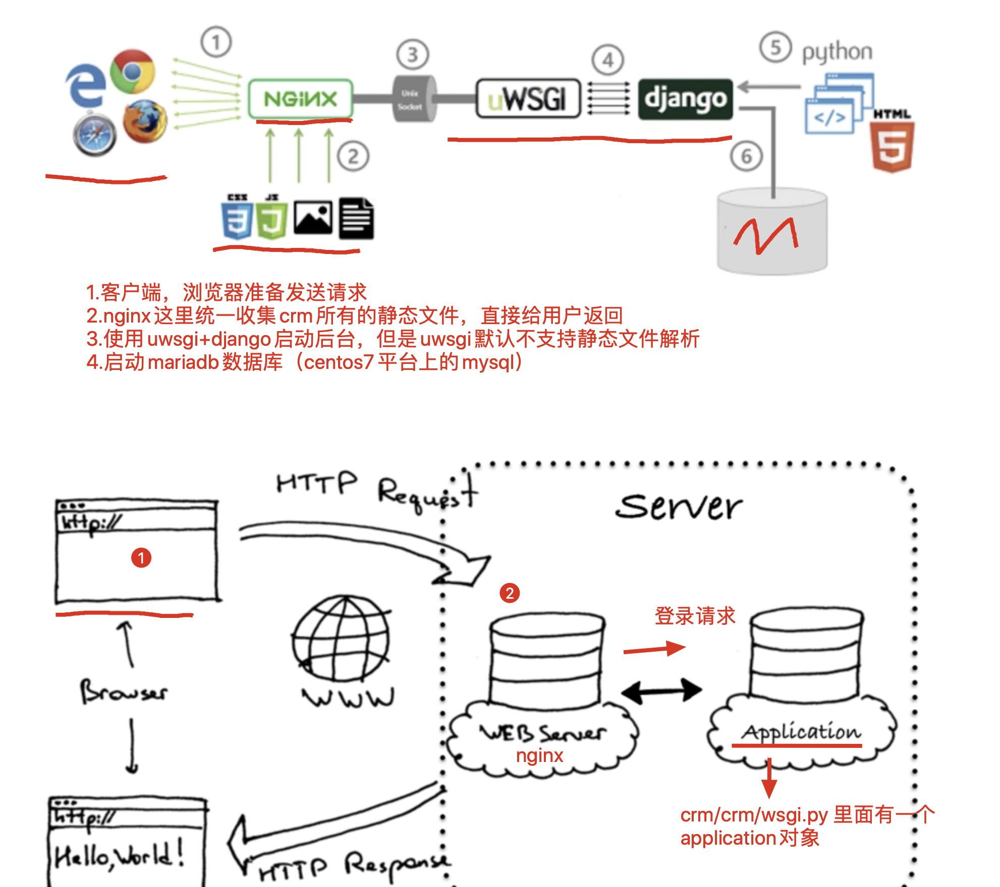
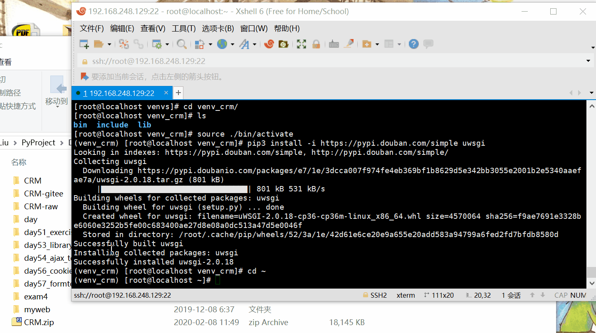
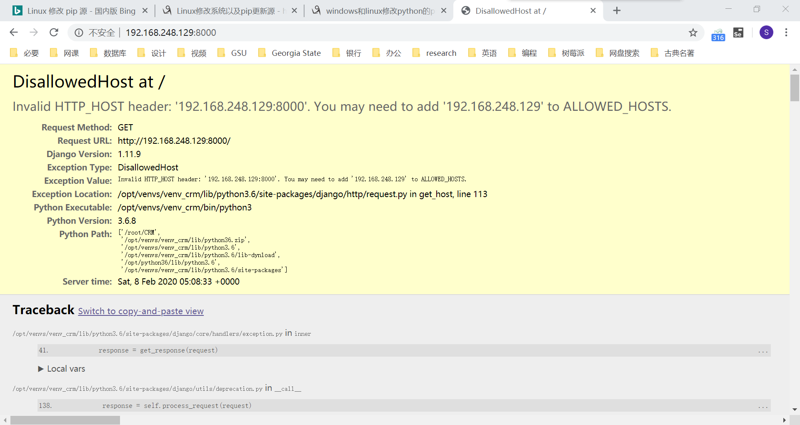
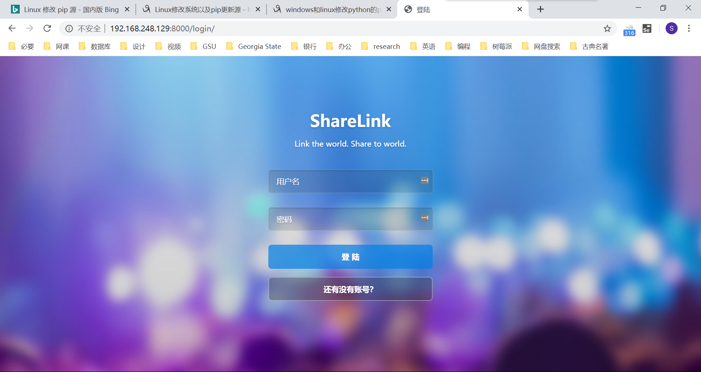
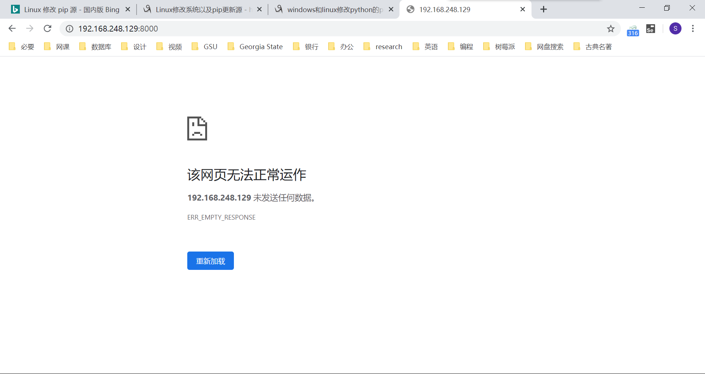
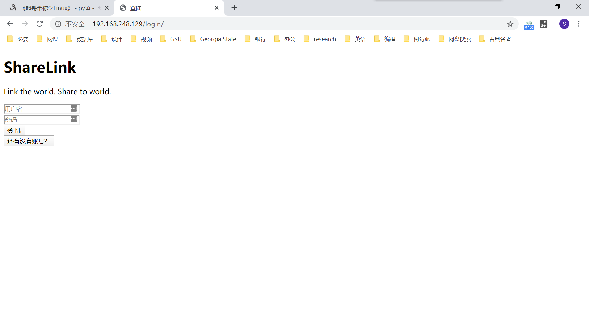
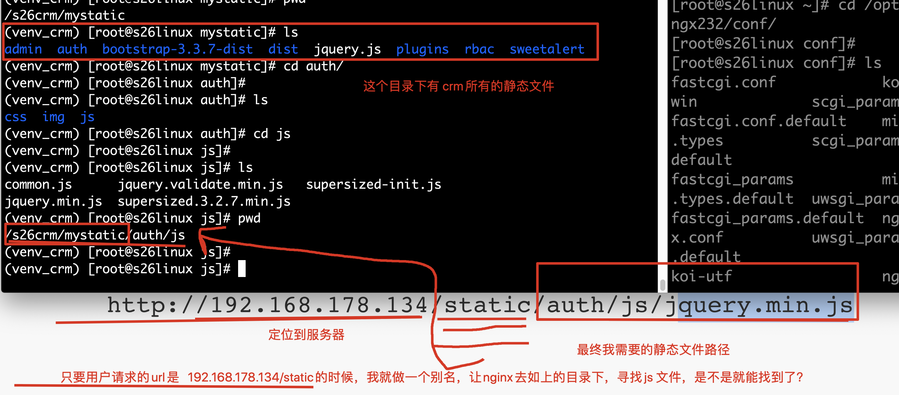
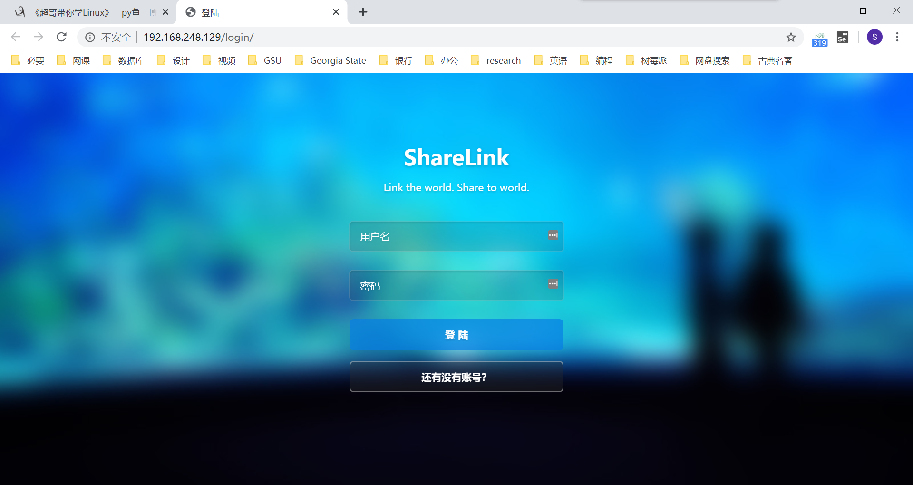

## crm 项目部署

[TOC]

### crm 项目部署流程

- 配置 nginx，提供反向代理功能。将 80 端口的请求，转发给 django 的 8000 端口；
- uwsgi + django 启动后端进程，部署在 8000 端口，处理用户的动态逻辑，包括登录、注册、查询等 curd（增删改查）操作
- mariadb（MySQL 数据库），进行数据导出、导入操作
- 虚拟环境的创建
- supervisor 进程管理工具  ，防止 uwsgi 突然崩溃，supervisor 能够自动启动 uwsgi

### 配置 uwsgi

部署 django 项目使用的命令 `python3 manage.py runserver` 其实是调用 wsgiref 这个 Python 内置的 wsgi 服务器，性能很低。

wsgi 实际上是运行一个 socket 服务端，便于程序员调试 django 程序，它是单线程，单进程，性能不高。

在 Linux 服务器线上，主流的部署形式是 uwsgi 对 django 进行启动，支持多进程，多线程，以及各种优化。

uwsgi 并发性更好，因为它是 C 写的一个基于 uwsgi 协议运行的高性能 Web 服务器。



服务器中环境比较复杂，为了不影响其他项目的运行，项目部署一般在虚拟的 Python 环境中进行。

因此，首先要配置一个 Python 的虚拟环境。在配置之前，要查看是否安装了 virtualenv：

```shell
[root@localhost etc]# which virtualenv
/usr/bin/which: no virtualenv in (/usr/local/sbin:/usr/local/bin:/usr/sbin:/usr/bin:/root/bin:/etc/python36/bin:/opt/python36/bin)
```

若出现上面的提示，说明需要先安装：

```shell
pip3 install -i https://pypi.douban.com/simple virtualenv
```

进入想要存放虚拟环境的文件夹，创建虚拟 Python 环境：

```shell
[root@localhost etc]# mkdir /opt/venvs
[root@localhost etc]# cd /opt/venvs/
[root@localhost venvs]# virtualenv --no-site-packages --python=python3 venv_crm
[root@localhost venvs]# cd venv_crm/
[root@localhost venv_crm]# 
[root@localhost venv_crm]# source ./bin/activate
(venv_crm) [root@localhost venv_crm]# 
```

以后的配置，都会在这个虚拟环境中进行。

虚拟环境激活后，安装 uwsgi 工具：

```shell
(venv_crm) [root@localhost venv_crm]# pip3 install -i https://pypi.douban.com/simple uwsgi
```

### 上传 crm 代码

把我们的 crm 项目打包成 zip，在 Xshell 上通过 lrzsz 工具上传至 Linux。



若没有 lrzsz 工具，可能会无法发送，需要先安装这个工具：

```shell
yum install lrzsz
```

若是 mac 用户，可以使用 scp 命令传输。

收到 crm 项目的 zip 压缩文件后，使用 unzip 命令解压缩。当然，要先安装 unzip 工具：

```shell
(venv_crm) [root@localhost ~]# yum install unzip -y
(venv_crm) [root@localhost ~]# unzip CRM.zip
```

### 安装 crm 项目依赖的环境

#### 安装 django

进入 crm 项目第一层文件夹，尝试启动 crm 项目：

```shell
(venv_crm) [root@localhost ~]# cd CRM
(venv_crm) [root@localhost CRM]# ls
app01  CRM  manage.py  rbac  utils
(venv_crm) [root@localhost CRM]# python3 manage.py runserver
```

运行出错，错误信息为：

```
ImportError: Couldn't import Django. Are you sure it's installed and available on your PYTHONPATH environment variable? Did you forget to activate a virtual environment?
```

这是因为虚拟环境中没有 django。兵来将挡水来土掩，安装 django 就是了：

```shell
(venv_crm) [root@localhost CRM]# pip3 install -i https://pypi.douban.com/simple django==1.11.9
```

#### 安装 pymysql

安装好 django，继续尝试启动 crm 项目：

```shell
(venv_crm) [root@localhost CRM]# python3 manage.py runserver
```

程序再次报错，这次的报错信息是：

```
ModuleNotFoundError: No module named 'pymysql'
```

看来我们还需要安装 pymysql 模块：

```shell
(venv_crm) [root@localhost CRM]# pip3 install -i https://pypi.douban.com/simple pymysql
```

#### 安装 django-multiselectfield

继续，尝试启动 crm 项目：

```shell
(venv_crm) [root@localhost CRM]# python3 manage.py runserver
```

有报错了，报错信息为：

```
ModuleNotFoundError: No module named 'multiselectfield'
```

这里提示的是没有安装 multiselectfield 模块。但主要注意的是，包的名字是 django-multiselectfield 而不是直接的 multiselectfield：

```shell
(venv_crm) [root@localhost CRM]# pip3 install -i https://pypi.douban.com/simple django-multiselectfield
```

#### 一键安装 crm 依赖环境

除了像我们前面逐次尝试逐个安装的方式外，我们还可以通过 pip 的 freeze 功能批量导出和导入所有模块。

在我们编写 crm 项目的操作系统中输入命令，批量导出模块信息至 `requirements.txt` 文件中：

```shell
pip3 freeze > requirements.txt
```

在 cmd 所在文件夹会出现一个 `requirements.txt` 文件，里面有所有的模块名和版本号信息。

把这个文件发送到 Linux 系统中，通过命令批量导入依赖的包：

```shell
pip install -r requirements.txt
```

### 配置数据库

#### 安装 MariaDB（MySQL）

安装好各种 crm 依赖的环境之后，crm 项目依然无法正常运行：因为我们还没有安装 MySQL 数据库。

在 CentOS 中，由于 MySQL 已经开始收费，有开源组织创建了一个完全一模一样的数据库，就是 MariaDB 数据库。

可以使用 yum 直接安装 MariaDB：

```shell
(venv_crm) [root@localhost CRM]# yum install mariadb-server mariadb -y
```

通过 yum 安装的 MariaDB 数据库服务可以通过 systemctl 命令启动：

```shell
(venv_crm) [root@localhost CRM]# systemctl start mariadb
```

为测试 MariaDB 运行状态，我们可以尝试登录。MariaDB 的用法同 MySQL 完全一致，甚至连接命令使用的也是 mysql：

```shell
(venv_crm) [root@localhost CRM]# mysql -uroot -p
```

初始密码默认为空，直接回车即可进入 MariaDB。使用命令修改密码为 123：

```mysql
MariaDB [(none)]> set password = password('123');
```

若数据库名称和密码会发生变化，还需要修改 `settings.py` 中数据库部分的配置。

#### 导出和导入数据库数据

在 Windows 中通过命令导出数据库中的数据：

```shell
mysqldump -uroot -p crm > crm.sql
```

把导出的 `crm.sql` 文件传到 Linux 中。创建并进入 crm 数据库，使用命令导入数据：

```mysql
MariaDB [(none)]> create database crm;
Query OK, 1 row affected (0.00 sec)
MariaDB [(none)]> use crm;
Database changed
MariaDB [crm]> source ~/crm.sql
```

可以查看一些表，是不是有数据导入：

```mysql
MariaDB [crm]> show tables;
+----------------------------+
| Tables_in_crm              |
+----------------------------+
| app01_campuses             |
| app01_classlist            |
| app01_classlist_teachers   |
| app01_consultrecord        |
| app01_courserecord         |
| app01_customer             |
| app01_customer_class_list  |
| app01_enrollment           |
| app01_studyrecord          |
| app01_userinfo             |
| app01_userinfo_roles       |
| auth_group                 |
| auth_group_permissions     |
| auth_permission            |
| auth_user                  |
| auth_user_groups           |
| auth_user_user_permissions |
| django_admin_log           |
| django_content_type        |
| django_migrations          |
| django_session             |
| rbac_menu                  |
| rbac_permission            |
| rbac_role                  |
| rbac_role_permissions      |
+----------------------------+
25 rows in set (0.00 sec)

MariaDB [crm]> select * from rbac_role;
+----+-----------+
| id | role_name |
+----+-----------+
|  2 | CEO       |
|  3 | 销售      |
|  4 | 讲师      |
+----+-----------+
3 rows in set (0.00 sec)

MariaDB [crm]> 
```

### 配置 `settings.py`

再次调试 crm ，应该就可以正常运行了。将其配置在 `0.0.0.0:8000`，并尝试通过浏览器访问，部署之前，或许需要清空防火墙列表：

```shell
(venv_crm) [root@localhost CRM]# iptables -F
(venv_crm) [root@localhost CRM]# python3 manage.py runserver 0.0.0.0:8000
```

虽然访问被禁止，但已经能看见 django 的大黄页，至少说明我们成功连接到了 Linux 的 django。禁止访问的原因是，我们没有在 settings.py 中指定 ALLOWED_HOSTS。



`ctrl + c` 终止运行中的 django 项目。使用 vim 命令编辑 settings.py 文件：

```shell
(venv_crm) [root@localhost CRM]# vim CRM/settings.py
```

找到 ALLOWED_HOSTS，在列表中添加 `‘*’`：

```python
ALLOWED_HOSTS = ['*']
```

保存并退出，再次启动 django 项目，我们就可以访问我们的 crm 项目了。



### uwsgi 启动 django

虽然刚刚我们已经成功运行好 django 项目。但是我们前面讨论过，django 使用的是 python 自带的 wsgiref，性能较低。平时的测试足够用，但并不适合线上的高并发环境。所以我们需要使用 uwsgi，使用多进程的方式启动 django。

#### 配置 `uwsgi.ini` 文件

进入 crm 项目的第一层文件夹，在此处创建一个 `uwsgi.ini` 文件：

```shell
(venv_crm) [root@localhost CRM]# pwd
/root/CRM
(venv_crm) [root@localhost CRM]# vim uwsgi.ini
```

在刚刚创建的文件中写入如下配置信息：

```ini
[uwsgi]
# Django-related settings
# the base directory (full path)
# 填入你crm项目的第一层绝对路径
chdir           = /root/CRM
# Django's wsgi file
# 这个wsgi.py文件，在第二层的crm目录下
module          = CRM.wsgi
# the virtualenv (full path)
# 填写虚拟环境的绝对路径
home            = /opt/venvs/venv_crm
# process-related settings
# master
master          = true
# maximum number of worker processes
# 定义uwsgi的工作进程数，优化公式是 2 * cpu_核数 + 1 
processes       = 3
# the socket (use the full path to be safe
# 这个socket参数是把你的crm启动在一个基于uwsgi协议的socket链接上，用户无法直接访问了
# 启动在socket链接上，就只能用nginx通过uwsgi协议反向代理，用户无法直接访问了
# 保护后端进程的安全，以及高性能 
# 这个socket也就是crm启动的地址和端口 
socket          = 0.0.0.0:8000
# ... with appropriate permissions - may be needed
# chmod-socket    = 664
# clear environment on exit
vacuum          = true
```

#### 启动 uwsgi

使用 uwsgi 命令，指定 uwsgi.ini 配置文件，启动 crm 程序，要注意找到 uwsgi 的位置：

```shell
(venv_crm) [root@localhost CRM]# uwsgi --ini uwsgi.ini
```

启动成功后，发现提示网页无法正常工作：



这是因为浏览器发送的是 http 请求，基于的是 http 协议；而 uwsgi 遵循的是 uwsgi 协议。两个协议不一致，就好比两个人，一个人说中文，一个人说英语，当然是没法正常交流的。这时，我们就需要找一个翻译。对于我们的服务器而言，这个翻译就是 nginx。

### nginx 配置和静态文件托管

#### 配置 nginx 反向代理

首先，找到 nginx.conf 文件。通过 yum 安装的 nginx，配置文件的位置为 `/etc/nginx/nginx.conf`；通过源码编译安装的nginx，配置文件在指定安装路径的 conf 文件夹下。然后，修改配置文件中的反向代理参数，设置如下：

```nginx
server {
    listen       80 default_server;
    listen       [::]:80 default_server;
    server_name  _;
    root         /usr/share/nginx/html;

    # Load configuration files for the default server block.
    include /etc/nginx/default.d/*.conf;

    location / {
    	# proxy_pass 处理的是 http 请求转发
    	# 这里要用基于 uwsgi 的转发参数
        uwsgi_pass 0.0.0.0:8000;
        include uwsgi_params;
    }

    error_page 404 /404.html;
    	location = /40x.html {
    }

    error_page 500 502 503 504 /50x.html;
    	location = /50x.html {
    }
}
```

修改好配置文件，保存并退出。平滑重启 nginx，并启动 uwsgi 服务：

```shell
(venv_crm) [root@localhost CRM]# nginx -s reload
(venv_crm) [root@localhost CRM]# uwsgi --ini uwsgi.ini
```

浏览器中输入服务器的 IP 地址。注意不要去 8000 端口，因为 nginx 监听的是 80 端口。如果访问 8000 端口，依然是直接访问的 uwsgi，还是无法正常访问。

#### 静态文件托管

当我们直接输入 IP 地址访问时，访问成功。但遇到一个问题——我们丢失了全部的样式，或者说，静态文件全部失效了。



这是因为 uwsgi 默认不会为我们解析静态文件。我们需要把静态文件托管给 nginx。

首先，在 django 项目的 `settings.py` 文件中，添加一个如下的配置，这个配置的意义是指定一个路径，准备存放即将导出的 crm 项目中的静态文件（注意要使用绝对路径，且不要放在 `/root` 路径下）：

```python
STATIC_ROOT = '/tmp/crm_static'
```

保存退出，使用命令导出 crm 项目中的静态文件至刚刚指定的文件夹中：

```shell
(venv_crm) [root@localhost CRM]# python3 manage.py collectstatic
```

查看我们指定的静态文件存放的路径，发现静态文件已经成功提出出来：

```shell
(venv_crm) [root@localhost CRM]# ls /tmp/crm_static/
admin  adminLTE  auth  __init__.py  rbac
```

提取出静态文件后，我们需要在 nginx 的配置中指定静态文件所在的位置。首先当然是打开 nginx.conf 配置文件：

```shell
(venv_crm) [root@localhost CRM]# vim /etc/nginx/nginx.conf
```

在 server 中原来的 location 下添加一条新的 location 配置：

```shell
location / {
    uwsgi_pass 0.0.0.0:8000;
    include uwsgi_params;
}

location /static {
	alias /tmp/crm_static;
}
```

这条配置的意思是给路径做一个别名，当发送来 `/static` 的请求时，到我们指定的静态文件存放位置返回静态文件。这个过程由 nginx 自动执行，不需要像后端发送请求。

静态文件，别名的修改原理图如下：



保存并退出配置，平滑重启 nginx，启动 uwsgi 服务：

```shell
(venv_crm) [root@localhost CRM]# nginx -s reload
(venv_crm) [root@localhost CRM]# uwsgi --ini uwsgi.ini
```

此时，我们就可以直接输入 IP，正常访问我们的 crm 项目了。



### Supervisor 进程管理工具

其实，我们已经完成了 crm 项目的部署。但是有这样一个问题：如果 uwsgi 因为某种原因崩溃了，而我们又没有及时发现。但是用户看来，会觉得网站很不好用。这时，我们就可以使用 Supervisor 进程管理工具。当后端进程崩溃时，Supervisor 会自动检测并自动重启 uwsgi 进程。

首先，还是要安装 Supervisor 工具：

```shell
(venv_crm) [root@localhost CRM]# yum install supervisor -y
```

紧接着，使用命令生成 Supervisor 配置文件，定义管理 crm 的任务：

```shell
(venv_crm) [root@localhost CRM]# echo_supervisord_conf > /etc/supervisor.conf
```

修改配置文件，在最底行，输入如下内容，Supervisor 其实也就是帮助用户执行命令而已：

```ini
[program:crm]
command=/opt/venvs/venv_crm/bin/uwsgi --ini  /root/CRM/uwsgi.ini    ; 程序启动命令，绝对路径
autostart=true       ; 在supervisord启动的时候也自动启动
startsecs=10         ; 启动10秒后没有异常退出，就表示进程正常启动了，默认为1秒
autorestart=true     ; 程序退出后自动重启,可选值：[unexpected,true,false]，默认为unexpected，表示进程意外杀死后才重启

stopasgroup=true     ;默认为false,进程被杀死时，是否向这个进程组发送stop信号，包括子进程
killasgroup=true     ;默认为false，向进程组发送kill信号，包括子进程
```

第一行 program 冒号后的 crm，就管理任务的一个名字而已，随便叫什么，自己能够看的懂就好。

此时，我们就可以用命令启动 Supervisor，然后查看被管理的任务，可以通过 ps 命令查看 uwsgi 是否顺利启动：

```shell
(venv_crm) [root@localhost CRM]# supervisord -c /etc/supervisor.conf 
(venv_crm) [root@localhost CRM]# ps -ef | grep uwsgi
root      37003  37002  0 15:50 ?        00:00:00 /opt/venvs/venv_crm/bin/uwsgi --ini /root/CRM/uwsgi.ini
root      37005  37003  0 15:50 ?        00:00:00 /opt/venvs/venv_crm/bin/uwsgi --ini /root/CRM/uwsgi.ini
root      37006  37003  0 15:50 ?        00:00:00 /opt/venvs/venv_crm/bin/uwsgi --ini /root/CRM/uwsgi.ini
root      37007  37003  0 15:50 ?        00:00:00 /opt/venvs/venv_crm/bin/uwsgi --ini /root/CRM/uwsgi.ini
root      37009  35426  0 15:51 pts/0    00:00:00 grep --color=auto uwsgi
```

尝试杀死 uwsgi 进程，再使用 ps 命令查看：

```shell
(venv_crm) [root@localhost CRM]# pkill uwsgi
(venv_crm) [root@localhost CRM]# ps -ef | grep uwsgi
root      37003  37002  0 15:50 ?        00:00:01 /opt/venvs/venv_crm/bin/uwsgi --ini /root/CRM/uwsgi.ini
root      37012  37003  0 15:53 ?        00:00:00 /opt/venvs/venv_crm/bin/uwsgi --ini /root/CRM/uwsgi.ini
root      37013  37003  0 15:53 ?        00:00:00 /opt/venvs/venv_crm/bin/uwsgi --ini /root/CRM/uwsgi.ini
root      37014  37003  0 15:53 ?        00:00:00 /opt/venvs/venv_crm/bin/uwsgi --ini /root/CRM/uwsgi.ini
root      37016  35426  0 15:53 pts/0    00:00:00 grep --color=auto uwsgi
```

可以使用 Supervisor 的任务管理命令 supervisorctl 查看、启动或终止进程：

```shell
(venv_crm) [root@localhost CRM]# supervisorctl -c /etc/supervisor.conf 
crm                              RUNNING   pid 37003, uptime 0:04:58
supervisor> stop crm
crm: stopped
supervisor> start crm
crm: started
supervisor> restart crm
crm: stopped
crm: started
supervisor> status crm
crm                              RUNNING   pid 37054, uptime 0:00:16
```

大功告成，我们顺利实现 crm 的部署上线~

