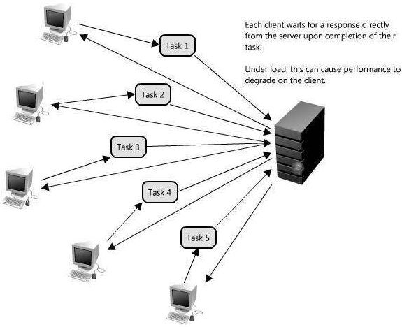
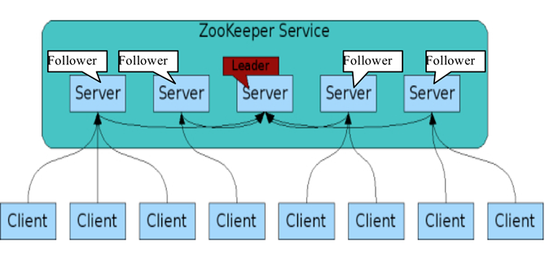
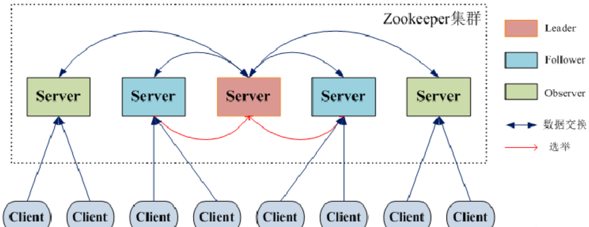
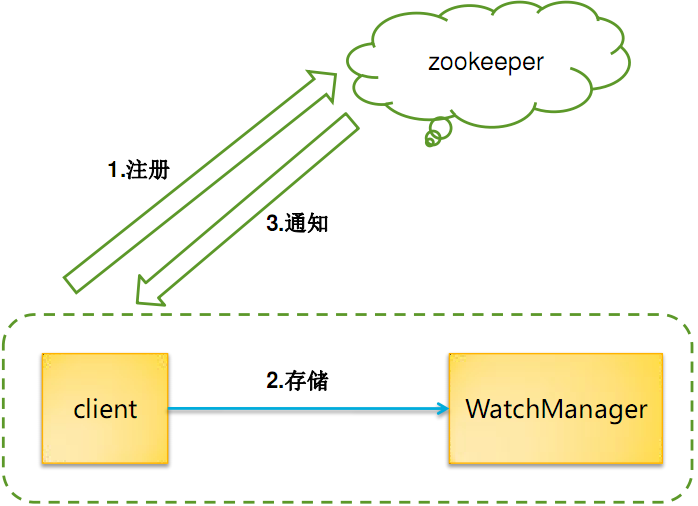
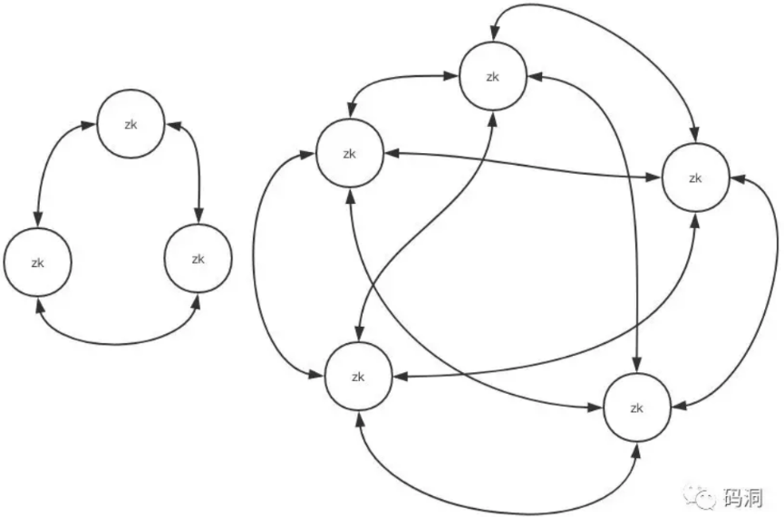
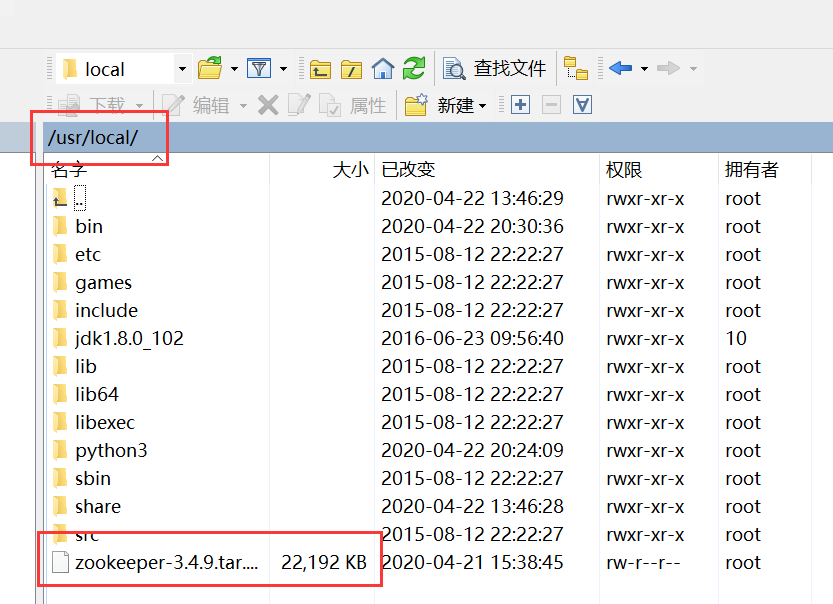
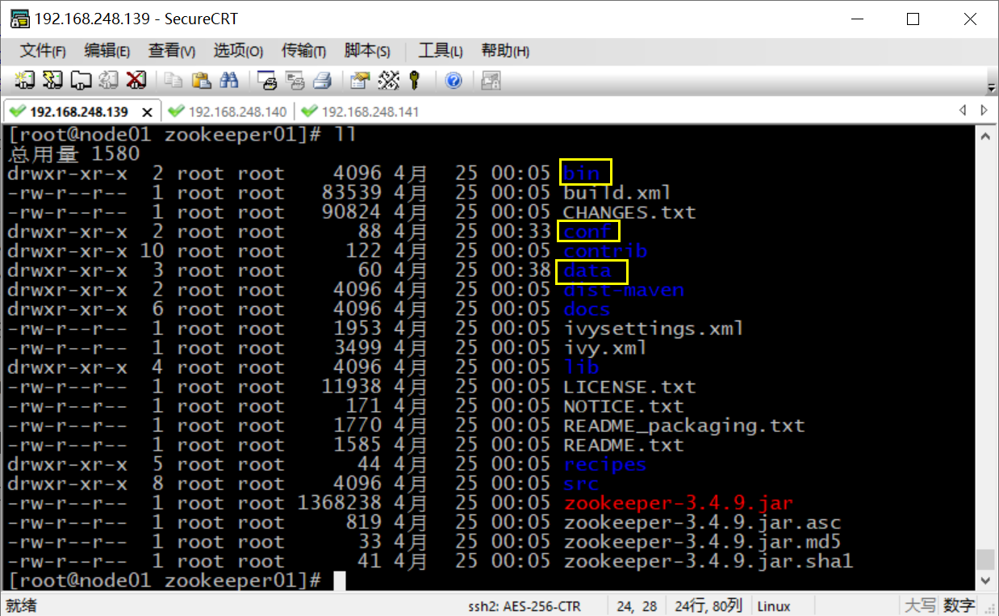
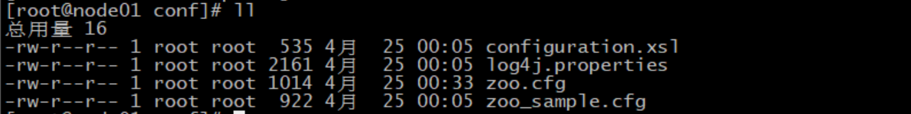
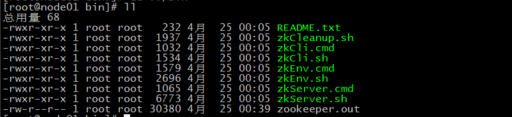

## ZooKeeper 分布式调度

[TOC]

### 为什么需要 ZooKeeper

- 大部分分布式应用需要一个主控、协调器或控制器来管理物理分布的子进程（如资源、任务分配等）

- 大部分应用需要开发私有的协调程序，缺乏一个通用的机制

- 协调程序的反复编写浪费，且难以形成通用、伸缩性好的协调器

  

- 协调服务

### ZooKeeper 简介

#### ZooKeeper 是什么

ZooKeeper 是 Google 的 Chubby 一个开源的实现，是开源的分布式协调服务。它包含一个简单的原语集，分布式应用程序可以基于它实现同步服务，配置维护和命名服务等。

ZooKeeper 是一个高性能的分布式数据一致性解决方案，它将那些复杂的，容易出错的分布式一致性服务封装起来，构成一个高效可靠的原语集，并提供一系列简单易用的接口给用户使用。

ZooKeeper 的选主过程采用的是 Raft 算法。Raft 算法可以参考 http://thesecretlivesofdata.com/raft/

它的架构如下图：



#### ZooKeeper 能帮我们做什么

- 分布式系统协调：多个节点一起完成一个动作

  - 集群管理

  - 选主

  - 分布式

- 负载均衡，一般不用它

#### ZooKeeper 的数据模型

- 层次化的目录结构，命名符合常规文件系统规范

- 每个节点在 ZooKeeper 中叫做 znode，并且其有一个唯一的路径标识

- znode 中的数据可以有多个版本，比如某一个路径下存有多个数据版本，那么查询这个路径下的数据就需要带上版本

- 节点不支持部分读写，而是一次性完整读写

#### ZooKeeper 的下载地址

网址：http://mirrors.cnnic.cn/apache/zookeeper/

### ZooKeeper 基本概念

#### 集群角色



#### ZooKeeper 节点类型

persistent：persistent 节点不和特定的 session 绑定，不会随着创建该节点的 session 的结束而消失，而是一直存在，除非该节点被显式删除。

ephemeral：ephemeral 节点是临时性的，如果创建该节点的 session 结束了，该节点就会被自动删除。ephemeral 节点不能拥有子节点，虽然 ephemeral 节点与创建它的 session 绑定，但只要该该节点没有被删除，其他 session 就可以读写该节点中关联的数据。使用 -e 参数指定创建 ephemeral 节点。

sequence：严格的说，sequence 并非节点类型中的一种，sequence 节点既可以是 ephemeral 的，也可以是 persistent 的。创建 sequence 节点时，ZooKeeper server 会在指定的节点名称后加上一个数字序列，该数字序列是递增的，因此可以多次创建相同的 sequence 节点，而得到不同的节点。使用 -s 参数指定创建 sequence 节点。

#### 版本

Version：当前Znode的版本。

Cversion：当前Znode的子节点的版本。

Aversion：当前Znode的ACL（访问控制）版本。

#### watcher

作用于Znode节点。

watcher 设置后，一旦触发一次就会失效，如果需要一直监听，就需要再次注册。

多种事件通知：数据更新，子节点状态等。

watcher 会监控目录节点的数据变化以及子目录的变化，一旦发送改变，则通知所有设置在这个目录节点的 watcher，从而做出相应的反应。



#### ZooKeeper 节点和配置常识

ZooKeeper 提供了创建/修改/删除节点的功能，如果父节点没有创建，子节点会创建失败。如果父节点还有子节点，父节点不可以被删除。

ZooKeeper 和客户端之间以 socket 形式进行双向通讯，客户端可以主动调用服务器，服务器也可以主动向客户端推送事件。

ZooKeeper 的事件有传递机制，子节点的增删改触发的事件会向上层依次传播，所有的父节点都可以收到子节点的数据变更事件，所以层次太深/子节点太多会给服务器的事件系统带来压力，节点分配要做好周密的规划。

ZooKeeper 的读性能随着节点数量的提升能不断增加，但是写性能会随着节点数量的增加而降低，所以节点的数量不宜太多，一般配置成 3 个或者 5 个就可以了。



### 安装 ZooKeeper

#### 单机版

单机版 ZooKeeper 就是在一台机器上安装一个 ZooKeeper。但其实单机版的 ZooKeeper 实际上是没什么意义的。但是我们只有安装了单机版的 ZooKeeper，将多个 ZooKeeper 联系起来，才能实现集群效果。安装单机版的 ZooKeeper 是一切的基础。

ZooKeeper 需要依赖 JDK 环境，使用命令查看是否安装了 Java JDK：

```bash
[root@localhost ~]# java -version
java version "1.8.0_102"
Java(TM) SE Runtime Environment (build 1.8.0_102-b14)
Java HotSpot(TM) 64-Bit Server VM (build 25.102-b14, mixed mode)
```

能查到版本号，说明已经有了 JDK 环境。如果报错，则说明 JDK 没有正常安装。JDK 的安装方法参见： [解压缩包安装 JDK](jdk-installation.md) 

通过 WinSCP 等工具，将 ZooKeeper 的安装包传到 CentOS 服务器。



切换到 ZooKeeper 压缩包所在的位置，将其解压缩：

```bash
cd /usr/local
tar -zxvf zookeeper-3.4.9.tar.gz
```

进入到解压好的文件夹中，并在里面创建一个 data 文件夹，用来存放数据：

```bash
[root@localhost local]# cd zookeeper-3.4.9
[root@localhost zookeeper-3.4.9]# mkdir data
[root@localhost zookeeper-3.4.9]# ls
bin          dist-maven       NOTICE.txt            zookeeper-3.4.9.jar.asc
build.xml    docs             README_packaging.txt  zookeeper-3.4.9.jar.md5
CHANGES.txt  ivysettings.xml  README.txt            zookeeper-3.4.9.jar.sha1
conf         ivy.xml          recipes
contrib      lib              src
data         LICENSE.txt      zookeeper-3.4.9.jar
[root@localhost zookeeper-3.4.9]# pwd
/usr/local/zookeeper-3.4.9
```

进入 conf 目录，复制配置文件模板 `zoo_sample.cfg` 为可生效的配置文件 `zoo.cfg`：

```bash
[root@localhost zookeeper-3.4.9]# cd conf
[root@localhost conf]# ls
configuration.xsl  log4j.properties  zoo_sample.cfg
[root@localhost conf]# cp zoo_sample.cfg zoo.cfg
[root@localhost conf]# ls
configuration.xsl  log4j.properties  zoo.cfg  zoo_sample.cfg
```

修改配置文件：

```bash
vi zoo.cfg
```

将保存数据的目录修改成我们刚刚创建的 data 目录：

```ini
dataDir=/usr/local/zookeeper-3.4.9/data
```

保存退出。

进入到安装目录的 bin 文件夹中，使用命令，启动 ZooKeeper，查看运行状态：

```bash
[root@localhost conf]# cd /usr/local/zookeeper-3.4.9/bin
[root@localhost bin]# pwd
/usr/local/zookeeper-3.4.9/bin
[root@localhost bin]# ./zkServer.sh start
ZooKeeper JMX enabled by default
Using config: /usr/local/zookeeper-3.4.9/bin/../conf/zoo.cfg
Starting zookeeper ... STARTED
[root@localhost bin]# ./zkServer.sh status
ZooKeeper JMX enabled by default
Using config: /usr/local/zookeeper-3.4.9/bin/../conf/zoo.cfg
Mode: standalone
```

我们看到，ZooKeeper 以单机状态，也就是 standalone 模式运行。

关闭 ZooKeeper：

```bash
[root@localhost bin]# ./zkServer.sh stop
ZooKeeper JMX enabled by default
Using config: /usr/local/zookeeper-3.4.9/bin/../conf/zoo.cfg
Stopping zookeeper ... STOPPED
```

#### 伪分布式

伪分布式就是一台机器上运行多个 ZooKeeper 的情况。这里我们以一台机器运行三个 ZooKeeper 为例。

首先确认没有 ZooKeeper 在运行中：

```bash
[root@localhost bin]# ps -aux | grep zoo
root       2670  0.0  0.0 112664   960 pts/0    R+   22:36   0:00 grep --color=auto zoo
```

如果只查到一条结果，说明没有运行中的 ZooKeeper。查到的结果其实是查询进程本身。

如果有 ZooKeeper 在运行，注意要把它终止掉。

将我们刚刚配置好的单机版 ZooKeeper 复制三份，分别为 zookeeper01、zookeeper02 和 zookeeper03：

```bash
[root@localhost local]# pwd
/usr/local
[root@localhost local]# cp -R zookeeper-3.4.9/ zookeeper01
[root@localhost local]# cp -R zookeeper-3.4.9/ zookeeper02
[root@localhost local]# cp -R zookeeper-3.4.9/ zookeeper03
[root@localhost local]# ls
bin    include       lib64    sbin   zookeeper01  zookeeper-3.4.9
etc    jdk1.8.0_102  libexec  share  zookeeper02
games  lib           python3  src    zookeeper03
```

给这三个 ZooKeeper 分别写一个 id：

```bash
[root@localhost local]# echo 1 >> zookeeper01/data/myid
[root@localhost local]# echo 2 >> zookeeper02/data/myid 
[root@localhost local]# echo 3 >> zookeeper03/data/myid
```

分别修改三个 ZooKeeper 的配置文件，这里以 zookeeper01 为例，其余两个将 01 改成 02 或 03 即可：

```bash
[root@localhost local]# cd zookeeper01/conf
[root@localhost conf]# vi zoo.cfg
```

分别将路径修改为恰当的值，将端口号分别设置为 2181、2182 和 2183：

```ini
dataDir=/usr/local/zookeeper01/data
# the port at which the clients will connect
clientPort=2181
```

并在配置文件末尾，加入如下内容，三个配置文件在末尾追加的这个内容是相同的，注意修改 IP 为恰当的。配置中的 1、2 和 3 就是我们之前指定的 id。冒号后面的两个数字分别是用来选举和通信的端口：

```ini
server.1=192.168.248.139:2881:3881
server.2=192.168.248.139:2882:3882
server.3=192.168.248.139:2883:3883
```

修改完成后，保存退出。注意三个 ZooKeeper 的配置文件都要修改，而且注意区分。

三台都配置好，就可以分别启动了。

首先启动 zookeeper01，并查看运行状态。需要切换到 zookeeper01 的 bin 目录操作：

```bash
[root@localhost bin]# pwd
/usr/local/zookeeper01/bin
[root@localhost bin]# ./zkServer.sh start
ZooKeeper JMX enabled by default
Using config: /usr/local/zookeeper01/bin/../conf/zoo.cfg
Starting zookeeper ... STARTED
[root@localhost bin]# ./zkServer.sh status
ZooKeeper JMX enabled by default
Using config: /usr/local/zookeeper01/bin/../conf/zoo.cfg
Error contacting service. It is probably not running.
```

查看状态时出错了。这是正常的，因为目前只有一个 ZooKeeper，无法顺利进行选举。

然后启动 zookeeper02，并查看运行状态，当然也要切换目录：

```bash
[root@localhost bin]# pwd
/usr/local/zookeeper02/bin
[root@localhost bin]# ./zkServer.sh start
ZooKeeper JMX enabled by default
Using config: /usr/local/zookeeper02/bin/../conf/zoo.cfg
Starting zookeeper ... STARTED
[root@localhost bin]# ./zkServer.sh status 
ZooKeeper JMX enabled by default
Using config: /usr/local/zookeeper02/bin/../conf/zoo.cfg
Mode: leader
```

我们看到，zookeeper02 是 leader，说明运行正常，且顺利完成选举。

再启动 zookeeper03，查看运行状态：

```bash
[root@localhost bin]# pwd
/usr/local/zookeeper03/bin
[root@localhost bin]# ./zkServer.sh start
ZooKeeper JMX enabled by default
Using config: /usr/local/zookeeper03/bin/../conf/zoo.cfg
Starting zookeeper ... STARTED
[root@localhost bin]# ./zkServer.sh status
ZooKeeper JMX enabled by default
Using config: /usr/local/zookeeper03/bin/../conf/zoo.cfg
Mode: follower
```

zookeeper03 是 follower。

我们还可以再次查看 zookeeper01 的角色状态：

```bash
[root@localhost bin]# pwd
/usr/local/zookeeper01/bin
[root@localhost bin]# ./zkServer.sh status
ZooKeeper JMX enabled by default
Using config: /usr/local/zookeeper01/bin/../conf/zoo.cfg
Mode: follower
```

zookeeper01 此时也是 follower。

至此，我们成功搭建好了伪分布式的 ZooKeeper。

关闭三个 ZooKeeper：

```bash
[root@localhost bin]# ./zkServer.sh stop
ZooKeeper JMX enabled by default
Using config: /usr/local/zookeeper01/bin/../conf/zoo.cfg
Stopping zookeeper ... STOPPED
```

我这里仅以 zookeeper01 为例，其余两个也要关闭，以免影响后续操作。

#### 完全分布式

这是真是项目中最常用的情况，也就是多台机器使用多个 ZooKeeper。这里以三台机器运行三个 ZooKeeper 为例。需要准备三个虚拟机，node01、node02 和 node03。将已有的虚拟机复制一份即可。

首先，要对这三台主机进行一些准备工作：

1. 确保防火墙和 selinux 处于关闭状态

   ```bash
   [root@localhost bin]# systemctl status firewalld
   ● firewalld.service - firewalld - dynamic firewall daemon
      Loaded: loaded (/usr/lib/systemd/system/firewalld.service; disabled; vendor preset: enabled)
      Active: inactive (dead)
   ```

2. 每台主机都取一个主机名，比如 node01、node02 和 node03。编辑 `/etc/hostname` 即可：

   ```bash
   vi /etc/hostname
   ```

   将里面的值替换为要改为的主机名即可，注意不要有其他的空格换行等符号。

3. 配置映射，修改 hosts 文件：

   ```bash
   vi /etc/hosts
   ```

   在 hosts 文件末尾追加如下内容，注意修改 IP，三台主机的 hosts 映射配置为同样的即可：

   ```
   192.168.248.139 node01
   192.168.248.140 node02
   192.168.248.141 node03
   ```

4. 完成了前面的配置，可以将三台机器都重启一下：

   ```bash
   reboot
   ```

5. 还可以配置一个 SSH 免密登录，以 node01 这台机器为例。

   在 node01 中，数据命令生成密钥，一路回车默认即可：

   ```bash
   [root@node01 ~]# ssh-keygen -t rsa
   Generating public/private rsa key pair.
   Enter file in which to save the key (/root/.ssh/id_rsa): 
   Created directory '/root/.ssh'.
   Enter passphrase (empty for no passphrase): 
   Enter same passphrase again: 
   Your identification has been saved in /root/.ssh/id_rsa.
   Your public key has been saved in /root/.ssh/id_rsa.pub.
   The key fingerprint is:
   ca:04:c7:57:9c:55:2a:6b:7b:6f:31:d1:03:61:37:cc root@node01
   The key's randomart image is:
   +--[ RSA 2048]----+
   |         ..o.+=o |
   |     .   .o .o.E.|
   |    . o . . . .. |
   |     o .   o  ...|
   |      . S o    ..|
   |     o . . .  o  |
   |      o   . .  o |
   |           . ..  |
   |             ..  |
   +-----------------+
   ```

   出现图形说明密钥创建完成。

   然后将密钥分别传送给三台机器，注意，自己也传一份：

   ```bash
   ssh-copy-id node01
   ssh-copy-id node02
   ssh-copy-id node03
   ```

   期间可能会需要输入 yes 确认，还要输入密码。

   密钥传送完毕后，即可使用 SSH 免密登录到其他机器中：

   ```bash
   ssh node01
   ```

准备工作做好了之后，我们就可以正式开始搭建完全分布式的 ZooKeeper 了。

把前面演示伪分布式的三个 zookeeper 删除。然后重新复制三个单机版 ZooKeeper：

```bash
rm -rf zookeeper01 zookeeper02 zookeeper03
cp -R zookeeper-3.4.9/ zookeeper01
cp -R zookeeper-3.4.9/ zookeeper02
cp -R zookeeper-3.4.9/ zookeeper03
```

给三个 ZooKeeper 分别写入三个不同的 id：

```bash
[root@node01 local]# echo 1 >> zookeeper01/data/myid
[root@node01 local]# echo 2 >> zookeeper02/data/myid
[root@node01 local]# echo 3 >> zookeeper03/data/myid
```

分别修改三个 ZooKeeper 的配置文件：

```bash
[root@node01 conf]# pwd
/usr/local/zookeeper01/conf
[root@node01 conf]# vi zoo.cfg
```

因为运行在不同机器，端口不必修改，只需修改数据存放路径即可：

```ini
dataDir=/usr/local/zookeeper01/data
```

并在配置文件末尾追加如下内容，指定每个 ZooKeeper 的 IP 和端口：

```ini
server.1=node01:2881:3881
server.2=node02:2881:3881
server.3=node03:2881:3881
```

对三个 ZooKeeper 都要进行上述修改。

在 node01 中，使用 scp 将配置好的三个 ZK 中的两个分别传到其他两台机器中：

```
scp -r /usr/local/zookeeper03 root@node02:/usr/local/zookeeper02
scp -r /usr/local/zookeeper03 root@node03:/usr/local/zookeeper03
```

分别启动三个 ZooKeeper 并查看状态，可发现三台机器一主二从正常运行，不再赘述。

### ZooKeeper 详解

#### 解压后目录结构

目录结构如图所示：



我们用到的目录有三个：

- bin 目录用来存放执行脚本
- conf 存放配置文件
- data 目录存放数据，myid 存放 id 值

#### 配置文件

配置文件存放在 conf 目录中，其内容如图所示：



配置文件模板为 `zoo_sample.cfg`。如果不存在 `zoo.cfg` 文件，将会使用默认配置；如果存在 `zoo.cfg` 文件，将会使用该文件中的配置。

#### 运行脚本

脚本文件存放在 bin 目录中，内容如下：



Linux 脚本以 sh 后缀，而 Windows 脚本以 cmd 后缀。

最后一个 zookeeper.out 是日志文件。

#### 命令行操作

命令行操作需要进入客户端进行操作。通过运行 `zkCli.sh` 脚本即可启动客户端：

```bash
./zkCli.sh
```

我们也可以通过指定 IP 端口，连接到其他机器的客户端：

```bash
./zkCli.sh -server node03:2181
```

如果不知道该用什么没关系，我们可以使用 help 命令查看帮助：

```
[zk: node03:2181(CONNECTED) 0] help
ZooKeeper -server host:port cmd args
        stat path [watch]
        set path data [version]
        ls path [watch]
        delquota [-n|-b] path
        ls2 path [watch]
        setAcl path acl
        setquota -n|-b val path
        history 
        redo cmdno
        printwatches on|off
        delete path [version]
        sync path
        listquota path
        rmr path
        get path [watch]
        create [-s] [-e] path data acl
        addauth scheme auth
        quit 
        getAcl path
        close 
        connect host:port
```

可以使用 ls 命令查看目录中的内容：

```bash
[zk: node03:2181(CONNECTED) 1] ls /
[zookeeper]
```

也可以创建目录，写入内容：

```bash
[zk: node03:2181(CONNECTED) 3] create /zk data
Created /zk
```

可以对此目录进行监听：

```bash
[zk: node03:2181(CONNECTED) 4] ls /zk watch
[]
```

当我们修改这个目录时，将会监听到目录的变化：

```bash
[zk: node03:2181(CONNECTED) 5] create /zk/zk01 data01

WATCHER::

WatchedEvent state:SyncConnected type:NodeChildrenChanged path:/zk
Created /zk/zk01
```

这时，如果我们在另外的机器中查看，即可看到 zk 目录：

```bash
[zk: localhost:2181(CONNECTED) 2] ls /zk
[zk01]
```

使用 quit 命令可退出 ZK。

