# Django 项目的部署

[TOC]

## 规划

使用 nginx + uWSGI + Django + virtualenv + supervisor 发布 web 服务器，如图所示：

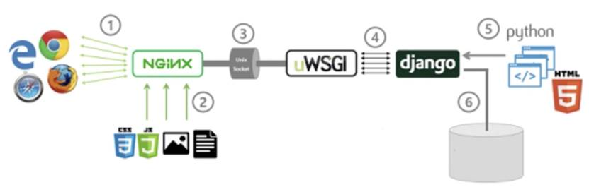

## 部署

### Python 3 环境的安装

通过编译源码安装 Python 3。

首先装一些编译源码需要的依赖文件，输入如下命令：

```bash
yum -y install gcc make cmake zlib-devel bzip2 bzip2-devel readline-devel sqlite sqlite-devel openssl-devel xz xz-devel libffi-devel
```

把 Python 安装包上传到 CentOS，然后解压缩：

```bash
tar -zxvf Python-3.6.5.tgz
```

创建个目录，用于一会儿安装 Python 3：

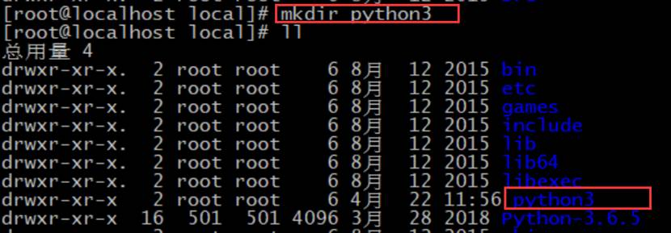

指定编译位置到刚才创建的目录

```bash
./configure --prefix=/usr/local/python3/
```

编译：

```bash
make
```

安装：

```bash
make install
```

安装完成。

### Django 安装

修改环境变量的配置：

```bash
vi /etc/profile
```

将 Python 的安装目录放到环境变量中，比如这样：

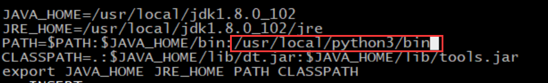

保存退出和，执行生效：

```bash
. /etc/profile
```

安装基础环境配置：

```bash
yum groupinstall "Development tools"
```

安装可能用到的包：

```bash
yum -y install zlib-devel bzip2-devel pcre-devel openssl-devel ncurses-devel sqlite-devel readline-devel tk-devel
```

指定清华源的下载包，安装 virtualenv，提高速度：

```bash
pip3 install -i https://pypi.tuna.tsinghua.edu.cn/simple virtualenv
```

我们可以升级一下 pip3：

```bash
pip3 install -i https://pypi.tuna.tsinghua.edu.cn/simple --upgrade pip
```

安装指定版本的 Django：

```bash
pip3 install -i https://pypi.tuna.tsinghua.edu.cndjango==1.11 
```

创建一个 Django 站点：

```bash
[root@node01 local]# cd /home
[root@node01 home]# django-admin startproject mysite
[root@node01 home]# ll
总用量 0
drwxr-xr-x 3 root root 35 4月  28 00:45 mysite
```

修改 Django 项目的配置文件：

```bash
[root@node01 mysite]# pwd
/home/mysite/mysite
[root@node01 mysite]# vi settings.py
```

修改 ALLOWED_HOSTS，使其允许外部访问：

```python
ALLOWED_HOSTS = ['*']
```

在 `0.0.0.0:8080` 运行 Django 项目：

```bash
[root@node01 home]# pwd
/home
[root@node01 home]# python3 mysite/manage.py runserver 0.0.0.0:8080
```

项目启动好之后，尝试访问：

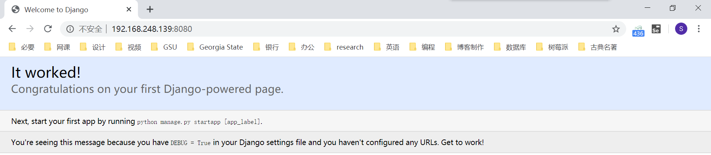

### virtualenv 虚拟环境

安装 virtualenv：

```bash
pip3 install -i https://pypi.tuna.tsinghua.edu.cn/simple virtualenv
```

可以通过命令找到通过 pip 安装的包所在的位置：

```bash
[root@node01 home]# find /usr/local/python3/ -name site-packages
/usr/local/python3/lib/python3.6/site-packages
```

创建虚拟环境：

```bash
[root@node01 home]# virtualenv --python=python3 venv
created virtual environment CPython3.6.5.final.0-64 in 378ms
  creator CPython3Posix(dest=/home/venv, clear=False, global=False)
  seeder FromAppData(download=False, pip=latest, setuptools=latest, wheel=latest, via=copy, app_data_dir=/root/.local/share/virtualenv/seed-app-data/v1.0.1)
  activators BashActivator,CShellActivator,FishActivator,PowerShellActivator,PythonActivator,XonshActivator
[root@node01 home]# ll
总用量 0
drwxr-xr-x 3 root root 52 4月  28 00:49 mysite
drwxr-xr-x 4 root root 43 4月  28 00:55 venv
```

当前目录下多出了个 venv 目录，存放的就是刚刚建立的虚拟环境。

进入虚拟环境 venv 里面的 bin 目录，执行如下，可以进入虚拟环境：

```bash
[root@node01 bin]# pwd
/home/venv/bin
[root@node01 bin]# . activate
(venv) [root@node01 bin]# 
```

进入虚拟环境后，前面会出现虚拟环境的名字用作提示。

在虚拟环境里安装 Django：

```bash
(venv) [root@node01 bin]# pip3 install -i https://pypi.tuna.tsinghua.edu.cn/simple django==1.11.26
```

在虚拟环境中创建一个 Django 项目：

```bash
(venv) [root@node01 home]# pwd
/home
(venv) [root@node01 home]# django-admin startproject dj
(venv) [root@node01 home]# ll
总用量 0
drwxr-xr-x 3 root root 31 4月  28 01:00 dj
drwxr-xr-x 3 root root 52 4月  28 00:49 mysite
drwxr-xr-x 4 root root 43 4月  28 00:55 venv
```

修改刚刚创建的 Django 项目的配置：

```bash
(venv) [root@node01 dj]# pwd
/home/dj/dj
(venv) [root@node01 dj]# vi settings.py
```

设置为允许所有主机访问：

```python
ALLOWED_HOSTS = ['*']
```

运行 Django 项目在 `0.0.0.0:8080` 端口：

```bash
(venv) [root@node01 home]# pwd
/home
(venv) [root@node01 home]# python3 dj/manage.py runserver 0.0.0.0:8080
```

访问浏览器，可以看到项目顺利启动：


退出虚拟环境：

```bash
(venv) [root@node01 home]# deactivate
```

### 引入项目依赖模块

使用命令导出依赖模块：

```bash
[root@node01 home]# pip3 freeze > requirements.txt
[root@node01 home]# cat requirements.txt 
appdirs==1.4.3
distlib==0.3.0
Django==1.11
filelock==3.0.12
importlib-metadata==1.6.0
importlib-resources==1.5.0
pytz==2019.3
six==1.14.0
virtualenv==20.0.18
zipp==3.1.0
```

进入虚拟环境：

```bash
[root@node01 bin]# pwd
/home/venv/bin
[root@node01 bin]# . activate
(venv) [root@node01 bin]# 
```

把上面提取的文件模块，导入虚拟环境：

```bash
pip3 install -i https://pypi.tuna.tsinghua.edu.cn/simple -r /home/requirements.txt
```

若出现以下问题，安装它给的版本指定就可以。

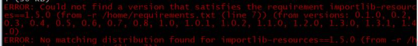

### uWSGI 安装

往常我们是使用 `manage.py` 的 runserver 命令启动 Django 项目。但这样运行实际上调用了 Python 内置的 wsgiref 模块，只能单进程单线程运行，效率比较低。

如果使用 uWSGI 启动 Django 项目，可以支持多线程，且稳定效率高。

首先进入到虚拟环境中：

```bash
[root@node01 bin]# pwd
/home/venv/bin
[root@node01 bin]# . activate
(venv) [root@node01 bin]#
```

安装 uWSGI，可以指定安装源，加快速度：

```bash
pip3 install -i https://pypi.tuna.tsinghua.edu.cn/simple uwsgi
```

查看 uWSGI 的版本，确定是否安装成功：

```bash
(venv) [root@node01 bin]# uwsgi --version
2.0.18
```

在项目的根目录中创建并编辑 `uwsgi.ini` 配置文件：

```bash
(venv) [root@node01 mysite]# pwd
/home/mysite
(venv) [root@node01 mysite]# vi uwsgi.ini
```

在其中写入如下内容，注意修改里面的路径：

```ini
[uwsgi]

# Django-related settings
# the base directory (full path)
# 项目第一层绝对路径
chdir           = /home/mysite
# Django's wsgi file
# 项目第二层相对路径
module          = mysite.wsgi
# the virtualenv (full path)
# 指定虚拟环境位置，写虚拟环境第一层绝对路径
home            = /home/venv/
# process-related settings
# 主进程
master          = true
# maximum number of worker processes
# 代表uwsgi运行的多进程数量，官方建议 2*CPU核数+1
processes       = 3
# the socket (use the full path to be safe
# 通过什么访问，后边用nginx，打开socket注释
# socket          = 0.0.0.0:8080
http          = 0.0.0.0:8080
# ... with appropriate permissions - may be needed
# chmod-socket    = 664
# clear environment on exit
# 服务停止时，自动清除pid之类的
vacuum          = true
```

通过 uWSGI，启动项目：

```bash
(venv) [root@node01 mysite]# pwd
/home/mysite
(venv) [root@node01 mysite]# uwsgi --ini ./uwsgi.ini
```

出现如下提示，说明 uWSGI 正常启动：

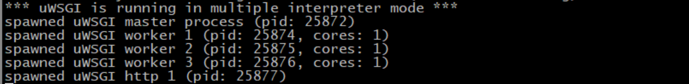

浏览器访问正常：

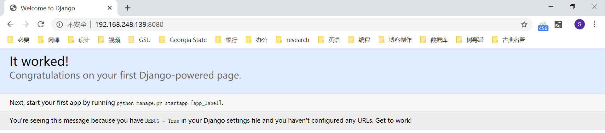

退出虚拟环境：

```bash
(venv) [root@node01 mysite]# deactivate
[root@node01 mysite]# 
```

### supervisor 安装

supervisor 是一个使用 Python 开发的进程管理工具。supervisor 的作用是，可以用它去启动 uWSGI。当 uWSGI 挂掉的时候，supervisor 会帮助自动重启。另外还可以很方便地管理 uWSGI 进程。

使用 yum 安装 python-setuptools：

```bash
yum -y install python-setuptools
```

生成 supervisor 的可执行文件：

```bash
easy_install supervisor
```

生成配置到 `/etc` 目录下：

```bash
echo_supervisord_conf > /etc/supervisord.conf
```

编辑刚刚生成的 supervisor 配置文件：

```bash
vi /etc/supervisord.conf
```

在文件的最后加入如下内容。注意，第一行修改成自己的虚拟环境所在位置，第二行的 command 根据自己 uWSGI 配置文件所在路径进行修改：

```ini
[program:mysite]
command= /home/venv/bin/uwsgi --ini /home/mysite/uwsgi.ini  ;
autostart=true       ;
startsecs=10         ;
autorestart=true     ;
stopasgroup=true     ;
killasgroup=true     ;
```

启动 supervisor，会自动把 uWSGI 启动：

```
supervisord -c /etc/supervisord.conf
```

此时可以查看到运行起来的进程：

```bash
[root@node01 mysite]# ps aux | grep supervisor
root      25957  0.0  1.0 215536 10100 ?        Ss   04:06   0:00 /usr/bin/python /usr/bin/supervisord -c /etc/supervisord.conf
root      25965  0.0  0.0 112732   972 pts/0    R+   04:07   0:00 grep --color=auto supervisor
```

浏览器可顺利访问 Django 项目：

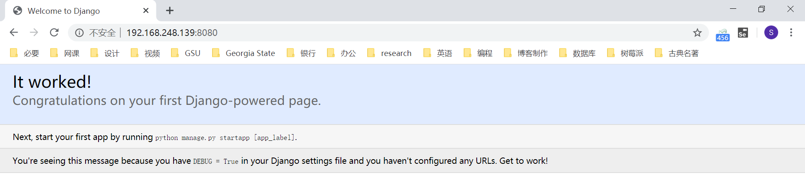

还可以进入 supervisor 的终端控制台：

```bash
[root@node01 mysite]# supervisorctl -c /etc/supervisord.conf
mysite                           RUNNING   pid 25958, uptime 0:01:30
supervisor> 
```

控制台里，可以启动或停止你的项目：

```bash
supervisor> status mysite    # 查看项目状态
mysite                           RUNNING   pid 25958, uptime 0:02:10
supervisor> stop mysite    # 停止项目
mysite: stopped
supervisor> start mysite    # 启动项目
mysite: started
supervisor> restart mysite    # 重启项目
mysite: stopped
mysite: started
supervisor> exit    # 退出 supervisor 控制台

[root@node01 mysite]# 
```

### 整合 Nginx

在生产环境中，出于安全考量，我们往往不会让用户直接访问项目，而是通过 Nginx 跳转过去，也就是用 Nginx 做反向代理。

修改一下 uWSGI 的配置：

```bash
vi /home/mysite/uwsgi.ini
```

将访问方式中，socket 的注释打开，然后注释掉 http：

```ini
socket          = 0.0.0.0:8080
# http          = 0.0.0.0:8080
```

进入 supervisor 控制台，重启项目：

```bash
[root@node01 mysite]# supervisorctl -c /etc/supervisord.conf 
mysite                           RUNNING   pid 25986, uptime 0:40:30
supervisor> restart mysite
mysite: stopped
mysite: started
```

此时是无法通过浏览器访问到 Django 项目的：

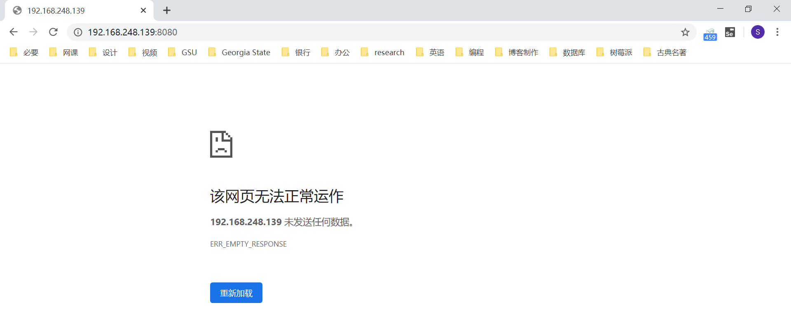

 

修改 Nginx 的配置：

```bash
[root@node01 conf]# pwd
/usr/local/nginx/conf
[root@node01 conf]# vi nginx.conf
```

注释掉原来的负载均衡相关代码，将 80 端口的访问请求以 uwsgi 的协议代理到 8080 端口：

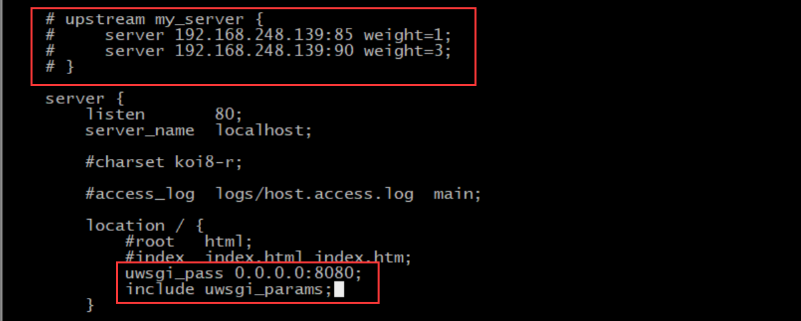

刷新 Nginx 配置：

```bash
[root@node01 conf]# nginx -t
nginx: the configuration file /usr/local/nginx/conf/nginx.conf syntax is ok
nginx: configuration file /usr/local/nginx/conf/nginx.conf test is successful
[root@node01 conf]# nginx -s reload
```

直接输入 IP，即可访问到 Django 项目：

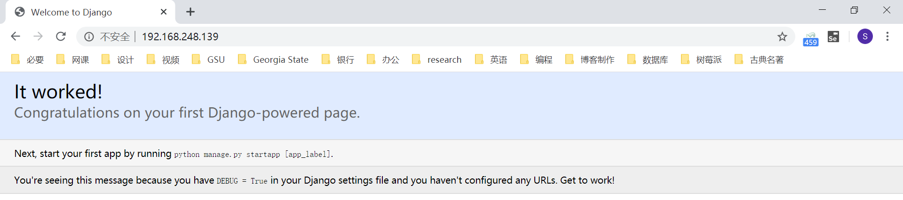

