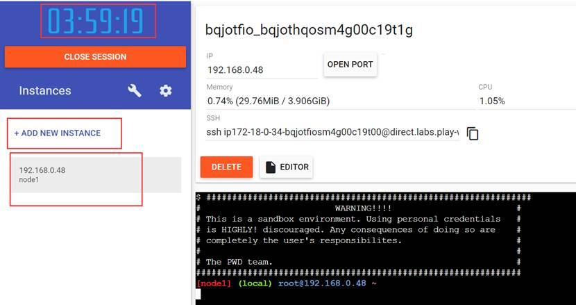

# Docker 初识和安装

[TOC]

## 容器技术和 docker 简介

### 部署方式的演变

最开始的时候，大家都是在一台物理机部署各种 Application。但是每个应用程序之间依赖的环境会有差异，在同一台机器中运行可能会产生冲突。如果分多台物理机来分别执行不同任务，虽然可以避免冲突，但是需要的成本大大增加。而且单台机器只跑一个任务，会造成性能冗余，很不经济。

后来有了虚拟化技术，将程序跑在不同的虚拟机中。这样每台虚拟机之间的环境相互独立，就不会有冲突。而因为应用都跑在一台机器上，所以也不需要额外购买服务器了。

但是虚拟机也是有局限的。因为虚拟机需要占用很多的资源，如果服务器的性能不是很强大，依旧不能部署很多的项目。这时，容器技术横空出世，解决了这个问题。

### 容器的必要性

开发人员开发一个 Application 需要各种环境，各种依赖。运维人员部署 Application 时也需要搭建各种环境。

运维人员部署 Application 时也需要搭建各种环境

容器解决了开发和运维之间的矛盾

### 容器的概念

- 容器是对软件和其依赖的标准化打包

- 容器中的应用之间相互隔离

- 容器共享同一个OS Kernel

- 容器可以运行在很多主流操作系统上

### 虚拟机与容器的区别

虚拟机是物理层面的隔离，容器是 Application 层面的隔离

### docker 的概念

docker 是目前最流行的容器技术的实现。

2004~2008 年，Linux 已经出现了 LXC。2013 年 docker 包装了LXC。2013 年三月开源，2016 年 docker 分为企业版（ee，收费）和社区版（ce，免费）。

### docker 的作用

- 简化配置

- 提高效率

### docker 和 kubernates

- docker 可以被 k8s 管理

- kubernetes，简称 k8s

### DevOps

DevOps 用来解决开发和运维间合作和沟通

不仅仅依赖 docker，还需要版本管理，持续集成等

### docker 的应用

在 2015 年的 618 大促中，京东大胆启用了基于 Docker 的容器技术来承载大促的关键业务（图片展现、单品页、团购页），当时基于 Docker 容器的弹性云项目已经有近万个 Docker 容器在线上环境运行，并且经受住了大流量的考验。

2016 年 618 中，弹性云项目更是担当重任，全部应用系统和大部分的 DB 服务都已经跑在 Docker 上，包括商品页面、用户订单、用户搜索、缓存、数据库，京东线上将会启动近 15 万个 Docker 容器。

京东弹性计算云通过软件定义数据中心与大规模容器集群调度，实现海量计算资源的统一管理，并满足性能与效率方面的需求，提升业务自助上线效率。应用部署密度大幅提升，资源使用率提升，节约大量的硬件资源。

## docker 环境的搭建方法

### docker 的安装介绍

docker 官网：https://docs.docker.com/

Docker 提供了两个版本：社区版（CE）和企业版（EE）

### docker 在 CentOS 系统上安装

docker 官方文档：https://docs.docker.com/install/linux/docker-ce/centos/#set-up-the-repository

首先执行下面的命令卸载老版本的 docker，防止有残留会产生冲突：

```bash
yum remove docker \
	docker-client \
	docker-client-latest \
	docker-common \
	docker-latest \
	docker-latest-logrotate \
	docker-logrotate \
	docker-selinux \
	docker-engine-selinux \
	docker-engine
```

安装可能用到的依赖：

```bash
yum install -y yum-utils \
	device-mapper-persistent-data \
	lvm2
```

添加 docker 的下载位置：

```
yum-config-manager \
	--add-repo \
	https://download.docker.com/linux/centos/docker-ce.repo
```

查询可用的 docker 版本：

```bash
yum list docker-ce --showduplicates | sort -r
```

安装指定版本的 docker，比如 18.06.1：

```bash
yum -y install docker-ce-18.06.1.ce-3.el7
```

开启 docker 服务：

```bash
systemctl start docker
```

设置 docker 服务开机自启动：

```bash
[root@node01 conf]# systemctl enable docker
Created symlink from /etc/systemd/system/multi-user.target.wants/docker.service to /usr/lib/systemd/system/docker.service.
```

查看 docker 的版本：

```bash
[root@node01 conf]# docker version
Client:
 Version:           18.06.1-ce
 API version:       1.38
 Go version:        go1.10.3
 Git commit:        e68fc7a
 Built:             Tue Aug 21 17:23:03 2018
 OS/Arch:           linux/amd64
 Experimental:      false

Server:
 Engine:
  Version:          18.06.1-ce
  API version:      1.38 (minimum version 1.12)
  Go version:       go1.10.3
  Git commit:       e68fc7a
  Built:            Tue Aug 21 17:25:29 2018
  OS/Arch:          linux/amd64
  Experimental:     false
```

装完 docker 之后，修改如下文件

```bash
vi /etc/docker/daemon.json
```

在其中写入如下内容，配置国内镜像：

```json
{
"registry-mirrors": [
"https://kfwkfulq.mirror.aliyuncs.com",
"https://2lqq34jg.mirror.aliyuncs.com",
"https://pee6w651.mirror.aliyuncs.com",
"https://registry.docker-cn.com",
"http://hub-mirror.c.163.com"
],
"dns": ["8.8.8.8","8.8.4.4"]
}
```

加入以下内容：

重启 docker 服务：

```bash
systemctl restart docker
```

### docker-machine 的使用

Docker Machine 是 Docker 官方提供的一个工具，它可以帮助我们在远程的机器上安装 Docker，或者在虚拟机 host 上直接安装虚拟机并在虚拟机中安装 Docker

可以通过 docker-machine 命令来管理这些虚拟机和 Docker

### docker playground

docker playground 是 docker 官方提供的在线学习测试 docker 的工具。

地址：https://labs.play-with-docker.com/

可以直接使用云端的 docker。这个服务器是公共的，但每次只能使用 4 小时。

左侧点一下，就增加一个实例

