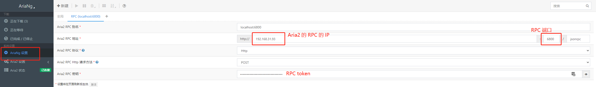

# Docker 安装 Aria2

[toc]

Aria2 是一个十分强大的下载工具，可以在 Linux 系统中使用。https://p3terx.com/archives/docker-aria2-pro.html 这个网站提供了基于 Aria2 完美配置和特殊定制优化的 Aria2 Docker，很适合像我这种懒懒的伸手党使用。

## 安装 Aria2

直接复制网站中的命令，将 \<TOKEN\> 修改成你想要设置的 RPC 密钥，并按需指定 Aria2 的配置路径和下载路径即可：

```bash
docker run -d \
    --name aria2-pro \
    --restart unless-stopped \
    --log-opt max-size=1m \
    --network host \
    -e PUID=$UID \
    -e PGID=$GID \
    -e RPC_SECRET=<TOKEN> \
    -e RPC_PORT=6800 \
    -e LISTEN_PORT=6888 \
    -v /path/to/aria2-config:/config \
    -v /path/to/aria2-downloads:/downloads \
    p3terx/aria2-pro
```

## 安装 Ar­i­aNg

Aria2 仅仅是下载的服务，我们还需要一个 web 页面来管理下载。https://p3terx.com/archives/aria2-frontend-ariang-tutorial.html 这位作者很贴心地也制作了一个 Ar­i­aNg 的容器供我们使用，还是直接用人家给的命令：

```bash
docker run -d \
    --name ariang \
    --restart unless-stopped \
    --log-opt max-size=1m \
    -p 46880:6880 \
    p3terx/ariang
```

然后浏览器输入 AriaNg 的 IP 和端口，就可以看到配置页面。点到下图位置，填写我们 aria2 的配置即可：



保存后，Aria2 的状态应变为 `已连接`。

然后就是傻瓜式的点点点，高级用法以后慢慢研究就好啦。